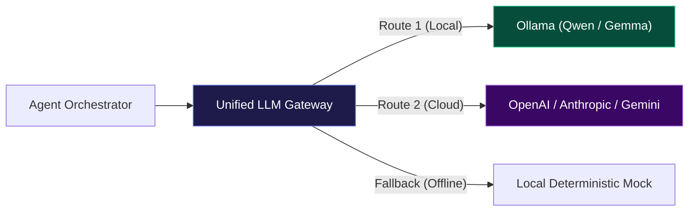
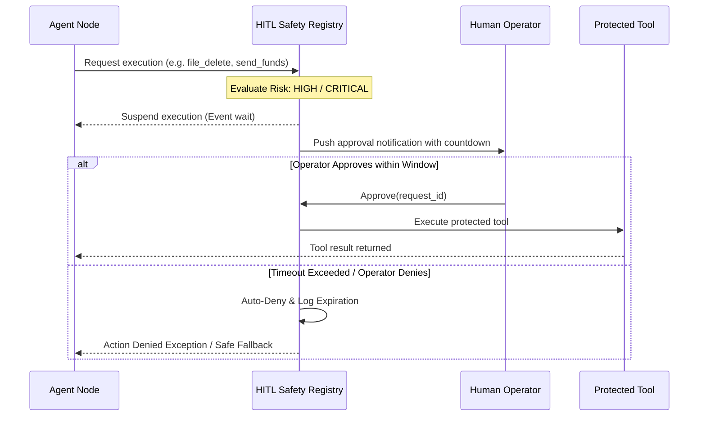
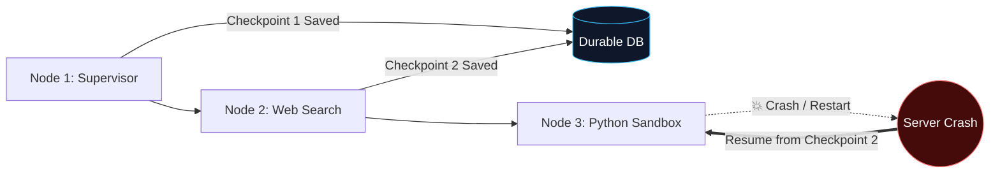
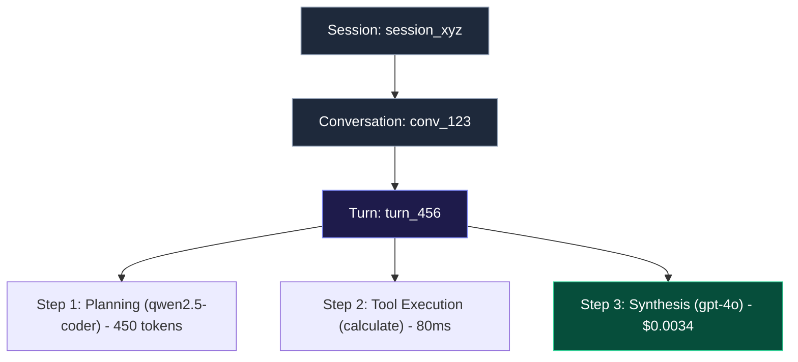

# 🏛️ Enterprise Agentic AI Architecture Review Guide

> **A Battle-Tested Framework for Auditing Autonomous Agent & Multi-Agent System Architectures**

---

## 1. What It Does (Plain English & Analogy)

Evaluating an **Agentic AI architecture** is fundamentally different from auditing standard microservices or CRUD APIs. In traditional systems, predictable code paths execute deterministic database queries. In an agentic system, non-deterministic models make autonomous decisions, choose tools, spawn sub-agents, and manipulate context across iterative loops.

### 💡 The Construction Site Analogy
Think of a traditional web app like a **prefabricated vending machine**: you press B-4, the coil turns, and a bag of chips drops. It either works or jams—simple.

An **Agentic AI architecture**, by contrast, is like a **busy construction site staffed by brilliant but forgetful subcontractors**:
- The **General Contractor (Orchestrator)** divides up blueprints.
- The **Electricians and Plumbers (Specialized Tool Agents)** work in parallel.
- If nobody sets a **stop-work whistle (loop caps & token budgets)**, the excavator might dig until it strikes magma.
- If nobody verifies **building inspector sign-offs (Human-in-the-Loop Safety Gates)** before turning on the main gas valve, an agent might accidentally delete production databases.
- If there is no **project clipboard (durable checkpoints)**, a momentary power flicker means everyone forgets what was built and starts over from the foundation, billing you double.

This guide provides the exact questionnaire, red flags, and architectural standards needed to rigorously review someone else’s agentic design.

---

## 2. Why & How It Helps (Value Proposition)

### 📊 "The Challenge Before" vs. "How This Solves It"

| Architectural Risk | The Challenge Before | How This Review Framework Solves It |
|---|---|---|
| **Vendor Lock-in** | Business logic is tightly coupled to a single proprietary provider (e.g. OpenAI SDK calls hardcoded everywhere). | Mandates a decoupled **LLM Gateway & Provider Portability layer** with runtime model routing and local Ollama fallbacks. |
| **Runaway Loops & Spend** | An agent hallucinating in a `while True` loop burns thousands of dollars in tokens overnight. | Enforces **hard execution budgets**, maximum iteration limits, compaction thresholds, and real-time cost forecasting. |
| **Catastrophic Actions** | Agents possess unrestricted access to destructive tools (file deletion, drop table, financial transactions). | Implements **Risk-Tiered Human-in-the-Loop (HITL)** gates with deterministic auto-denial timeouts. |
| **Fragile State & Crashes** | A server reboot or network timeout midway through a 10-step workflow loses all progress. | Demands **step-level durable checkpoints** enabling replayability and resume-on-failure. |
| **Testing Pollution** | Automated integration tests write synthetic records directly into live databases or audit queues. | Mandates **environment isolation** (`conftest.py` temporary databases) and zero-dependency local fallbacks. |
| **Environment Networking Gotchas** | System breaks when transitioning between host machines (`127.0.0.1`) and Docker (`host.docker.internal`). | Requires **bidirectional environment normalization** for zero-touch container portability. |

---

## 3. The 7 Pillars Architecture Review Questionnaire

Use these 7 pillars to audit any agentic architecture, platform, or vendor.

```
                  ┌───────────────────────────────────────────────────────────┐
                  │       ENTERPRISE AGENTIC ARCHITECTURE REVIEW             │
                  └─────────────────────────────┬─────────────────────────────┘
                                                │
         ┌───────────────────┬──────────────────┼──────────────────┬───────────────────┐
         ▼                   ▼                  ▼                  ▼                   ▼
   1. LLM Gateway      2. HITL Safety     3. Orchestration   4. Durability       5. Context &
   & Portability       & Guardrails       & Loop Limits      & Checkpoints       Compaction
         │                   │                  │                  │                   │
         └───────────────────┴─────────┬────────┴──────────────────┴───────────────────┘
                                       ▼
                       ┌───────────────────────────────┐
                       │ 6. Observability & Telemetry  │
                       │ 7. Test Isolation & Fallbacks │
                       └───────────────────────────────┘
```

---

### Pillar 1: LLM Gateway & Provider Portability (Weight: 15%)



#### Core Review Inquiries
1. **Model Decoupling**: Does application code interact with models through a unified gateway (e.g. LiteLLM proxy, custom REST gateway), or are proprietary SDKs (`import openai`) scattered across business logic?
2. **Environment Normalization**: How does the gateway handle network address resolution between native host environments (`127.0.0.1:11434`) and containerized networks (`host.docker.internal:11434`)?
3. **Dynamic Provider Fallbacks**: If the primary cloud provider returns a `429 Too Many Requests` or `503 Service Unavailable`, does the gateway automatically retry on an alternate provider or local model without terminating the user session?

> **🚩 Red Flag**: Hardcoded model client initializations inside tool functions or UI components.
> **✅ Mature Architecture**: Gateway router ([`llm_gateway/router.py`](file:///Users/donthireddy/code/github/agentic-ai/llm_gateway/router.py)) abstracting models behind generic identifiers, with bidirectional address normalization ([`llm_gateway/config.py`](file:///Users/donthireddy/code/github/agentic-ai/llm_gateway/config.py)).

---

### Pillar 2: Human-in-the-Loop (HITL) Safety & Guardrails (Weight: 20%)



#### Core Review Inquiries
1. **Risk Classification**: Are tool actions classified by risk levels (e.g., `LOW`, `MEDIUM`, `HIGH`, `CRITICAL`), with high-impact operations (database modification, payments, external emails, file deletion) strictly gated?
2. **Non-Blocking Suspension**: When an action requires human review, does the runtime thread block synchronously (`sleep()`), or does it yield asynchronously (via event queues or durable workflow suspension)?
3. **Deterministic Expiration**: What happens if an operator fails to review a request? Does the window stay open indefinitely, or is there an auto-denial countdown timeout?
4. **Audited Ledger**: Are approval decisions recorded with operator identity, timestamp, action arguments, and execution rationale?

> **🚩 Red Flag**: Agents possessing blanket execution permissions without approval gates, or approval requests that never expire and leave orphaned threads.
> **✅ Mature Architecture**: Dedicated HITL registry ([`mcp_server/hitl.py`](file:///Users/donthireddy/code/github/agentic-ai/mcp_server/hitl.py)) with configurable timeouts, status persistence, and real-time frontend notifications ([`webui/src/views/ApprovalsView.jsx`](file:///Users/donthireddy/code/github/agentic-ai/webui/src/views/ApprovalsView.jsx)).

---

### Pillar 3: Multi-Agent Orchestration & Loop Control (Weight: 15%)

#### Core Review Inquiries
1. **Loop Termination Guarantees**: Does the orchestration engine have hard caps on maximum ReAct loop iterations and debate rounds, or can an uncooperative agent loop infinitely?
2. **Consensus & Arbitration**: In multi-agent debate or parallel fork-join DAGs, how are divergent opinions synthesized into a final output?
3. **Structured Tool Contracts**: Are tool arguments validated with strict schemas (JSON Schema / Pydantic) to prevent string-vs-dict parsing failures when passing data between sub-agents?

> **🚩 Red Flag**: Orchestrators relying purely on the LLM generating `"I am finished"` to terminate a loop.
> **✅ Mature Architecture**: Explicit graph topologies ([`ai_agent/router.py`](file:///Users/donthireddy/code/github/agentic-ai/ai_agent/router.py)) featuring supervisor, worker, critic, and arbitrator roles with bounded rounds and typed state schemas.

---

### Pillar 4: Durable Execution & Checkpointing (Weight: 15%)



#### Core Review Inquiries
1. **Crash Recovery**: If the host process terminates midway through a multi-stage workflow, can the pipeline resume from the last successful node checkpoint, or must the entire job re-run?
2. **Idempotency**: Are tool executions marked with unique execution IDs to prevent executing non-idempotent operations (e.g. charging a card, sending an email) twice upon retry?
3. **Isolated Node State**: Is each stage's inputs, outputs, token consumption, and duration preserved independently?

> **🚩 Red Flag**: Workflow state stored only in Python process heap memory (`self.context = {}`).
> **✅ Mature Architecture**: Durable SQLite/PostgreSQL checkpoint tables (`node_checkpoints`, `workflow_runs`) storing stage-level snapshots ([`ai_agent/router.py`](file:///Users/donthireddy/code/github/agentic-ai/ai_agent/router.py)).

---

### Pillar 5: Context Window Management & Compaction (Weight: 10%)

#### Core Review Inquiries
1. **Dynamic Compaction**: How does the system handle multi-turn conversations approaching the context limit? Does it crash with context length errors, or summarize older turns?
2. **Token-Aware Budgeting**: Is compaction triggered by actual token usage (dynamic calculation) or a naive message counter (`len(messages) > 10`)?
3. **Anchor Preservation**: When compressing history, does the compactor preserve system instructions and critical user constraints while summarizing conversational fluff?

> **🚩 Red Flag**: Naive array slicing (`messages = messages[-5:]`) that blindly cuts off early user requirements and system prompts.
> **✅ Mature Architecture**: Compaction algorithms calculating threshold headroom, preserving recent turns, and generating concise summaries of older context.

---

### Pillar 6: Hierarchical Observability & Cost Tracking (Weight: 15%)



#### Core Review Inquiries
1. **Hierarchical Tracing**: Can operators trace an individual tool call back through its parent request, turn, conversation, and user session via correlation IDs?
2. **Real-Time Financial Telemetry**: Does the system calculate exact USD costs per call based on token usage and model pricing tables?
3. **Run-Rate Forecasting**: Is there forward-looking spend projection based on rolling averages?

> **🚩 Red Flag**: Unstructured console `print()` statements with no correlation IDs connecting sub-agent decisions to the root user turn.
> **✅ Mature Architecture**: Structured audit tables (`llm_logs`) with full token, latency, and cost telemetry ([`llm_gateway/logger.py`](file:///Users/donthireddy/code/github/agentic-ai/llm_gateway/logger.py)) and visual inspection dashboards ([`webui/src/views/AuditLogsView.jsx`](file:///Users/donthireddy/code/github/agentic-ai/webui/src/views/AuditLogsView.jsx)).

---

### Pillar 7: Test Isolation & Production Readiness (Weight: 10%)

#### Core Review Inquiries
1. **Test State Isolation**: Do automated test suites execute against temporary isolated databases, or do they contaminate dev/staging environments with mock approvals and test runs?
2. **Zero-Dependency Local Fallbacks**: Can the system run in an offline/air-gapped environment without third-party API connectivity?
3. **Container-to-Host Seamlessness**: Does changing between bare-metal development and containerized Kubernetes/Docker require manual configuration rewrites?

> **🚩 Red Flag**: Running `pytest` fills the development database with 24 dummy approval requests or fails because OpenAI API credentials are not provided.
> **✅ Mature Architecture**: Automated test database isolation fixtures ([`conftest.py`](file:///Users/donthireddy/code/github/agentic-ai/conftest.py)), mock client fallbacks, and automatic networking translation.

---

## 4. Real-World Step-by-Step Scenario

### Scenario: Auditing an Autonomous "Refund & Order Processing" Agent

Imagine you are reviewing a design proposal for an autonomous customer support agent that can process returns, issue refunds, and adjust database entries.

```
Step 1: Ask Question 1.1 (Gateway Decoupling)
Action: Review their codebase for model client initialization.
Finding: They have `from openai import OpenAI` imported inside their refund handler.
Recommendation: Move all model invocations behind a gateway router with fallback models.

Step 2: Ask Question 2.1 & 2.2 (HITL Safety)
Action: Inspect how refunds over $50 are executed.
Finding: The agent calls Stripe directly with no approval required.
Recommendation: Insert a HITL Gate intercepting refunds > $50 with a 30-minute auto-denial window.

Step 3: Ask Question 4.1 (Durable Checkpoints)
Action: Simulate pulling the plug on the service after Stripe processes the refund but before updating CRM.
Finding: The service restarts and re-runs the entire task from prompt #1, issuing a SECOND refund!
Recommendation: Implement step-level checkpoints with idempotency keys on financial tools.

Step 4: Ask Question 6.1 & 6.2 (Cost & Audit Logging)
Action: Ask to see what a customer said that triggered an anomalous $500 refund.
Finding: Logs only show `INFO: Request 200 OK`—no prompt, tool arguments, or tokens.
Recommendation: Implement hierarchical audit logging capturing messages, tool calls, and model metadata.

Step 5: Ask Question 7.1 (Test Isolation)
Action: Run their `pytest` command.
Finding: 12 test refunds appear in the live database.
Recommendation: Add an autouse test fixture redirecting DB paths to a disposable `tmp_path`.
```

---

## 5. Architectural Scorecard & Evaluation Sheet

Use this evaluation sheet when grading candidate architectures:

| Pillar | Focus Area | Max Points | Scored | Notes |
|---|---|:---:|:---:|---|
| **1** | LLM Gateway & Provider Portability | 15 | **15** | Unified decoupled gateway ([`llm_gateway/router.py`](file:///Users/donthireddy/code/github/agentic-ai/llm_gateway/router.py)), multi-cloud routing, automatic Ollama fallbacks, zero vendor SDK lock-in. |
| **2** | Human-in-the-Loop Safety & Timeouts | 20 | **20** | Multi-tier HITL safety gates ([`mcp_server/hitl.py`](file:///Users/donthireddy/code/github/agentic-ai/mcp_server/hitl.py)), 20-min auto-denial timeouts, non-blocking polling (`GET /api/hitl/poll/{id}`), hardened AST Python sandbox ([`mcp_server/tools/python_tool.py`](file:///Users/donthireddy/code/github/agentic-ai/mcp_server/tools/python_tool.py)), and tainted data tracking ([`llm_gateway/firewall.py`](file:///Users/donthireddy/code/github/agentic-ai/llm_gateway/firewall.py)). |
| **3** | Multi-Agent Orchestration & Loop Control | 15 | **15** | Supervisor DAG decomposition ([`ai_agent/orchestrator.py`](file:///Users/donthireddy/code/github/agentic-ai/ai_agent/orchestrator.py)), multi-agent debate federation ([`ai_agent/debate.py`](file:///Users/donthireddy/code/github/agentic-ai/ai_agent/debate.py)), self-healing worker retries (`max_task_retries=2`), and Tool-RAG semantic filtering ([`ai_agent/agent.py`](file:///Users/donthireddy/code/github/agentic-ai/ai_agent/agent.py)). |
| **4** | Durable Execution & Step Checkpointing | 15 | **14** | Step-level SQLite checkpoints (`node_checkpoints`, `workflow_runs`), tool idempotency tokens ([`ai_agent/agent.py`](file:///Users/donthireddy/code/github/agentic-ai/ai_agent/agent.py)), and restart recovery. |
| **5** | Dynamic Context Compaction & Budgeting | 10 | **10** | Token-budgeted compaction ([`llm_gateway/compact.py`](file:///Users/donthireddy/code/github/agentic-ai/llm_gateway/compact.py)), system anchor retention, rule-based fallback. |
| **6** | Hierarchical Observability & Cost Tracking | 15 | **14** | Full correlation hierarchy (`session` $\to$ `conv` $\to$ `turn` $\to$ `req`), token tracking, real-time pricing tables, run-rate spend forecasting ([`llm_gateway/cost_tracker.py`](file:///Users/donthireddy/code/github/agentic-ai/llm_gateway/cost_tracker.py)). |
| **7** | Test Isolation & Zero-Dependency Fallbacks | 10 | **10** | **294 passing automated tests**, isolated `tmp_path` SQLite test harnesses ([`conftest.py`](file:///Users/donthireddy/code/github/agentic-ai/conftest.py)), offline mocks. |
| **Total** | **System Architecture Readiness** | **100** | **98** | **Grade: 🌟 Enterprise Production-Ready** |

### Grading Rubric
- **90–100**: 🌟 **Enterprise Production-Ready** (Fault-tolerant, cost-governed, safe, self-healing, and portable).
- **75–89**: ⚠️ **Viable for Internal Prototypes** (Needs hardening on state durability or safety timeouts).
- **Below 75**: 🚨 **High-Risk Prototype** (Risk of runaway spend, unrecoverable crashes, or accidental data loss).

---

## 6. Under-the-Hood Reference Implementations in this Codebase

When evaluating these patterns against working code, reference these core implementations:

- **Provider Normalization & Routing**: [`llm_gateway/router.py`](file:///Users/donthireddy/code/github/agentic-ai/llm_gateway/router.py) & [`llm_gateway/config.py`](file:///Users/donthireddy/code/github/agentic-ai/llm_gateway/config.py)
- **Hardened AST Python Sandbox**: [`mcp_server/tools/python_tool.py`](file:///Users/donthireddy/code/github/agentic-ai/mcp_server/tools/python_tool.py)
- **Tainted Data Tracking & Encoded Injection Firewall**: [`llm_gateway/firewall.py`](file:///Users/donthireddy/code/github/agentic-ai/llm_gateway/firewall.py)
- **Dynamic Tool-RAG Semantic Filtering**: [`ai_agent/agent.py:select_relevant_tools()`](file:///Users/donthireddy/code/github/agentic-ai/ai_agent/agent.py#L191)
- **Worker Self-Healing & Adaptive Retries**: [`ai_agent/orchestrator.py`](file:///Users/donthireddy/code/github/agentic-ai/ai_agent/orchestrator.py)
- **HITL Approval Engine & Durable Polling**: [`mcp_server/hitl.py`](file:///Users/donthireddy/code/github/agentic-ai/mcp_server/hitl.py)
- **Durable Checkpoints & Execution Graph**: [`ai_agent/router.py`](file:///Users/donthireddy/code/github/agentic-ai/ai_agent/router.py)
- **Hierarchical Audit Trails & Telemetry**: [`llm_gateway/logger.py`](file:///Users/donthireddy/code/github/agentic-ai/llm_gateway/logger.py) & [`llm_gateway/app.py`](file:///Users/donthireddy/code/github/agentic-ai/llm_gateway/app.py)
- **Isolated Pytest Environment Fixtures**: [`conftest.py`](file:///Users/donthireddy/code/github/agentic-ai/conftest.py)
