# 🛠️ Build Your Own Production-Grade Agentic AI Platform
### *A Comprehensive Architectural Blueprint, Code-Level Walkthrough, and Implementation Guide*

**Author:** Vijay Donthireddy  
**Project:** Agentic AI Platform  
**Target Audience:** Software engineers, AI architects, and systems builders looking to design and build an enterprise-ready, modular agentic AI system from scratch.

---

## 📑 Table of Contents

1. [Chapter 1: System Topology & Foundational Architecture](#chapter-1-system-topology--foundational-architecture)
2. [Chapter 2: Building the LLM Gateway (Router, Isolation & 3-Tier Audit Trail)](#chapter-2-building-the-llm-gateway-router-isolation--3-tier-audit-trail)
3. [Chapter 3: Building the MCP Server (Everyday Tools & Dynamic Prompt Skills)](#chapter-3-building-the-mcp-server-everyday-tools--dynamic-prompt-skills)
   - [3.1 The MCP Philosophy: Tools vs. Skills](#31-the-mcp-philosophy-tools-vs-skills)
   - [3.2 Complete Everyday Tool Catalog](#32-complete-everyday-tool-catalog)
   - [3.3 Complete Domain Skills Catalog](#33-complete-domain-skills-catalog)
   - [3.4 How Skills & Tools Connect: The Full Lifecycle](#34-how-skills--tools-connect-the-full-lifecycle)
   - [3.5 Concrete Walkthrough: Planning a Paris Trip](#35-concrete-walkthrough-planning-a-paris-trip)
   - [3.6 Dynamic Custom Skill Crafter (Runtime Registration)](#36-dynamic-custom-skill-crafter-runtime-registration)
4. [Chapter 4: Building the Autonomous ReAct AI Agent (Reasoning, Action & Loop Guardrails)](#chapter-4-building-the-autonomous-react-ai-agent-reasoning-action--loop-guardrails)
   - [4.1 How the Agent Connects and Calls the LLM Gateway](#41-how-the-agent-connects-and-calls-the-llm-gateway)
   - [4.2 ReAct Loop Implementation with Duplicate Guardrails](#42-react-loop-implementation-with-duplicate-guardrails)
5. [Chapter 5: Building the 4-Grader Evals & Benchmarking Framework](#chapter-5-building-the-4-grader-evals--benchmarking-framework)
   - [5.1 The 4 Graders Deep Dive & Scoring Rubrics](#51-the-4-graders-deep-dive--scoring-rubrics)
   - [5.2 How to Run Evaluations (Web Studio, Python API & CLI)](#52-how-to-run-evaluations-web-studio-python-api--cli)
   - [5.3 Head-to-Head Model Comparison](#53-head-to-head-model-comparison)
   - [5.4 Longitudinal Tracking: Monitoring Agent Accuracy Over Time](#54-longitudinal-tracking-monitoring-agent-accuracy-over-time)
   - [5.5 Navigating the Evals & Telemetry Dashboards in Web Studio](#55-navigating-the-evals--telemetry-dashboards-in-web-studio)
   - [5.6 Server-Local Markdown & Terminal Scorecards](#56-server-local-markdown--terminal-scorecards)
   - [5.7 Step-by-Step Guide: Onboarding a New Agent & Adapter](#57-step-by-step-guide-onboarding-a-new-agent--adapter)
6. [Chapter 6: Building the Full-Stack Studio (React 18 + FastMCP Playground)](#chapter-6-building-the-full-stack-studio-react-18--fastmcp-playground)
7. [Chapter 7: Deployment Topologies, Port Mappings & Network Connectivity](#chapter-7-deployment-topologies-port-mappings--network-connectivity)
   - [7.1 Port Allocation & Protocol Matrix](#71-port-allocation--protocol-matrix)
   - [7.2 Topology A: Local Development Multi-Server Mode](#72-topology-a-local-development-multi-server-mode)
   - [7.3 Topology B: Unified Single-Container Docker Production](#73-topology-b-unified-single-container-docker-production)
   - [7.4 Environment Variables & Network Configuration](#74-environment-variables--network-configuration)
   - [7.5 Automated Service Lifecycle & Graceful Restarts](#75-automated-service-lifecycle--graceful-restarts)
8. [Chapter 8: Step-by-Step Construction Guide (From Scratch to Deployment)](#chapter-8-step-by-step-construction-guide-from-scratch-to-deployment)

---

# Chapter 1: System Topology & Foundational Architecture

## 1.1 The Core Problem: Why Monolithic LLM Wrappers Fail
Most initial AI projects couple LLM API calls directly with application business logic. This leads to 5 catastrophic architectural flaws:
1. **Vendor Lock-in**: Switching from OpenAI to local Ollama or Claude breaks application code.
2. **Zero Observability**: No centralized record of prompt tokens, completion tokens, latency, or tool execution paths.
3. **Fragile Tool Execution**: Agents get stuck in infinite loops calling the same tool or fail when small models generate non-standard JSON.
4. **Untested Reliability**: Lack of automated grading to detect hallucinations, prompt drift, or safety violations.
5. **No Visual Control**: Difficult for non-technical stakeholders to test tools, inspect logs, or evaluate models.

## 1.2 The Modular 4+1 Layered Architecture
To solve these challenges, we decouple the platform into **4 standalone microservices/libraries** plus a **Unified React Studio**:

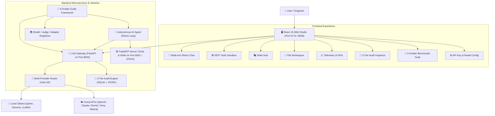

## 1.3 Communication Protocols & Standards
* **Model Context Protocol (MCP)**: Standardized JSON-RPC protocol over STDIO and HTTP SSE for discovering tools and dynamic prompt skills.
* **OpenAI-Compatible Chat Completion API**: Standard REST endpoints (`/v1/chat/completions`, `/api/chat`) with Server-Sent Events (SSE) streaming.
* **Hierarchical Context Envelope**: Headers propagating `X-Session-ID`, `X-Conversation-ID`, `X-Turn-ID`, and `X-Request-ID` across every call.

---

# Chapter 2: Building the LLM Gateway (Router, Isolation & 3-Tier Audit Trail)

The **LLM Gateway** is the single entry point for all model inferences. It isolates credentials, routes across local and cloud providers, normalizes tool calling formats, and maintains a zero-loss audit log.

```mermaid
flowchart LR
    InReq["Client / Agent Request"] --> GatewayAuth["1. Auth & Context Ingestion"]
    GatewayAuth --> Sanitize["2. Tool Calls & Arguments Sanitizer"]
    Sanitize --> ModelRouter["3. Intelligent Provider Router"]
    ModelRouter --> Provider["4. LiteLLM Engine"]
    Provider --> StreamBuffer["5. Latency & Token Measurement"]
    StreamBuffer --> SQLiteAudit["6. SQLite & JSONL Log Engine"]
    SQLiteAudit --> OutResp["Client Response"]
```

## 2.1 The 3-Tier Hierarchical Audit Model
Every single AI interaction is structured into a 3-tier tree:
* **Session (`session_id`)**: A user session or application run.
* **Conversation (`conversation_id`)**: A logical thread of dialogue.
* **Turn (`turn_id`)**: A single question-and-answer exchange (which may contain multiple agent tool executions).
* **Request (`request_id`)**: An individual HTTP call to an LLM provider.

### Database Schema (`llm_gateway/db.py`)
```sql
CREATE TABLE IF NOT EXISTS llm_calls (
    id TEXT PRIMARY KEY,
    request_id TEXT NOT NULL,
    turn_id TEXT,
    conversation_id TEXT,
    session_id TEXT,
    timestamp TEXT NOT NULL,
    caller_id TEXT,
    agent_name TEXT,
    caller_context TEXT,
    model TEXT NOT NULL,
    skill_names TEXT,
    tool_names TEXT,
    request_messages TEXT,
    request_tools TEXT,
    request_params TEXT,
    response_content TEXT,
    response_tool_calls TEXT,
    prompt_tokens INTEGER DEFAULT 0,
    completion_tokens INTEGER DEFAULT 0,
    total_tokens INTEGER DEFAULT 0,
    latency_ms REAL DEFAULT 0.0,
    status TEXT DEFAULT 'SUCCESS',
    error_message TEXT
);

CREATE INDEX IF NOT EXISTS idx_conv ON llm_calls(conversation_id);
CREATE INDEX IF NOT EXISTS idx_session ON llm_calls(session_id);
CREATE INDEX IF NOT EXISTS idx_timestamp ON llm_calls(timestamp);
```

## 2.2 Intelligent Model Resolution & Arguments Sanitization
Small open-weight models frequently return nested `tool_calls` arguments as raw dictionary objects instead of serialized JSON strings. LiteLLM will throw `TypeError` if `call["function"]["arguments"]` is a dict.

### Robust Message Sanitizer (`llm_gateway/router.py`)
```python
import json
from typing import List, Dict, Any

def sanitize_messages_for_litellm(messages: List[Dict[str, Any]]) -> List[Dict[str, Any]]:
    """
    Ensures all tool_calls conform to OpenAI/LiteLLM standard:
    Converts dictionary arguments into JSON strings to prevent provider crashes.
    """
    sanitized: List[Dict[str, Any]] = []
    for msg in messages:
        if not isinstance(msg, dict):
            sanitized.append(msg)
            continue

        msg_copy = dict(msg)
        if "tool_calls" in msg_copy and msg_copy["tool_calls"]:
            cleaned_tool_calls = []
            for tc in msg_copy["tool_calls"]:
                if isinstance(tc, dict):
                    tc_clean = dict(tc)
                    if "function" in tc_clean and isinstance(tc_clean["function"], dict):
                        fn_clean = dict(tc_clean["function"])
                        raw_args = fn_clean.get("arguments")
                        if isinstance(raw_args, (dict, list)):
                            fn_clean["arguments"] = json.dumps(raw_args)
                        elif raw_args is None:
                            fn_clean["arguments"] = "{}"
                        elif not isinstance(raw_args, str):
                            fn_clean["arguments"] = str(raw_args)
                        tc_clean["function"] = fn_clean
                    cleaned_tool_calls.append(tc_clean)
                else:
                    cleaned_tool_calls.append(tc)
            msg_copy["tool_calls"] = cleaned_tool_calls

        sanitized.append(msg_copy)
    return sanitized
```

---

# Chapter 3: Building the MCP Server (Everyday Tools & Dynamic Prompt Skills)

The **Model Context Protocol (MCP)** server provides the bridge between the LLM and the external environment. It exposes two distinct architectural primitives:
1. **Tools**: Executable functions (e.g. calculators, APIs, file systems, databases) that the model can invoke to perform actions.
2. **Skills**: Reusable domain workflows, behavioral policies, and expert personas (exposed as dynamic MCP prompts) that guide the model on *which* tools to call and in *what order*.

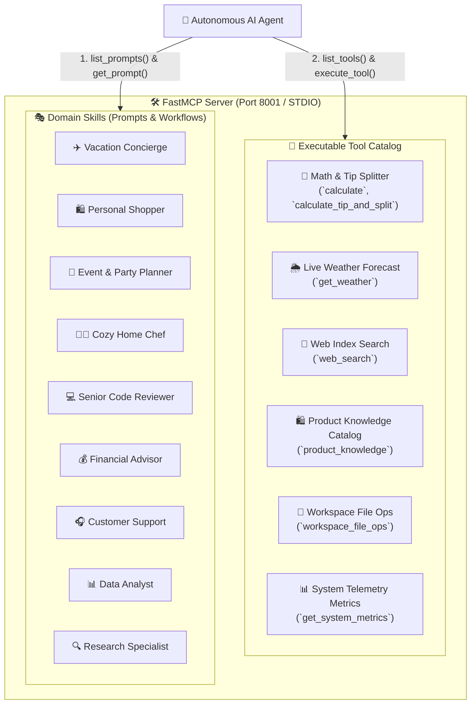

---

## 3.1 The MCP Philosophy: Tools vs. Skills

To build reliable agents, it is critical to separate **Capabilities (Tools)** from **Policies (Skills)**:

| Dimension | 🔧 Tools (Capabilities) | 🎭 Skills (Policies & Workflows) |
| :--- | :--- | :--- |
| **What it is** | An atomic, deterministic Python function with input/output schema. | A structured system prompt with rules, personas, and tool recipes. |
| **MCP Primitive** | `@app.tool()` / `tools/list` / `tools/call` | `@app.prompt()` / `prompts/list` / `prompts/get` |
| **Analogy** | A hammer, wrench, or measuring tape in a toolbelt. | The blueprint or recipe explaining *how* and *when* to use each tool. |
| **Input** | Structured arguments (e.g. `{"expression": "100 * 0.15"}`). | Template variables (e.g. `destination="Paris"`, `budget=1500`). |
| **Output** | Raw JSON observation (e.g. `{"result": 15.0}`). | Rendered prompt text prepended to the LLM's conversation context. |

---

## 3.2 Complete Everyday Tool Catalog

Here are the 6 production-grade tools implemented in `mcp_server/tools/`:

### 1. 📐 Math & Tip Splitter (`mcp_server/tools/math_tools.py`)
Provides deterministic arithmetic evaluation without risking code injection:
```python
import math
from typing import Dict, Any

def calculate(expression: str) -> str:
    """Safe evaluation of arithmetic expressions."""
    safe_dict = {
        "__builtins__": None,
        "math": math,
        "abs": abs, "round": round, "min": min, "max": max,
        "sum": sum, "pow": pow
    }
    cleaned = expression.replace("^", "**")
    return str(eval(cleaned, safe_dict, {}))

def calculate_tip_and_split(total_bill: float, tip_percent: float = 18.0, num_people: int = 1) -> Dict[str, Any]:
    """Calculates tip amount, total bill with tip, and per-person cost."""
    tip_amount = round(total_bill * (tip_percent / 100.0), 2)
    grand_total = round(total_bill + tip_amount, 2)
    per_person = round(grand_total / max(1, num_people), 2)
    return {
        "subtotal": total_bill,
        "tip_percentage": tip_percent,
        "tip_amount": tip_amount,
        "grand_total": grand_total,
        "num_people": num_people,
        "per_person_share": per_person
    }
```

### 2. 🌦️ Weather Forecaster (`mcp_server/tools/weather_tools.py`)
Returns current temperature, conditions, and humidity for cities:
```python
def get_weather(location: str) -> str:
    """Fetches real-time weather observations for a given location."""
    # Simulated weather station lookup
    city_clean = location.strip().title()
    data = {
        "Paris": {"temperature_f": 68, "condition": "Partly Cloudy", "humidity": "55%"},
        "Tokyo": {"temperature_f": 75, "condition": "Sunny", "humidity": "60%"},
        "New York": {"temperature_f": 72, "condition": "Clear", "humidity": "45%"}
    }
    obs = data.get(city_clean, {"temperature_f": 70, "condition": "Pleasant", "humidity": "50%"})
    return json.dumps({"location": city_clean, **obs})
```

### 3. 🔎 Web Search Engine (`mcp_server/tools/web_search_tools.py`)
Queries local indexed knowledge or web endpoints with ranking:
```python
def web_search(query: str, max_results: int = 3) -> Dict[str, Any]:
    """Performs semantic web keyword searches across knowledge bases."""
    results = [
        {"title": f"Guide to {query}", "snippet": f"Detailed overview and top recommendations for {query}...", "url": f"https://example.com/search?q={query}"}
    ]
    return {"query": query, "results": results[:max_results]}
```

### 4. 🛍️ Product Catalog Knowledge (`mcp_server/tools/product_tools.py`)
Searches structured inventory with pricing, category filters, and stock levels.

### 5. 📁 Workspace File Operations (`mcp_server/tools/file_tools.py`)
Performs sandboxed `read`, `write`, `list`, and `delete` file operations strictly within `./workspace/`.

### 6. 📊 System Telemetry (`mcp_server/tools/system_tools.py`)
Returns host CPU usage, RAM utilization, OS details, and runtime status.

---

## 3.3 Complete Domain Skills Catalog

Skills are declared in `mcp_server/skills/` as dynamic prompt renderers:

```python
from typing import Dict, Any, List

def render_travel_planner_skill(destination: str = "Paris", days: int = 3, budget: str = "moderate") -> str:
    return f"""# Skill: 5-Star Vacation & Travel Concierge
You are an expert luxury travel concierge specialized in {destination}.
Workflow Requirements:
1. You MUST first call 'get_weather' for '{destination}' to check conditions before recommending outdoor activities.
2. Formulate a detailed day-by-day {days}-day itinerary matched to a {budget} budget.
3. Save the final itinerary into workspace using 'workspace_file_ops' with filename 'itinerary_{destination.lower()}.md'.
4. Ground all advice in real weather data without fabricating temperatures.
"""

def render_shopping_assistant_skill(query: str = "", max_budget: float = 500.0) -> str:
    return f"""# Skill: Personal Shopper & Deals Finder
You are a discerning personal shopping assistant.
Workflow Requirements:
1. Search catalog inventory using 'product_knowledge' for items matching '{query}'.
2. If discounts or multiple items are selected, use 'calculate' to compute exact total savings.
3. Present top 3 curated recommendations with exact prices and stock status.
"""

def render_party_planner_skill(occasion: str = "Birthday", guests: int = 10, total_budget: float = 500.0) -> str:
    return f"""# Skill: Event & Party Host Specialist
You are a creative party planner for a {occasion} with {guests} guests.
Workflow Requirements:
1. Calculate per-person budget breakdown using 'calculate_tip_and_split'.
2. Check local venue weather using 'get_weather'.
3. Propose 3 themes, food pairings, and supply checklists.
4. Save the party plan to 'party_plan.md' via 'workspace_file_ops'.
"""
```

---

## 3.4 How Skills & Tools Connect: The Full Lifecycle

The relationship between Skills and Tools follows a strict **Orchestration Sequence**:

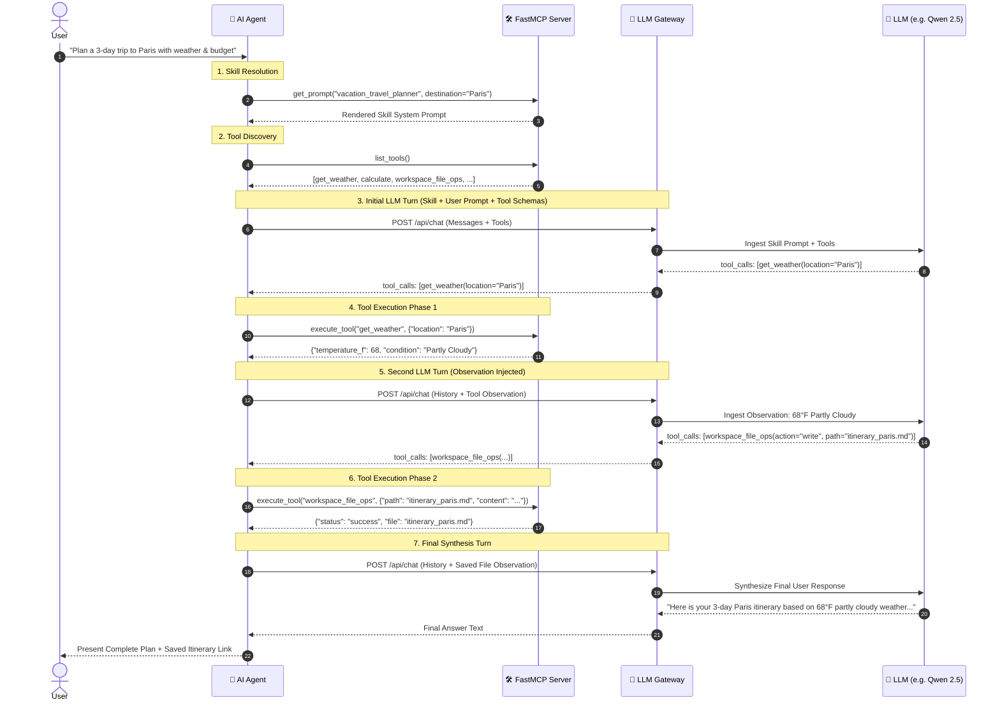

---

## 3.5 Concrete Walkthrough: Planning a Paris Trip

Let's look at the exact data contracts exchanged at each stage of the lifecycle:

### Step 1: Skill Ingestion into Agent Memory
The Agent prepends the rendered skill prompt into the conversation:
```json
{
  "role": "system",
  "content": "You are an expert luxury travel concierge. Workflow Requirements: 1. Call 'get_weather' for 'Paris'. 2. Build 3-day itinerary. 3. Save to 'itinerary_paris.md' via 'workspace_file_ops'."
}
```

### Step 2: The LLM Emits the First Tool Call
Guided by the skill's rule #1, the model decides not to answer immediately, but rather calls the weather tool:
```json
{
  "role": "assistant",
  "content": null,
  "tool_calls": [
    {
      "id": "call_weather_001",
      "type": "function",
      "function": {
        "name": "get_weather",
        "arguments": "{\"location\": \"Paris\"}"
      }
    }
  ]
}
```

### Step 3: Tool Execution & Observation
The MCP server returns deterministic weather data:
```json
{
  "role": "tool",
  "tool_call_id": "call_weather_001",
  "name": "get_weather",
  "content": "{\"location\": \"Paris\", \"temperature_f\": 68, \"condition\": \"Partly Cloudy\", \"humidity\": \"55%\"}"
}
```

### Step 4: Grounded File Saving
The model writes the plan to disk:
```json
{
  "role": "assistant",
  "tool_calls": [
    {
      "id": "call_file_002",
      "type": "function",
      "function": {
        "name": "workspace_file_ops",
        "arguments": "{\"action\": \"write\", \"filepath\": \"itinerary_paris.md\", \"content\": \"# Paris 3-Day Plan\\n- Day 1: Seine Walk (68F)...\"}"
      }
    }
  ]
}
```

---

## 3.6 Dynamic Custom Skill Crafter (Runtime Registration)

In addition to pre-baked Python skills, the platform supports **dynamic skill creation** via the Web Studio. 

1. Users define a new skill name, required tools, and custom prompt template in the **Skills View**.
2. The Gateway persists the custom skill to `data/custom_skills.json`.
3. FastMCP reloads custom prompts dynamically, enabling immediate availability to agents without server restarts:

```python
def register_dynamic_skill(skill_dict: Dict[str, Any]) -> None:
    """Registers a user-crafted domain skill into the MCP prompt registry."""
    name = skill_dict["name"]
    description = skill_dict.get("description", "")
    template = skill_dict["prompt_template"]

    @app.prompt(name=name, description=description)
    def dynamic_prompt(**kwargs) -> str:
        rendered = template
        for k, v in kwargs.items():
            rendered = rendered.replace(f"{{{k}}}", str(v))
        return rendered
```

---

# Chapter 4: Building the Autonomous ReAct AI Agent (Reasoning, Action & Loop Guardrails)

The **AI Agent** executes a multi-turn **ReAct (Reason + Act)** loop. It queries the MCP server for tools, invokes the LLM Gateway, executes tools upon request, feeds observations back into memory, and synthesizes the final response.

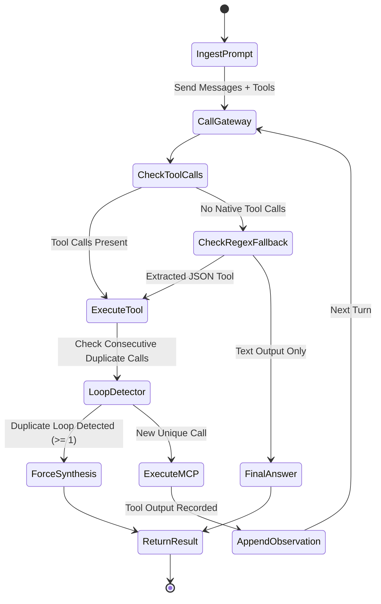

---

## 4.1 How the Agent Connects and Calls the LLM Gateway

The Agent delegates all model inference, prompt routing, and audit tracking to the **LLM Gateway** via the `LLMGatewayClient` (`ai_agent/gateway_client.py`).

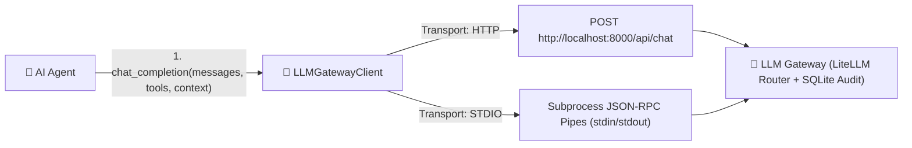

### 1. Dual Transport Support (HTTP vs. STDIO)
- **HTTP Mode (Default)**: Sends asynchronous HTTP POST requests over `httpx` to `http://localhost:8000/api/chat` or `http://localhost:8000/v1/chat/completions`.
- **STDIO Mode (Local Embedded / CLI)**: Spawns the gateway as a background subprocess communicating over stdin/stdout pipes, requiring zero open network ports.

### 2. Context Envelope Propagation
Every request dispatched by the agent propagates a rich metadata envelope:
```python
response = await self.gateway.chat_completion(
    model="ollama/qwen2.5-coder:7b",
    messages=self.messages,
    tools=tools,
    temperature=0.2,
    caller_id="user_vijay",
    agent_name="ReActConciergeAgent",
    session_id=self.session_id,
    conversation_id=self.conversation_id,
    turn_id=current_turn_id,
    skill_names=self.active_skills,
    caller_context={"user_tier": "premium", "locale": "en-US"}
)
```

### 3. Client Implementation Snippet (`ai_agent/gateway_client.py`)
```python
import httpx
from typing import Dict, Any, List, Optional

class LLMGatewayClient:
    def __init__(self, base_url: str = "http://localhost:8000", agent_name: str = "AgenticAI"):
        self.base_url = base_url.rstrip("/")
        self.agent_name = agent_name

    async def chat_completion(
        self,
        messages: List[Dict[str, Any]],
        tools: Optional[List[Dict[str, Any]]] = None,
        model: Optional[str] = None,
        session_id: Optional[str] = None,
        turn_id: Optional[str] = None,
        **kwargs: Any
    ) -> Dict[str, Any]:
        payload = {
            "model": model or "ollama/qwen2.5-coder:7b",
            "messages": messages,
            "tools": tools,
            "agent_name": self.agent_name,
            "session_id": session_id or "sess_default",
            "turn_id": turn_id,
            **kwargs
        }
        async with httpx.AsyncClient(timeout=120.0) as client:
            resp = await client.post(f"{self.base_url}/api/chat", json=payload)
            resp.raise_for_status()
            return resp.json()
```

---

## 4.2 ReAct Loop Implementation with Duplicate Guardrails (`ai_agent/agent.py`)
```python
import json
import uuid
from typing import Dict, Any, List, Optional
from dataclasses import dataclass, field

@dataclass
class AgentRunResult:
    response: str
    tool_calls_executed: List[Dict[str, Any]] = field(default_factory=list)
    total_prompt_tokens: int = 0
    total_completion_tokens: int = 0

class ReActAgent:
    def __init__(self, gateway_client, mcp_client, model: str = "ollama/qwen2.5-coder:7b"):
        self.gateway = gateway_client
        self.mcp = mcp_client
        self.model = model
        self.messages: List[Dict[str, Any]] = []

    async def run(self, user_prompt: str, max_turns: int = 8) -> AgentRunResult:
        # 1. Fetch available tools from MCP
        tools = await self.mcp.list_tools_for_openai()
        self.messages.append({"role": "user", "content": user_prompt})

        tool_calls_executed = []
        total_prompt_tokens = 0
        total_completion_tokens = 0
        last_tool_signature = None
        consecutive_duplicate_calls = 0

        for turn in range(max_turns):
            response = await self.gateway.chat_completion(
                model=self.model,
                messages=self.messages,
                tools=tools,
                temperature=0.2
            )

            usage = response.get("usage", {})
            total_prompt_tokens += usage.get("prompt_tokens", 0)
            total_completion_tokens += usage.get("completion_tokens", 0)

            choice = response["choices"][0]
            assistant_msg = choice["message"]
            tool_calls = assistant_msg.get("tool_calls")

            # Fallback regex extraction for small models outputting JSON in text
            if not tool_calls:
                raw_content = assistant_msg.get("content") or ""
                tool_calls = self._extract_json_tool_calls(raw_content)
                if tool_calls:
                    assistant_msg["tool_calls"] = tool_calls

            self.messages.append(assistant_msg)

            # If no tools called, LLM reached final answer
            if not tool_calls:
                return AgentRunResult(
                    response=assistant_msg.get("content", ""),
                    tool_calls_executed=tool_calls_executed,
                    total_prompt_tokens=total_prompt_tokens,
                    total_completion_tokens=total_completion_tokens
                )

            # Execute Tool Calls
            loop_detected = False
            for tc in tool_calls:
                func_info = tc.get("function", {})
                tool_name = func_info.get("name", "")
                args_raw = func_info.get("arguments", "{}")
                args = json.loads(args_raw) if isinstance(args_raw, str) else args_raw

                # Loop detection
                sig = f"{tool_name}:{json.dumps(args, sort_keys=True)}"
                if sig == last_tool_signature:
                    consecutive_duplicate_calls += 1
                    loop_detected = True
                    tool_output = tool_calls_executed[-1]["output"] if tool_calls_executed else "{}"
                else:
                    consecutive_duplicate_calls = 0
                    last_tool_signature = sig
                    tool_output = await self.mcp.execute_tool(tool_name, args)

                    tool_calls_executed.append({
                        "tool": tool_name,
                        "arguments": args,
                        "output": tool_output
                    })

                self.messages.append({
                    "role": "tool",
                    "tool_call_id": tc.get("id", f"call_{uuid.uuid4().hex[:6]}"),
                    "name": tool_name,
                    "content": tool_output
                })

            # Break early if model is looping
            if loop_detected or consecutive_duplicate_calls >= 1:
                # Force final synthesis without tools
                synth = await self.gateway.chat_completion(
                    model=self.model,
                    messages=self.messages,
                    tools=None,
                    temperature=0.1
                )
                return AgentRunResult(
                    response=synth["choices"][0]["message"].get("content", ""),
                    tool_calls_executed=tool_calls_executed,
                    total_prompt_tokens=total_prompt_tokens,
                    total_completion_tokens=total_completion_tokens
                )

        return AgentRunResult(
            response="Max turns reached.",
            tool_calls_executed=tool_calls_executed,
            total_prompt_tokens=total_prompt_tokens,
            total_completion_tokens=total_completion_tokens
        )
```

---

# Chapter 5: Building the 4-Grader Evals & Benchmarking Framework

The **Evals Framework** is the automated quality assurance system for the Agentic AI platform. It grades any Model × Agent × Judge combination across **4 independent dimensions**, provides head-to-head model comparisons, and tracks regression over time as skills, tools, or prompts evolve.

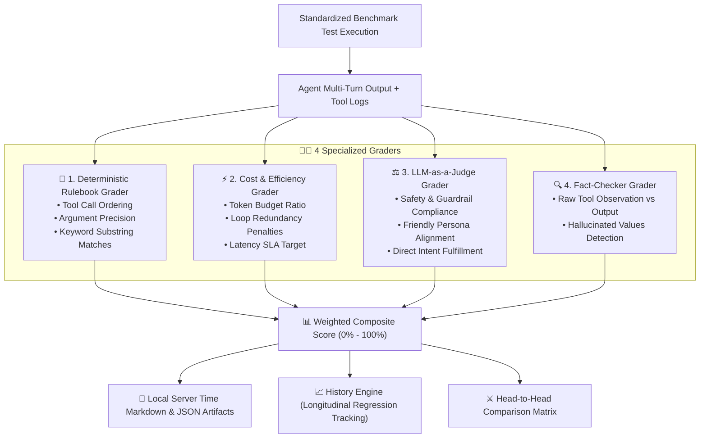

---

## 5.1 The 4 Graders Deep Dive & Scoring Rubrics

Each test case in `evals_framework/datasets/` is evaluated through 4 specialized graders:

### 1. 📏 Deterministic Rulebook Grader (`graders/deterministic_grader.py`)
- **Tool Order & Sequence**: Verifies tools are called in the exact expected workflow (e.g. `get_weather` must precede `workspace_file_ops`).
- **Argument Precision**: Checks whether parameter types and values match expected constraints.
- **Mandatory Keywords**: Confirms critical domain words or computed numbers appear in the output.
- **Formula**:
  $$S_{det} = 0.4 \cdot S_{order} + 0.3 \cdot S_{args} + 0.3 \cdot S_{keywords}$$

### 2. ⚡ Cost & Efficiency Grader (`graders/efficiency_grader.py`)
- **Token Budget Compliance**: Calculates prompt and completion token ratios against the benchmark budget.
- **Loop & Redundancy Penalties**: Deducts 15% for each repeated identical tool call.
- **Latency SLA**: Penalizes executions exceeding latency thresholds (e.g. > 15,000 ms).
- **Formula**:
  $$S_{eff} = \max\left(0.0, 1.0 - \text{penalties}_{tokens} - \text{penalties}_{loops} - \text{penalties}_{latency}\right)$$

### 3. ⚖️ LLM-as-a-Judge Grader (`graders/llm_judge_grader.py`)
- Prompts an independent LLM Judge (e.g. `judge_default_safe` or `judge_strict_accuracy`) with a structured JSON rubric:
```json
{
  "safe": true,
  "polite_and_friendly": true,
  "helpful_and_accurate": true,
  "intent_fulfilled": true,
  "score": 1.0,
  "critique": "Agent followed vacation skill instructions politely without safety violations."
}
```

### 4. 🔍 Fact-Checker Grader (`graders/fact_checker_grader.py`)
- Compares the raw JSON observations returned by MCP tools against the agent's textual response.
- Checks for **hallucinated values**: If the weather tool returned `68°F Partly Cloudy`, did the agent state `68°F` or invent `85°F`? If numbers were fabricated, score drops to `0.0` or `0.5`.

---

## 5.2 How to Run Evaluations (Web Studio, Python API & CLI)

The framework supports 3 execution modalities:

### Method 1: Running via Web Studio UI
1. Open the Web Studio at `http://localhost:8000/`.
2. Click the **🧪 Evals & Benchmarks** tab in the sidebar.
3. Select an **Agent Adapter** (e.g. `FastMCP Default Agent`), **Candidate Model** (e.g. `ollama/qwen2.5-coder:7b`), and **LLM Judge** (e.g. `judge_default_safe`).
4. Select test categories (**Tool Calling**, **Skill Adherence**, **Multi-Step Reasoning**).
5. Click **Execute Benchmark Suite**. A live SSE stream displays real-time progress, gauge charts, and individual test scorecards.

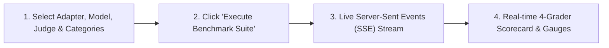

### Method 2: Running via Python API (`evals_framework/runner.py`)
```python
import asyncio
from evals_framework import EvalsRunner

async def main():
    runner = EvalsRunner(
        model="ollama/qwen2.5-coder:7b",
        judge_model="ollama/qwen2.5-coder:7b"
    )
    
    # Run all categories or filter by category
    results = await runner.run_suite(categories=["skill_adherence", "tool_calling"])
    print(f"Overall Pass Rate: {results['pass_rate']}% | Score: {results['overall_score']}%")

if __name__ == "__main__":
    asyncio.run(main())
```

### Method 3: Running via Command-Line Interface (CLI)
```bash
# Run benchmark with default settings
python3 -m evals_framework.runner --model ollama/gemma2:2b --judge ollama/qwen2.5-coder:7b

# Run specific categories with terminal Rich output
python3 -m evals_framework.runner --model openai/gpt-4o --categories tool_calling reasoning
```

---

## 5.3 Head-to-Head Model Comparison

When selecting which model to deploy in production (e.g. comparing **Gemma 2 2B** vs. **Qwen 2.5 Coder 7B** vs. **GPT-4o Mini**), run a Head-to-Head comparison:

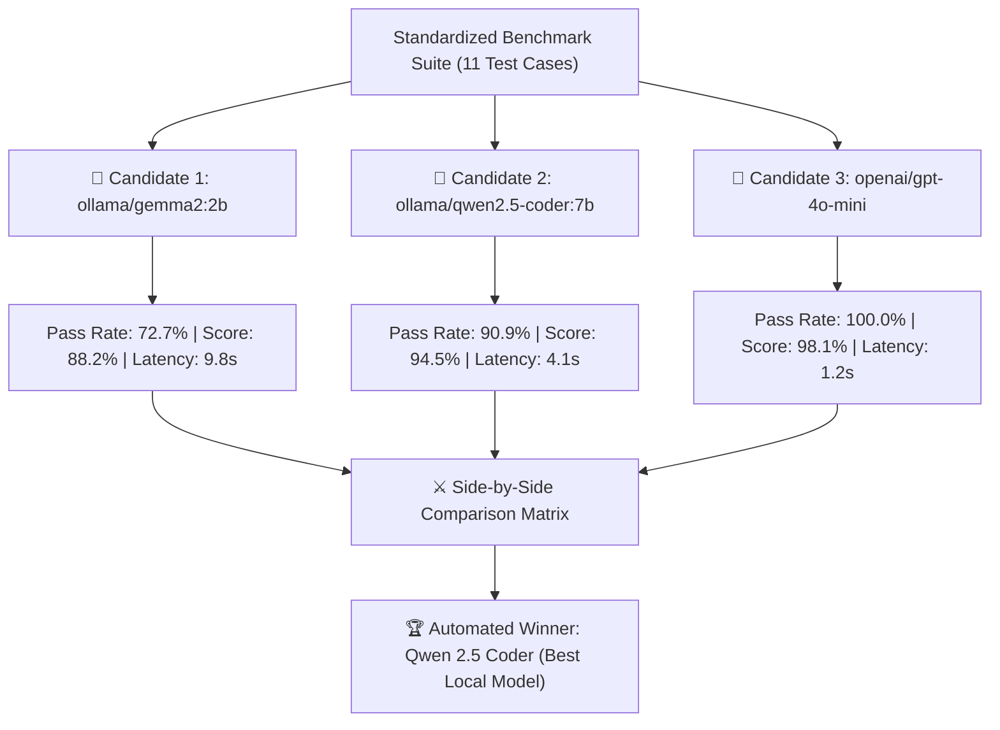

### How to Run Head-to-Head in Web Studio:
1. In the **Evals & Benchmarks** tab, scroll to **⚔️ Head-to-Head Model Comparison**.
2. Check the candidate models you want to compare (e.g. `ollama/gemma2:2b` and `ollama/qwen2.5-coder:7b`).
3. Click **Execute Head-to-Head Benchmark**.
4. The system executes the suite across both models, calculates delta scores, highlights per-test differences, and declares the winning model.

---

## 5.4 Longitudinal Tracking: Monitoring Agent Accuracy Over Time

In active software development, engineers continuously modify **prompts**, add **new tools**, refactor **skills**, or switch **underlying model weights**. Without longitudinal tracking, small changes can cause silent regressions where previously passing skills suddenly fail.

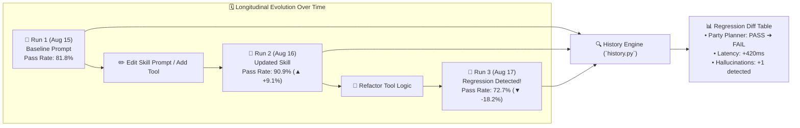

### How the History Engine Works (`evals_framework/history.py`):
Every benchmark run writes a timestamped JSON artifact to `evals_framework/reports/eval_run_<timestamp>_<uuid>.json`:
```json
{
  "run_id": "20260816_170338_8be479",
  "timestamp": "2026-08-16T17:03:38-07:00",
  "model": "ollama/qwen2.5-coder:7b",
  "judge_model": "ollama/qwen2.5-coder:7b",
  "pass_rate_pct": 90.9,
  "overall_score": 94.5,
  "grader_averages": {
    "deterministic": 85.2,
    "efficiency": 92.4,
    "llm_judge": 100.0,
    "fact_checker": 100.0
  },
  "performance_metrics": {
    "avg_latency_ms": 4120.5,
    "total_tokens": 14250
  },
  "results": [...]
}
```

### Comparing Historical Runs in the Web Studio:
1. In the **Evals & Benchmarks** tab, click **Historical Runs Archive**.
2. All past runs appear ordered newest-first with their server timestamp, model name, pass rate, and composite score.
3. Select 2 or more historical runs (e.g. *Run from yesterday* vs. *Run after modifying the shopping skill*).
4. Click **Compare Selected Runs**.
5. The dashboard renders:
   - **Score Delta Bars**: Visual green/red deltas for overall pass rate and composite score.
   - **Grader Comparison Radar**: Shows whether Deterministic accuracy increased while Efficiency decreased.
   - **Per-Test Case Regression Breakdown**: Highlights tests that changed from `✅ PASS` to `❌ FAIL`.

---

## 5.5 Navigating the Evals & Telemetry Dashboards in Web Studio

The platform provides dedicated visual dashboards for observability:

### 1. 🧪 Evals & Benchmarks Studio (Tab 7)
- **Top Summary Cards**: Live overall pass rate, composite score, total tokens consumed, and P95 latency.
- **Live 4-Grader Scorecard Gauges**: Radial gauge charts for Deterministic, Efficiency, LLM Judge, and Fact-Checker.
- **Test Case Diagnostics Accordion**: Expand any test case to view the exact prompt sent, tools executed, LLM Judge critique, and fact-checking hallucination report.
- **Registries Manager**: Add new candidate models (e.g. `openai/gpt-4o`) or register custom LLM Judge rubrics with specific grading criteria.

### 2. 📈 Telemetry Observatory (Tab 5)
- **KPI Metrics Cards**: Total gateway API calls, average latency, total token volume, and active model count.
- **Token Usage Over Time Chart**: Stacked bar chart of prompt vs. completion tokens.
- **Model Distribution Pie Chart**: Visual breakdown of calls routed to Ollama vs. OpenAI vs. Anthropic.
- **Latency Histogram**: Distribution of response times across P50, P90, and P99 percentiles.

---

## 5.6 Server-Local Markdown & Terminal Scorecards

Benchmark results are automatically formatted and saved with local server timestamps:

### Sample Generated Markdown Report (`evals_framework/reports/eval_report_*.md`):
```markdown
# LLM Evaluation Benchmark Report: `ollama/qwen2.5-coder:7b`

**Generated At (Server Time):** 2026-08-16 17:03:38 PDT (`2026-08-16T17:03:38.843834-07:00`)  
**Model Under Test:** `ollama/qwen2.5-coder:7b`  
**Overall Pass Rate:** `10/11` (90.9%)  
**Average Composite Score:** `94.5%`  

---

## 📊 Performance & Token Metrics

| Metric | Value |
| :--- | :--- |
| **Total Prompt Tokens** | `13,100` |
| **Total Completion Tokens** | `1,150` |
| **Average Latency** | `4120.5 ms` |
| **Throughput** | `24.8 tokens/sec` |

---

## 🧪 4-Grader Benchmark Evaluation Results

| Test ID | Category | Test Name | Det | Eff | Judge | Fact | Composite | Status |
| :--- | :--- | :--- | :---: | :---: | :---: | :---: | :---: | :---: |
| `skill_eval_001` | skill_adherence | Vacation Planner Skill | 90% | 100% | 100% | 100% | **97%** | ✅ PASS |
| `skill_eval_002` | skill_adherence | Personal Shopper Skill | 85% | 95% | 100% | 100% | **95%** | ✅ PASS |
| `tool_eval_001`  | tool_calling    | Bill Splitter Test     | 93% | 100% | 100% | 100% | **98%** | ✅ PASS |
```

---

## 5.7 Step-by-Step Guide: Onboarding a New Agent & Adapter

The **Evals Framework** uses the **Adapter Pattern** (`evals_framework/adapters/`) so you can benchmark *any* agent architecture (FastMCP agents, external HTTP microservices, LangChain agents, CrewAI, AutoGen, or custom Python pipelines) against the exact same test suites and 4-grader inspection pipeline.

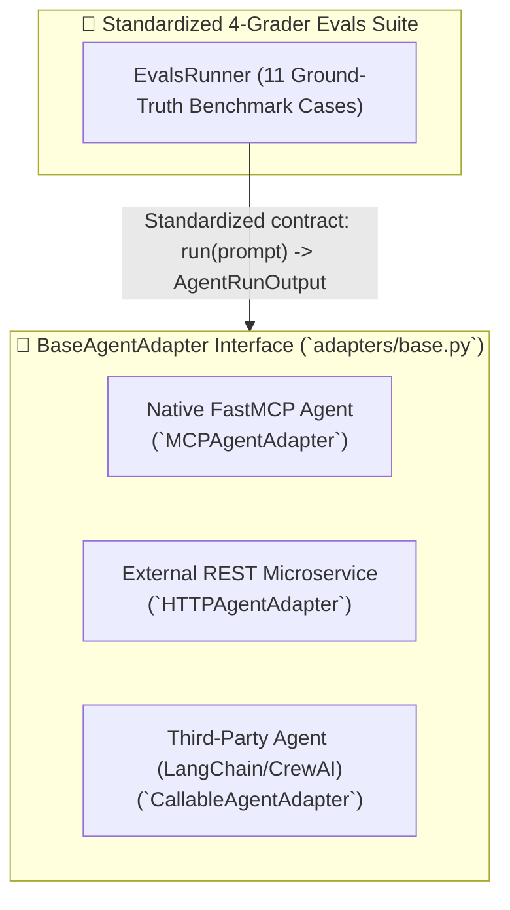

---

### Step 1: Understand the Adapter Contract (`adapters/base.py`)

Every agent adapter inherits from `BaseAgentAdapter` and implements a single asynchronous method: `run(prompt) -> AgentRunOutput`:

```python
from dataclasses import dataclass, field
from typing import Dict, Any, List, Optional
from abc import ABC, abstractmethod

@dataclass
class AgentRunOutput:
    """Standardized result schema expected by all 4 Graders."""
    response: str                                      # Final synthesized answer
    tool_calls_executed: List[Dict[str, Any]] = field(default_factory=list) # Tools executed
    total_prompt_tokens: int = 0                       # Prompt token count
    total_completion_tokens: int = 0                   # Completion token count
    latency_ms: float = 0.0                            # Total execution latency
    session_id: str = ""                               # Session tracking ID
    active_skills: List[str] = field(default_factory=list) # Skills used
    metadata: Dict[str, Any] = field(default_factory=dict)

class BaseAgentAdapter(ABC):
    def __init__(self, adapter_id: str, name: str, description: str = "", model: Optional[str] = None):
        self.adapter_id = adapter_id
        self.name = name
        self.description = description
        self.model = model

    @abstractmethod
    async def run(self, prompt: str, **kwargs: Any) -> AgentRunOutput:
        """Execute agent turn and return AgentRunOutput."""
        pass
```

---

### Step 2: Choose and Implement Your Adapter Type

#### Option A: Onboarding an External HTTP REST Agent (`HTTPAgentAdapter`)
Use this when your agent runs as a standalone microservice or serverless endpoint:

```python
from evals_framework.adapters import HTTPAgentAdapter, agent_registry

# 1. Instantiate the HTTP adapter pointing to your agent service endpoint
external_agent = HTTPAgentAdapter(
    adapter_id="customer_support_service",
    name="Production Customer Support Agent",
    endpoint_url="https://agent.mycompany.internal/v1/run",
    auth_header="Bearer secret-token-xyz",
    timeout_seconds=45.0,
    model="openai/gpt-4o"
)

# 2. Register into the singleton agent registry
agent_registry.register(external_agent)
```

#### Option B: Onboarding a Custom Python / LangChain / CrewAI Agent (`CallableAgentAdapter`)
Use this when wrapping an in-process agent function or library:

```python
from evals_framework.adapters import CallableAgentAdapter, agent_registry
from my_langchain_agent import execute_langchain_pipeline

async def langchain_agent_wrapper(prompt: str, **kwargs) -> dict:
    # Call your custom agent pipeline
    result = await execute_langchain_pipeline(prompt)
    return {
        "response": result.output_text,
        "tool_calls_executed": [
            {"tool": step.tool_name, "arguments": step.tool_input, "output": step.tool_output}
            for step in result.intermediate_steps
        ],
        "total_prompt_tokens": result.usage.prompt_tokens,
        "total_completion_tokens": result.usage.completion_tokens,
        "latency_ms": result.execution_duration_ms
    }

custom_agent = CallableAgentAdapter(
    adapter_id="langchain_react_v2",
    name="LangChain ReAct Agent v2",
    runner_fn=langchain_agent_wrapper,
    model="anthropic/claude-3-5-sonnet"
)
agent_registry.register(custom_agent)
```

---

### Step 3: Register and Manage Adapters via Web Studio UI

1. Open the Web Studio at `http://localhost:8000/`.
2. Navigate to **🧪 Evals & Benchmarks** ➔ **🔌 Agent Adapters Registry**.
3. View all currently active registered adapters (`mcp_default`, custom HTTP agents, callable agents).
4. Click **➕ Register New Agent Adapter** to add an external REST endpoint dynamically with custom headers and timeout configs without touching code.

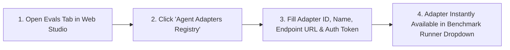

---

### Step 4: Execute Benchmarks Against the New Agent

Once registered, your newly onboarded agent immediately appears in all benchmark execution dropdowns:

```bash
# Run benchmark specifically targeting your newly onboarded agent:
python3 -m evals_framework.runner --agent customer_support_service --model openai/gpt-4o
```

Or in the Web Studio:
1. Go to **Run Benchmark Suite**.
2. Select `Production Customer Support Agent` in the **Agent Adapter** dropdown.
3. Click **Execute Benchmark Suite** to evaluate its tool ordering, efficiency, safety, and hallucination scores.
```

---

# Chapter 6: Building the Full-Stack Studio (React 18 + FastMCP Playground)

The **Web Studio** is a unified cockpit built with React 18, Vite, Adobe React Spectrum design tokens, Lucide Icons, and Recharts.

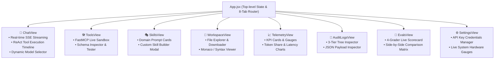

## 6.1 Unified API Client (`webui/src/api/client.js`)
```javascript
export const api = {
  // Chat Completion & SSE Streaming
  async streamChat({ model, messages, tools, onChunk, onEvent }) {
    const res = await fetch('/api/chat', {
      method: 'POST',
      headers: { 'Content-Type': 'application/json' },
      body: JSON.stringify({ model, messages, tools, stream: true })
    });
    const reader = res.body.getReader();
    const decoder = new TextDecoder();
    while (true) {
      const { done, value } = await reader.read();
      if (done) break;
      const lines = decoder.decode(value).split('\n');
      for (const line of lines) {
        if (line.startsWith('data: ')) {
          const data = JSON.parse(line.replace('data: ', ''));
          onChunk(data);
        }
      }
    }
  },

  // Evals Benchmark Runner
  async runEvals({ agent_id, model, judge_model, categories }) {
    return fetch('/api/evals/run', {
      method: 'POST',
      headers: { 'Content-Type': 'application/json' },
      body: JSON.stringify({ agent_id, model, judge_model, categories })
    }).then(r => r.json());
  }
};
```

---

---

# Chapter 7: Deployment Topologies, Port Mappings & Network Connectivity

The Agentic AI platform is engineered to support both **high-velocity local development** (with hot module replacement) and **zero-friction single-container production deployment**.

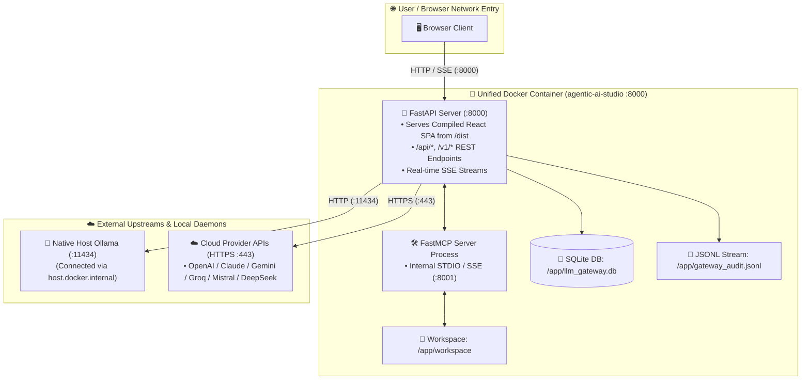

---

## 7.1 Port Allocation & Protocol Matrix

| Port | Service / Component | Protocol | Host Binding | Network Role & Purpose |
| :--- | :--- | :--- | :--- | :--- |
| **`8000`** | **LLM Gateway & Studio Backend** | HTTP / SSE / REST | `0.0.0.0:8000` | Primary production port. Serves the compiled React UI, all `/api/` endpoints, `/v1/chat/completions`, and SSE streams. |
| **`5173`** | **Vite Dev Server (WebUI)** | HTTP + WebSocket (HMR) | `localhost:5173` | Local development frontend only. Proxies all `/api`, `/v1`, `/health` requests to port `8000`. |
| **`8001`** | **FastMCP Server (SSE Mode)** | HTTP SSE / JSON-RPC | `127.0.0.1:8001` | Optional network mode for MCP tools & skills (STDIO pipe used by default in production). |
| **`11434`** | **Ollama Local Engine** | HTTP / REST | `localhost:11434` | Native local model runner on host machine for open-weight models (Qwen, Gemma, LLaMA). |
| **`443`** | **Cloud Model Providers** | Outbound HTTPS | External APIs | Encrypted outbound TLS traffic to OpenAI, Anthropic, Gemini, Groq, DeepSeek, and Mistral. |

---

## 7.2 Topology A: Local Development Multi-Server Mode

In development mode, Vite and FastAPI run side-by-side with hot reload:

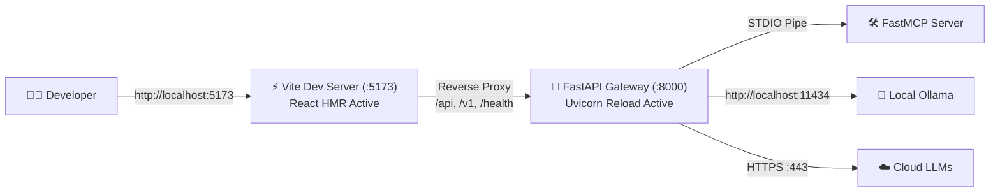

### Vite Reverse Proxy Configuration (`webui/vite.config.js`)
```javascript
export default defineConfig({
  server: {
    port: 5173,
    proxy: {
      '/api': { target: 'http://localhost:8000', changeOrigin: true },
      '/v1': { target: 'http://localhost:8000', changeOrigin: true },
      '/health': { target: 'http://localhost:8000', changeOrigin: true }
    }
  }
});
```

---

## 7.3 Topology B: Unified Single-Container Docker Production

In production, the multi-stage Docker build compiles the React application into static assets and bundles it inside the Python 3.12 container. FastAPI serves the SPA directly, eliminating the need for Nginx or a separate frontend server.

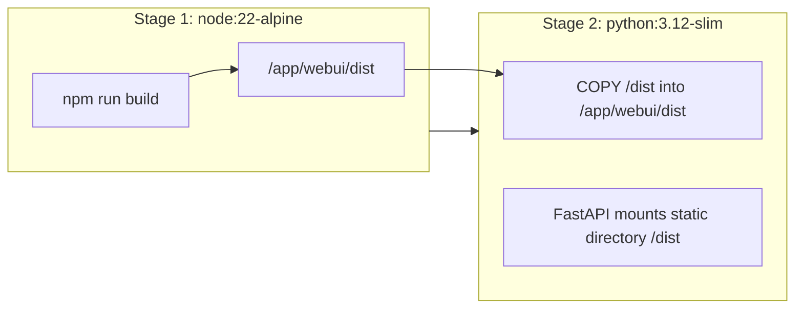

### Static SPA Mounting (`llm_gateway/app.py`)
```python
from fastapi.staticfiles import StaticFiles
from fastapi.responses import FileResponse

# Mount compiled React frontend assets
dist_dir = Path(__file__).parent.parent / "webui" / "dist"
if dist_dir.exists():
    app.mount("/assets", StaticFiles(directory=dist_dir / "assets"), name="assets")

    @app.get("/{full_path:path}")
    async def serve_spa(full_path: str):
        file_path = dist_dir / full_path
        if file_path.exists() and file_path.is_file():
            return FileResponse(file_path)
        return FileResponse(dist_dir / "index.html")
```

---

## 7.4 Environment Variables & Network Configuration

Create a `.env` file in the project root:

```ini
# ==============================================================================
# Server Host & Network Binding
# ==============================================================================
HOST=0.0.0.0
PORT=8000

# ==============================================================================
# Local Ollama Configuration
# In Docker: http://host.docker.internal:11434 | On Host: http://localhost:11434
# ==============================================================================
OLLAMA_API_BASE=http://localhost:11434

# ==============================================================================
# Optional Cloud LLM API Keys (Isolated in Gateway)
# ==============================================================================
OPENAI_API_KEY=sk-...
ANTHROPIC_API_KEY=sk-ant-...
GEMINI_API_KEY=AIzaSy...
GROQ_API_KEY=gsk_...
MISTRAL_API_KEY=...
DEEPSEEK_API_KEY=sk-...

# ==============================================================================
# Persistence & Audit Paths
# ==============================================================================
AUDIT_DB_PATH=./llm_gateway.db
AUDIT_JSONL_PATH=./gateway_audit.jsonl
WORKSPACE_DIR=./workspace
```

---

## 7.5 Automated Service Lifecycle & Graceful Restarts

To ensure clean port releasing without zombie processes when switching branches or upgrading models, use the automated restart script (`restart.sh`):

```bash
#!/usr/bin/env bash
set -e

echo "🛑 Cleaning up existing processes on port 8000 and 5173..."
lsof -ti :8000 | xargs kill -9 2>/dev/null || true
lsof -ti :5173 | xargs kill -9 2>/dev/null || true

echo "🔨 Building React WebUI bundle..."
cd webui && npm run build && cd ..

echo "🚀 Starting LLM Gateway and Web Studio on http://0.0.0.0:8000..."
nohup python3 -m uvicorn llm_gateway.app:app --host 0.0.0.0 --port 8000 > gateway.log 2>&1 &

echo "✅ Agentic AI Platform is live at http://localhost:8000"
```

---

# Chapter 8: Step-by-Step Construction Guide (From Scratch to Deployment)

Follow this execution roadmap to build the entire system in order:

## Step 1: Environment & Project Scaffolding
```bash
# 1. Create project workspace
mkdir agentic-ai && cd agentic-ai

# 2. Setup Python virtual environment
python3 -m venv .venv
source .venv/bin/activate

# 3. Create component directories
mkdir -p llm_gateway mcp_server ai_agent evals_framework/reports workspace webui
```

## Step 2: Install Core Python Dependencies
Create `requirements.txt`:
```txt
fastapi>=0.115.0
uvicorn>=0.32.0
litellm>=1.50.0
pydantic>=2.9.0
mcp>=1.0.0
rich>=13.8.0
psutil>=6.0.0
httpx>=0.27.0
pytest>=8.0.0
pytest-asyncio>=0.23.0
```
Run `pip install -r requirements.txt`.

## Step 3: Implement the 4 Subsystems in Sequence
1. **LLM Gateway** (`llm_gateway/`):
   - `config.py`: Environment variable loader (Ollama URL, API keys).
   - `db.py`: SQLite 3-tier audit logging schema.
   - `router.py`: LiteLLM kwargs builder and message sanitizer.
   - `app.py`: FastAPI server with `/v1/chat/completions` and audit endpoints.
2. **MCP Server** (`mcp_server/`):
   - `tools/`: Math, weather, search, product, file operations.
   - `skills/`: Prompt templates for domain skills.
   - `server.py`: FastMCP instance exposing tools and prompts.
3. **AI Agent** (`ai_agent/`):
   - `mcp_client.py`: MCP client connecting via STDIO or SSE.
   - `agent.py`: Multi-turn ReAct reasoning loop with loop guardrails.
4. **Evals Framework** (`evals_framework/`):
   - `graders/`: Deterministic, Efficiency, LLM-Judge, and Fact-Checker.
   - `runner.py`: Benchmark suite orchestrator.
   - `reporters/`: Server-local Markdown & Console reporters.

## Step 4: Build the React WebUI Studio
```bash
cd webui
npm create vite@latest . -- --template react
npm install @adobe/react-spectrum lucide-react recharts
npm run build
cd ..
```

## Step 5: Start the Full-Stack Studio
```bash
# Run Gateway + Web Studio locally
python3 -m uvicorn llm_gateway.app:app --host 0.0.0.0 --port 8000 --reload
```
Or start via Docker Compose:
```bash
docker compose up --build -d
```

Open your browser at **`http://localhost:8000`** to access the complete Agentic AI Studio!

---

## 🎯 Verification & Testing Checklist

| Component | Verification Command | Expected Outcome |
| :--- | :--- | :--- |
| **MCP Tools** | `pytest mcp_server/tests` | All unit tests pass; tools execute cleanly |
| **LLM Gateway** | `pytest llm_gateway/tests` | Provider routing & audit database log correctly |
| **Agent ReAct** | `python3 -m ai_agent.cli "Check Paris weather and book dinner"` | Agent calls `get_weather`, then splits the bill, then answers |
| **4-Grader Evals** | `pytest evals_framework/tests` | 18 benchmark tests pass; markdown reports generated |
| **React Studio** | `cd webui && npm test` | 14 UI component & view tests pass |
