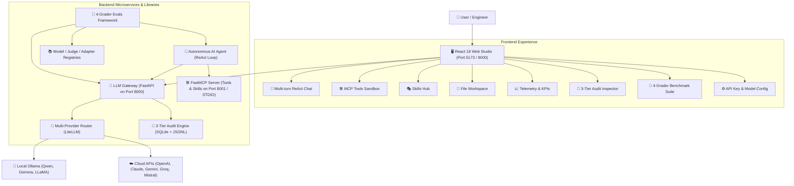
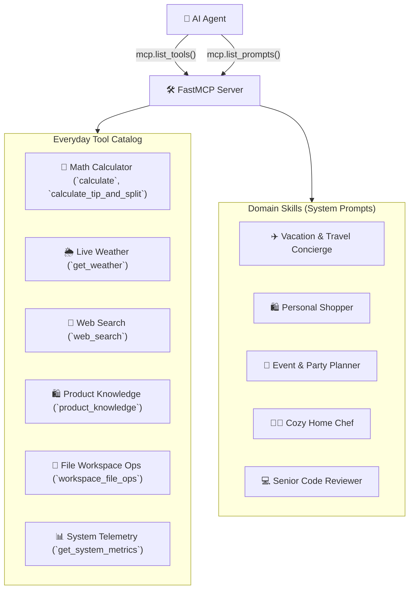
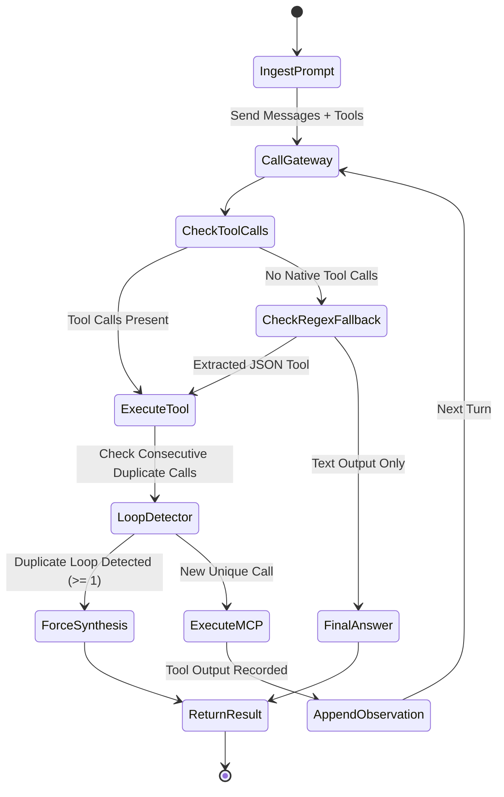
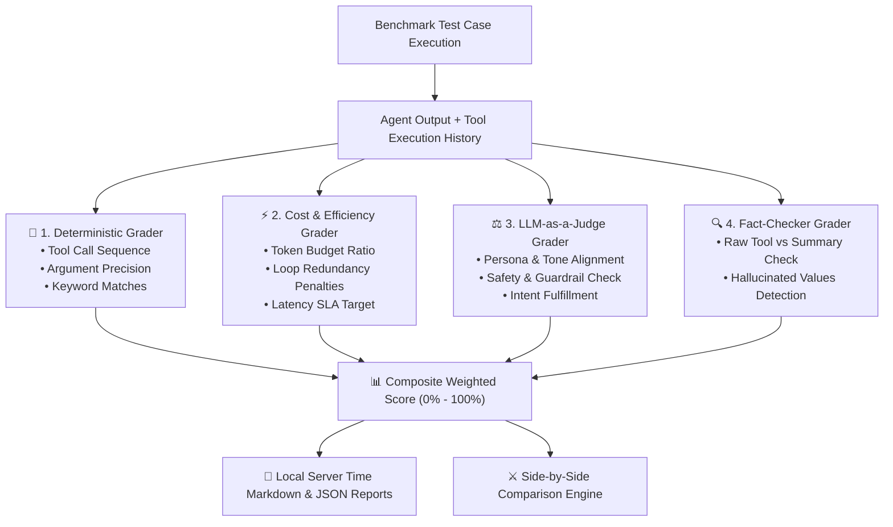
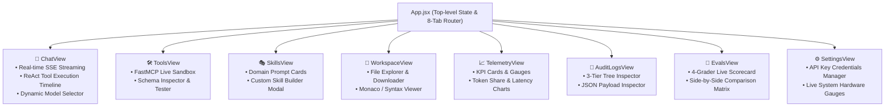

```mermaid
flowchart LR
    InReq["Client / Agent Request"] --> GatewayAuth["1. Auth & Context Ingestion"]
    GatewayAuth --> Sanitize["2. Tool Calls & Arguments Sanitizer"]
    Sanitize --> ModelRouter["3. Intelligent Provider Router"]
    ModelRouter --> Provider["4. LiteLLM Engine"]
    Provider --> StreamBuffer["5. Latency & Token Measurement"]
    StreamBuffer --> SQLiteAudit["6. SQLite & JSONL Log Engine"]
    SQLiteAudit --> OutResp["Client Response"]
```

# 🛠️ Build Your Own Production-Grade Agentic AI Platform
### *A Comprehensive Architectural Blueprint, Code-Level Walkthrough, and Implementation Guide*

**Author:** Vijay Donthireddy  
**Project:** Agentic AI Platform  
**Target Audience:** Software engineers, AI architects, and systems builders looking to design and build an enterprise-ready, modular agentic AI system from scratch.

---

## 📑 Table of Contents

1. [Chapter 1: System Topology & Foundational Architecture](#chapter-1-system-topology--foundational-architecture)
2. [Chapter 2: Building the LLM Gateway (Router, Isolation & 3-Tier Audit Trail)](#chapter-2-building-the-llm-gateway-router-isolation--3-tier-audit-trail)
3. [Chapter 3: Building the MCP Server (Everyday Tools & Dynamic Prompt Skills)](#chapter-3-building-the-mcp-server-everyday-tools--dynamic-prompt-skills)
4. [Chapter 4: Building the Autonomous ReAct AI Agent (Reasoning, Action & Loop Guardrails)](#chapter-4-building-the-autonomous-react-ai-agent-reasoning-action--loop-guardrails)
5. [Chapter 5: Building the 4-Grader Evals & Benchmarking Framework](#chapter-5-building-the-4-grader-evals--benchmarking-framework)
6. [Chapter 6: Building the Full-Stack Studio (React 18 + FastMCP Playground)](#chapter-6-building-the-full-stack-studio-react-18--fastmcp-playground)
7. [Chapter 7: Step-by-Step Construction Guide (From Scratch to Deployment)](#chapter-7-step-by-step-construction-guide-from-scratch-to-deployment)

---

# Chapter 1: System Topology & Foundational Architecture

## 1.1 The Core Problem: Why Monolithic LLM Wrappers Fail
Most initial AI projects couple LLM API calls directly with application business logic. This leads to 5 catastrophic architectural flaws:
1. **Vendor Lock-in**: Switching from OpenAI to local Ollama or Claude breaks application code.
2. **Zero Observability**: No centralized record of prompt tokens, completion tokens, latency, or tool execution paths.
3. **Fragile Tool Execution**: Agents get stuck in infinite loops calling the same tool or fail when small models generate non-standard JSON.
4. **Untested Reliability**: Lack of automated grading to detect hallucinations, prompt drift, or safety violations.
5. **No Visual Control**: Difficult for non-technical stakeholders to test tools, inspect logs, or evaluate models.

## 1.2 The Modular 4+1 Layered Architecture
To solve these challenges, we decouple the platform into **4 standalone microservices/libraries** plus a **Unified React Studio**:



## 1.3 Communication Protocols & Standards
* **Model Context Protocol (MCP)**: Standardized JSON-RPC protocol over STDIO and HTTP SSE for discovering tools and dynamic prompt skills.
* **OpenAI-Compatible Chat Completion API**: Standard REST endpoints (`/v1/chat/completions`, `/api/chat`) with Server-Sent Events (SSE) streaming.
* **Hierarchical Context Envelope**: Headers propagating `X-Session-ID`, `X-Conversation-ID`, `X-Turn-ID`, and `X-Request-ID` across every call.

---

# Chapter 2: Building the LLM Gateway (Router, Isolation & 3-Tier Audit Trail)

The **LLM Gateway** is the single entry point for all model inferences. It isolates credentials, routes across local and cloud providers, normalizes tool calling formats, and maintains a zero-loss audit log.



## 2.1 The 3-Tier Hierarchical Audit Model
Every single AI interaction is structured into a 3-tier tree:
* **Session (`session_id`)**: A user session or application run.
* **Conversation (`conversation_id`)**: A logical thread of dialogue.
* **Turn (`turn_id`)**: A single question-and-answer exchange (which may contain multiple agent tool executions).
* **Request (`request_id`)**: An individual HTTP call to an LLM provider.

### Database Schema (`llm_gateway/db.py`)
```sql
CREATE TABLE IF NOT EXISTS llm_calls (
    id TEXT PRIMARY KEY,
    request_id TEXT NOT NULL,
    turn_id TEXT,
    conversation_id TEXT,
    session_id TEXT,
    timestamp TEXT NOT NULL,
    caller_id TEXT,
    agent_name TEXT,
    caller_context TEXT,
    model TEXT NOT NULL,
    skill_names TEXT,
    tool_names TEXT,
    request_messages TEXT,
    request_tools TEXT,
    request_params TEXT,
    response_content TEXT,
    response_tool_calls TEXT,
    prompt_tokens INTEGER DEFAULT 0,
    completion_tokens INTEGER DEFAULT 0,
    total_tokens INTEGER DEFAULT 0,
    latency_ms REAL DEFAULT 0.0,
    status TEXT DEFAULT 'SUCCESS',
    error_message TEXT
);

CREATE INDEX IF NOT EXISTS idx_conv ON llm_calls(conversation_id);
CREATE INDEX IF NOT EXISTS idx_session ON llm_calls(session_id);
CREATE INDEX IF NOT EXISTS idx_timestamp ON llm_calls(timestamp);
```

## 2.2 Intelligent Model Resolution & Arguments Sanitization
Small open-weight models frequently return nested `tool_calls` arguments as raw dictionary objects instead of serialized JSON strings. LiteLLM will throw `TypeError` if `call["function"]["arguments"]` is a dict.

### Robust Message Sanitizer (`llm_gateway/router.py`)
```python
import json
from typing import List, Dict, Any

def sanitize_messages_for_litellm(messages: List[Dict[str, Any]]) -> List[Dict[str, Any]]:
    """
    Ensures all tool_calls conform to OpenAI/LiteLLM standard:
    Converts dictionary arguments into JSON strings to prevent provider crashes.
    """
    sanitized: List[Dict[str, Any]] = []
    for msg in messages:
        if not isinstance(msg, dict):
            sanitized.append(msg)
            continue

        msg_copy = dict(msg)
        if "tool_calls" in msg_copy and msg_copy["tool_calls"]:
            cleaned_tool_calls = []
            for tc in msg_copy["tool_calls"]:
                if isinstance(tc, dict):
                    tc_clean = dict(tc)
                    if "function" in tc_clean and isinstance(tc_clean["function"], dict):
                        fn_clean = dict(tc_clean["function"])
                        raw_args = fn_clean.get("arguments")
                        if isinstance(raw_args, (dict, list)):
                            fn_clean["arguments"] = json.dumps(raw_args)
                        elif raw_args is None:
                            fn_clean["arguments"] = "{}"
                        elif not isinstance(raw_args, str):
                            fn_clean["arguments"] = str(raw_args)
                        tc_clean["function"] = fn_clean
                    cleaned_tool_calls.append(tc_clean)
                else:
                    cleaned_tool_calls.append(tc)
            msg_copy["tool_calls"] = cleaned_tool_calls

        sanitized.append(msg_copy)
    return sanitized
```

---

# Chapter 3: Building the MCP Server (Everyday Tools & Dynamic Prompt Skills)

The **MCP Server** exposes executable tools and contextual prompt templates using the FastMCP standard.



## 3.1 Implementing FastMCP Server (`mcp_server/server.py`)
```python
from mcp.server.fastmcp import FastMCP
import json

app = FastMCP(
    name="Agentic MCP Server",
    version="1.0.0",
    description="Everyday tools and domain skills for autonomous AI agents."
)

@app.tool(name="calculate", description="Evaluate a mathematical expression.")
def calculate(expression: str) -> str:
    """Safe evaluation of arithmetic expressions."""
    # Sanitize and safely evaluate
    import math
    safe_dict = {"__builtins__": None, "math": math, "abs": abs, "round": round}
    return str(eval(expression, safe_dict, {}))

@app.tool(name="get_weather", description="Get current weather for a city.")
def get_weather(location: str) -> str:
    # Simulated weather database lookup
    return json.dumps({"location": location, "temperature_f": 72, "condition": "Sunny", "humidity": "45%"})

@app.prompt(name="vacation_travel_planner", description="System prompt for vacation planning.")
def vacation_travel_planner(destination: str, days: int = 3) -> str:
    return (
        f"You are a 5-star travel concierge. Plan a {days}-day itinerary for {destination}. "
        "You MUST first check the weather using 'get_weather' before recommending activities."
    )
```

---

# Chapter 4: Building the Autonomous ReAct AI Agent (Reasoning, Action & Loop Guardrails)

The **AI Agent** executes a multi-turn **ReAct (Reason + Act)** loop. It queries the MCP server for tools, invokes the LLM Gateway, executes tools upon request, feeds observations back into memory, and synthesizes the final response.



## 4.1 ReAct Loop Implementation with Duplicate Guardrails (`ai_agent/agent.py`)
```python
import json
import uuid
from typing import Dict, Any, List, Optional
from dataclasses import dataclass, field

@dataclass
class AgentRunResult:
    response: str
    tool_calls_executed: List[Dict[str, Any]] = field(default_factory=list)
    total_prompt_tokens: int = 0
    total_completion_tokens: int = 0

class ReActAgent:
    def __init__(self, gateway_client, mcp_client, model: str = "ollama/qwen2.5-coder:7b"):
        self.gateway = gateway_client
        self.mcp = mcp_client
        self.model = model
        self.messages: List[Dict[str, Any]] = []

    async def run(self, user_prompt: str, max_turns: int = 8) -> AgentRunResult:
        # 1. Fetch available tools from MCP
        tools = await self.mcp.list_tools_for_openai()
        self.messages.append({"role": "user", "content": user_prompt})

        tool_calls_executed = []
        total_prompt_tokens = 0
        total_completion_tokens = 0
        last_tool_signature = None
        consecutive_duplicate_calls = 0

        for turn in range(max_turns):
            response = await self.gateway.chat_completion(
                model=self.model,
                messages=self.messages,
                tools=tools,
                temperature=0.2
            )

            usage = response.get("usage", {})
            total_prompt_tokens += usage.get("prompt_tokens", 0)
            total_completion_tokens += usage.get("completion_tokens", 0)

            choice = response["choices"][0]
            assistant_msg = choice["message"]
            tool_calls = assistant_msg.get("tool_calls")

            # Fallback regex extraction for small models outputting JSON in text
            if not tool_calls:
                raw_content = assistant_msg.get("content") or ""
                tool_calls = self._extract_json_tool_calls(raw_content)
                if tool_calls:
                    assistant_msg["tool_calls"] = tool_calls

            self.messages.append(assistant_msg)

            # If no tools called, LLM reached final answer
            if not tool_calls:
                return AgentRunResult(
                    response=assistant_msg.get("content", ""),
                    tool_calls_executed=tool_calls_executed,
                    total_prompt_tokens=total_prompt_tokens,
                    total_completion_tokens=total_completion_tokens
                )

            # Execute Tool Calls
            loop_detected = False
            for tc in tool_calls:
                func_info = tc.get("function", {})
                tool_name = func_info.get("name", "")
                args_raw = func_info.get("arguments", "{}")
                args = json.loads(args_raw) if isinstance(args_raw, str) else args_raw

                # Loop detection
                sig = f"{tool_name}:{json.dumps(args, sort_keys=True)}"
                if sig == last_tool_signature:
                    consecutive_duplicate_calls += 1
                    loop_detected = True
                    tool_output = tool_calls_executed[-1]["output"] if tool_calls_executed else "{}"
                else:
                    consecutive_duplicate_calls = 0
                    last_tool_signature = sig
                    tool_output = await self.mcp.execute_tool(tool_name, args)

                    tool_calls_executed.append({
                        "tool": tool_name,
                        "arguments": args,
                        "output": tool_output
                    })

                self.messages.append({
                    "role": "tool",
                    "tool_call_id": tc.get("id", f"call_{uuid.uuid4().hex[:6]}"),
                    "name": tool_name,
                    "content": tool_output
                })

            # Break early if model is looping
            if loop_detected or consecutive_duplicate_calls >= 1:
                # Force final synthesis without tools
                synth = await self.gateway.chat_completion(
                    model=self.model,
                    messages=self.messages,
                    tools=None,
                    temperature=0.1
                )
                return AgentRunResult(
                    response=synth["choices"][0]["message"].get("content", ""),
                    tool_calls_executed=tool_calls_executed,
                    total_prompt_tokens=total_prompt_tokens,
                    total_completion_tokens=total_completion_tokens
                )

        return AgentRunResult(
            response="Max turns reached.",
            tool_calls_executed=tool_calls_executed,
            total_prompt_tokens=total_prompt_tokens,
            total_completion_tokens=total_completion_tokens
        )
```

---

# Chapter 5: Building the 4-Grader Evals & Benchmarking Framework

The **Evals Framework** executes standardized benchmarks against any Model × Agent × Judge combination, grading each run across **4 independent dimensions**.



## 5.1 The 4 Graders Explained

| Grader | Responsibility | Scoring Formula |
| :--- | :--- | :--- |
| **1. Deterministic** | Verifies tool sequence, exact parameter values, and mandatory keywords. | $S_{det} = 0.4 \cdot S_{order} + 0.3 \cdot S_{args} + 0.3 \cdot S_{keywords}$ |
| **2. Cost & Efficiency** | Penalizes excessive token usage, duplicate calls, and slow latency. | $S_{eff} = 1.0 - \text{penalties}_{tokens} - \text{penalties}_{loops} - \text{penalties}_{latency}$ |
| **3. LLM-as-a-Judge** | Uses an independent LLM to rate safety, friendliness, and intent. | $S_{judge} \in [0.0, 1.0]$ via structured JSON rubric |
| **4. Fact-Checker** | Compares numbers/facts in final text against raw tool JSON outputs. | $S_{fact} = 1.0$ if grounded; $0.0 - 0.5$ if hallucination detected |

## 5.2 Server-Local Markdown Report Generator (`evals_framework/reporters/markdown_reporter.py`)
```python
from pathlib import Path
from datetime import datetime
from typing import Dict, Any, List

def generate_markdown_report(
    model_name: str,
    test_results: List[Dict[str, Any]],
    performance_metrics: Dict[str, Any],
    output_dir: str = "./evals_framework/reports"
) -> str:
    out_path = Path(output_dir)
    out_path.mkdir(parents=True, exist_ok=True)
    
    # Use localized server time with timezone
    now = datetime.now().astimezone()
    timestamp = now.strftime("%Y%m%d_%H%M%S")
    clean_model = model_name.replace("/", "_").replace(":", "_")
    file_path = out_path / f"eval_report_{clean_model}_{timestamp}.md"

    passed_tests = sum(1 for t in test_results if t.get("overall_passed"))
    total_tests = len(test_results)
    pass_rate = round(passed_tests / total_tests * 100, 1) if total_tests else 0
    server_time_str = now.strftime("%Y-%m-%d %H:%M:%S %Z")

    content = f"""# LLM Evaluation Benchmark Report: `{model_name}`

**Generated At (Server Time):** {server_time_str} (`{now.isoformat()}`)  
**Model Under Test:** `{model_name}`  
**Overall Pass Rate:** `{passed_tests}/{total_tests}` ({pass_rate}%)  

## 📊 Performance Metrics
- **Total Tokens:** `{performance_metrics.get('total_tokens', 0):,}`
- **Average Latency:** `{performance_metrics.get('avg_latency_ms', 0):.1f} ms`
- **P95 Latency:** `{performance_metrics.get('p95_latency_ms', 0):.1f} ms`
"""
    file_path.write_text(content, encoding="utf-8")
    return str(file_path)
```

---

# Chapter 6: Building the Full-Stack Studio (React 18 + FastMCP Playground)

The **Web Studio** is a unified cockpit built with React 18, Vite, Adobe React Spectrum design tokens, Lucide Icons, and Recharts.



## 6.1 Unified API Client (`webui/src/api/client.js`)
```javascript
export const api = {
  // Chat Completion & SSE Streaming
  async streamChat({ model, messages, tools, onChunk, onEvent }) {
    const res = await fetch('/api/chat', {
      method: 'POST',
      headers: { 'Content-Type': 'application/json' },
      body: JSON.stringify({ model, messages, tools, stream: true })
    });
    const reader = res.body.getReader();
    const decoder = new TextDecoder();
    while (true) {
      const { done, value } = await reader.read();
      if (done) break;
      const lines = decoder.decode(value).split('\n');
      for (const line of lines) {
        if (line.startsWith('data: ')) {
          const data = JSON.parse(line.replace('data: ', ''));
          onChunk(data);
        }
      }
    }
  },

  // Evals Benchmark Runner
  async runEvals({ agent_id, model, judge_model, categories }) {
    return fetch('/api/evals/run', {
      method: 'POST',
      headers: { 'Content-Type': 'application/json' },
      body: JSON.stringify({ agent_id, model, judge_model, categories })
    }).then(r => r.json());
  }
};
```

---

# Chapter 7: Step-by-Step Construction Guide (From Scratch to Deployment)

Follow this execution roadmap to build the entire system in order:

## Step 1: Environment & Project Scaffolding
```bash
# 1. Create project workspace
mkdir agentic-ai && cd agentic-ai

# 2. Setup Python virtual environment
python3 -m venv .venv
source .venv/bin/activate

# 3. Create component directories
mkdir -p llm_gateway mcp_server ai_agent evals_framework/reports workspace webui
```

## Step 2: Install Core Python Dependencies
Create `requirements.txt`:
```txt
fastapi>=0.115.0
uvicorn>=0.32.0
litellm>=1.50.0
pydantic>=2.9.0
mcp>=1.0.0
rich>=13.8.0
psutil>=6.0.0
httpx>=0.27.0
pytest>=8.0.0
pytest-asyncio>=0.23.0
```
Run `pip install -r requirements.txt`.

## Step 3: Implement the 4 Subsystems in Sequence
1. **LLM Gateway** (`llm_gateway/`):
   - `config.py`: Environment variable loader (Ollama URL, API keys).
   - `db.py`: SQLite 3-tier audit logging schema.
   - `router.py`: LiteLLM kwargs builder and message sanitizer.
   - `app.py`: FastAPI server with `/v1/chat/completions` and audit endpoints.
2. **MCP Server** (`mcp_server/`):
   - `tools/`: Math, weather, search, product, file operations.
   - `skills/`: Prompt templates for domain skills.
   - `server.py`: FastMCP instance exposing tools and prompts.
3. **AI Agent** (`ai_agent/`):
   - `mcp_client.py`: MCP client connecting via STDIO or SSE.
   - `agent.py`: Multi-turn ReAct reasoning loop with loop guardrails.
4. **Evals Framework** (`evals_framework/`):
   - `graders/`: Deterministic, Efficiency, LLM-Judge, and Fact-Checker.
   - `runner.py`: Benchmark suite orchestrator.
   - `reporters/`: Server-local Markdown & Console reporters.

## Step 4: Build the React WebUI Studio
```bash
cd webui
npm create vite@latest . -- --template react
npm install @adobe/react-spectrum lucide-react recharts
npm run build
cd ..
```

## Step 5: Start the Full-Stack Studio
```bash
# Run Gateway + Web Studio
python3 -m uvicorn llm_gateway.app:app --host 0.0.0.0 --port 8000 --reload
```
Open your browser at **`http://localhost:8000`** to access the complete Agentic AI Studio!

---

## 🎯 Verification & Testing Checklist

| Component | Verification Command | Expected Outcome |
| :--- | :--- | :--- |
| **MCP Tools** | `pytest mcp_server/tests` | All unit tests pass; tools execute cleanly |
| **LLM Gateway** | `pytest llm_gateway/tests` | Provider routing & audit database log correctly |
| **Agent ReAct** | `python3 -m ai_agent.cli "Check Paris weather and book dinner"` | Agent calls `get_weather`, then splits the bill, then answers |
| **4-Grader Evals** | `pytest evals_framework/tests` | 18 benchmark tests pass; markdown reports generated |
| **React Studio** | `cd webui && npm test` | 14 UI component & view tests pass |
