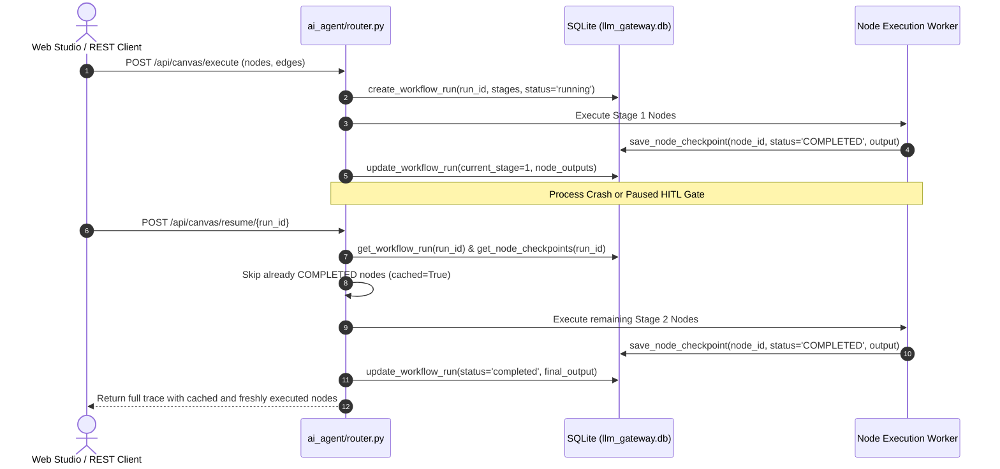
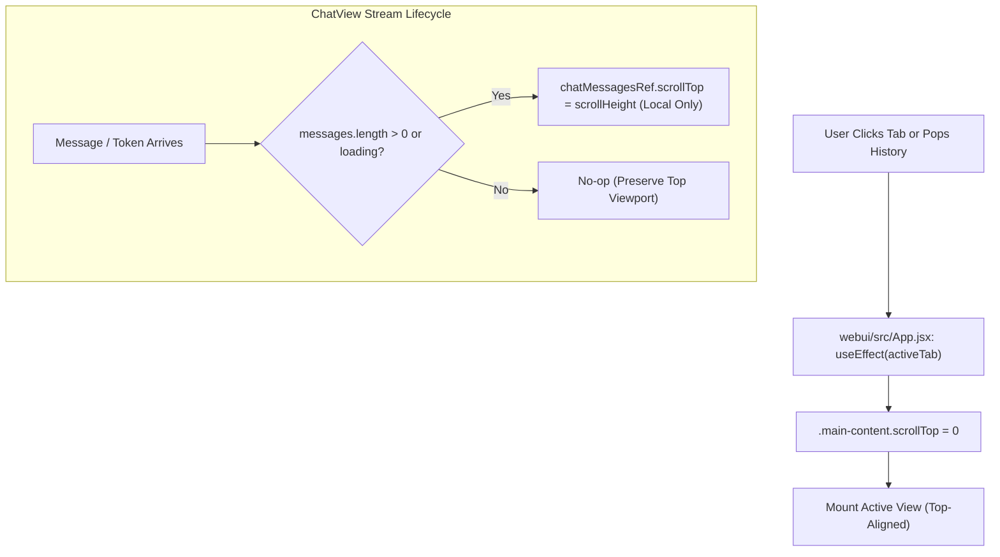
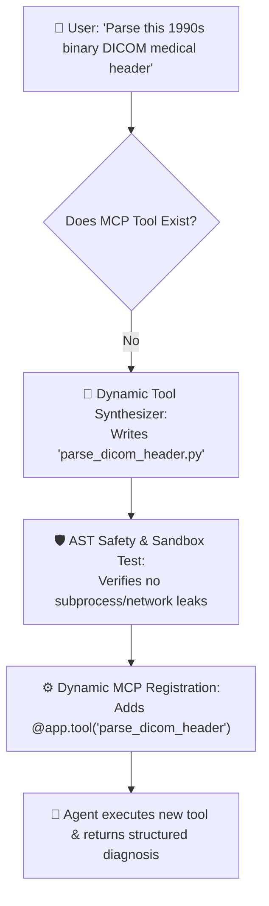
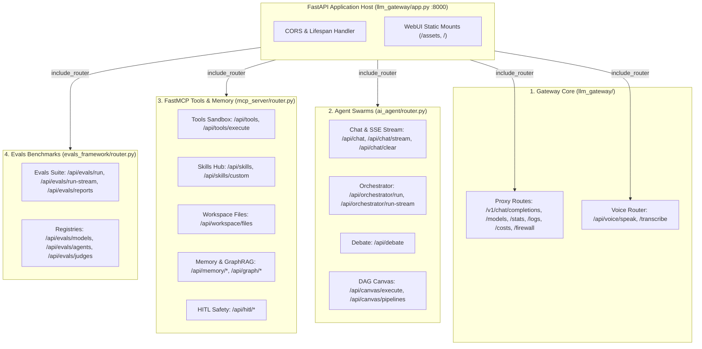

# 📐 Extendable System Design Document
## Agentic AI Platform — Modular Architecture, Extension Points & Developer Blueprint

**Author**: **Vijay Donthireddy**  
**Repository**: [vdonthireddy/agentic-ai](https://github.com/vdonthireddy/agentic-ai)  
**Version**: 2.0.0 (Next-Gen Production Architecture)  
**License**: MIT  
**Step-by-Step UI & Learning Tracks**: [docs/README.md](docs/README.md)

---

## 🎯 Executive Summary & Architectural Philosophy

The **Agentic AI Platform** is designed from the ground up as an open, decoupled, and highly extendable agent system. Unlike monolithic agent frameworks that tightly couple model access, tool definitions, and user interfaces into opaque abstractions, this platform is structured around **6 Core Design Principles**:

1. **Protocol-Agnostic Modularity**: Tools are decoupled from agents using the open **Model Context Protocol (MCP)**.
2. **Multi-Provider Centralization**: The **LiteLLM Gateway** isolates authentication, rate-limiting, and cost-tracking from application logic.
3. **Hierarchical Observability**: Every request is captured within a 3-tier audit hierarchy (**Conversation** &rarr; **Turn** &rarr; **Request**).
4. **Non-Blocking Safety Interceptors**: Destructive actions are halted safely with **Human-in-the-Loop (HITL)** cryptographic approval gates.
5. **Pluggable Multi-Agent Swarms & Consensus**: Tasks are scheduled across parallel worker pools using DAGs, dynamic skill inferencing, and multi-agent adversarial debate.
6. **Zero-Dependency Portability**: Features graceful fallbacks (e.g. ChromaDB &rarr; SQLite keyword search, NetworkX &rarr; BFS graph traversal) so the platform runs identically on local laptops and cloud Kubernetes clusters.

---

## 📖 Plain-English Glossary & Core Concepts

> *"Complex architecture is easier to build when the terms make intuitive sense. Here is a plain-English guide to the core concepts used throughout this platform."*

| Term | The Real-World Analogy | What It Means in Plain English |
| :--- | :--- | :--- |
| **Cohere (Command-R+)** | **The Enterprise Search Specialist** | An enterprise AI company founded by Aidan Gomez (co-author of the paper that invented the Transformer architecture). Known for **Command-R+** (a business reasoning and tool-calling model) and **Cohere Rerank** (industry-standard search ranking). In this design doc, it serves as an example of plugging in a new cloud AI provider. |
| **LiteLLM** | **The Universal TV Remote Control** | Every AI provider (OpenAI, Claude, Gemini, Cohere, Ollama) expects a slightly different code format. LiteLLM acts as a universal adapter so your code talks to 100+ different AI models using one single standard API. |
| **RAG (Retrieval-Augmented Generation)** | **The Open-Book Exam** | Instead of forcing an AI to guess answers from memory (which causes hallucinations), RAG searches your private PDFs or databases, extracts the relevant paragraphs, and gives them to the AI as a reference sheet before it answers. |
| **Vector Embedding** | **An Organizer by Meaning, Not Spelling** | A mathematical representation of the *meaning* of a sentence. Because of embeddings, the AI knows that *"How much is a ticket?"* and *"Show me pricing"* mean the same thing, even though they share no common words. |
| **DAG (Directed Acyclic Graph)** | **A Step-by-Step Cooking Recipe** | A task flow that only moves forward in one direction with **zero infinite loops** (Directed = one-way arrows, Acyclic = no circular deadlocks, Graph = connected steps). Used by the Task Planner to run parallel worker agents safely. |
| **MCP (Model Context Protocol)** | **The Universal USB-C Port for AI** | An open standard created by Anthropic that allows any AI brain to discover and execute any software tool (calculators, weather, web search, databases) using a standardized connection format. |
| **HITL (Human-in-the-Loop)** | **The "Confirm Before Deleting" Popup** | A cryptographic safety checkpoint where the AI stops and asks human permission before running sensitive operations (like deleting files or transferring funds). |
| **Token & Context Window** | **Word Count Currency & Memory Limit** | AI models don't read full words; they process 4-character chunks called tokens (*"hamburger"* = `ham` + `burger`). The **context window** is the maximum number of tokens an AI can remember in a single turn. |
| **ReAct Loop** | **Think &rarr; Act &rarr; Observe &rarr; Repeat** | The fundamental decision loop where an agent reasons about a question, picks a tool to run, inspects the tool's result, and repeats until the task is complete. |
| **Progressive Disclosure** | **Index Card &rarr; Detailed Manual** | An efficiency pattern where the AI only receives a lightweight list of available skills upfront, and loads detailed prompt guidelines into memory only when that specific skill is needed. |
| **AST (Abstract Syntax Tree)** | **The Airport Security X-Ray for Code** | A safe parser that analyzes mathematical formulas node-by-node to guarantee they only contain numbers and basic arithmetic operators (`+`, `-`, `*`, `/`) before evaluating them, blocking malicious code injections. |
| **SSE (Server-Sent Events)** | **The Live Word-by-Word Teletype Stream** | A web protocol that streams AI responses chunk-by-chunk to the browser so users see a typewriter effect in real time instead of waiting 10 seconds for the full response. |

---

## 🏗️ System Topology & Component Layering

```mermaid
flowchart TD
    subgraph Layer1["Layer 1: Presentation & Developer Studio (webui/)"]
        direction TB
        UI_Chat["1. Chatbot Studio (SSE + Voice)"]
        UI_Canvas["2. Workflow Canvas (2D DAG Studio)"]
        UI_Tools["3. Tool Catalog & Sandbox"]
        UI_Skills["4. Domain Skills Hub & Crafter"]
        UI_Files["5. Workspace Files Editor"]
        UI_Telem["6. Telemetry & Cost Observatory"]
        UI_Logs["7. 3-Tier Audit Inspector"]
        UI_Evals["8. 4-Grader Evals Matrix"]
        UI_Orch["9. Multi-Agent Orchestrator (DAG Swarm)"]
        UI_Mem["10. Memory Explorer (Vector + GraphRAG)"]
        UI_Settings["11. Gateway & Host Diagnostics"]
    end

    subgraph Layer2["Layer 2: Hardened Gateway & Routing (llm_gateway/)"]
        direction TB
        GW_Router["Multi-Provider Router (LiteLLM)"]
        GW_RL["Token-Bucket Rate Limiter (RPM / TPM)"]
        GW_CT["Cost Tracker & 30-Day Forecaster"]
        GW_Stream["SSE Chunk Stream Accumulator"]
        GW_Voice["Voice Router (/api/voice)"]
        GW_DB[("SQLite Audit Store: llm_gateway.db")]
        GW_JSONL["JSONL Audit Append Log"]
    end

    subgraph Layer3["Layer 3: Autonomous Agent Swarm (ai_agent/)"]
        direction TB
        AG_Sup["Supervisor Agent (orchestrator.py)"]
        AG_Plan["Task DAG Planner (task_planner.py)"]
        AG_Pool["Worker Agent Pool (asyncio.Semaphore)"]
        AG_Loop["ReAct Reasoning Loop (agent.py)"]
        AG_MCPC["MCP Stdio Client (mcp_client.py)"]
    end

    subgraph Layer4["Layer 4: MCP Tool & Skill Execution (mcp_server/)"]
        direction TB
        MCP_Core["FastMCP Server (server.py)"]
        MCP_HITL["HITL Safety Interceptor (hitl.py)"]
        MCP_Mem["Dual-Backend Memory Engine (memory_backend.py)"]
        MCP_Tools["Everyday Tools: Math, Weather, Web, Catalog, Files, Voice"]
        MCP_Skills["Dynamic Domain Skills Catalog"]
    end

    subgraph Layer5["Layer 5: Continuous Evaluation & Benchmarking (evals_framework/)"]
        direction TB
        EV_Run["Generic Benchmark Runner (runner.py)"]
        EV_Graders["4-Grader Suite: Deterministic, Latency, LLM Judge, Fact-Checker"]
        EV_Reg["Registries: Models, Judges, Agent Adapters"]
        EV_Hist["Side-by-Side Matrix & Reports"]
    end

    subgraph Layer6["Layer 6: Model Providers & Physical Storage"]
        direction TB
        M_Local["Local Ollama :11434 (gemma2, qwen2.5, llama3.2)"]
        M_Cloud["Cloud Providers (OpenAI, Claude, Gemini, Groq, Mistral, DeepSeek)"]
        FS_Work["./workspace/ (Agent Files)"]
        FS_Mem["./memory_store/ (Vector DB)"]
    end

    Layer1 <-->|REST & SSE Events| Layer2
    Layer2 <-->|Chat Completions| Layer3
    Layer3 <-->|STDIO / JSON-RPC| Layer4
    Layer5 <-->|Benchmark Test Runs| Layer3
    Layer5 <-->|Judge Scoring| Layer2
    Layer2 <-->|API Calls| M_Cloud
    Layer2 <-->|Local HTTP| M_Local
    Layer4 --> FS_Work
    Layer4 --> FS_Mem
    Layer2 --> GW_DB
    Layer2 --> GW_JSONL
```



---

## 🔌 Core Extension Points

The platform exposes **6 distinct extension points** for developers to plug in new capabilities without altering core infrastructure:

```
┌───────────────────────────────────────────────────────────────────────────────────┐
│                           PLATFORM EXTENSION POINTS                               │
├────────────────────────────────┬──────────────────────────────────────────────────┤
│ Extension Point                │ Target Component & File                          │
├────────────────────────────────┼──────────────────────────────────────────────────┤
│ 1. Custom Tools & Services     │ mcp_server/tools/<tool_name>.py                  │
│ 2. Custom Domain Skills        │ mcp_server/skills/<skill_name>.py                │
│ 3. LLM Providers & Models      │ llm_gateway/router.py & cost_tracker.py          │
│ 4. Vector Memory Backends      │ mcp_server/memory_backend.py                     │
│ 5. Multi-Agent Swarm Protocols │ ai_agent/task_planner.py & orchestrator.py        │
│ 6. Evaluator Graders & Metrics │ evals_framework/graders/ & datasets/             │
└────────────────────────────────┴──────────────────────────────────────────────────┘
```

---

## 🛠️ Extension Point 1: Adding Custom MCP Everyday Tools

### Architecture Contract
MCP tools are pure Python functions decorated with `@app.tool()` on the `FastMCP` instance in `mcp_server/server.py`. 

### Best Practices for Robust Tools:
1. **Resilient Type Annotations**: Accept `Any` with sensible defaults so LLMs of any size (from 2B to 400B) can supply arguments as strings, numbers, or dictionaries.
2. **Parameter Aliases**: Support common LLM variations (e.g. `query`, `search`, `text`, `content`).
3. **Structured Dict Return**: Always return structured JSON dictionaries containing a `"status"` or `"success"` indicator.
4. **HITL Protection for Destructive Actions**: Decorate dangerous actions with `@requires_approval`.

### Implementation Recipe: Custom SQL Database Query Tool

#### Step 1: Define the Tool in `mcp_server/tools/db_tools.py`
```python
"""Database exploration tool for executing read-only queries."""

import sqlite3
import json
from typing import Dict, Any, Optional

def execute_readonly_sql(
    query: str = "",
    sql: str = "",
    statement: str = "",
    db_path: str = "./workspace/company.db",
    max_rows: int = 25,
    **kwargs: Any
) -> Dict[str, Any]:
    """Execute safe read-only SQL queries against SQLite database."""
    actual_query = query or sql or statement
    if not actual_query:
        return {"status": "error", "message": "No SQL query provided."}
    
    # Enforce read-only constraint
    clean_sql = actual_query.strip().upper()
    if not clean_sql.startswith("SELECT") and not clean_sql.startswith("PRAGMA") and not clean_sql.startswith("EXPLAIN"):
        return {"status": "error", "message": "Only SELECT and inspection queries are allowed."}

    try:
        conn = sqlite3.connect(db_path)
        conn.row_factory = sqlite3.Row
        cursor = conn.cursor()
        cursor.execute(actual_query)
        rows = [dict(r) for r in cursor.fetchmany(max_rows)]
        conn.close()
        return {
            "status": "success",
            "query": actual_query,
            "row_count": len(rows),
            "rows": rows
        }
    except Exception as e:
        return {"status": "error", "message": f"SQL Execution Failed: {str(e)}"}
```

#### Step 2: Register in `mcp_server/server.py`
```python
from tools.db_tools import execute_readonly_sql

@app.tool(
    name="sql_query",
    description="Execute read-only SQL SELECT queries against the local workspace database."
)
def tool_sql_query(
    query: Any = "",
    sql: Any = "",
    db_path: str = "./workspace/company.db",
    max_rows: int = 25
) -> str:
    res = execute_readonly_sql(query=query, sql=sql, db_path=db_path, max_rows=max_rows)
    return json.dumps(res, indent=2)
```

---

## ⚡ Extension Point 2: Adding Custom Domain Skills

### Architecture Contract
Domain skills are modular prompt packages residing in `mcp_server/skills/`. They implement **Progressive Disclosure**:
- Lightweight metadata registered in the Skill Catalog (`id`, `name`, `category`, `description`, `recommended_tools`).
- Detailed persona instructions dynamically loaded on demand via the meta-tool `load_skill()`.

### Implementation Recipe: Legal Document Auditor Skill

#### Step 1: Create `mcp_server/skills/legal_auditor.py`
```python
"""Legal Document Auditor Domain Skill."""

LEGAL_AUDITOR_METADATA = {
    "id": "legal_auditor_skill",
    "name": "⚖️ Legal Document Auditor",
    "description": "Reviews contracts, terms of service, and agreements for liability risks, termination clauses, and non-standard indemnities.",
    "category": "Compliance & Legal",
    "recommended_tools": ["workspace_file_ops", "web_search", "memory_store"]
}

LEGAL_AUDITOR_PROMPT = """
You are an expert Enterprise Legal & Compliance Auditor.
When reviewing documents or answering legal questions:
1. Identify high-risk clauses: Unlimited liability, one-sided indemnification, and broad IP assignments.
2. Flag ambiguous termination periods (e.g. lack of cure periods).
3. Use `workspace_file_ops` to read contracts from the workspace and output structured risk matrices.
4. Save critical findings to memory using `memory_store` under namespace 'legal_audit'.
5. Always include a disclaimer that guidance does not substitute for formal legal counsel.
"""
```

#### Step 2: Add to `mcp_server/skills/__init__.py`
```python
from .legal_auditor import LEGAL_AUDITOR_METADATA, LEGAL_AUDITOR_PROMPT

ALL_SKILLS = [
    ...,
    LEGAL_AUDITOR_METADATA
]

SKILL_PROMPTS = {
    ...,
    "legal_auditor_skill": LEGAL_AUDITOR_PROMPT
}
```

---

## 🤖 Extension Point 3: Adding LLM Providers & Custom Gateway Backends

### Architecture Contract
The **LiteLLM Gateway** (`llm_gateway/router.py`) maps user model identifiers to provider endpoints and credentials. Adding a new provider requires registering its prefix, auth resolution, and pricing entries.

### Implementation Recipe: Adding Cohere Command-R+

#### Step 1: Update `llm_gateway/router.py`
```python
# Shorthand mapping
MODEL_SHORTHANDS["command-r-plus"] = "cohere/command-r-plus"

# Authentication kwargs builder
def build_litellm_kwargs(model_name: str) -> dict:
    ...
    elif model_name.startswith("cohere/"):
        api_key = os.environ.get("COHERE_API_KEY") or config.get("cohere_api_key")
        return {"api_key": api_key}
```

#### Step 2: Update Pricing in `llm_gateway/cost_tracker.py`
```python
MODEL_PRICING["cohere/command-r-plus"] = {
    "prompt_usd_per_million": 2.50,
    "completion_usd_per_million": 10.00
}
```

---

## 🧠 Extension Point 4: Custom Vector Memory Backends

### Architecture Contract
All memory backends must implement the abstract `VectorMemoryBackend` interface in `mcp_server/memory_backend.py`:

```python
class BaseMemoryBackend:
    def store(self, content: str, metadata: dict, namespace: str) -> str:
        """Store content and return unique memory_id."""
        raise NotImplementedError

    def recall(self, query: str, namespace: str, top_k: int) -> List[Dict[str, Any]]:
        """Return top_k semantically matched memories."""
        raise NotImplementedError

    def list_memories(self, namespace: str, limit: int) -> List[Dict[str, Any]]:
        """List stored memories in a namespace."""
        raise NotImplementedError

    def delete(self, memory_id: str) -> bool:
        """Delete memory by ID."""
        raise NotImplementedError

    def list_namespaces(self) -> List[str]:
        """Return all existing namespaces."""
        raise NotImplementedError
```

---

## 🧪 Extension Point 5: Adding Custom Benchmark Graders & Datasets

### Architecture Contract
The evaluation framework (`evals_framework/`) uses modular graders implementing the `BaseGrader` interface. Graders take the test case input, agent execution trace, and tool call sequence to produce a normalized score from `0.0` to `100.0`.

### Grader Interface:
```python
class BaseGrader:
    name: str = "custom_grader"
    description: str = "Evaluates custom criteria"

    def evaluate(self, test_case: dict, agent_result: dict, tool_calls: list) -> Dict[str, Any]:
        """Returns:
        {
            "score": float (0-100),
            "passed": bool,
            "feedback": str,
            "metrics": dict
        }
        """
        ...
```

---

## 🛡️ Extension Point 6: Custom Human-in-the-Loop (HITL) Interceptors

### Architecture Contract
To safeguard new sensitive actions, use the `@requires_approval` decorator in `mcp_server/hitl.py`:

```python
from hitl import requires_approval, RiskLevel

@requires_approval(
    risk_level=RiskLevel.CRITICAL,
    description="Sending external emails or payment webhooks requires human authorization.",
    action_filter={"send_payment", "transfer_funds", "send_mass_email"},
    timeout_seconds=90.0
)
def financial_transfer_tool(action: str, amount: float, recipient: str):
    # This code executes ONLY if approved via UI modal or API within timeout_seconds
    ...
```

---

## 💾 Extension Point 7: Durable State Machine, DAG Step Checkpointing & Crash-Resilient Resume

### 1. What It Does (Plain English & Analogy)
> **The Analogy: *"The Video Game Auto-Save & Mission Checkpoint"***  
> When a gamer plays a multi-hour mission, the console periodically triggers auto-saves. If power cuts out, they resume at the last checkpoint without restarting from level 1. Similarly, **Durable State Machine Checkpointing** treats every node in a workflow DAG as an atomic, auto-saved checkpoint in SQLite. If a process terminates, the machine reboots, or a human takes 2 hours to approve an action, the execution state can be resumed at `POST /api/canvas/resume/{run_id}` without re-running finished nodes or re-paying LLM token costs.

### 2. Why & How It Helps (Value Proposition)

| The Challenge Before | How Checkpointing Solves It |
| :--- | :--- |
| **In-Memory Volatility**: Complex DAG runs stored in RAM vanish upon server restart or process crash. | **Durable SQLite Persistence**: `workflow_runs` and `node_checkpoints` serialize graph state, stages, inputs, and outputs to disk. |
| **Duplicate Inference Costs**: Resuming a failed or paused 10-node DAG re-ran nodes 1–9, burning thousands of redundant tokens. | **Skip Completed Nodes**: Resume engine scans `node_checkpoints` for `COMPLETED` nodes, preserves their outputs in context, and executes only pending nodes. |
| **Loss of Pending Approvals**: HITL requests in RAM were discarded on reboot, leaving downstream agents blocked forever. | **Persistent HITL Storage**: `hitl_requests` table stores pending approvals and rehydrates them on server boot. |
| **Zero Execution Observability**: Teams had no audit trail of intermediate inputs/outputs for individual DAG nodes. | **Node-Level Traceability**: Full timing, step input, and output persisted per node with query endpoints `GET /api/canvas/runs` and `GET /api/canvas/runs/{run_id}`. |

### 3. Real-World Step-by-Step Scenario
1. **DAG Submission**: User triggers a 3-stage pipeline (Stage 1: Calculate metrics; Stage 2: Retrieve knowledge & memory; Stage 3: Wire transfer HITL approval gate).
2. **Intermediate Checkpoints**: Stage 1 calculates results and stores checkpoint `chk_run1_stage1` (`COMPLETED`). Stage 2 queries knowledge and stores checkpoint `chk_run1_stage2` (`COMPLETED`).
3. **Execution Interrupted**: Process halts at Stage 3 awaiting human approval. The server host restarts for updates.
4. **Resume**: Admin calls `POST /api/canvas/resume/{run_id}`. The engine detects Stage 1 & 2 are complete, marks them as `cached: true` in the trace, and resumes right at the Stage 3 HITL gate.
5. **Final Output**: Admin approves; Stage 3 completes; `workflow_runs` is marked `completed` with final synthesized output.

### 4. Witty Commentary from the Engineering Trenches
> *"Building an agentic workflow without durable checkpoints is like writing a 5,000-word essay directly inside a browser form without hitting save. One stray Wi-Fi blip and your work is gone. SQLite is the battle-tested, zero-config helmet that protects your enterprise workflows from the inevitable chaos of production servers."*

### 5. Visual Flows & Under-the-Hood Code



---

## 📊 Database Schema & Data Contracts

### 3-Tier Interaction Audit Schema (`llm_gateway.db`)

```sql
CREATE TABLE IF NOT EXISTS interactions (
    id TEXT PRIMARY KEY,               -- e.g. req_17238491_abc
    session_id TEXT NOT NULL,          -- Top-level user session
    conversation_id TEXT NOT NULL,      -- Thread session (reset on /clear)
    turn_id TEXT NOT NULL,              -- Single user prompt turn
    timestamp DATETIME DEFAULT CURRENT_TIMESTAMP,
    agent_name TEXT,
    model TEXT NOT NULL,
    status TEXT NOT NULL,              -- SUCCESS, ERROR, RATE_LIMITED
    latency_ms REAL,
    prompt_tokens INTEGER,
    completion_tokens INTEGER,
    total_tokens INTEGER,
    cost_usd REAL DEFAULT 0.0,         -- Model inference spend
    prompt_messages TEXT,              -- Full JSON messages array
    response_content TEXT,             -- Raw model completion
    tool_calls TEXT,                   -- JSON array of tool calls & results
    error_message TEXT,
    caller_ip TEXT
);

CREATE INDEX IF NOT EXISTS idx_conv_turn ON interactions(conversation_id, turn_id);
CREATE INDEX IF NOT EXISTS idx_timestamp ON interactions(timestamp);
CREATE INDEX IF NOT EXISTS idx_model ON interactions(model);
```

### Durable Workflow DAG Execution Schema (`workflow_runs` & `node_checkpoints`)

```sql
CREATE TABLE IF NOT EXISTS workflow_runs (
    run_id TEXT PRIMARY KEY,            -- Unique execution run ID (e.g. run_20260904_...)
    pipeline_id TEXT,                  -- Optional saved pipeline template ID
    workflow_name TEXT NOT NULL,       -- Human-readable pipeline name
    status TEXT NOT NULL,              -- running, completed, aborted, failed
    initial_input TEXT,                -- Prompt or goal provided to pipeline
    target_model TEXT,                 -- Default LLM model used across agent nodes
    current_stage INTEGER DEFAULT 0,   -- Current Kahn's algorithm stage index
    total_stages INTEGER DEFAULT 0,    -- Total topological stages
    nodes TEXT NOT NULL,               -- JSON serialized list of DAG nodes
    edges TEXT NOT NULL,               -- JSON serialized list of directed edges
    stages TEXT NOT NULL,              -- JSON serialized 2D list of stage node IDs
    node_outputs TEXT NOT NULL,        -- JSON dictionary {node_id: output_text}
    final_output TEXT,                 -- Synthesized output from sink nodes
    duration_ms REAL DEFAULT 0.0,      -- Total pipeline execution wall time
    created_at TEXT NOT NULL,          -- ISO-8601 UTC timestamp
    updated_at TEXT NOT NULL           -- ISO-8601 UTC timestamp
);

CREATE TABLE IF NOT EXISTS node_checkpoints (
    id TEXT PRIMARY KEY,               -- Unique checkpoint ID (chk_{run_id}_{node_id})
    run_id TEXT NOT NULL,              -- Foreign key to workflow_runs(run_id)
    node_id TEXT NOT NULL,             -- Node identifier within the DAG
    stage INTEGER NOT NULL,            -- Execution wave / topological stage index
    node_type TEXT NOT NULL,           -- agent, tool, hitl, memory
    label TEXT,                        -- Human-friendly display label
    status TEXT NOT NULL,              -- PENDING, RUNNING, COMPLETED, FAILED, DENIED
    step_input TEXT,                   -- Upstream inputs provided to this node
    output TEXT,                       -- Output text or JSON generated by this node
    duration_ms REAL DEFAULT 0.0,      -- Node execution latency in milliseconds
    created_at TEXT NOT NULL,          -- ISO-8601 UTC creation timestamp
    updated_at TEXT NOT NULL,          -- ISO-8601 UTC last modified timestamp
    FOREIGN KEY(run_id) REFERENCES workflow_runs(run_id) ON DELETE CASCADE
);

CREATE INDEX IF NOT EXISTS idx_chk_run ON node_checkpoints(run_id, stage);
```

### Persistent Human-in-the-Loop Approval Schema (`hitl_requests`)

```sql
CREATE TABLE IF NOT EXISTS hitl_requests (
    request_id TEXT PRIMARY KEY,        -- Unique HITL request ID (e.g. hitl_abc123)
    tool_name TEXT NOT NULL,           -- Name of intercepting tool or safety gate
    arguments TEXT NOT NULL,           -- JSON serialized arguments requiring review
    risk_level TEXT NOT NULL,          -- low, medium, high, critical
    description TEXT,                  -- Human-readable rationale for approval gate
    status TEXT NOT NULL,              -- pending, approved, denied, expired
    created_at REAL NOT NULL,          -- Epoch timestamp
    timeout_seconds REAL NOT NULL,     -- Auto-expiry countdown in seconds
    resolved_at REAL,                  -- Epoch timestamp when approved/denied
    resolved_by TEXT                   -- User or role that resolved the request
);

CREATE INDEX IF NOT EXISTS idx_hitl_status ON hitl_requests(status);
```

### Memory Schema (`memories.db` SQLite Fallback)

```sql
CREATE TABLE IF NOT EXISTS memories (
    memory_id TEXT PRIMARY KEY,
    namespace TEXT NOT NULL DEFAULT 'default',
    content TEXT NOT NULL,
    metadata_json TEXT DEFAULT '{}',
    created_at DATETIME DEFAULT CURRENT_TIMESTAMP
);

CREATE INDEX IF NOT EXISTS idx_mem_ns ON memories(namespace);
```

---

## 🚀 Step-by-Step Extension Walkthrough

```
+-------------------------------------------------------------------------+
|                  HOW TO ADD A NEW FEATURE TO THE STUDIO                 |
+-------------------------------------------------------------------------+
|                                                                         |
|  1. BACKEND TOOL       -> Create tool in mcp_server/tools/              |
|  2. MCP REGISTRATION   -> Register in mcp_server/server.py              |
|  3. GATEWAY ROUTE      -> Add REST/SSE endpoints in llm_gateway/        |
|  4. CLIENT BINDING     -> Expose in webui/src/api/client.js             |
|  5. REACT STUDIO VIEW  -> Build view in webui/src/views/MyView.jsx      |
|  6. NAVIGATION WIRING  -> Add Tab to webui/src/App.jsx & Sidebar.jsx    |
|  7. AUTOMATED TESTS    -> Write unit tests in mcp_server/tests/ & UI    |
|                                                                         |
+-------------------------------------------------------------------------+
```

### 🖥️ Layer 1 Presentation Architecture: Viewport Lifecycle & Ancestor Scroll Containment

#### 1. What It Does (Plain English & Analogy)
In a multi-view developer studio, navigation transitions and dynamic streaming updates must always keep the user anchored at the top of the newly selected screen without disorienting layout jumps.
- **The Core Mandate**: When entering any tab (e.g. Chat, Canvas, Tools, Skills, Evals, Orchestrator), the primary viewport must immediately start at the very top (`scrollTop = 0`).
- **Internal Stream Containment**: Live output streams (chat bubbles, terminal logs, live orchestrator event feeds) must scroll only their *own dedicated sub-containers* rather than bubbling up and forcing the parent studio container to scroll down.

> 💡 **The Real-World Analogy**:  
> Imagine an elevator inside a skyscraper. When you step onto the 5th floor, you expect to walk out onto the hallway floor at eye level. You wouldn't expect the entire skyscraper to drop 20 feet into the ground just because someone in office 502 pulled down their window blinds! Ancestral scroll containment ensures that child message streams move inside their own box without dragging down the whole building.

#### 2. Why & How It Helps (Value Proposition)

| The Challenge Before | How This Solves It |
|---|---|
| **Ancestral Scroll Hijacking**: Child components calling `element.scrollIntoView()` caused the browser to scroll every parent container up the DOM tree, pulling the `.main-content` viewport down. | **Localized Sub-Container Scrolling**: Uses direct `containerRef.current.scrollTop = containerRef.current.scrollHeight` inside the message list, completely eliminating ancestor scroll bubbling. |
| **Silent Scroll Leaks on Tab Switch**: Navigating between tabs failed to reset `.main-content` scroll, causing views to render partially scrolled out of view. | **Centralized Active-Tab Scroll Anchor**: A root-level `useEffect` in [`webui/src/App.jsx`](file:///Users/donthireddy/code/github/agentic-ai/webui/src/App.jsx) resets `.main-content.scrollTop = 0` on every tab change and history popstate. |
| **Premature Mount Scrolling**: Empty chat views auto-scrolled to the bottom of the welcome screen on first landing. | **Guarded Stream Scroll Effects**: Auto-scroll logic only triggers when active messages or streaming tokens actually exist (`messages.length > 0 \|\| loading`). |

#### 3. Real-World Simple Step-by-Step Scenario
1. **User Lands on Studio (`/`)**: The app mounts `ChatView`. The welcome prompt chips are displayed cleanly at the top of the viewport (`scrollTop = 0`).
2. **User Switches to Evals (`/evals`)**: App updates `activeTab`. The centralized scroll anchor immediately resets `.main-content.scrollTop = 0`, presenting the benchmark configuration cards at the top.
3. **Live Orchestration Run (`/orchestrator`)**: The task decomposition engine begins streaming parallel task events. Only the `maxHeight: 250px` event feed scrolls internally, leaving the supervisor prompt controls stationary and accessible.

#### 4. Witty, Engaging & Humorous Commentary
> *"There is a special circle in developer hell reserved for web apps that aggressively scroll you 300 pixels down the page the exact millisecond you land on them. We banished that demon forever by forbidding wild `scrollIntoView()` calls and teaching our scroll containers proper indoor manners."*

#### 5. Visual Flows & Under-the-Hood Code



**Implementation Pattern in [`webui/src/App.jsx`](file:///Users/donthireddy/code/github/agentic-ai/webui/src/App.jsx)**:
```javascript
// Centralized Top Viewport Anchor
useEffect(() => {
  if (typeof window !== 'undefined') {
    window.scrollTo(0, 0);
    const mainContent = document.querySelector('.main-content');
    if (mainContent) mainContent.scrollTop = 0;
    const contentPane = document.querySelector('.content-pane');
    if (contentPane) contentPane.scrollTop = 0;
  }
}, [activeTab]);
```

## 🗺️ Implemented Architecture & Next-Phase Roadmap

### 📋 Complete Architecture Implementation Status (Phases 1–4)

```
┌────────────────────────────────────────────────────────────────────────────────────────┐
│                        COMPREHENSIVE IMPLEMENTATION MATRIX (ACTIVE & LIVE)             │
├─────────┬─────────────────────────────────────────────────┬────────────────────────────┤
│ Phase   │ Feature Area                                    │ Active Source File         │
├─────────┼─────────────────────────────────────────────────┼────────────────────────────┤
│ Phase 1 │ LiteLLM Multi-Provider Gateway & 3-Tier Audit   │ llm_gateway/router.py, db  │
│ Phase 1 │ FastMCP Server with 6 Core Everyday Tools       │ mcp_server/server.py       │
│ Phase 1 │ Autonomous ReAct Reasoning Loop with Guardrails │ ai_agent/agent.py          │
│ Phase 1 │ 4-Grader Automated Evaluation Framework         │ evals_framework/runner.py  │
├─────────┼─────────────────────────────────────────────────┼────────────────────────────┤
│ Phase 2 │ Multi-Agent Swarm Orchestrator & Task DAG       │ ai_agent/orchestrator.py   │
│ Phase 2 │ Long-Term Semantic Vector Memory (Chroma+SQLite)│ mcp_server/memory_backend  │
│ Phase 2 │ Human-in-the-Loop (HITL) Safety Gates           │ mcp_server/hitl.py         │
│ Phase 2 │ Token-Bucket Rate Limiting & Cost Forecaster    │ llm_gateway/cost_tracker.py│
│ Phase 2 │ Voice Interface Layer (Whisper STT & Web Audio) │ mcp_server/tools/voice_..  │
├─────────┼─────────────────────────────────────────────────┼────────────────────────────┤
│ Phase 3 │ Multi-Agent Debate & Consensus Review Protocol  │ ai_agent/debate.py         │
│ Phase 3 │ GraphRAG Entity & Relationship Knowledge Graph  │ mcp_server/graph_memory.py │
│ Phase 3 │ Python Sandbox Interpreter with Plotly Charts   │ mcp_server/tools/python..  │
│ Phase 3 │ Interactive Live Artifacts Side-Panel           │ webui/src/components/Art.. │
│ Phase 3 │ Durable State Machine, Checkpointing & Resume   │ ai_agent/router.py, db.py  │
│ Phase 3 │ Persistent SQLite HITL Approval Storage         │ mcp_server/hitl.py, db.py  │
├─────────┼─────────────────────────────────────────────────┼────────────────────────────┤
│ Phase 4 │ Visual Drag-and-Drop Workflow Canvas (DAG)      │ webui/src/views/CanvasView │
│ Phase 4 │ Multi-Server External MCP Client Federation     │ ai_agent/federation.py     │
│ Phase 4 │ PII Masking & Real-Time Prompt Injection Guard  │ llm_gateway/firewall.py    │
│ Phase 4 │ OpenTelemetry (OTel) Distributed Tracing        │ llm_gateway/telemetry_otel │
│ Recipes │ Safe Read-Only SQL Database Explorer (`sql_q..`)│ mcp_server/tools/db_tools  │
│ Recipes │ Legal Document Auditor Domain Skill             │ mcp_server/skills/legal..  │
└─────────┴─────────────────────────────────────────────────┴────────────────────────────┘
```

---

## 🔮 Phase 5: Autonomous Self-Evolution, Edge Vision & Enterprise Governance

> *"The highest evolutionary state of an agentic system is when the system can inspect its own limitations, write its own missing tools safely, consolidate its daily learnings like human sleep cycles, and run securely on the edge."*
> — **Vijay Donthireddy**

Below is the architectural blueprint for the next evolutionary release of the platform:

```
┌────────────────────────────────────────────────────────────────────────────────────────┐
│                        PHASE 5 FUTURE ROADMAP ARCHITECTURE SPECIFICATION               │
├─────────┬─────────────────────────────────────────────────┬────────────────────────────┤
│ Release │ Proposed Feature Area                           │ Planned Architecture Layer │
├─────────┼─────────────────────────────────────────────────┼────────────────────────────┤
│ Phase 5 │ 5.1 Dynamic Tool Synthesizer (Auto-Tool Crafter)│ mcp_server/tool_synthesizer│
│ Phase 5 │ 5.2 Multi-Modal Vision & Screen Grounding Agent │ ai_agent/vision_agent.py   │
│ Phase 5 │ 5.3 Episodic Reflection & Memory Consolidation  │ mcp_server/reflection.py   │
│ Phase 5 │ 5.4 Differential Privacy & Confidential Enclave │ llm_gateway/confidential.py│
│ Phase 5 │ 5.5 Browser-Native Edge WASM/WebGPU Fallback    │ webui/src/engine/wasm.js   │
│ Phase 5 │ 5.6 Enterprise RBAC & Multi-Tenant Cost Center  │ llm_gateway/rbac.py        │
└─────────┴─────────────────────────────────────────────────┴────────────────────────────┘
```

---

### 5.1 🧬 Dynamic Tool Synthesizer (Auto-Tool Crafter at Runtime)

#### 💡 Plain-English Concept: *The 3D Printer for Software Tools*
When Donna or the agent encounters a unique user problem for which no pre-existing tool exists (e.g., converting a rare currency, computing specialized thermodynamic formulas, or parsing proprietary EDI medical files), **the agent writes a new Python tool function on the fly, tests it in the sandbox, and registers it into the MCP catalog dynamically**.

#### 🎯 The Problem It Solves
Engineering teams cannot predict every single tool an enterprise user will need. Instead of failing with *"I don't have a tool for this"*, the agent invents the tool on demand safely.

#### 🖼️ Architecture Flow


---

### 5.2 👁️ Multi-Modal Vision & Screen-Grounding Agent (`vision_agent.py`)

#### 💡 Plain-English Concept: *The Digital Eyes*
Equips the agent with the ability to **see, inspect, and reason over images, architectural diagrams, PDF charts, and live UI screen captures**.

#### 🎯 The Problem It Solves
Text-only agents cannot audit visual wireframes, inspect system architecture screenshots, or verify visual formatting bugs in web applications.

#### 💬 Real-World User Scenario
- **User Action**: Uploads a screenshot of an AWS CloudWatch latency spike.
- **Vision Agent**: Performs optical character recognition and visual bounding box inspection, identifies that database connections saturated at 14:02 UTC, and correlates it with an unindexed SQL query.

---

### 5.3 🧠 Episodic Reflection & Memory Consolidation (`reflection.py`)

#### 💡 Plain-English Concept: *The Nightly Dream & Journaling Cycle*
Just as human brains consolidate daily short-term memories into long-term wisdom during sleep, **the Reflection Engine runs background maintenance cycles to distill thousands of raw conversation interactions into high-level rules, user preferences, and synthesized domain wisdom**.

#### 🎯 The Problem It Solves
Raw conversation logs quickly fill context windows and vector databases with redundant noise (e.g. *"Hello"*, *"Can you hear me?"*). Memory consolidation condenses 100 conversations into 5 crisp, actionable behavioral rules.

---

### 5.4 🔒 Differential Privacy & Confidential Enclave Computing (`confidential.py`)

#### 💡 Plain-English Concept: *The Armored Bank Vault for Enterprise Data*
Protects corporate vector embeddings and database queries using **mathematical Differential Privacy** (injecting calibrated noise to prevent individual data extraction) and **Hardware Enclaves (AWS Nitro / GCP Confidential Space)** to ensure encryption keys are never visible even to cloud root administrators.

---

### 5.5 ⚡ Browser-Native Edge WASM & WebGPU Fallback (`wasm.js`)

#### 💡 Plain-English Concept: *The Solar-Powered Offline Calculator*
Compiles lightweight small language models (e.g. SmolLM, Gemma 2B) and embedding models into **WebAssembly (WASM) and WebGPU** so the entire React Web Studio can run offline directly on an airplane with zero server connectivity.

---

### 5.6 🤝 Enterprise Multi-Tenant RBAC & Departmental Cost Allocation (`rbac.py`)

#### 💡 Plain-English Concept: *The Corporate Expense Account & Badge Reader*
Enables large enterprises to partition the Agentic AI platform across departments (Engineering, Legal, Sales, HR):
- **Role-Based Access Control (RBAC)**: Restricts destructive tools (`workspace_file_ops(delete)`) to Senior Admins.
- **Departmental Chargebacks**: Generates monthly cost allocation reports with automated budget caps per team.

---

## 6. 🧩 Decoupled Subsystem Architecture & Microservice Boundary Pattern

```
┌──────────────────────────────────────────────────────────────────────────────────┐
│                     DECOUPLED SUB-SYSTEM ARCHITECTURE & ROUTERS                  │
├──────────────────────┬────────────────────────────────────┬──────────────────────┤
│ Subsystem / Package  │ Dedicated FastAPI Router           │ Responsibility       │
├──────────────────────┼────────────────────────────────────┼──────────────────────┤
│ 1. `llm_gateway/`    │ `llm_gateway/app.py` & `voice_endpoints.py` │ LiteLLM Proxy, Rate  │
│                      │                                    │ Limiting, Cost & PII │
├──────────────────────┼────────────────────────────────────┼──────────────────────┤
│ 2. `ai_agent/`       │ `ai_agent/router.py`               │ Chat, Swarms, Debate │
│                      │                                    │ & DAG Canvas Engine  │
├──────────────────────┼────────────────────────────────────┼──────────────────────┤
│ 3. `mcp_server/`     │ `mcp_server/router.py`             │ Tools, Skills, HITL, │
│                      │                                    │ Memory & GraphRAG    │
├──────────────────────┼────────────────────────────────────┼──────────────────────┤
│ 4. `evals_framework/`│ `evals_framework/router.py`        │ 4-Grader Evals,      │
│                      │                                    │ Benchmarks & Reports │
└──────────────────────┴────────────────────────────────────┴──────────────────────┘
```

### 1. What It Does (Plain English & Analogy)
**The Airport Terminal Concourse Analogy**:
Imagine an international airport where Terminal A handles regional flights, Terminal B handles international long-haul routes, Terminal C handles cargo, and Terminal D handles security checkpoints. If all check-in desks, customs agents, and baggage handlers were forced into one single 2,000-person hallway, a jam at the food court would ground all airplanes.

In our decoupled architecture, **`llm_gateway`**, **`ai_agent`**, **`mcp_server`**, and **`evals_framework`** each function as completely self-contained terminals. Each provides its own dedicated FastAPI router with strict encapsulation, while the main gateway server cleanly composes them into the unified 11-tab React Studio using non-blocking dynamic router inclusion.

### 2. Why & How It Helps (Value Proposition)

| The Challenge Before (Monolithic God Controller) | How This Decoupled Architecture Solves It |
| :--- | :--- |
| `llm_gateway/app.py` was over 2,070 lines long and imported every subsystem directly. | `app.py` is reduced by **77%** down to ~480 lines of pure gateway logic, mounting modular domain routers. |
| Hard imports caused circular dependencies and blocked standalone microservice deployments. | `llm_gateway` can be deployed independently as a lightweight LiteLLM proxy without installing agents or evals. |
| Changes to DAG canvas or debate logic required editing the gateway proxy server file. | Agent features are authored and tested strictly within [`ai_agent/`](file:///Users/donthireddy/code/github/agentic-ai/ai_agent/router.py) with zero risk to gateway stability. |
| Testing individual subsystems required mocking the entire monolithic application stack. | Each subsystem router is completely testable in isolation with its own domain fixtures. |

### 3. Real-World Simple Step-by-Step Scenario
1. **Developer Wants a Standalone LLM Gateway**: An enterprise team wants a LiteLLM proxy for company-wide OpenAI/Claude cost tracking. They run `python -m llm_gateway` with zero agent or evals overhead.
2. **AI Engineer Builds a Custom Swarm**: The AI engineer adds a new consensus algorithm in [`ai_agent/debate.py`](file:///Users/donthireddy/code/github/agentic-ai/ai_agent/debate.py) and exposes it in [`ai_agent/router.py`](file:///Users/donthireddy/code/github/agentic-ai/ai_agent/router.py) without touching database schemas or proxy routes.
3. **Unified Studio Deployment**: In production, `Dockerfile` or `docker compose up` starts the composed FastAPI host, which dynamically mounts all four domain routers and serves the React bundle.

### 4. Witty, Engaging & Humorous Commentary
> *"Every software project starts with 'We'll just add one tiny endpoint to `app.py`.' Fast forward 6 months, and your gateway proxy file is 2,000 lines long, imports the weather forecast, runs Kahn's algorithm for DAG cycle detection, and arbitrates multi-agent red-team debates over coffee. This refactor is the corporate intervention that restores peace, sanity, and single-responsibility boundaries."*

### 5. Visual Flows & Under-the-Hood Code



#### Under-the-Hood Composition Snippet ([`llm_gateway/app.py`](file:///Users/donthireddy/code/github/agentic-ai/llm_gateway/app.py)):

```python
# Graceful decoupled router mounting with offline fallbacks
app.include_router(voice_router)

try:
    from mcp_server.router import router as mcp_router
    app.include_router(mcp_router)
    logger.info("Loaded MCP Tools & Memory router.")
except ImportError as e:
    logger.warning(f"MCP server router not loaded: {e}")

try:
    from ai_agent.router import router as agent_router
    app.include_router(agent_router)
    logger.info("Loaded AI Agent & Swarm router.")
except ImportError as e:
    logger.warning(f"AI agent router not loaded: {e}")

try:
    from evals_framework.router import router as evals_router
    app.include_router(evals_router)
    logger.info("Loaded Evals Framework router.")
except ImportError as e:
    logger.warning(f"Evals framework router not loaded: {e}")
```

---

*© Vijay Donthireddy — Extendable System Design Document. Open-source under MIT License.*
