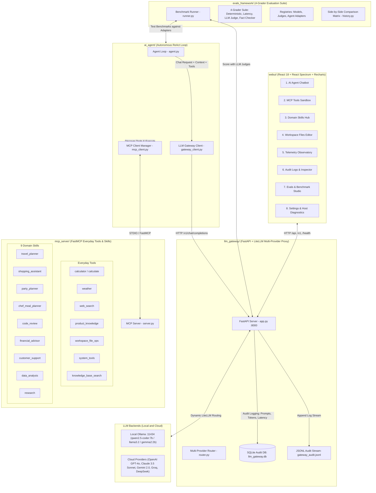
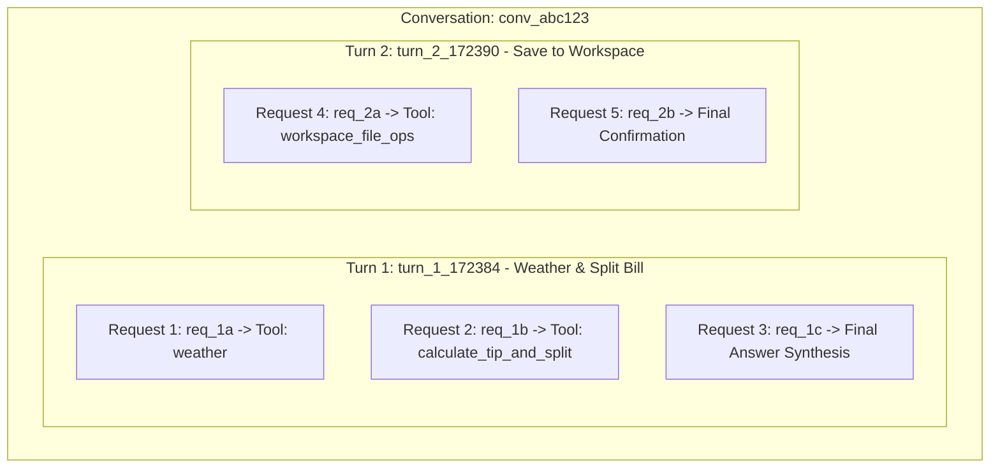

# Agentic AI: Real-World Everyday Tools, Fun Skills, Multi-Provider LiteLLM Gateway & React Studio

**Author**: **Vijay Donthireddy**

A complete production-ready modular architecture for building and running autonomous AI agents powered by local LLMs via **Ollama** and cloud LLMs via **OpenAI**, **Anthropic Claude**, **Google Gemini**, **Groq**, **Mistral**, and **DeepSeek**, real-world everyday tools (**Calculator**, **Live Weather**, **Web Search**, **Shopping Product Catalog**, **Workspace File Ops**, **System Metrics**), 9 domain skills (**Vacation Concierge**, **Personal Shopper**, **Party Host**, **Home Chef**, **Code Reviewer**, **Financial Advisor**, **Customer Support**, **Data Analyst**, **Research Specialist**), centralized prompt/token audit logging via a **LiteLLM Gateway**, a **4-Grader Evals Framework**, and a modern **React WebUI Studio** built with **React Spectrum** and **Recharts**.

> 📖 **Looking to build your own from scratch?** Read the comprehensive [Build Your Own Agentic AI Platform Guide](file:///Users/donthireddy/code/github/agentic-ai/BUILD_YOUR_OWN_AGENTIC_AI.md) for chapter-by-chapter architecture diagrams, code samples, and step-by-step instructions.

---

## 🏗️ Architecture Overview



---

## 📂 Project Structure

```
agentic-ai/
├── webui/                         # Modern React 18 WebUI Application
│   ├── package.json               # React 18, @adobe/react-spectrum, lucide-react, recharts, vitest
│   ├── vite.config.js             # Vite config with /api, /v1 proxy to Gateway
│   ├── dist/                      # Compiled production assets served by FastAPI
│   ├── src/
│   │   ├── main.jsx               # Entrypoint wrapped with Spectrum Theme Provider
│   │   ├── App.jsx                # Layout & 8 Studio tab routing
│   │   ├── api/client.js          # Unified API client for Gateway endpoints
│   │   ├── styles/index.css       # Custom design system, glassmorphism tokens, dark theme
│   │   ├── components/            # Sidebar, TopHeader, InspectorModal, CreateSkillModal
│   │   └── views/                 # 8 feature views (Chat, Tools, Skills, Workspace, Telemetry, Logs, Evals, Settings)
│   └── test/                      # Vitest unit test suite (13 test cases)
│
├── llm_gateway/                   # Multi-Provider LiteLLM Proxy & Audit Gateway
│   ├── app.py                     # FastAPI application serving completions, APIs, & WebUI
│   ├── router.py                  # Multi-provider model resolution & authentication builder
│   ├── config.py                  # Gateway configuration & cloud API key discovery
│   ├── stdio_gateway.py           # IPC Stdio gateway transport
│   ├── db.py                      # SQLite storage for audit records
│   ├── logger.py                  # Audit logging engine (SQLite + JSONL)
│   ├── models.py                  # Pydantic schemas for requests, responses, and context
│   └── tests/                     # Unit test suite (32 test cases)
│
├── ai_agent/                      # Autonomous ReAct Agent Loop
│   ├── agent.py                   # Core Agent loop managing ReAct tool-calling
│   ├── mcp_client.py              # MCP Client connecting to MCP Server over STDIO
│   ├── gateway_client.py          # Client for communicating with LLM Gateway
│   ├── cli.py                     # Interactive Rich terminal CLI
│   ├── demo.py                    # Automated end-to-end verification script
│   └── tests/                     # Unit test suite (6 test cases)
│
├── mcp_server/                    # FastMCP Server with Everyday Tools & Domain Skills
│   ├── server.py                  # FastMCP Server exposing tools & prompt-based skills
│   ├── tools/                     # Math, weather, search, products, files, system metrics
│   ├── skills/                    # 9 domain skills (travel, shopping, party, chef, review, finance, support, data, research)
│   └── tests/                     # Unit test suite (34 test cases)
│
├── evals_framework/               # 4-Grader Generic Agent & Model Evaluation Suite
│   ├── adapters/                  # Pluggable Agent Adapters (FastMCP Native, HTTP REST, Callable)
│   ├── registries/                # Dynamic Model & LLM-as-a-Judge Registries
│   ├── runner.py                  # Generic benchmark runner (Agent x Model x Judge)
│   ├── history.py                 # Historical run comparison & matrix engine
│   ├── datasets/                  # Benchmark cases (tool calling, skills, reasoning)
│   ├── graders/                   # 4 graders: deterministic, latency, llm-judge, fact-checker
│   ├── evaluators/                # Accuracy, adherence, correctness, performance scorers
│   ├── reporters/                 # Console and Markdown report generators (Server Local Time & Timezone)
│   └── tests/                     # Unit test suite (18 test cases)
│
├── workspace/                     # Persistent file workspace directory for agents
└── scripts/                       # Example scripts (e.g. openai_example.py)
```

---

## ⚡ Quick Start & Running

### 1. Install Dependencies
```bash
# Python virtual environment
python3 -m venv .venv
source .venv/bin/activate
pip install -r llm_gateway/requirements.txt
pip install -r mcp_server/requirements.txt
pip install -r ai_agent/requirements.txt
pip install -r evals_framework/requirements.txt

# React WebUI dependencies
cd webui && npm install && cd ..
```

### 2. Configure Cloud API Keys (Optional)
Copy `.env.example` to `.env` or set environment variables:
```bash
export OPENAI_API_KEY="sk-..."
export ANTHROPIC_API_KEY="sk-ant-..."
export GEMINI_API_KEY="AIza..."
export GROQ_API_KEY="gsk_..."
export MISTRAL_API_KEY="..."
export DEEPSEEK_API_KEY="sk-..."
```

### 3. Launch Gateway & WebUI Studio

#### Production Mode (FastAPI Serving React Bundle):
```bash
# Build React WebUI
cd webui && npm run build && cd ..

# Start LLM Gateway
.venv/bin/python llm_gateway/main.py

# Open browser at http://localhost:8000
```

#### Development Mode (Vite HMR with Proxy):
```bash
# Terminal 1: Backend Gateway
.venv/bin/python llm_gateway/main.py

# Terminal 2: Vite React Dev Server
cd webui && npm run dev

# Open browser at http://localhost:5173
```

---

## 🧪 Comprehensive Automated Test Suites

The project features **103 automated unit and integration tests** across the entire stack:

### Run All Python Tests (90 test cases)
```bash
.venv/bin/pytest
======================= 90 passed, 5 warnings in 10.56s ========================
```

### Run React WebUI Tests (13 test cases)
```bash
cd webui && npm test
======================= 13 passed (13) in 1.15s ===============================
```

### Test Coverage Breakdown:
- **`webui/src/test/`** (13 tests): React UI components, API client, view rendering, state updates, modal interactions.
- **`llm_gateway/tests/`** (32 tests): Multi-provider routing, shorthand resolution, authentication kwargs, FastAPI endpoints, SQLite DB auditing, Stdio IPC transport.
- **`mcp_server/tests/`** (34 tests): Math tools, file tools, system metrics, search tools, and all 9 domain skills.
- **`ai_agent/tests/`** (6 tests): Autonomous ReAct agent engine loop and MCP client adapter.
- **`evals_framework/tests/`** (18 tests): Evaluators, 4-Grader scorecard, benchmark runner, datasets, and registries.

---

## 🌟 The 8 Studio Modules

1. **💬 AI Agent Chatbot**: Multi-turn conversation with step-by-step tool invocation timeline, multi-provider model switcher, domain skills switcher, token counter meter, `/clear` session resets, and JSON export.
2. **🛠️ MCP Tools & Sandbox**: Interactive catalog of all everyday tools and live execution sandbox.
3. **⚡ Domain Skills Hub**: Grid of all 9 domain skills + custom persona crafter modal with one-click chat activation.
4. **📁 Workspace File Explorer**: Browse, view, edit, create, save, and download persistent files in `./workspace/`.
5. **📊 Telemetry Observatory**: Real-time KPI summary cards, Prompt vs Completion token distribution chart, and Model execution share graph.
6. **📜 Interaction Audit Logs & Inspector**: Categorized 3-tier telemetry tree (**Conversation** &rarr; **Turn** &rarr; **Request**) + flat stream with deep call inspector modal.
7. **🧪 Evals & Benchmark Studio**: 4-Grader benchmark runner, Candidate Models registry, LLM Judges registry, Agent Adapters registry, Historical runs, and Side-by-Side Comparison Matrix.
8. **⚙️ Settings & Host Diagnostics**: Multi-provider credentials manager, Ollama URL, Transport switcher, and live host hardware gauges (CPU, RAM, Disk, OS).

---

## 📜 Hierarchical Interaction Audit Logging Architecture

Every interaction across the system is categorized and tracked through a 3-tier hierarchy:

1. **`conversation_id`**: The entire multi-turn thread/session between a user and an agent. Typing `/clear` or clicking *New Conversation* finishes the session and starts a fresh conversation ID.
2. **`turn_id`**: A single user-initiated turn (starts when the user sends a prompt and encompasses all intermediate reasoning/tool cycles until the final response).
3. **`request_id`**: Every individual HTTP completion call sent to an LLM within that turn (e.g. tool selection, tool result processing, and final answer synthesis).



### Key Capabilities in WebUI:
- **Hierarchical Tree View**: Visualizes conversations as collapsible cards containing their individual turns, which expand to reveal all underlying LLM requests with latency and token breakdowns.
- **Flat Stream View**: Single tabular stream of all requests across conversations with search, model filtering, and inspection.
- **Deep Inspector Modal**: Inspects raw request messages, parameters, model response content, tool calls, and latency.
- **Conversation Isolation**: Typing `/clear` or `/new` in the chat immediately generates a new `conversation_id`, preserving past conversations in the audit logs while resetting context for the active session.

