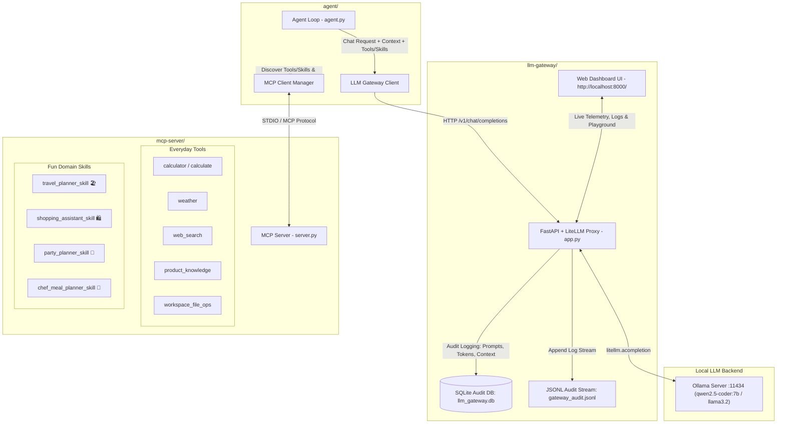

# Agentic AI: Real-World Everyday Tools, Fun Skills & LiteLLM Gateway

A modular architecture for building and running autonomous AI agents powered by local LLMs via **Ollama**, real-world everyday tools (**Calculator**, **Live Weather**, **Web Search**, **Shopping Product Catalog**), fun domain skills (**Vacation Concierge**, **Personal Shopper**, **Party Host**, **Home Chef**), and centralized prompt/token audit logging via a **LiteLLM Gateway**.

---

## 🏗️ Architecture Overview



---

## 📂 Project Structure

```
agentic-ai/
├── mcp_server/                 # Model Context Protocol (MCP) Server
│   ├── server.py               # MCP Server exposing tools & prompt-based skills
│   ├── tools/                  # Real-world everyday tools (math, weather, search, products, files)
│   ├── skills/                 # Fun interactive skills (travel, shopping, party, chef)
│   ├── tests/                  # Unit test suite (14 test cases)
│   └── requirements.txt
│
├── llm_gateway/                # LiteLLM Proxy & Audit Gateway + Studio UI
│   ├── app.py                  # FastAPI application routing LLM completions & UI
│   ├── static/                 # Unified Single Web Studio (HTML/CSS/JS)
│   ├── db.py                   # SQLite storage for audit records
│   ├── logger.py               # Audit logging engine (SQLite + JSONL)
│   ├── models.py               # Pydantic schemas for requests/context
│   ├── tests/                  # Unit test suite (7 test cases)
│   └── requirements.txt
│
├── ai_agent/                   # Autonomous LLM Agent Loop & Package
│   ├── agent.py                # Core Agent loop managing ReAct tool-calling
│   ├── mcp_client.py           # MCP Client connecting to MCP Server over STDIO
│   ├── gateway_client.py       # Client for communicating with LLM Gateway
│   ├── cli.py                  # Interactive Rich terminal CLI
│   ├── demo.py                 # Automated end-to-end verification script
│   ├── tests/                  # Unit test suite (3 test cases)
│   └── requirements.txt
│
├── evals_framework/            # 4-Grader LLM & Agent Evaluation Suite
│   ├── runner.py               # Benchmark test runner
│   ├── compare_models.py       # Comparative scorecard generator
│   ├── datasets/               # Benchmark cases (tool calling, skills, reasoning)
│   ├── graders/                # 4 graders: deterministic, efficiency, llm-judge, fact-checker
│   ├── evaluators/             # Accuracy, adherence, correctness, performance scorers
│   ├── reporters/              # Console and Markdown report generators
│   ├── tests/                  # Unit test suite (15 test cases)
│   └── reports/                # Benchmark reports (.md)
│
├── scripts/
│   ├── run_gateway.sh          # Helper to start LLM Gateway on port 8000
│   ├── run_agent.sh            # Helper to launch the interactive Agent CLI
│   ├── run_demo.sh             # Helper to run the automated E2E demo
│   ├── run_evals.sh            # Helper to execute the evaluation runner
│   └── inspect_logs.py         # CLI tool to query and inspect audit database
├── .env.example
├── .gitignore
└── README.md
```

---

## 🧪 Unit Testing

Run all 39 unit tests across all 4 components:

```bash
pytest mcp_server/tests llm_gateway/tests ai_agent/tests evals_framework/tests -v
```

---

## 🚀 Quick Start Guide

### 1. Prerequisites
- **Python 3.10+** (Python 3.12 recommended)
- **Ollama** running locally:
  ```bash
  ollama run qwen2.5-coder:7b
  # or
  ollama run llama3.2
  ```

### 2. Environment Setup
Install dependencies with `uv` (recommended) or standard `pip`:
```bash
# Create and activate virtual environment
uv venv .venv
source .venv/bin/activate

# Install all dependencies
uv pip install -r requirements.txt
```

---

## 🐳 Consolidated Docker Deployment (One-Command Launch)

The entire architecture (LiteLLM Gateway, MCP Tool Server, AI Agent Chatbot, Audit Logger, and Evals Framework) is unified into a single Docker setup. You don't need to start multiple separate containers or run multiple scripts.

### 🚀 One-Command Launch
```bash
./scripts/docker_run.sh
# Or directly via Docker Compose:
docker compose up --build -d
```

### 🌐 Access Everything from One Unified UI
Open your browser to:
👉 **[http://localhost:8000/](http://localhost:8000/)**

From this single web interface, you can:
1. **💬 Chat with the AI Agent** (with real-time MCP tool execution cards & skill selectors).
2. **📊 Monitor Token & Latency Telemetry** (live charts & metrics).
3. **📜 Inspect Historical Prompts & Audit Logs** (searchable logs & full message inspector).
4. **🧪 Execute 4-Grader Evals & Benchmarks** (interactive scorecard & markdown report viewer).

### Useful Docker Commands:
```bash
# View live application logs
docker compose logs -f

# Stop the entire stack
docker compose down
```

---

## 🏃 Running Locally (Without Docker)

### Step 1: Start the LLM Gateway
In a terminal window:
```bash
./scripts/run_gateway.sh
```
*The gateway starts on `http://localhost:8000`, exposes `/v1/chat/completions`, and connects to Ollama at `http://localhost:11434`.*

### Step 2: Run the Automated E2E Demo
In another terminal:
```bash
./scripts/run_demo.sh
```
This tests:
1. **MCP Tool Calling**: Math calculation (`calculate`) and Python execution (`execute_python`).
2. **System Diagnostics**: Host hardware inspection (`get_system_metrics`) and workspace file writing (`workspace_file_ops`).
3. **Skill Activation**: Injects `data_analysis_skill` to compute growth trends.
4. **Audit Verification**: Validates persisted records in `llm_gateway.db`.

### Step 4: Run the LLM Evaluation Framework
Benchmark your local models across tool accuracy, skill adherence, correctness, and latency:
```bash
# Evaluate default model (qwen2.5-coder:7b)
./scripts/run_evals.sh ollama/qwen2.5-coder:7b

# Compare multiple models head-to-head (e.g. qwen2.5-coder vs llama3.2):
python evals-framework/compare_models.py --models ollama/qwen2.5-coder:7b ollama/llama3.2
```
*Reports are saved automatically to `evals-framework/reports/` in Markdown format.*

---

## 🛠️ Everyday Tools (Real-World & Non-Technical)

| Tool Name | Real-World Purpose | Example Invocations |
| :--- | :--- | :--- |
| **`calculator`** | Compute dinner bill splitting, restaurant tips, sales discounts, and monthly budgets. | `"Split a $184.50 bill among 4 people"`, `"15% off on $199.99"` |
| **`weather`** | Live global weather conditions, temperatures, umbrella alerts, and 3-day forecasts. | `"What's the weather like in Paris this weekend?"`, `"Tokyo forecast"` |
| **`web_search`** | Search trending travel guides, top food spots, game night ideas, and 15-min recipes. | `"Top ramen shops in Tokyo"`, `"Fun games for party of 8"` |
| **`product_knowledge`** | Browse top-rated consumer products (espresso machines, headphones, luggage, cozy hoodies). | `"Find top-rated headphones on sale"`, `"Look up espresso maker"` |
| **`workspace_file_ops`** | Save vacation packing checklists, grocery lists, and party schedules to files. | `"Save packing list to packing_list.txt"` |

---

## 🌟 Fun & Easy-to-Understand Domain Skills

| Skill Name | Role & Persona | What it Does |
| :--- | :--- | :--- |
| **`travel_planner_skill`** | 🏖️ **Vacation & Adventure Concierge** | Checks the live weather, crafts exciting day-by-day itineraries, suggests local bakeries & sights, and gives packing advice. |
| **`shopping_assistant_skill`** | 🛍️ **Personal Shopper & Gift Finder** | Searches the product catalog, calculates exact discount prices, compares gift ideas, and highlights customer reviews. |
| **`party_planner_skill`** | 🎉 **Epic Party & Celebration Host** | Plans game nights, birthday bashes, and dinners — calculating pizza/snack quantities, checking weather, and picking fun games. |
| **`chef_meal_planner_skill`** | 🍳 **Cozy Home Chef & Meal Crafter** | Creates delicious 15-to-30 minute weeknight dinner recipes, categorized grocery lists, and scaled serving sizes. |

---

## 📊 LLM Gateway Audit Logging

The LLM Gateway captures every request and response, recording:
- **Full Prompts & Messages**: All system instructions, user queries, assistant replies, and tool responses.
- **Token Usage**: `prompt_tokens`, `completion_tokens`, `total_tokens`.
- **Caller Context**: `caller_id`, `agent_name`, `session_id`, client IP, custom headers (`X-Caller-Context`).
- **Discovered & Invoked Tools**: Names of all tools available and executed.
- **Active Skills**: Skill names injected during the turn.
- **Performance**: Exact request latency in milliseconds (`latency_ms`).

### Inspecting Audit Logs
Use the included CLI tool:
```bash
# View summary stats and recent calls
python scripts/inspect_logs.py

# Inspect complete details (including full prompts and responses) for a specific call ID:
python scripts/inspect_logs.py --detail call_xxxxxxxxx

# Filter by session or agent:
python scripts/inspect_logs.py --session demo_sess_123
python scripts/inspect_logs.py --agent DemoAgent-E2E
```

### Gateway REST Endpoints
- `POST /v1/chat/completions`: OpenAI-compatible proxy routing to local Ollama via LiteLLM.
- `GET /v1/models`: List available local models.
- `GET /v1/logs`: Retrieve audit records with filtering and pagination.
- `GET /v1/stats`: Aggregate token consumption and tool/skill usage frequencies.
- `GET /health`: Health status of Gateway and Ollama connectivity.
