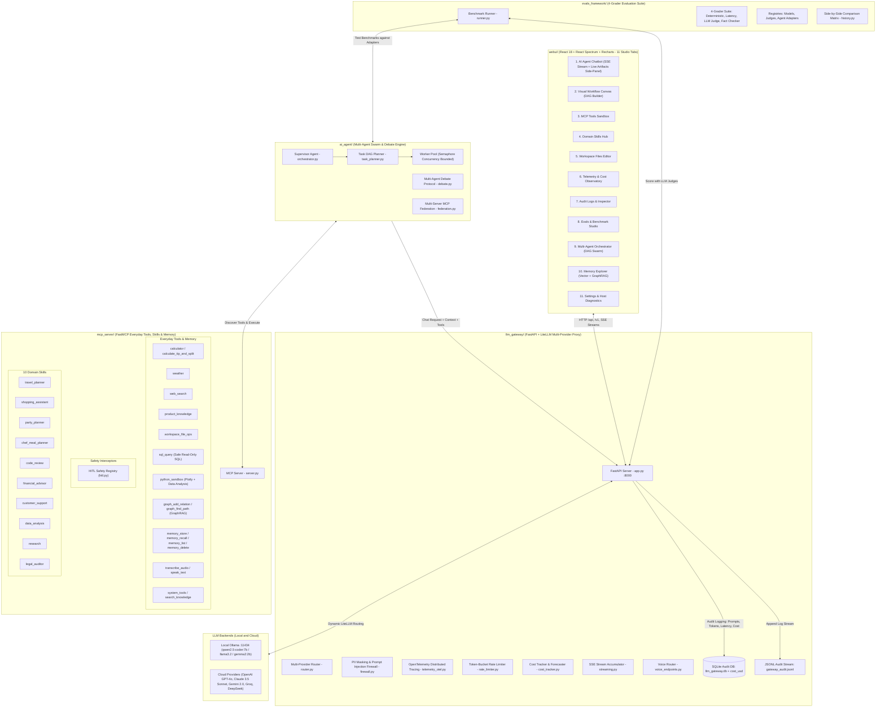
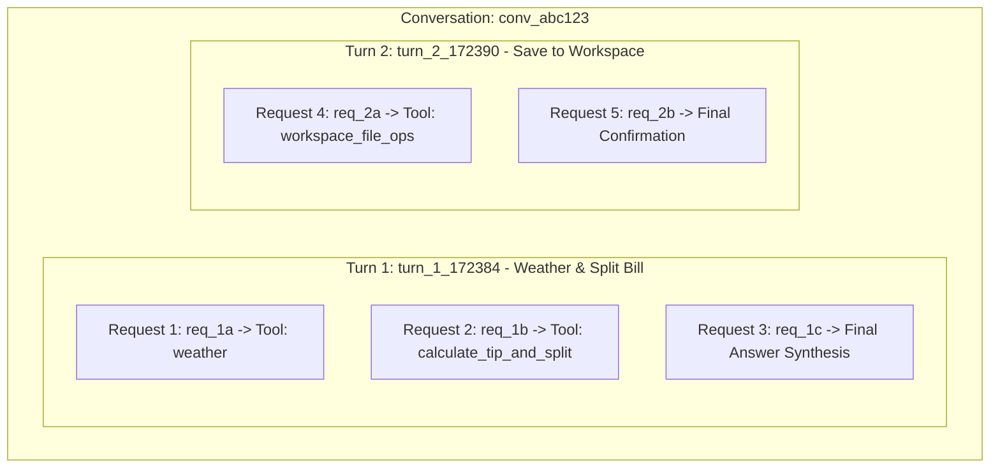

# Agentic AI: Real-World Everyday Tools, Fun Skills, Multi-Provider LiteLLM Gateway, Swarms & React Studio

**Author**: **Vijay Donthireddy**

A complete production-grade modular architecture for building and running autonomous AI agents powered by local LLMs via **Ollama** and cloud LLMs via **OpenAI**, **Anthropic Claude**, **Google Gemini**, **Groq**, **Mistral**, and **DeepSeek**, real-world everyday tools (**Calculator**, **Live Weather**, **Web Search**, **Shopping Product Catalog**, **Workspace File Ops**, **Safe SQL Explorer**, **Python Sandbox Interpreter**, **GraphRAG Entity Knowledge Graph**, **Semantic Memory**, **Voice Recognition & Synthesis**, **System Metrics**), 10 domain skills (**Vacation Concierge**, **Personal Shopper**, **Party Host**, **Home Chef**, **Code Reviewer**, **Financial Advisor**, **Customer Support**, **Data Analyst**, **Research Specialist**, **Legal Document Auditor**), centralized prompt/token/cost audit logging via a **LiteLLM Gateway**, **Multi-Agent Debate & Consensus Protocols**, **PII Masking & Prompt Injection Firewalls**, **OpenTelemetry Distributed Tracing**, a **4-Grader Evals Framework**, a **Multi-Agent DAG Swarm Orchestrator**, a **Multi-Server MCP Federation Engine**, **HITL Safety Interceptors**, and a modern **React WebUI Studio (11 Tabs + Live Interactive Artifacts)** built with **React Spectrum** and **Recharts**.

> 📖 **Looking to build your own from scratch?** Read the comprehensive [Build Your Own Agentic AI Platform Guide](docs/BUILD_YOUR_OWN_AGENTIC_AI.md) for chapter-by-chapter architecture diagrams, code samples, and step-by-step instructions.

---

## 🏗️ Architecture Overview



---

## 📂 Project Structure

```
agentic-ai/
├── webui/                         # Modern React 18 WebUI Application (10 Studio Tabs)
│   ├── package.json               # React 18, @adobe/react-spectrum, lucide-react, recharts, vitest
│   ├── vite.config.js             # Vite config with /api, /v1 proxy to Gateway
│   ├── dist/                      # Compiled production assets served by FastAPI
│   ├── src/
│   │   ├── main.jsx               # Entrypoint wrapped with Spectrum Theme Provider
│   │   ├── App.jsx                # Layout & 10 Studio tab routing
│   │   ├── api/client.js          # Unified API client for Gateway endpoints
│   │   ├── styles/index.css       # Custom design system, glassmorphism tokens, dark theme
│   │   ├── components/            # Sidebar, TopHeader, InspectorModal, CreateSkillModal, HITLApprovalModal
│   │   └── views/                 # 10 feature views (Chat, Tools, Skills, Workspace, Telemetry, Logs, Evals, Settings, Orchestrator, Memory)
│   └── test/                      # Vitest unit test suite (18 test cases)
│
├── llm_gateway/                   # Multi-Provider LiteLLM Proxy & Audit Gateway
│   ├── app.py                     # FastAPI application serving completions, SSE streams, APIs, & WebUI
│   ├── router.py                  # Multi-provider model resolution & authentication builder
│   ├── config.py                  # Gateway configuration & cloud API key discovery
│   ├── rate_limiter.py            # Token-bucket rate limiter with per-caller and global limits
│   ├── cost_tracker.py            # Multi-provider pricing model, cost calculation & 30-day forecaster
│   ├── streaming.py               # SSE stream formatting & StreamAccumulator for audit logging
│   ├── voice_endpoints.py         # Speech transcription & TTS synthesis API router
│   ├── db.py                      # SQLite storage for audit records with cost_usd migration
│   ├── logger.py                  # Audit logging engine (SQLite + JSONL)
│   ├── models.py                  # Pydantic schemas for requests, responses, and context
│   └── tests/                     # Unit test suite (76 test cases)
│
├── ai_agent/                      # Autonomous ReAct Agent Loop & Multi-Agent Swarms
│   ├── agent.py                   # Core Agent loop managing ReAct tool-calling
│   ├── orchestrator.py            # SupervisorAgent coordinating parallel worker swarms
│   ├── task_planner.py            # LLM DAG task decomposition & topological sort cycle check
│   ├── mcp_client.py              # MCP Client connecting to MCP Server over STDIO
│   ├── gateway_client.py          # Client for communicating with LLM Gateway
│   ├── cli.py                     # Interactive Rich terminal CLI
│   ├── demo.py                    # Automated end-to-end verification script
│   └── tests/                     # Unit test suite (30 test cases)
│
├── mcp_server/                    # FastMCP Server with Everyday Tools, Memory & Skills
│   ├── server.py                  # FastMCP Server exposing tools, memory, voice & prompt-based skills
│   ├── hitl.py                    # Human-in-the-Loop safety registry, @requires_approval & async resolution
│   ├── memory_backend.py          # Dual-backend vector memory (ChromaDB + SQLite fallback)
│   ├── tools/                     # Math, weather, search, products, files, memory, voice, metrics
│   ├── skills/                    # 9 domain skills (travel, shopping, party, chef, review, finance, support, data, research)
│   └── tests/                     # Unit test suite (75 test cases)
│
├── evals_framework/               # 4-Grader Generic Agent & Model Evaluation Suite
│   ├── adapters/                  # Pluggable Agent Adapters (FastMCP Native, HTTP REST, Callable)
│   ├── registries/                # Dynamic Model & LLM-as-a-Judge Registries
│   ├── runner.py                  # Generic benchmark runner (Agent x Model x Judge)
│   ├── history.py                 # Historical run comparison & matrix engine
│   ├── datasets/                  # Benchmark cases (tool calling, skills, reasoning)
│   ├── graders/                   # 4 graders: deterministic, latency, llm-judge, fact-checker
│   ├── evaluators/                # Accuracy, adherence, correctness, performance scorers
│   ├── reporters/                 # Console and Markdown report generators
│   └── tests/                     # Unit test suite (18 test cases)
│
├── workspace/                     # Persistent file workspace directory for agents
└── memory_store/                  # Persistent semantic vector memory store
```

---

## ⚡ Quick Start & Running

### 1. Install Dependencies
```bash
# Python virtual environment
python3 -m venv .venv
source .venv/bin/activate
pip install -r llm_gateway/requirements.txt
pip install -r mcp_server/requirements.txt
pip install -r ai_agent/requirements.txt
pip install -r evals_framework/requirements.txt

# React WebUI dependencies
cd webui && npm install && cd ..
```

### 2. Configure Cloud API Keys (Optional)
Copy `.env.example` to `.env` or set environment variables:
```bash
export OPENAI_API_KEY="sk-..."
export ANTHROPIC_API_KEY="sk-ant-..."
export GEMINI_API_KEY="AIza..."
export GROQ_API_KEY="gsk_..."
export MISTRAL_API_KEY="..."
export DEEPSEEK_API_KEY="sk-..."
```

### 3. Launch Gateway & WebUI Studio

#### Production Mode (FastAPI Serving React Bundle):
```bash
# Build React WebUI
cd webui && npm run build && cd ..

# Start LLM Gateway
.venv/bin/python llm_gateway/main.py

# Open browser at http://localhost:8000
```

#### Development Mode (Vite HMR with Proxy):
```bash
# Terminal 1: Backend Gateway
.venv/bin/python llm_gateway/main.py

# Terminal 2: Vite React Dev Server
cd webui && npm run dev

# Open browser at http://localhost:5173
```

---

## 🧪 Comprehensive Automated Test Suites

The project features **253 automated unit and integration tests** across the entire stack:

### Run All Python Tests (235 test cases)
```bash
.venv/bin/pytest
======================= 235 passed, 1 skipped in 15.16s =======================
```

### Run React WebUI Tests (18 test cases)
```bash
cd webui && npm test
======================= 18 passed (18) in 1.99s ===============================
```

### Test Coverage Breakdown:
- **`webui/src/test/`** (18 tests): React UI components, 10-tab Sidebar, API client, HITL modal, OrchestratorView, MemoryView, view rendering, state updates.
- **`llm_gateway/tests/`** (76 tests): Multi-provider routing, shorthand resolution, authentication kwargs, FastAPI endpoints, SQLite DB auditing, Stdio IPC transport, SSE streaming, token-bucket rate limiter, multi-provider cost tracking, and Phase 2 endpoint lifecycle.
- **`mcp_server/tests/`** (75 tests): Math tools, file tools, system metrics, search tools, 9 domain skills, vector memory store/recall/delete, voice speech-to-text/TTS, and HITL safety registry.
- **`ai_agent/tests/`** (30 tests): Autonomous ReAct agent engine loop, MCP client adapter, task DAG decomposition, topological sort cycle validation, and supervisor/worker swarm coordination.
- **`evals_framework/tests/`** (18 tests): Evaluators, 4-Grader scorecard, benchmark runner, datasets, and registries.

---

## 🌟 The 10 Studio Modules

1. **💬 AI Agent Chatbot**: Multi-turn conversation with real-time SSE typewriter streaming, step-by-step tool invocation timeline, Voice mic input & TTS toggle, HITL approval popups, multi-provider model switcher, domain skills switcher, token counter meter, `/clear` session resets, and JSON export.
2. **🛠️ MCP Tools & Sandbox**: Interactive catalog of all everyday tools, vector memory tools, voice tools, and live execution sandbox.
3. **⚡ Domain Skills Hub**: Grid of all 9 domain skills + custom persona crafter modal with one-click chat activation.
4. **📁 Workspace File Explorer**: Browse, view, edit, create, save, and download persistent files in `./workspace/`.
5. **📊 Telemetry & Cost Observatory**: Real-time KPI summary cards, Prompt vs Completion token distribution chart, Model execution share graph, and 30-Day Cost Spend Forecaster.
6. **📜 Interaction Audit Logs & Inspector**: Categorized 3-tier telemetry tree (**Conversation** &rarr; **Turn** &rarr; **Request**) + flat stream with deep call inspector modal.
7. **🧪 Evals & Benchmark Studio**: 4-Grader benchmark runner, Candidate Models registry, LLM Judges registry, Agent Adapters registry, Historical runs, and Side-by-Side Comparison Matrix.
8. **🤖 Multi-Agent Orchestrator (Tab 9)**: Task DAG visualizer, parallel worker swarm execution, live SSE execution event feed, and consensus result synthesis.
9. **🧠 Memory Explorer (Tab 10)**: Semantic vector memory search, similarity score matching, namespace tagging, and memory lifecycle management.
10. **⚙️ Settings & Host Diagnostics**: Multi-provider credentials manager, Ollama URL, Transport switcher, and live host hardware gauges (CPU, RAM, Disk, OS).

---

## 📜 Hierarchical Interaction Audit Logging Architecture

Every interaction across the system is categorized and tracked through a 3-tier hierarchy:

1. **`conversation_id`**: The entire multi-turn thread/session between a user and an agent. Typing `/clear` or clicking *New Conversation* finishes the session and starts a fresh conversation ID.
2. **`turn_id`**: A single user-initiated turn (starts when the user sends a prompt and encompasses all intermediate reasoning/tool cycles until the final response).
3. **`request_id`**: Every individual HTTP completion call sent to an LLM within that turn (e.g. tool selection, tool result processing, and final answer synthesis).



---

## 👨‍💻 Author

**Vijay Donthireddy**  
- **LinkedIn**: [linkedin.com/in/vijaydonthireddy](https://www.linkedin.com/in/vijaydonthireddy/)  
- **GitHub**: [github.com/vdonthireddy/agentic-ai](https://github.com/vdonthireddy/agentic-ai)  

*License: MIT. Built for production-grade, observable agentic AI architectures.*
