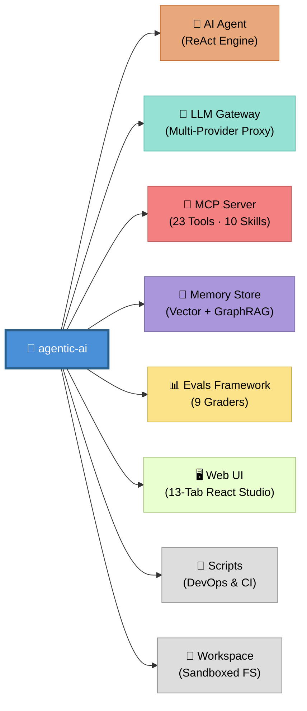
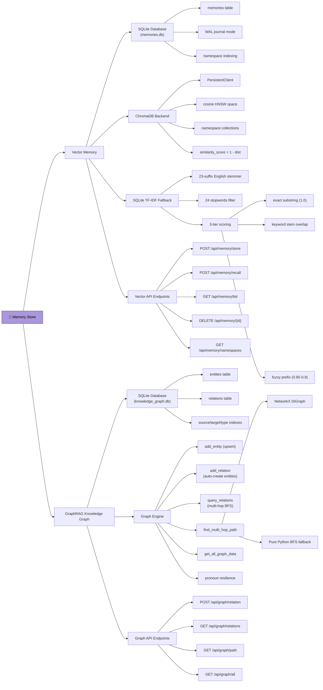
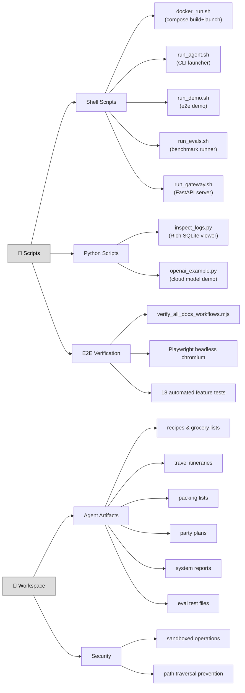

```mermaid
flowchart LR
    AI["🤖 AI Agent"]

    AI --> CORE["Core ReAct Engine"]
    AI --> GC["Gateway Client"]
    AI --> MCPC["MCP Client"]
    AI --> TP["Task Planner"]
    AI --> ORCH["Orchestrator"]
    AI --> DEB["Debate Engine"]
    AI --> FED["Federation"]
    AI --> RTR["API Router"]
    AI --> CLI["CLI"]

    CORE --> AR["AgentRunResult"]
    AR --> ar1["response"]
    AR --> ar2["tool_calls_executed"]
    AR --> ar3["total_prompt_tokens"]
    AR --> ar4["total_completion_tokens"]
    AR --> ar5["active_skills"]

    CORE --> REACT["ReAct Loop"]
    REACT --> r1["max 6 iterations"]
    REACT --> r2["text-based call recovery"]
    REACT --> r3["dedup & loop breaker"]
    REACT --> r4["SHA-256 idempotency cache"]
    REACT --> r5["firewall output sanitization"]
    REACT --> r6["fallback synthesis"]

    CORE --> TRAG["Tool-RAG Filter"]
    TRAG --> tr1["query token scoring"]
    TRAG --> tr2["active skill boost"]
    TRAG --> tr3["intent detection"]
    TRAG --> tr4["essential tools retention"]
    TRAG --> tr5["max 12 tools"]

    CORE --> SKILL["Progressive Disclosure"]
    SKILL --> sk1["discover_skills"]
    SKILL --> sk2["load_skill"]
    SKILL --> sk3["activate_skill"]
    SKILL --> sk4["system prompt injection"]

    CORE --> STATE["Durable State"]
    STATE --> st1["_hydrate_session"]
    STATE --> st2["_persist_turn"]
    STATE --> st3["SQLite sessions"]
    STATE --> st4["SQLite turns"]

    GC --> gc1["HTTP transport"]
    GC --> gc2["Stdio subprocess IPC"]
    GC --> gc3["chat_completion"]
    GC --> gc4["check_health"]
    GC --> gc5["list_models"]
    GC --> gc6["get_audit_logs"]
    GC --> gc7["get_gateway_stats"]
    GC --> gc8["tracing headers<br/>(X-Caller-Id, etc.)"]

    MCPC --> mc1["stdio_client spawn"]
    MCPC --> mc2["list_tools_for_llm"]
    MCPC --> mc3["list_skills"]
    MCPC --> mc4["get_skill_prompt"]
    MCPC --> mc5["execute_tool"]
    MCPC --> mc6["argument normalization"]
    mc6 --> mn1["calculator aliases"]
    mc6 --> mn2["weather aliases"]
    mc6 --> mn3["workspace aliases"]
    mc6 --> mn4["tip/split aliases"]
    MCPC --> mc7["self-healing reconnect"]

    TP --> SUB["SubTask"]
    SUB --> sub1["task_id"]
    SUB --> sub2["description"]
    SUB --> sub3["skill"]
    SUB --> sub4["depends_on"]
    SUB --> sub5["status"]

    TP --> DAG["TaskDAG"]
    DAG --> dag1["get_ready_tasks"]
    DAG --> dag2["is_complete"]
    DAG --> dag3["validate_acyclic<br/>(Kahn's algorithm)"]

    TP --> DECOMP["Decomposition"]
    DECOMP --> d1["infer_skill heuristics"]
    DECOMP --> d2["build_decomposition_prompt"]
    DECOMP --> d3["parse_decomposition_response"]
    DECOMP --> d4["cycle repair"]

    ORCH --> ORC["SupervisorAgent"]
    ORC --> o1["decompose prompt"]
    ORC --> o2["_execute_worker"]
    ORC --> o3["_execute_dag"]
    ORC --> o4["_synthesize results"]
    ORC --> o5["self-healing retry"]
    ORC --> o6["semaphore concurrency"]
    ORC --> o7["deadlock resolution"]
    ORC --> o8["SQLite checkpoints"]

    DEB --> DBM["MultiAgentDebateManager"]
    DBM --> db1["Proposer agent"]
    DBM --> db2["Red-Team Critic"]
    DBM --> db3["Arbitrator agent"]
    DBM --> db4["RISK_SCORE extraction"]
    DBM --> db5["confidence scoring"]
    DBM --> db6["distinct models per role"]

    FED --> FM["FederatedMCPManager"]
    FM --> fm1["register_server"]
    FM --> fm2["connect_all"]
    FM --> fm3["refresh_tools_catalog"]
    FM --> fm4["namespace tagging"]
    FM --> fm5["routed execution"]
    FM --> fm6["STDIO + SSE transports"]

    RTR --> RAPI["16 API Endpoints"]
    RAPI --> ra1["POST /api/chat"]
    RAPI --> ra2["POST /api/chat/stream SSE"]
    RAPI --> ra3["POST /api/chat/clear"]
    RAPI --> ra4["POST /api/orchestrator/run"]
    RAPI --> ra5["POST /api/orchestrator/run-stream"]
    RAPI --> ra6["GET /api/orchestrator/runs"]
    RAPI --> ra7["POST /api/debate"]
    RAPI --> ra8["POST /api/canvas/execute"]
    RAPI --> ra9["POST /api/canvas/resume/{id}"]
    RAPI --> ra10["GET /api/canvas/runs"]
    RAPI --> ra11["POST /api/canvas/pipelines"]
    RAPI --> ra12["DELETE /api/canvas/pipelines/{id}"]
    RAPI --> ra13["GET /api/chat/sessions/{id}"]

    CLI --> cl1["/skills command"]
    CLI --> cl2["/skill activate"]
    CLI --> cl3["/stats display"]
    CLI --> cl4["/logs display"]
    CLI --> cl5["Rich formatted panels"]

    style AI fill:#E8A87C,stroke:#C4753B,color:#000,stroke-width:2px
```

```mermaid
flowchart LR
    GW["🚪 LLM Gateway"]

    GW --> PROXY["Multi-Provider Proxy"]
    GW --> SR["Smart Router"]
    GW --> FW["Security Firewall"]
    GW --> RL["Rate Limiter"]
    GW --> CT["Cost Tracker"]
    GW --> CMP["Context Compactor"]
    GW --> STR["Streaming"]
    GW --> TEL["Telemetry"]
    GW --> LOG["Audit Logger"]
    GW --> DB["Database Engine"]
    GW --> STDIO["Stdio Transport"]
    GW --> VOICE["Voice Endpoints"]
    GW --> APP["HTTP App"]

    PROXY --> MODELS["Model Catalog"]
    MODELS --> m1["ollama/gemma2:2b"]
    MODELS --> m2["ollama/qwen2.5-coder:7b"]
    MODELS --> m3["ollama/llama3.2"]
    MODELS --> m4["ollama/mistral:latest"]
    MODELS --> m5["openai/gpt-4o"]
    MODELS --> m6["openai/gpt-4o-mini"]
    MODELS --> m7["openai/o3-mini"]
    MODELS --> m8["anthropic/claude-3.5-sonnet"]
    MODELS --> m9["anthropic/claude-3.5-haiku"]
    MODELS --> m10["gemini/gemini-2.0-flash"]
    MODELS --> m11["gemini/gemini-1.5-pro"]
    MODELS --> m12["groq/llama-3.3-70b"]
    MODELS --> m13["deepseek/deepseek-chat"]
    MODELS --> m14["deepseek/deepseek-reasoner"]
    MODELS --> m15["mistral/mistral-large"]

    PROXY --> PUTIL["Router Utils"]
    PUTIL --> pu1["resolve_model_name"]
    PUTIL --> pu2["sanitize_messages_for_litellm"]
    PUTIL --> pu3["build_litellm_kwargs"]
    PUTIL --> pu4["get_available_models"]
    PUTIL --> pu5["credential isolation"]
    PUTIL --> pu6["fallback model selection"]

    SR --> SRC["2-Stage Pipeline"]
    SRC --> sr1["Stage 1: Reason<br/>(intent classifier)"]
    SRC --> sr2["Threshold evaluation"]
    SRC --> sr3["Stage 2: Execute"]
    SRC --> sr4["Stage 3: Trace persist"]
    SRC --> sr5["Heuristic fallback"]
    SRC --> sr6["Bypass mode"]

    SR --> SCAT["5 Categories"]
    SCAT --> sc1["coding (0.75)"]
    SCAT --> sc2["complex_work (0.80)"]
    SCAT --> sc3["general_qa (0.70)"]
    SCAT --> sc4["fast_lightweight (0.60)"]
    SCAT --> sc5["creative_writing (0.70)"]

    FW --> FWF["Firewall Features"]
    FWF --> fw1["10 injection regex patterns"]
    FWF --> fw2["Base64 decode inspection"]
    FWF --> fw3["Zero-width char stripping"]
    FWF --> fw4["Unicode NFKD normalization"]
    FWF --> fw5["PII masking (SSN/CC/email/phone/API keys)"]
    FWF --> fw6["PII restoration"]
    FWF --> fw7["Untrusted output tainting"]

    RL --> RLF["Token Bucket Algorithm"]
    RLF --> rl1["per-caller RPM (60)"]
    RLF --> rl2["per-caller TPM (100K)"]
    RLF --> rl3["global RPM (300)"]
    RLF --> rl4["retry_after calculation"]

    CT --> CTF["Cost Features"]
    CTF --> ct1["15-model pricing table"]
    CTF --> ct2["per-request USD calc"]
    CTF --> ct3["free local Ollama ($0)"]
    CTF --> ct4["cost summary by model"]
    CTF --> ct5["cost summary by caller"]
    CTF --> ct6["30-day spend forecast"]

    CMP --> CMPF["Compaction Features"]
    CMPF --> c1["token estimation (~4 chars)"]
    CMPF --> c2["system prompt preservation"]
    CMPF --> c3["recent turns verbatim"]
    CMPF --> c4["older turns → summary card"]
    CMPF --> c5["savings % calculation"]

    STR --> STRF["SSE Streaming"]
    STRF --> str1["format_sse_event"]
    STRF --> str2["StreamAccumulator"]
    STRF --> str3["tool call reassembly"]
    STRF --> str4["token delta events"]
    STRF --> str5["keepalive pings"]

    TEL --> TELF["OpenTelemetry"]
    TELF --> tel1["W3C trace context"]
    TELF --> tel2["GatewayTraceSpan"]
    TELF --> tel3["trace_span context mgr"]

    LOG --> LOGF["3-Tier Audit"]
    LOGF --> log1["Conversation → Turn → Request"]
    LOGF --> log2["SQLite WAL sink"]
    LOGF --> log3["JSONL file sink"]
    LOGF --> log4["SSE pub/sub broadcast"]

    DB --> DBT["9 SQLite Tables"]
    DBT --> db1["llm_logs"]
    DBT --> db2["gateway_settings"]
    DBT --> db3["saved_pipelines"]
    DBT --> db4["workflow_runs"]
    DBT --> db5["node_checkpoints"]
    DBT --> db6["hitl_requests"]
    DBT --> db7["smart_router_logs"]
    DBT --> db8["agent_sessions"]
    DBT --> db9["agent_turns"]
    DBT --> db10["action_idempotency"]

    DB --> DBS["Stats Engine"]
    DBS --> ds1["P50/P90/P99 latency"]
    DBS --> ds2["anomaly detection"]
    DBS --> ds3["tool frequency"]
    DBS --> ds4["skill frequency"]

    APP --> AAPI["35+ HTTP Endpoints"]
    AAPI --> aa1["POST /v1/chat/completions"]
    AAPI --> aa2["GET /v1/models"]
    AAPI --> aa3["GET /health"]
    AAPI --> aa4["GET /v1/logs"]
    AAPI --> aa5["GET /v1/stats"]
    AAPI --> aa6["GET /v1/logs/stream SSE"]
    AAPI --> aa7["GET /v1/logs/export"]
    AAPI --> aa8["GET /metrics (Prometheus)"]
    AAPI --> aa9["GET /api/config"]
    AAPI --> aa10["POST /api/config"]
    AAPI --> aa11["GET /api/costs"]
    AAPI --> aa12["GET /api/costs/forecast"]
    AAPI --> aa13["GET /api/rate-limit/status"]
    AAPI --> aa14["POST /api/firewall/inspect"]
    AAPI --> aa15["POST /api/chat/compact"]

    style GW fill:#95E1D3,stroke:#5BB8A6,color:#000,stroke-width:2px
```

```mermaid
flowchart LR
    MCP["🔌 MCP Server"]

    MCP --> TOOLS["23 FastMCP Tools"]
    MCP --> SKILLS["10 Domain Skills"]
    MCP --> HITL["HITL Safety Gate"]
    MCP --> CTX["Context Providers"]
    MCP --> RAPI["REST API Router"]

    TOOLS --> MATH["Math Tools"]
    MATH --> ma1["calculator"]
    MATH --> ma2["calculate"]
    MATH --> ma3["calculate_tip_and_split"]
    MATH --> ma4["tip_calculator"]
    MATH --> ma5["split_bill"]

    TOOLS --> FILE["File Tools"]
    FILE --> fi1["workspace_file_ops"]
    fi1 --> fop1["read"]
    fi1 --> fop2["write"]
    fi1 --> fop3["list"]
    fi1 --> fop4["delete"]
    FILE --> fi2["path traversal guard"]
    FILE --> fi3["action aliases"]

    TOOLS --> WEB["Web Tools"]
    WEB --> we1["web_search (DuckDuckGo)"]
    WEB --> we2["curated offline fallback"]

    TOOLS --> WEATH["Weather Tool"]
    WEATH --> wt1["7 city database"]
    WEATH --> wt2["3-day forecasts"]
    WEATH --> wt3["UV index / AQI"]
    WEATH --> wt4["dynamic fallback"]

    TOOLS --> PROD["Product Tools"]
    PROD --> pr1["product_knowledge"]
    PROD --> pr2["5-item catalog"]
    PROD --> pr3["SKU matching"]
    PROD --> pr4["weighted scoring"]

    TOOLS --> SRCH["Search Tools"]
    SRCH --> sr1["knowledge_base_search"]
    SRCH --> sr2["LiteLLM/Ollama/MCP docs"]

    TOOLS --> VMEM["Memory Tools"]
    VMEM --> vm1["memory_store (18 aliases)"]
    VMEM --> vm2["memory_recall"]
    VMEM --> vm3["memory_list"]
    VMEM --> vm4["memory_delete"]

    TOOLS --> GRAPH["GraphRAG Tools"]
    GRAPH --> gr1["graph_add_relation"]
    GRAPH --> gr2["graph_query_relations"]
    GRAPH --> gr3["graph_find_path"]

    TOOLS --> CODE["Code Tools"]
    CODE --> co1["sql_query (read-only)"]
    CODE --> co2["python_sandbox"]
    co2 --> ps1["AST validation"]
    co2 --> ps2["43 safe builtins"]
    co2 --> ps3["plotly chart extraction"]
    co2 --> ps4["timeout enforcement"]

    TOOLS --> VOICE["Voice Tools"]
    VOICE --> vo1["transcribe_audio (Whisper)"]
    VOICE --> vo2["speak_text (TTS)"]

    TOOLS --> SYS["System Tools"]
    SYS --> sy1["CPU / RAM / Disk metrics"]

    TOOLS --> DISC["Discovery Tools"]
    DISC --> di1["discover_skills"]
    DISC --> di2["load_skill"]

    SKILLS --> SK["10 Skill Personas"]
    SK --> s1["🏖️ Travel Planner"]
    SK --> s2["🛍️ Shopping Assistant"]
    SK --> s3["🎉 Party Planner"]
    SK --> s4["🍳 Chef Meal Planner"]
    SK --> s5["💻 Code Reviewer"]
    SK --> s6["📈 Financial Advisor"]
    SK --> s7["🎧 Customer Support"]
    SK --> s8["📊 Data Analyst"]
    SK --> s9["🔬 Research"]
    SK --> s10["⚖️ Legal Auditor"]

    HITL --> HF["HITL Features"]
    HF --> h1["RiskLevel enum<br/>(LOW/MED/HIGH/CRITICAL)"]
    HF --> h2["HITLRule registration"]
    HF --> h3["create_request"]
    HF --> h4["async wait_for_resolution"]
    HF --> h5["approve / deny"]
    HF --> h6["timeout auto-deny"]
    HF --> h7["@requires_approval decorator"]
    HF --> h8["SQLite hydration"]

    CTX --> ctx1["FileContextProvider"]
    CTX --> ctx2["WebContextProvider"]
    CTX --> ctx3["MemoryContextProvider"]

    style MCP fill:#F38181,stroke:#C45B5B,color:#000,stroke-width:2px
```

```mermaid
flowchart LR
    EVAL["📊 Evals Framework"]

    EVAL --> RUN["Runner Engine"]
    EVAL --> GRAD["9 Graders"]
    EVAL --> ADAPT["Agent Adapters"]
    EVAL --> REG["Registries"]
    EVAL --> DS["Datasets"]
    EVAL --> HIST["History Engine"]
    EVAL --> REP["Reporters"]
    EVAL --> EAPI["17 API Endpoints"]

    RUN --> SUITE["EvalsRunner"]
    SUITE --> su1["load_test_cases"]
    SUITE --> su2["run_suite"]
    SUITE --> su3["multi-iteration averaging"]
    SUITE --> su4["composite score formula"]
    su4 --> wt1["Deterministic 20%"]
    su4 --> wt2["Efficiency 15%"]
    su4 --> wt3["LLM Judge 15%"]
    su4 --> wt4["Faithfulness 15%"]
    su4 --> wt5["Fact Checker 10%"]
    su4 --> wt6["Safety 10%"]
    su4 --> wt7["Style 5%"]
    su4 --> wt8["Relevance 5%"]
    su4 --> wt9["Code Syntax 5%"]

    GRAD --> G1["Deterministic Grader"]
    G1 --> g1a["tool presence P/R"]
    G1 --> g1b["sequential order"]
    G1 --> g1c["argument matching"]
    G1 --> g1d["keyword assertions"]
    G1 --> g1e["section compliance"]

    GRAD --> G2["Efficiency Grader"]
    G2 --> g2a["token budget SLA"]
    G2 --> g2b["loop redundancy penalty"]
    G2 --> g2c["latency SLA"]

    GRAD --> G3["LLM Judge Grader"]
    G3 --> g3a["safety scoring"]
    G3 --> g3b["tone & politeness"]
    G3 --> g3c["intent adherence"]
    G3 --> g3d["heuristic fallback"]

    GRAD --> G4["Fact Checker Grader"]
    G4 --> g4a["tool-to-summary grounding"]
    G4 --> g4b["hallucination detection"]
    G4 --> g4c["token overlap fallback"]

    GRAD --> G5["Faithfulness Grader"]
    G5 --> g5a["atomic assertion extraction"]
    G5 --> g5b["price/currency/date check"]
    G5 --> g5c["named entity verification"]

    GRAD --> G6["Safety Grader"]
    G6 --> g6a["API key detection"]
    G6 --> g6b["JWT / AWS / Slack tokens"]
    G6 --> g6c["SSN / credit card / phone"]
    G6 --> g6d["rm -rf / DROP DB / fork bomb"]
    G6 --> g6e["Shannon entropy check"]

    GRAD --> G7["Style Constraint Grader"]
    G7 --> g7a["min/max word count"]
    G7 --> g7b["forbidden formatting"]
    G7 --> g7c["Flesch readability"]

    GRAD --> G8["Relevance Grader"]
    G8 --> g8a["fluff detection"]
    G8 --> g8b["query alignment"]
    G8 --> g8c["verbosity penalty"]

    GRAD --> G9["Code Syntax Grader"]
    G9 --> g9a["Python AST parsing"]
    G9 --> g9b["dangerous call detection"]
    G9 --> g9c["JSON validation"]
    G9 --> g9d["SQL validation"]

    ADAPT --> AD["4 Adapter Types"]
    AD --> ad1["MCPAgentAdapter"]
    AD --> ad2["HTTPAgentAdapter"]
    AD --> ad3["CallableAgentAdapter"]
    AD --> ad4["AgentRegistry singleton"]

    REG --> MR["ModelRegistry"]
    MR --> mr1["10 default models"]

    REG --> JR["JudgeRegistry"]
    JR --> jr1["judge_standard"]
    JR --> jr2["judge_strict_qwen"]
    JR --> jr3["judge_gpt4o_mini"]
    JR --> jr4["judge_gemini_flash"]

    DS --> DSF["3 Dataset Files"]
    DSF --> ds1["tool_calling_evals.json"]
    DSF --> ds2["skill_adherence_evals.json"]
    DSF --> ds3["reasoning_evals.json"]

    HIST --> HE["HistoryEngine"]
    HE --> he1["list_runs"]
    HE --> he2["get_run"]
    HE --> he3["get_run_logs<br/>(3-tier fallback)"]
    HE --> he4["compare_runs matrix"]

    REP --> RP["2 Reporters"]
    RP --> rp1["Rich console scorecard"]
    RP --> rp2["Markdown report generator"]

    EAPI --> ea1["POST /api/evals/run"]
    EAPI --> ea2["GET /api/evals/run-stream"]
    EAPI --> ea3["GET /api/evals/compare-models-stream"]
    EAPI --> ea4["GET /api/evals/runs"]
    EAPI --> ea5["GET /api/evals/runs/{id}"]
    EAPI --> ea6["GET /api/evals/runs/{id}/logs"]
    EAPI --> ea7["GET /api/evals/compare"]
    EAPI --> ea8["CRUD /api/evals/agents"]
    EAPI --> ea9["CRUD /api/evals/models"]
    EAPI --> ea10["CRUD /api/evals/judges"]

    style EVAL fill:#FCE38A,stroke:#C4B040,color:#000,stroke-width:2px
```

```mermaid
flowchart LR
    WEB["🖥️ Web UI<br/>(React 18 + Spectrum)"]

    WEB --> TABS["13 Studio Tabs"]
    WEB --> COMP["7 Shared Components"]
    WEB --> APIC["40+ API Client Methods"]

    TABS --> T1["💬 ChatView"]
    T1 --> t1a["SSE streaming"]
    T1 --> t1b["context compaction"]
    T1 --> t1c["voice input (Web Audio)"]
    T1 --> t1d["TTS output (Speech API)"]
    T1 --> t1e["embedded DAG execution"]
    T1 --> t1f["artifact panel<br/>(HTML/Plotly/Code)"]
    T1 --> t1g["tool timeline"]
    T1 --> t1h["prompt chips"]
    T1 --> t1i["3 prebuilt DAG workflows"]

    TABS --> T2["🔲 CanvasView"]
    T2 --> t2a["drag-and-drop 2D board"]
    T2 --> t2b["4 node types<br/>(agent/tool/hitl/memory)"]
    T2 --> t2c["DFS cycle detection"]
    T2 --> t2d["Bezier wire routing"]
    T2 --> t2e["Kahn topological execution"]
    T2 --> t2f["persistent pipelines"]
    T2 --> t2g["durable checkpoints"]
    T2 --> t2h["crash recovery resume"]

    TABS --> T3["🛡️ ApprovalsView"]
    T3 --> t3a["pending queue"]
    T3 --> t3b["countdown timers"]
    T3 --> t3c["safety rules registry"]
    T3 --> t3d["resolution history"]

    TABS --> T4["⚡ SmartRouterView"]
    T4 --> t4a["playground with chips"]
    T4 --> t4b["2-stage pipeline card"]
    T4 --> t4c["config editor"]
    T4 --> t4d["threshold tuning"]
    T4 --> t4e["trace log inspector"]

    TABS --> T5["🔧 ToolsView"]
    T5 --> t5a["MCP tool catalog"]
    T5 --> t5b["parameter sandbox"]
    T5 --> t5c["latency meter"]

    TABS --> T6["🎭 SkillsView"]
    T6 --> t6a["9 persona grid"]
    T6 --> t6b["progressive disclosure banner"]
    T6 --> t6c["custom skill creator"]

    TABS --> T7["📁 WorkspaceView"]
    T7 --> t7a["file browser"]
    T7 --> t7b["code editor"]
    T7 --> t7c["create/save/delete"]

    TABS --> T8["📈 TelemetryView"]
    T8 --> t8a["KPI cards"]
    T8 --> t8b["token pie chart"]
    T8 --> t8c["model share bar chart"]
    T8 --> t8d["cost forecast"]
    T8 --> t8e["anomaly table"]

    TABS --> T9["📋 AuditLogsView"]
    T9 --> t9a["3-tier tree view"]
    T9 --> t9b["flat stream view"]
    T9 --> t9c["live SSE streaming"]
    T9 --> t9d["CSV/JSONL export"]

    TABS --> T10["🧪 EvalsView"]
    T10 --> t10a["single model runner"]
    T10 --> t10b["multi-model comparison"]
    T10 --> t10c["registry management"]
    T10 --> t10d["run archive"]
    T10 --> t10e["4-grader trace modal"]

    TABS --> T11["🌐 OrchestratorView"]
    T11 --> t11a["supervisor decomposition"]
    T11 --> t11b["SSE worker streaming"]
    T11 --> t11c["multi-agent debate"]

    TABS --> T12["🧠 MemoryView"]
    T12 --> t12a["vector memory vault"]
    T12 --> t12b["namespace switcher"]
    T12 --> t12c["GraphRAG explorer"]
    T12 --> t12d["add triples"]
    T12 --> t12e["multi-hop path finding"]

    TABS --> T13["⚙️ SettingsView"]
    T13 --> t13a["transport mode toggle"]
    T13 --> t13b["Ollama config"]
    T13 --> t13c["multi-provider API keys"]
    T13 --> t13d["hyperparameter editor"]
    T13 --> t13e["system telemetry gauges"]

    COMP --> C1["Sidebar (5 nav groups)"]
    COMP --> C2["TopHeader"]
    COMP --> C3["InspectorModal<br/>(execution waterfall)"]
    COMP --> C4["HITLApprovalModal<br/>(countdown + risk badge)"]
    COMP --> C5["CreateSkillModal"]
    COMP --> C6["ArtifactPanel<br/>(HTML/Plotly/Code)"]
    COMP --> C7["EvalTraceModal<br/>(4-tier coordinates)"]

    style WEB fill:#EAFFD0,stroke:#A8C77B,color:#000,stroke-width:2px
```

# 🧠 Agentic-AI — Complete Feature Map (Exhaustive)

> A comprehensive radial feature map showing **every** module, sub-module, class, method, endpoint, tool, skill, and grader — drilled down to the atomic level. Click any section to expand/collapse.

---

## 🌐 Top-Level Architecture

---

<h2>🤖 AI Agent — Full Feature Breakdown</h2>

---

<h2>🚪 LLM Gateway — Full Feature Breakdown</h2>

---

<h2>🔌 MCP Server — Full Feature Breakdown</h2>

---

<h2>💾 Memory Store — Full Feature Breakdown</h2>

---

<h2>📊 Evals Framework — Full Feature Breakdown</h2>

---

<h2>🖥️ Web UI — Full Feature Breakdown</h2>

---

<h2>📜 Scripts & 📂 Workspace</h2>

---

<h2>📈 Feature Count Summary</h2>

| Module | Top Features | Sub-features | Leaf Items | Tests |
|--------|-------------|--------------|------------|-------|
| 🤖 AI Agent | 9 | 42 | 87 | 6 suites |
| 🚪 LLM Gateway | 13 | 48 | 112 | 12 suites |
| 🔌 MCP Server | 5 | 38 | 78 | 14 suites |
| 💾 Memory Store | 2 | 14 | 34 | via MCP tests |
| 📊 Evals Framework | 8 | 32 | 68 | 5 suites |
| 🖥️ Web UI | 3 | 24 | 95 | 4 suites |
| 📜 Scripts | 3 | 8 | 21 | E2E suite |
| 📂 Workspace | 2 | 3 | 8 | — |
| **Total** | **45** | **209** | **503** | **41+ suites** |

> 🎯 **503 atomic features** across **45 top-level features** and **209 intermediate sub-features** — the complete anatomy of `agentic-ai`.

---

<h2>🏗️ Architectural Capabilities Matrix</h2>

| Capability | Components | Value |
|:---|:---|:---|
| **Autonomous ReAct Loop** | Agent + MCP Client + Tool-RAG | Iterative reasoning with loop detection, dedup, and fallback synthesis |
| **Progressive Skill Disclosure** | 10 Skills + discover/load tools | 85% token savings via on-demand persona loading |
| **Multi-Agent Orchestration** | Supervisor + DAG + Workers | Parallel task execution with self-healing retry |
| **Adversarial Debate** | Proposer + Critic + Arbitrator | Cross-model consensus with risk scoring |
| **Federated Tool Routing** | FederatedMCPManager | Multi-server tool catalog with namespace isolation |
| **2-Stage Smart Routing** | SmartRouter + 5 Categories | Intent classification → confidence threshold → optimal model |
| **Enterprise Security** | Firewall + HITL + Rate Limiter | Injection defense, PII masking, approval gates, token buckets |
| **Dual Memory Architecture** | ChromaDB + SQLite + GraphRAG | Semantic vector recall + relational knowledge graph traversal |
| **9-Grader Eval System** | Deterministic to LLM Judge | Comprehensive AI quality assessment with weighted composite |
| **Durable State Engine** | SQLite WAL + Checkpoints | Session recovery, DAG resume, tool idempotency |
| **Full Observability** | OTel + Prometheus + Audit | Distributed tracing, P50/90/99 latency, cost forecasting |
| **13-Tab Visual Studio** | React + Spectrum + Recharts | Interactive chat, DAG canvas, memory explorer, eval runner |

