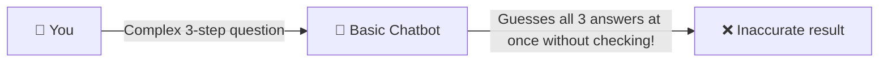
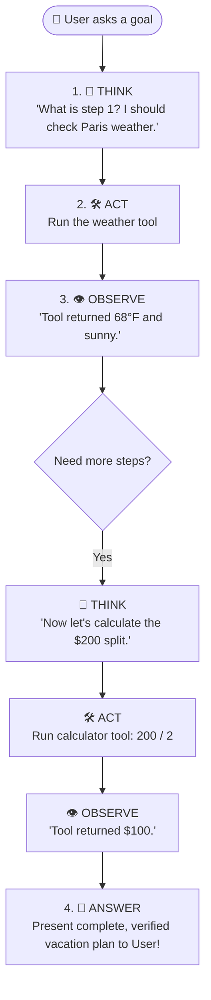
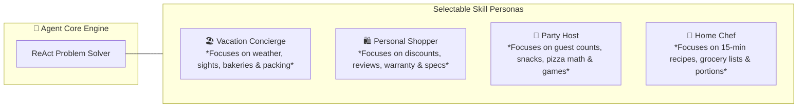
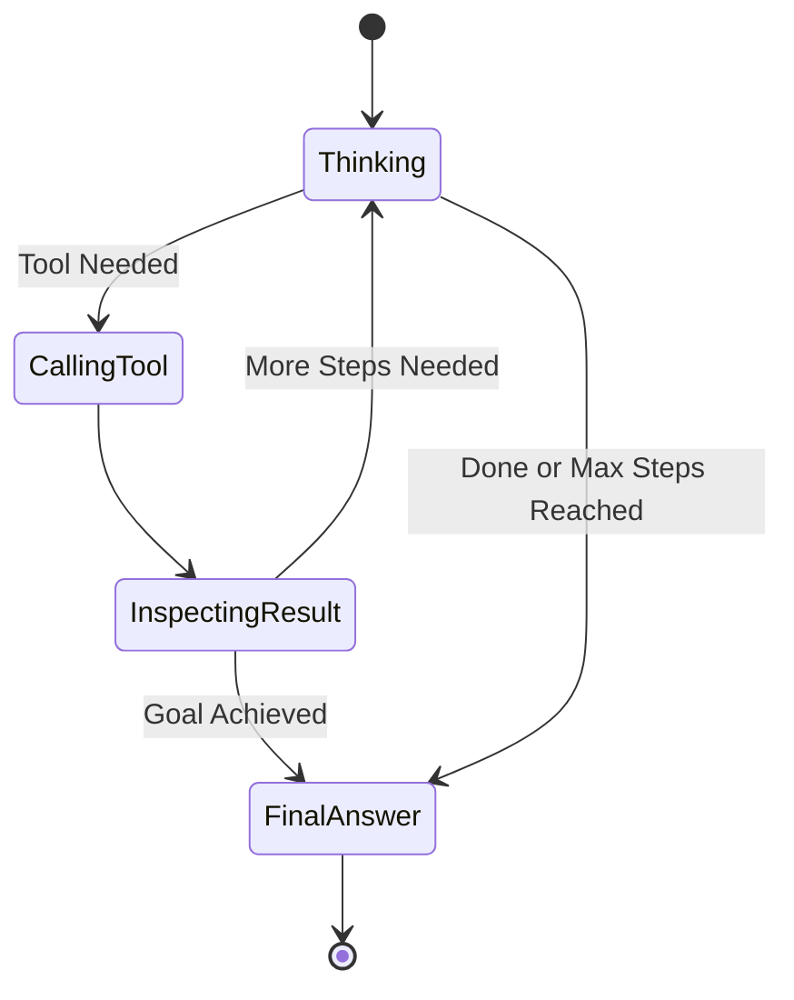

# 🧠 The Layman's Guide to Autonomous AI Agent
### *The Autonomous Concierge & ReAct Problem Solver*

---

## 🤷 What Problem Are We Solving?

A standard chatbot is like a **parrot**: it just spits words out in one shot. If you ask a multi-step question:

> *"Check if it's going to rain in Paris this weekend. If it's clear, plan a 3-day walking trip with bakery stops and split a $200 hotel deposit between 2 people."*

A basic chatbot tries to guess everything in a single breath. It can't pause, take intermediate notes, or run a calculator halfway through.

---

## 💡 The Solution: The Autonomous ReAct Agent

The **Autonomous AI Agent (`ai_agent/`)** acts like a **smart human concierge**. It uses a technique called **ReAct (Reason + Act)**:

---

## 🎭 How Skills Guide the Agent

Think of a **Skill** as a **special training guide or uniform** handed to the agent before it starts:

---

## 🛠️ The Safety Net (Preventing Infinite Loops)

What if an AI gets confused and keeps calling the same tool forever?
The Agent Client has a built-in **Iteration Guard**:
* Maximum 6 tool attempts per turn.
* If a tool is repeated unnecessarily, the agent wraps up and answers with the best information available.

---

## 🎯 Summary
* **Basic Chatbot**: Guesses everything in one shot.
* **Agent Client**: Thinks step-by-step, uses tools when needed, reads the results, and delivers verified answers.
