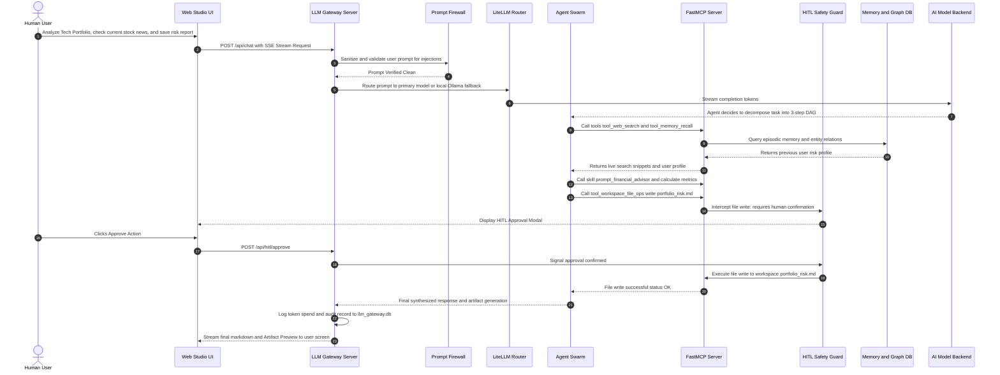
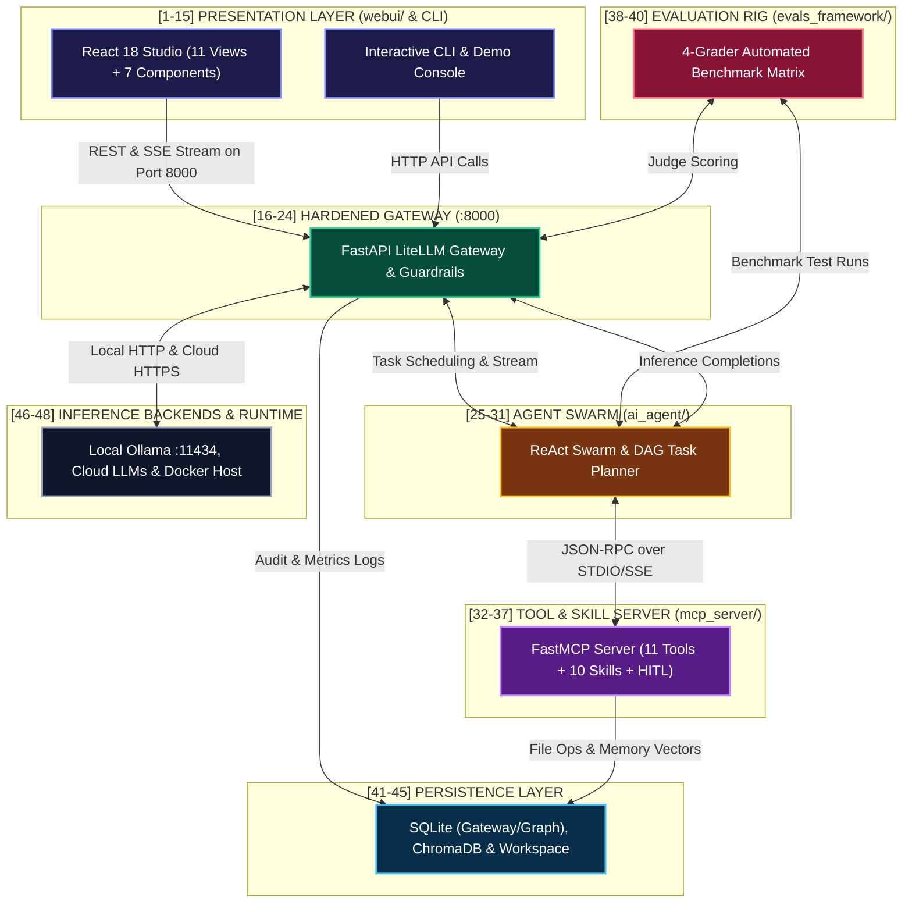
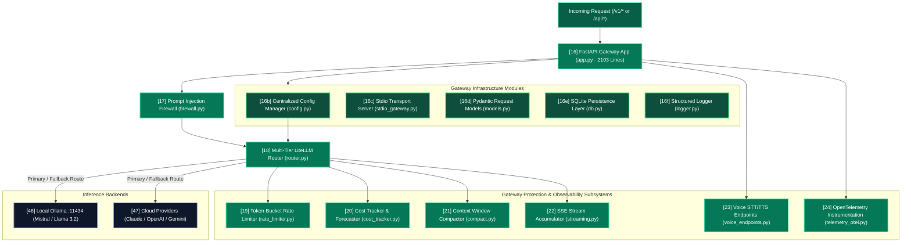
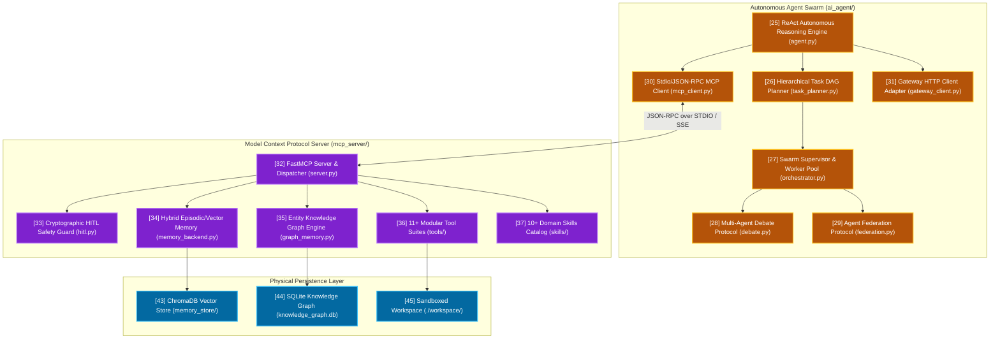
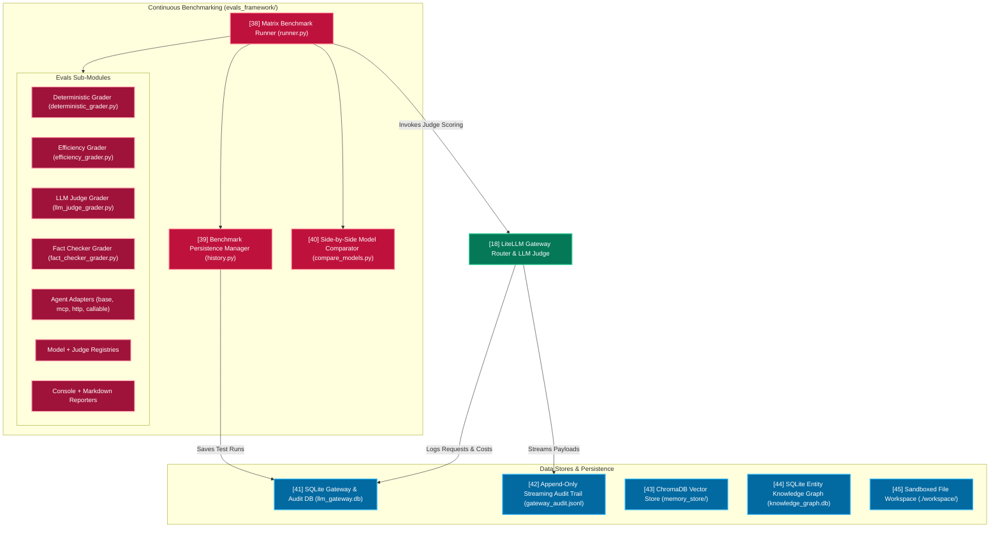
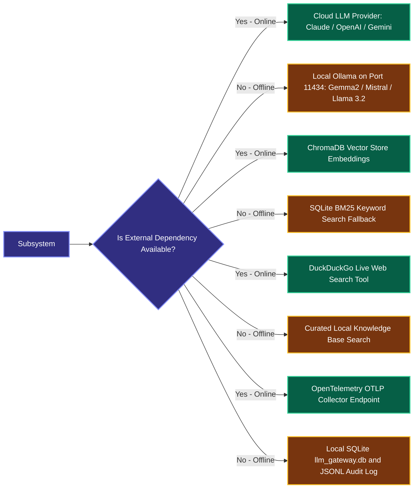

# 🏛️ Comprehensive Architecture & System Topology
## Agentic AI Platform — Modular Architecture, Service Blueprint & Deep-Code Index

**Author**: **Vijay Donthireddy**  
**Repository**: [vdonthireddy/agentic-ai](https://github.com/vdonthireddy/agentic-ai)  
**Version**: 2.0.0 (Production Grade Multi-Agent Ecosystem)  
**Target Document**: `architecture.md`  
**Step-by-Step UI & Feature Guides**: [docs/README.md (6-Phase Learning Curriculum)](docs/README.md)

---

## 🌟 1. Architectural Essence & Plain-English Analogy

> ### 🧠 The Grand Analogy: *"The Autonomous NASA Mission Control"*
> Imagine a state-of-the-art space exploration center:
> 1. **The Mission Control Dashboard (Web UI & Canvas)**: Where flight directors, engineers, and scientists monitor live telemetry, inspect satellite imagery, visualize mission trajectory graphs, and approve critical orbital maneuvers.
> 2. **The Communications & Safety Gateway (FastAPI LLM Gateway)**: The hardened antenna array that encrypts messages, shields against rogue radio interference (Prompt Firewall), tracks power and fuel consumption down to the penny (Cost & Token Tracker), and routes transmissions across low-latency satellite constellations (Multi-Provider Router).
> 3. **The Autonomous Exploration Rover Swarm (AI Agent & Task Planner)**: The intelligent rovers on the surface that decompose high-level directives into dependency-ordered action graphs (DAGs), coordinate specialized sub-rovers, debate navigation routes when terrain is disputed, and report back status.
> 4. **The Universal Scientific Tool Bay (FastMCP Server & HITL Interceptors)**: The robotic arms, spectrometers, drills, and memory banks plugged in via standardized universal couplings (Model Context Protocol). If a drill command risks cracking a solar array, the system immediately pauses and requests flight director cryptographic approval (Human-in-the-Loop).
> 5. **The Flight Simulator & Benchmarking Center (Evals Framework)**: A high-fidelity testing rig that subjects rovers to simulated sandstorms and tricky questions, scoring their accuracy, latency, and truthfulness before clearance for real missions.

---

## ⚖️ 2. The Value Proposition: Challenge Before vs. How This Solves It

| Architectural Dimension | ❌ The Challenge Before (Traditional / Monolithic AI) | ✅ How This Architecture Solves It (Agentic AI 2.0) |
| :--- | :--- | :--- |
| **Tool & Agent Coupling** | Tools are hardcoded into specific agent prompts. Swapping or adding a tool breaks prompt templates and requires full codebase rewrites. | **Open MCP Standard**: Tools & skills are decoupled over JSON-RPC 2.0 (stdio/SSE), allowing agents to discover and invoke any capability dynamically. |
| **Model Lock-In & Outages** | If OpenAI or Anthropic suffers an outage or rate limit spike, the entire application crashes without warning. | **Smart Multi-Tier Routing**: Automatic fallback from cloud models (Claude, GPT-4o, Gemini) to local offline models (Ollama Mistral, Llama 3.2). |
| **Unchecked Cost & Latency** | Agents get caught in runaway loops, burning thousands of dollars in tokens before developers notice. | **Token-Bucket Rate Limiter + Cost Forecaster**: Live token accounting, budget thresholds, context compaction, and 30-day proactive spend projections. |
| **Dangerous Tool Execution** | Agents with file or SQL write permissions can accidentally truncate databases or wipe critical files silently. | **Cryptographic HITL Safety Gates**: Destructive operations automatically trigger interactive approval modals requiring human authorization. |
| **Agent Amnesia & Context Loss** | Agents forget user preferences and past interactions the moment the current conversation session ends. | **3-Tier Hybrid Memory Store**: Ephemeral working memory + vector semantic recall (ChromaDB/SQLite) + multi-hop Entity Knowledge Graph. |
| **Blind Execution & No Quality Gates** | Prompt changes are deployed blindly without regression testing or standardized performance metrics. | **Automated 4-Grader Evals Matrix**: Side-by-side benchmarking evaluating exact-match, latency SLA, LLM-as-a-judge, and factual accuracy. |

---

## 🎬 3. Real-World Step-by-Step Scenario: "Analyze Financial Risks & Update Portfolio"

To understand how every app, service, gateway, tool, and database interact, follow this real-world execution flow:



---

## 🎭 4. Witty Commentary from the Engineering Trenches

> *"We once asked an un-gated AI agent to 'clean up the project files' before a demo. It interpreted 'clean' as `rm -rf /` and spent three minutes trying to delete its own operating system. That is why this architecture features a cryptographic Human-in-the-Loop gate, a Prompt Firewall, an isolated `./workspace/` sandbox, and a 3-tier audit log that records every single byte before an agent is allowed to breathe near disk storage."*

---

## 🗺️ 5. Master Architecture Topology

To make the architecture easy to read and understand without excessive downscaling, the topology is organized into **one Consolidated All-in-One Diagram**, one **Macro Blueprint**, and **4 Focused Deep-Dive Subsystem Diagrams**.

### 🎯 5.0 Consolidated All-in-One Architecture Diagram

> This is the single "bird's-eye view" the user requested: **every major component, data store, API surface, and external dependency in one diagram**.

```mermaid
flowchart TB
    classDef uiColor fill:#312e81,stroke:#818cf8,stroke-width:2px,color:#fff
    classDef gwColor fill:#047857,stroke:#34d399,stroke-width:2px,color:#fff
    classDef agentColor fill:#b45309,stroke:#fbbf24,stroke-width:2px,color:#fff
    classDef mcpColor fill:#7e22ce,stroke:#c084fc,stroke-width:2px,color:#fff
    classDef evalColor fill:#be123c,stroke:#fb7185,stroke-width:2px,color:#fff
    classDef storeColor fill:#0369a1,stroke:#38bdf8,stroke-width:2px,color:#fff
    classDef infraColor fill:#0f172a,stroke:#94a3b8,stroke-width:2px,color:#fff
    classDef apiColor fill:#065f46,stroke:#6ee7b7,stroke-width:1px,color:#fff

    subgraph CLIENTS["🖥️ CLIENT TIER"]
        direction LR
        REACT["React 18 Web Studio<br/>11 Views + 7 Components"]:::uiColor
        APICLIENT["API Client Layer<br/>client.js"]:::uiColor
        CLI["Terminal CLI<br/>cli.py + demo.py"]:::uiColor
    end

    subgraph GATEWAY["🛡️ FASTAPI GATEWAY :8000"]
        direction TB
        APP["app.py<br/>2103 Lines - Central Router"]:::gwColor
        STDIO["stdio_gateway.py<br/>Dual Transport Mode"]:::gwColor

        subgraph SECURITY["Security Pipeline"]
            FW["Firewall<br/>PII + Injection Guard"]:::gwColor
            RATE["Rate Limiter<br/>Token Bucket RPM/TPM"]:::gwColor
        end

        subgraph ROUTING["Intelligent Routing"]
            ROUTER["LiteLLM Router<br/>100+ Model Backends"]:::gwColor
            CONFIG["Config Manager<br/>7 Cloud Provider Keys"]:::gwColor
        end

        subgraph OBSERVABILITY["Observability Stack"]
            COST["Cost Tracker<br/>30-Day Forecaster"]:::gwColor
            STREAM["SSE Accumulator<br/>Real-Time Streaming"]:::gwColor
            COMPACT["Context Compactor<br/>History Summarizer"]:::gwColor
            OTEL["OpenTelemetry<br/>Distributed Traces"]:::gwColor
            VOICE["Voice STT/TTS<br/>Whisper + Speech"]:::gwColor
        end

        subgraph API_SURFACE["60+ REST Endpoints"]
            direction LR
            V1["/v1/chat/completions<br/>/v1/models /v1/logs"]:::apiColor
            STUDIO["/api/chat /api/tools<br/>/api/skills /api/evals"]:::apiColor
            ADVANCED["/api/debate /api/canvas<br/>/api/orchestrator"]:::apiColor
            DATA["/api/memory /api/graph<br/>/api/hitl /api/costs"]:::apiColor
        end
    end

    subgraph AGENTS["🤖 AGENT SWARM"]
        direction TB
        REACT_AGENT["ReAct Engine<br/>agent.py - 462 Lines"]:::agentColor
        PLANNER["DAG Task Planner<br/>task_planner.py"]:::agentColor
        ORCH["Supervisor + Workers<br/>orchestrator.py - 364 Lines"]:::agentColor
        DEBATE["Debate Protocol<br/>Proposer-Critic-Arbitrator"]:::agentColor
        FED["Federation Protocol<br/>Inter-Agent Messaging"]:::agentColor
        MCP_CLIENT["MCP Client Bridge<br/>JSON-RPC 2.0 STDIO"]:::agentColor
        GW_CLIENT["Gateway HTTP Client<br/>Typed API Helpers"]:::agentColor
    end

    subgraph MCP_SERVER["🧰 MCP TOOL SERVER"]
        direction TB
        SRV["FastMCP Server<br/>server.py - JSON-RPC"]:::mcpColor
        HITL["HITL Safety Guard<br/>Risk Levels + Timeouts"]:::mcpColor
        MEM_ENGINE["Memory Engine<br/>ChromaDB + SQLite BM25"]:::mcpColor
        GRAPH_ENGINE["Knowledge Graph<br/>Entity Relations + BFS"]:::mcpColor
        TOOLS["11 Tool Suites<br/>Math Web File DB Voice"]:::mcpColor
        SKILLS["10 Domain Skills<br/>Finance Legal Code Chef"]:::mcpColor
    end

    subgraph EVALS["📊 EVAL FRAMEWORK"]
        direction TB
        RUNNER["Benchmark Runner<br/>runner.py - 511 Lines"]:::evalColor
        GRADERS["4 Graders: Deterministic<br/>Efficiency LLM-Judge Fact"]:::evalColor
        ADAPTERS["5 Agent Adapters<br/>MCP HTTP Callable Base"]:::evalColor
        REGISTRIES["Model + Judge Registry<br/>Dynamic Registration"]:::evalColor
        REPORTERS["Console + Markdown<br/>Report Generators"]:::evalColor
    end

    subgraph PERSISTENCE["💾 PERSISTENCE LAYER"]
        direction LR
        SQLITE_GW["SQLite Gateway DB<br/>llm_gateway.db"]:::storeColor
        JSONL["Audit JSONL Trail<br/>gateway_audit.jsonl"]:::storeColor
        CHROMA["ChromaDB Vectors<br/>memory_store/memories.db"]:::storeColor
        GRAPH_DB["Knowledge Graph DB<br/>memory_store/knowledge_graph.db"]:::storeColor
        WORKSPACE["Sandboxed Workspace<br/>./workspace/"]:::storeColor
    end

    subgraph INFRA["☁️ INFERENCE + RUNTIME"]
        direction LR
        OLLAMA["Ollama :11434<br/>Gemma2 Mistral Llama Qwen"]:::infraColor
        CLOUD["Cloud Providers<br/>OpenAI Claude Gemini Groq"]:::infraColor
        DOCKER["Docker Compose<br/>Multi-Stage Containerization"]:::infraColor
    end

    %% Client to Gateway
    REACT --> APICLIENT
    APICLIENT -->|"REST + SSE :8000"| APP
    CLI -->|"HTTP API"| APP

    %% Gateway Internal
    APP --> SECURITY
    APP --> ROUTING
    APP --> OBSERVABILITY
    APP --> API_SURFACE
    APP --- STDIO

    %% Gateway to Agents
    APP <-->|"Task Dispatch"| REACT_AGENT
    REACT_AGENT --> PLANNER
    PLANNER --> ORCH
    ORCH --> DEBATE
    ORCH --> FED
    REACT_AGENT --> MCP_CLIENT
    REACT_AGENT --> GW_CLIENT

    %% Agent to MCP
    MCP_CLIENT <-->|"JSON-RPC STDIO"| SRV
    SRV --> HITL
    SRV --> MEM_ENGINE
    SRV --> GRAPH_ENGINE
    SRV --> TOOLS
    SRV --> SKILLS

    %% Gateway to Inference
    ROUTER -->|"Primary + Fallback"| OLLAMA
    ROUTER -->|"Cloud HTTPS"| CLOUD

    %% Evals
    RUNNER --> GRADERS
    RUNNER --> ADAPTERS
    RUNNER --> REGISTRIES
    RUNNER --> REPORTERS
    RUNNER <-->|"Judge Scoring"| APP
    ADAPTERS <-->|"Agent Benchmarks"| REACT_AGENT

    %% Persistence
    APP -->|"Audit Logs"| SQLITE_GW
    APP -->|"Stream Payloads"| JSONL
    MEM_ENGINE --> CHROMA
    GRAPH_ENGINE --> GRAPH_DB
    TOOLS -->|"File I/O"| WORKSPACE
    RUNNER -->|"Save Reports"| SQLITE_GW
```



---

### 🌐 5.1 Macro Blueprint: End-to-End System Flow



---

### 🖥️ 5.2 Deep-Dive: Presentation Layer & Web Studio (`webui/`)

```mermaid
flowchart TD
    classDef viewStyle fill:#312e81,stroke:#818cf8,stroke-width:2px,color:#ffffff;
    classDef modalStyle fill:#4338ca,stroke:#a5b4fc,stroke-width:2px,color:#ffffff;
    classDef apiStyle fill:#1e3a5f,stroke:#60a5fa,stroke-width:2px,color:#ffffff;
    classDef gwRefStyle fill:#064e3b,stroke:#34d399,stroke-width:2px,color:#ffffff;

    ROOT["[1] React 18 Web Studio Root (App.jsx)"]:::viewStyle

    subgraph CoreViews["Studio Primary Workspaces"]
        V1["[3] Chat & Voice Studio (ChatView.jsx)"]:::viewStyle
        V2["[4] Graph Canvas Visualizer (CanvasView.jsx)"]:::viewStyle
        V3["[5] Multi-Agent Orchestrator (OrchestratorView.jsx)"]:::viewStyle
        V4["[6] Memory & Graph Explorer (MemoryView.jsx)"]:::viewStyle
        V5["[7] Tool Catalog Sandbox (ToolsView.jsx)"]:::viewStyle
        V6["[8] Dynamic Skills Hub (SkillsView.jsx)"]:::viewStyle
        V7["[9] Workspace File Explorer (WorkspaceView.jsx)"]:::viewStyle
        V8["[10] 4-Grader Evals Matrix (EvalsView.jsx)"]:::viewStyle
        V9["[11] Telemetry Observatory (TelemetryView.jsx)"]:::viewStyle
        V10["[12] 3-Tier Audit Inspector (AuditLogsView.jsx)"]:::viewStyle
        V11["[13] System Settings & Health (SettingsView.jsx)"]:::viewStyle
    end

    subgraph Modals["Interactive Studio Panels & Components"]
        M1["[14] HITL Approval Modal (HITLApprovalModal.jsx)"]:::modalStyle
        M2["[15] Dynamic Artifact Panel (ArtifactPanel.jsx)"]:::modalStyle
        M3["[15b] Create Skill Modal (CreateSkillModal.jsx)"]:::modalStyle
        M4["[15c] Eval Trace Inspector (EvalTraceModal.jsx)"]:::modalStyle
        M5["[15d] Inspector Modal (InspectorModal.jsx)"]:::modalStyle
        M6["[15e] Sidebar Navigation (Sidebar.jsx)"]:::modalStyle
        M7["[15f] Top Header Bar (TopHeader.jsx)"]:::modalStyle
    end

    API_LAYER["[15g] API Client Layer (api/client.js)"]:::apiStyle
    GW_TARGET["[16] FastAPI Gateway Server (:8000)"]:::gwRefStyle

    ROOT --> CoreViews
    ROOT --> Modals
    V1 --> M1
    V1 --> M2
    V8 --> M4
    V6 --> M3
    CoreViews --> API_LAYER
    API_LAYER -->|REST /api/* & SSE Streams| GW_TARGET
```



---

### 🛡️ 5.3 Deep-Dive: Hardened LLM Gateway (`llm_gateway/`)



---

### 🤖 5.4 Deep-Dive: Autonomous Agent Swarm & MCP Execution Engine



---

### 📊 5.5 Deep-Dive: Evaluations Framework & Persistence Architecture



---

## 📑 6. Exhaustive Numbered Reference Index & Deep-Code Links

The table below explains every single numbered element from the topology diagrams above, linking directly to the source code file and active line numbers:

### 🖥️ Layer 1: Client Applications & Presentation (`webui/` & CLI)

| # | Component / Service | Active File Link & Line Numbers | Description & Functionality |
| :---: | :--- | :--- | :--- |
| **`[1]`** | **React 18 / Vite Web Studio Root** | [webui/src/App.jsx:L1-L150](file:///Users/donthireddy/code/github/agentic-ai/webui/src/App.jsx#L1-L150) | Main Single Page Application shell. Handles view routing, dynamic tabs, global theme management, and provider health checks. |
| **`[2]`** | **CLI & Interactive Agent Console** | [ai_agent/cli.py:L1-L180](file:///Users/donthireddy/code/github/agentic-ai/ai_agent/cli.py#L1-L180)<br>[ai_agent/demo.py:L1-L200](file:///Users/donthireddy/code/github/agentic-ai/ai_agent/demo.py#L1-L200) | Standalone command-line client for headless server environments, interactive terminal chat, and automated scripting. |
| **`[3]`** | **Chat & Voice Studio View** | [webui/src/views/ChatView.jsx:L1-L850](file:///Users/donthireddy/code/github/agentic-ai/webui/src/views/ChatView.jsx#L1-L850) | Real-time interactive chat interface supporting Server-Sent Events (SSE) typewriter streaming, voice recording/playback, and skill invocation. |
| **`[4]`** | **Graph Canvas Visualizer View** | [webui/src/views/CanvasView.jsx:L1-L800](file:///Users/donthireddy/code/github/agentic-ai/webui/src/views/CanvasView.jsx#L1-L800) | Interactive drag-and-drop node graph canvas for building custom agent chains, visual tool pipelines, and prompt DAGs. |
| **`[5]`** | **Multi-Agent Orchestrator View** | [webui/src/views/OrchestratorView.jsx:L1-L500](file:///Users/donthireddy/code/github/agentic-ai/webui/src/views/OrchestratorView.jsx#L1-L500) | Live visualizer for task DAG planning, showing sub-task decomposition, parallel worker execution status, and aggregated results. |
| **`[6]`** | **Memory & Graph Explorer View** | [webui/src/views/MemoryView.jsx:L1-L350](file:///Users/donthireddy/code/github/agentic-ai/webui/src/views/MemoryView.jsx#L1-L350) | Visual browser for inspecting episodic memory buffers, semantic vector search distances, and multi-hop entity relationship graphs. |
| **`[7]`** | **Tool Catalog & Sandbox View** | [webui/src/views/ToolsView.jsx:L1-L200](file:///Users/donthireddy/code/github/agentic-ai/webui/src/views/ToolsView.jsx#L1-L200) | Interactive directory of registered MCP tools with a test sandbox for manual parameter execution and schema validation. |
| **`[8]`** | **Dynamic Skills Hub View** | [webui/src/views/SkillsView.jsx:L1-L180](file:///Users/donthireddy/code/github/agentic-ai/webui/src/views/SkillsView.jsx#L1-L180) | Management portal for browsing, activating, creating, and editing progressive disclosure domain skills. |
| **`[9]`** | **Workspace Explorer View** | [webui/src/views/WorkspaceView.jsx:L1-L220](file:///Users/donthireddy/code/github/agentic-ai/webui/src/views/WorkspaceView.jsx#L1-L220) | Secure in-browser file editor and directory browser for files generated inside the `./workspace/` sandbox. |
| **`[10]`** | **4-Grader Evals Matrix View** | [webui/src/views/EvalsView.jsx:L1-L1100](file:///Users/donthireddy/code/github/agentic-ai/webui/src/views/EvalsView.jsx#L1-L1100) | Comprehensive evaluation dashboard for running benchmark datasets, comparing models side-by-side, and inspecting judge rationales. |
| **`[11]`** | **Telemetry & Cost Observatory View** | [webui/src/views/TelemetryView.jsx:L1-L320](file:///Users/donthireddy/code/github/agentic-ai/webui/src/views/TelemetryView.jsx#L1-L320) | Real-time system performance metrics, token spend charts, latency distributions, and 30-day budget forecasting. |
| **`[12]`** | **3-Tier Audit Log Inspector View** | [webui/src/views/AuditLogsView.jsx:L1-L450](file:///Users/donthireddy/code/github/agentic-ai/webui/src/views/AuditLogsView.jsx#L1-L450) | Hierarchical audit viewer exploring Conversation &rarr; Turn &rarr; Request records with token counts, execution latencies, and tool calls. |
| **`[13]`** | **System Config & Health View** | [webui/src/views/SettingsView.jsx:L1-L350](file:///Users/donthireddy/code/github/agentic-ai/webui/src/views/SettingsView.jsx#L1-L350) | Configuration interface for managing active models, fallbacks, API keys, system prompts, and checking endpoint liveness. |
| **`[14]`** | **HITL Approval Modal Component** | [webui/src/components/HITLApprovalModal.jsx:L1-L120](file:///Users/donthireddy/code/github/agentic-ai/webui/src/components/HITLApprovalModal.jsx#L1-L120) | Non-blocking modal that intercepts destructive agent actions (file deletes, DB writes) and prompts the human user for explicit approval. |
| **`[15]`** | **Artifact Panel Component** | [webui/src/components/ArtifactPanel.jsx:L1-L100](file:///Users/donthireddy/code/github/agentic-ai/webui/src/components/ArtifactPanel.jsx#L1-L100) | Side-docked preview panel for code snippets, markdown documents, and rendered visual outputs generated during agent turns. |
| **`[15b]`** | **Create Skill Modal** | [webui/src/components/CreateSkillModal.jsx:L1-L100](file:///Users/donthireddy/code/github/agentic-ai/webui/src/components/CreateSkillModal.jsx#L1-L100) | Interactive form modal for defining new custom domain skills with name, description, system prompt, and tool assignments. |
| **`[15c]`** | **Eval Trace Inspector Modal** | [webui/src/components/EvalTraceModal.jsx:L1-L400](file:///Users/donthireddy/code/github/agentic-ai/webui/src/components/EvalTraceModal.jsx#L1-L400) | Deep-dive modal for inspecting individual evaluation results including judge rationale, grader scores, and token metrics. |
| **`[15d]`** | **Inspector Modal** | [webui/src/components/InspectorModal.jsx:L1-L80](file:///Users/donthireddy/code/github/agentic-ai/webui/src/components/InspectorModal.jsx#L1-L80) | General-purpose JSON/data inspector modal for debugging tool outputs and API responses. |
| **`[15e]`** | **Sidebar Navigation** | [webui/src/components/Sidebar.jsx:L1-L60](file:///Users/donthireddy/code/github/agentic-ai/webui/src/components/Sidebar.jsx#L1-L60) | Primary left-rail navigation component managing tab routing across all 11 studio views. |
| **`[15f]`** | **Top Header Bar** | [webui/src/components/TopHeader.jsx:L1-L50](file:///Users/donthireddy/code/github/agentic-ai/webui/src/components/TopHeader.jsx#L1-L50) | Studio header component displaying branding, connection status, and active model indicator. |
| **`[15g]`** | **API Client Layer** | [webui/src/api/client.js:L1-L200](file:///Users/donthireddy/code/github/agentic-ai/webui/src/api/client.js#L1-L200) | Centralized HTTP/fetch client module providing typed API helper functions for all `/api/*` and `/v1/*` gateway endpoints. |

---

### 🛡️ Layer 2: Hardened FastAPI LLM Gateway (`llm_gateway/`)

| # | Component / Service | Active File Link & Line Numbers | Description & Functionality |
| :---: | :--- | :--- | :--- |
| **`[16]`** | **FastAPI Application Server** | [llm_gateway/app.py:L1-L2103](file:///Users/donthireddy/code/github/agentic-ai/llm_gateway/app.py#L1-L2103) | Core HTTP/WebSocket server listening on port 8000. Implements OpenAI-compatible `/v1/*` routes, Studio `/api/*` endpoints, and 60+ REST API surfaces including HITL, Orchestrator, Debate, Canvas, Memory, GraphRAG, Firewall, Costs, and Rate-Limiting. |
| **`[16b]`** | **Centralized Configuration Manager** | [llm_gateway/config.py:L1-L180](file:///Users/donthireddy/code/github/agentic-ai/llm_gateway/config.py#L1-L180) | Pydantic-based `GatewayConfig` managing 7 cloud provider API keys (OpenAI, Anthropic, Gemini, Groq, Mistral, OpenRouter, DeepSeek), Docker-aware Ollama base URL resolution, server transport mode (`http`/`stdio`), DB paths, and all system hyperparameters. |
| **`[16c]`** | **Stdio Transport Server** | [llm_gateway/stdio_gateway.py:L1-L283](file:///Users/donthireddy/code/github/agentic-ai/llm_gateway/stdio_gateway.py#L1-L283) | Alternative JSON-line stdin/stdout transport enabling the gateway to be spawned as a subprocess by IDEs and MCP hosts without HTTP networking. |
| **`[16d]`** | **Pydantic Request/Response Models** | [llm_gateway/models.py:L1-L80](file:///Users/donthireddy/code/github/agentic-ai/llm_gateway/models.py#L1-L80) | Typed request schemas (`ChatCompletionRequest`, `LogQueryFilter`, `ModelInfo`) ensuring strict input validation on all API endpoints. |
| **`[16e]`** | **SQLite Database Operations** | [llm_gateway/db.py:L1-L400](file:///Users/donthireddy/code/github/agentic-ai/llm_gateway/db.py#L1-L400) | Core persistence layer managing schema creation, audit log queries, hierarchical log joins, gateway stat aggregation, settings persistence, eval registry storage, and DAG pipeline CRUD operations. |
| **`[16f]`** | **Structured Audit Logger** | [llm_gateway/logger.py:L1-L100](file:///Users/donthireddy/code/github/agentic-ai/llm_gateway/logger.py#L1-L100) | Dual-output logging engine writing to both SQLite DB and append-only JSONL files for compliance and SIEM integration. |
| **`[17]`** | **Prompt Injection Firewall** | [llm_gateway/firewall.py:L1-L108](file:///Users/donthireddy/code/github/agentic-ai/llm_gateway/firewall.py#L1-L108) | Guardrail layer detecting jailbreaks (6 injection patterns), system prompt overrides, and automatically masking PII (SSN, credit cards, emails, phone numbers, API keys) with bi-directional restoration. |
| **`[18]`** | **Multi-Tier LiteLLM Router** | [llm_gateway/router.py:L1-L380](file:///Users/donthireddy/code/github/agentic-ai/llm_gateway/router.py#L1-L380) | Intelligent provider router that translates unified chat requests to 100+ AI backends with automatic failover to local Ollama. |
| **`[19]`** | **Token-Bucket Rate Limiter** | [llm_gateway/rate_limiter.py:L1-L180](file:///Users/donthireddy/code/github/agentic-ai/llm_gateway/rate_limiter.py#L1-L180) | In-memory token-bucket governor enforcing strict Requests-Per-Minute (RPM) and Tokens-Per-Minute (TPM) limits across clients. |
| **`[20]`** | **Cost & Token Tracker** | [llm_gateway/cost_tracker.py:L1-L250](file:///Users/donthireddy/code/github/agentic-ai/llm_gateway/cost_tracker.py#L1-L250) | Precise token accounting engine matching prompt/completion tokens against provider pricing tables with 30-day cost forecasting. |
| **`[21]`** | **Context Window Compactor** | [llm_gateway/compact.py:L1-L150](file:///Users/donthireddy/code/github/agentic-ai/llm_gateway/compact.py#L1-L150) | Intelligent message summarizer that compacts older conversation history when total tokens exceed model context boundaries. |
| **`[22]`** | **SSE Stream Accumulator** | [llm_gateway/streaming.py:L1-L160](file:///Users/donthireddy/code/github/agentic-ai/llm_gateway/streaming.py#L1-L160) | Async stream processor that yields real-time word-by-word Server-Sent Events to web clients while accumulating the complete response. |
| **`[23]`** | **Voice STT/TTS Endpoints** | [llm_gateway/voice_endpoints.py:L1-L48](file:///Users/donthireddy/code/github/agentic-ai/llm_gateway/voice_endpoints.py#L1-L48) | Dedicated audio processing router (`/api/voice/transcribe` & `/api/voice/speak`) for speech-to-text and text-to-speech synthesis via Whisper. |
| **`[24]`** | **OpenTelemetry Instrumentation** | [llm_gateway/telemetry_otel.py:L1-L80](file:///Users/donthireddy/code/github/agentic-ai/llm_gateway/telemetry_otel.py#L1-L80) | Enterprise observability hooks capturing distributed trace spans, error rates, and request latencies for APM ingestion. |

---

### 🤖 Layer 3: Autonomous Agent Core & Swarm (`ai_agent/`)

| # | Component / Service | Active File Link & Line Numbers | Description & Functionality |
| :---: | :--- | :--- | :--- |
| **`[25]`** | **ReAct Autonomous Reasoning Engine** | [ai_agent/agent.py:L1-L462](file:///Users/donthireddy/code/github/agentic-ai/ai_agent/agent.py#L1-L462) | Primary agent reasoning loop (Thought &rarr; Action &rarr; Observation &rarr; Reflection) executing multi-turn tool calling with configurable `max_tool_iterations`. |
| **`[26]`** | **Hierarchical Task DAG Planner** | [ai_agent/task_planner.py:L1-L220](file:///Users/donthireddy/code/github/agentic-ai/ai_agent/task_planner.py#L1-L220) | Decomposes complex user goals into Directed Acyclic Graphs (DAGs) with explicit step dependencies and parallelism flags. |
| **`[27]`** | **Swarm Supervisor & Worker Pool** | [ai_agent/orchestrator.py:L1-L364](file:///Users/donthireddy/code/github/agentic-ai/ai_agent/orchestrator.py#L1-L364) | Schedules DAG tasks across an asynchronous worker agent pool using `asyncio.Semaphore` to bound concurrency. Produces `OrchestratorRunResult` with full execution trace. |
| **`[28]`** | **Multi-Agent Debate Protocol** | [ai_agent/debate.py:L1-L170](file:///Users/donthireddy/code/github/agentic-ai/ai_agent/debate.py#L1-L170) | Orchestrates multi-agent adversarial debate (Proposer, Adversarial Critic, Consensus Arbitrator) to reach verifiable consensus on complex reasoning problems. |
| **`[29]`** | **Agent Federation Protocol** | [ai_agent/federation.py:L1-L110](file:///Users/donthireddy/code/github/agentic-ai/ai_agent/federation.py#L1-L110) | Standardized inter-agent communication protocol allowing distributed agent instances to exchange messages, tasks, and state. |
| **`[30]`** | **MCP Client Bridge** | [ai_agent/mcp_client.py:L1-L280](file:///Users/donthireddy/code/github/agentic-ai/ai_agent/mcp_client.py#L1-L280) | Subprocess and network bridge communicating with FastMCP servers via JSON-RPC 2.0 protocol over stdio or SSE streams. |
| **`[31]`** | **Gateway Client Adapter** | [ai_agent/gateway_client.py:L1-L200](file:///Users/donthireddy/code/github/agentic-ai/ai_agent/gateway_client.py#L1-L200) | High-level HTTP client providing typed helper functions for the agent core to interact with the LLM Gateway API. |

---

### 🧰 Layer 4: Model Context Protocol (MCP) Server (`mcp_server/`)

| # | Component / Service | Active File Link & Line Numbers | Description & Functionality |
| :---: | :--- | :--- | :--- |
| **`[32]`** | **FastMCP Server & JSON-RPC Engine** | [mcp_server/server.py:L1-L750](file:///Users/donthireddy/code/github/agentic-ai/mcp_server/server.py#L1-L750) | Core MCP implementation exposing standardized `tools/*`, `prompts/*`, and `resources/*` interfaces over JSON-RPC 2.0. |
| **`[33]`** | **HITL Safety Interceptor** | [mcp_server/hitl.py:L1-L279](file:///Users/donthireddy/code/github/agentic-ai/mcp_server/hitl.py#L1-L279) | Security layer with `RiskLevel` enum (LOW/MEDIUM/HIGH/CRITICAL), configurable timeout rules, async `wait_for_resolution`, and approval/denial history tracking. |
| **`[34]`** | **Hybrid Memory Engine** | [mcp_server/memory_backend.py:L1-L350](file:///Users/donthireddy/code/github/agentic-ai/mcp_server/memory_backend.py#L1-L350) | Dual-backend memory store: ChromaDB semantic vector embeddings with an automatic zero-dependency SQLite BM25 keyword fallback. |
| **`[35]`** | **Entity Knowledge Graph Engine** | [mcp_server/graph_memory.py:L1-L250](file:///Users/donthireddy/code/github/agentic-ai/mcp_server/graph_memory.py#L1-L250) | Graph memory subsystem supporting entity nodes, typed relation edges, and BFS multi-hop relationship path finding. Persists to `memory_store/knowledge_graph.db`. |
| **`[36]`** | **11+ Modular Tool Suites** | [mcp_server/tools/](file:///Users/donthireddy/code/github/agentic-ai/mcp_server/tools) | Suites: [math_tools.py](file:///Users/donthireddy/code/github/agentic-ai/mcp_server/tools/math_tools.py), [weather_tools.py](file:///Users/donthireddy/code/github/agentic-ai/mcp_server/tools/weather_tools.py), [web_search_tools.py](file:///Users/donthireddy/code/github/agentic-ai/mcp_server/tools/web_search_tools.py), [product_tools.py](file:///Users/donthireddy/code/github/agentic-ai/mcp_server/tools/product_tools.py), [file_tools.py](file:///Users/donthireddy/code/github/agentic-ai/mcp_server/tools/file_tools.py), [memory_tools.py](file:///Users/donthireddy/code/github/agentic-ai/mcp_server/tools/memory_tools.py), [voice_tools.py](file:///Users/donthireddy/code/github/agentic-ai/mcp_server/tools/voice_tools.py), [db_tools.py](file:///Users/donthireddy/code/github/agentic-ai/mcp_server/tools/db_tools.py), [python_tool.py](file:///Users/donthireddy/code/github/agentic-ai/mcp_server/tools/python_tool.py), [search_tools.py](file:///Users/donthireddy/code/github/agentic-ai/mcp_server/tools/search_tools.py), [system_tools.py](file:///Users/donthireddy/code/github/agentic-ai/mcp_server/tools/system_tools.py). |
| **`[37]`** | **10+ Dynamic Domain Skills** | [mcp_server/skills/](file:///Users/donthireddy/code/github/agentic-ai/mcp_server/skills) | Domain skills: [financial_advisor.py](file:///Users/donthireddy/code/github/agentic-ai/mcp_server/skills/financial_advisor.py), [legal_auditor.py](file:///Users/donthireddy/code/github/agentic-ai/mcp_server/skills/legal_auditor.py), [code_review.py](file:///Users/donthireddy/code/github/agentic-ai/mcp_server/skills/code_review.py), [research.py](file:///Users/donthireddy/code/github/agentic-ai/mcp_server/skills/research.py), [customer_support.py](file:///Users/donthireddy/code/github/agentic-ai/mcp_server/skills/customer_support.py), [data_analysis.py](file:///Users/donthireddy/code/github/agentic-ai/mcp_server/skills/data_analysis.py), [chef_meal_planner.py](file:///Users/donthireddy/code/github/agentic-ai/mcp_server/skills/chef_meal_planner.py), [party_planner.py](file:///Users/donthireddy/code/github/agentic-ai/mcp_server/skills/party_planner.py), [shopping_assistant.py](file:///Users/donthireddy/code/github/agentic-ai/mcp_server/skills/shopping_assistant.py), [travel_planner.py](file:///Users/donthireddy/code/github/agentic-ai/mcp_server/skills/travel_planner.py). |

---

### 📊 Layer 5: Evals & Benchmarking Framework (`evals_framework/`)

| # | Component / Service | Active File Link & Line Numbers | Description & Functionality |
| :---: | :--- | :--- | :--- |
| **`[38]`** | **Matrix Benchmark Runner** | [evals_framework/runner.py:L1-L511](file:///Users/donthireddy/code/github/agentic-ai/evals_framework/runner.py#L1-L511) | Automated testing engine executing multi-model and multi-agent test runs against 4 specialized graders. |
| **`[38b]`** | **4 Specialized Graders** | [graders/deterministic_grader.py](file:///Users/donthireddy/code/github/agentic-ai/evals_framework/graders/deterministic_grader.py), [graders/efficiency_grader.py](file:///Users/donthireddy/code/github/agentic-ai/evals_framework/graders/efficiency_grader.py), [graders/llm_judge_grader.py](file:///Users/donthireddy/code/github/agentic-ai/evals_framework/graders/llm_judge_grader.py), [graders/fact_checker_grader.py](file:///Users/donthireddy/code/github/agentic-ai/evals_framework/graders/fact_checker_grader.py) | Exact-match scoring, cost/latency SLA benchmarks, LLM-as-a-judge semantic evaluation, and factual accuracy verification. |
| **`[38c]`** | **5 Agent Adapters** | [adapters/base.py](file:///Users/donthireddy/code/github/agentic-ai/evals_framework/adapters/base.py), [adapters/mcp_adapter.py](file:///Users/donthireddy/code/github/agentic-ai/evals_framework/adapters/mcp_adapter.py), [adapters/http_adapter.py](file:///Users/donthireddy/code/github/agentic-ai/evals_framework/adapters/http_adapter.py), [adapters/callable_adapter.py](file:///Users/donthireddy/code/github/agentic-ai/evals_framework/adapters/callable_adapter.py), [adapters/registry.py](file:///Users/donthireddy/code/github/agentic-ai/evals_framework/adapters/registry.py) | Pluggable agent interface layer enabling benchmarking of MCP agents, HTTP endpoints, callable functions, and any custom agent type. |
| **`[38d]`** | **Model & Judge Registries** | [registries/models.py](file:///Users/donthireddy/code/github/agentic-ai/evals_framework/registries/models.py), [registries/judges.py](file:///Users/donthireddy/code/github/agentic-ai/evals_framework/registries/judges.py) | Dynamic registration system for candidate models and LLM judge configurations used during benchmark runs. |
| **`[38e]`** | **Report Generators** | [reporters/console_reporter.py](file:///Users/donthireddy/code/github/agentic-ai/evals_framework/reporters/console_reporter.py), [reporters/markdown_reporter.py](file:///Users/donthireddy/code/github/agentic-ai/evals_framework/reporters/markdown_reporter.py) | Dual-output reporting producing rich terminal (Rich Console) summaries and persistent Markdown benchmark reports. |
| **`[39]`** | **Benchmark History Store** | [evals_framework/history.py:L1-L180](file:///Users/donthireddy/code/github/agentic-ai/evals_framework/history.py#L1-L180) | Persistent record keeper storing historical evaluation runs, scoring breakdowns, pass/fail matrices, and JSON reports. |
| **`[40]`** | **Side-by-Side Model Comparator** | [evals_framework/compare_models.py:L1-L100](file:///Users/donthireddy/code/github/agentic-ai/evals_framework/compare_models.py#L1-L100) | Comparative testing utility evaluating multiple LLM models on identical benchmark inputs to compare cost, latency, and quality. |

---

### 💾 Layer 6: Data Stores & Persistence Layer

| # | Component / Service | Active File Link & Line Numbers | Description & Functionality |
| :---: | :--- | :--- | :--- |
| **`[41]`** | **SQLite Gateway & Audit DB** | `llm_gateway.db`<br>via [llm_gateway/db.py:L1-L400](file:///Users/donthireddy/code/github/agentic-ai/llm_gateway/db.py#L1-L400) | Embedded relational database holding request logs, token analytics, dynamic system settings, eval registry data, and saved DAG pipelines. |
| **`[42]`** | **Streaming JSONL Audit Trail** | `gateway_audit.jsonl`<br>via [llm_gateway/logger.py:L1-L100](file:///Users/donthireddy/code/github/agentic-ai/llm_gateway/logger.py#L1-L100) | High-speed append-only JSONL log capturing raw request/response payloads for external SIEM and compliance log streaming. |
| **`[43]`** | **ChromaDB Vector Store** | `memory_store/memories.db`<br>via [mcp_server/memory_backend.py:L61-L190](file:///Users/donthireddy/code/github/agentic-ai/mcp_server/memory_backend.py#L61-L190) | Persistent embedding vector database enabling cosine semantic similarity retrieval across episodic and long-term memories. |
| **`[44]`** | **SQLite Entity Knowledge Graph** | `memory_store/knowledge_graph.db`<br>via [mcp_server/graph_memory.py:L20-L25](file:///Users/donthireddy/code/github/agentic-ai/mcp_server/graph_memory.py#L20-L25) | Dedicated relational graph database persisting entity nodes, relationship predicates, and directional knowledge edges. Path configured at `graph_memory.py:L23`. |
| **`[45]`** | **Sandboxed Agent Workspace** | `./workspace/`<br>via [mcp_server/tools/file_tools.py:L1-L140](file:///Users/donthireddy/code/github/agentic-ai/mcp_server/tools/file_tools.py#L1-L140) | Secure isolated filesystem root preventing agents from reading or writing files outside of the designated project directory. |

---

### ☁️ Layer 7: Inference Backends & Container Runtime

| # | Component / Service | Active File Link & Line Numbers | Description & Functionality |
| :---: | :--- | :--- | :--- |
| **`[46]`** | **Local Ollama Inference Server** | `http://localhost:11434`<br>via [llm_gateway/router.py:L20-L80](file:///Users/donthireddy/code/github/agentic-ai/llm_gateway/router.py#L20-L80) | Local offline model server hosting quantized open-source weights (Gemma2, Mistral 7B, Llama 3.2, Qwen 2.5, DeepSeek-R1). |
| **`[47]`** | **Cloud Commercial AI Providers** | External Cloud APIs<br>via [llm_gateway/config.py:L37-L43](file:///Users/donthireddy/code/github/agentic-ai/llm_gateway/config.py#L37-L43) | Multi-provider cloud inference connectors for OpenAI (GPT-4o), Anthropic (Claude 3.5 Sonnet), Google Gemini, Groq, Mistral, OpenRouter, and DeepSeek. |
| **`[48]`** | **Docker Containerization Suite** | [Dockerfile:L1-L60](file:///Users/donthireddy/code/github/agentic-ai/Dockerfile#L1-L60)<br>[docker-compose.yml:L1-L41](file:///Users/donthireddy/code/github/agentic-ai/docker-compose.yml#L1-L41) | Multi-stage Docker build and compose configuration containerizing the entire gateway, React web studio, and agent runtime in one portable unit. |

---

## 🔌 7. Comprehensive API & Route Specification

The Gateway serves as the central nerve center with **60+ REST/SSE endpoints** organized into 10 domain groups:

```
                          ┌───────────────────────────────────────────────────────────────────────┐
                          │                    FASTAPI GATEWAY (:8000)                            │
                          │                   app.py - 2103 Lines                                 │
                          └───────────────────────────┬───────────────────────────────────────────┘
                                                      │
     ┌──────────────┬──────────────┬──────────────┬────┴──────┬──────────────┬──────────────┬──────────────┐
     │              │              │              │           │              │              │              │
     ▼              ▼              ▼              ▼           ▼              ▼              ▼              ▼
┌──────────┐ ┌──────────┐ ┌──────────┐ ┌──────────┐ ┌──────────┐ ┌──────────┐ ┌──────────┐ ┌──────────┐
│ /v1/*    │ │ /api/chat │ │ /api/    │ │ /api/    │ │ /api/    │ │ /api/    │ │ /api/    │ │ /api/    │
│ OpenAI   │ │ Agent     │ │ evals   │ │ hitl    │ │ memory  │ │ canvas  │ │ debate  │ │ graph   │
│ Compat   │ │ Studio    │ │ Matrix  │ │ Safety  │ │ Store   │ │ DAG Exec│ │ Adversa │ │ RAG     │
└──────────┘ └──────────┘ └──────────┘ └──────────┘ └──────────┘ └──────────┘ └──────────┘ └──────────┘
```

### 📋 Complete Endpoint Reference Table

| Group | HTTP Method | Route Signature | Handler Location | Purpose |
| :--- | :--- | :--- | :--- | :--- |
| **OpenAI** | `POST` | `/v1/chat/completions` | [app.py:L184](file:///Users/donthireddy/code/github/agentic-ai/llm_gateway/app.py#L184) | Standardized OpenAI chat completion with streaming & tool-calling support. |
| **OpenAI** | `GET` | `/v1/models` | [app.py:L172](file:///Users/donthireddy/code/github/agentic-ai/llm_gateway/app.py#L172) | Returns list of configured local and cloud AI models. |
| **OpenAI** | `GET` | `/v1/logs` | [app.py:L413](file:///Users/donthireddy/code/github/agentic-ai/llm_gateway/app.py#L413) | Query audit logs with filtering and pagination. |
| **OpenAI** | `GET` | `/v1/stats` | [app.py:L457](file:///Users/donthireddy/code/github/agentic-ai/llm_gateway/app.py#L457) | Retrieve summary metrics and token consumption statistics. |
| **Chat** | `POST` | `/api/chat` | [app.py:L479](file:///Users/donthireddy/code/github/agentic-ai/llm_gateway/app.py#L479) | Primary Web UI agent chat endpoint with MCP tool execution. |
| **Chat** | `POST` | `/api/chat/clear` | [app.py:L536](file:///Users/donthireddy/code/github/agentic-ai/llm_gateway/app.py#L536) | Reset chat history and generate a new conversation ID. |
| **Chat** | `POST` | `/api/chat/compact` | [app.py:L2059](file:///Users/donthireddy/code/github/agentic-ai/llm_gateway/app.py#L2059) | Compact older conversation messages into structured summary. |
| **Tools** | `GET` | `/api/tools` | [app.py:L565](file:///Users/donthireddy/code/github/agentic-ai/llm_gateway/app.py#L565) | Lists all discovered MCP tools with schemas. |
| **Tools** | `POST` | `/api/tools/execute` | [app.py:L649](file:///Users/donthireddy/code/github/agentic-ai/llm_gateway/app.py#L649) | Directly execute an MCP tool in the test sandbox. |
| **Skills** | `GET` | `/api/skills` | [app.py:L733](file:///Users/donthireddy/code/github/agentic-ai/llm_gateway/app.py#L733) | Returns the catalog of domain skills. |
| **Skills** | `POST` | `/api/skills/custom` | [app.py:L742](file:///Users/donthireddy/code/github/agentic-ai/llm_gateway/app.py#L742) | Create a new custom domain skill at runtime. |
| **Skills** | `DELETE` | `/api/skills/custom/{skill_id}` | [app.py:L758](file:///Users/donthireddy/code/github/agentic-ai/llm_gateway/app.py#L758) | Delete a custom skill by ID. |
| **Workspace** | `GET` | `/api/workspace/files` | [app.py:L774](file:///Users/donthireddy/code/github/agentic-ai/llm_gateway/app.py#L774) | List files inside the sandboxed workspace. |
| **Workspace** | `GET` | `/api/workspace/files/{path}` | [app.py:L790](file:///Users/donthireddy/code/github/agentic-ai/llm_gateway/app.py#L790) | Read a specific file from the workspace. |
| **Workspace** | `POST` | `/api/workspace/files` | [app.py:L804](file:///Users/donthireddy/code/github/agentic-ai/llm_gateway/app.py#L804) | Write/create a file in the workspace. |
| **Workspace** | `DELETE` | `/api/workspace/files/{path}` | [app.py:L820](file:///Users/donthireddy/code/github/agentic-ai/llm_gateway/app.py#L820) | Delete a file from the workspace. |
| **System** | `GET` | `/api/system/metrics` | [app.py:L834](file:///Users/donthireddy/code/github/agentic-ai/llm_gateway/app.py#L834) | CPU, memory, active connections, and token throughput metrics. |
| **Config** | `GET` | `/api/config` | [app.py:L869](file:///Users/donthireddy/code/github/agentic-ai/llm_gateway/app.py#L869) | Retrieves current gateway configuration. |
| **Config** | `POST` | `/api/config` | [app.py:L909](file:///Users/donthireddy/code/github/agentic-ai/llm_gateway/app.py#L909) | Update gateway configuration (models, limits, keys). |
| **Evals** | `GET` | `/api/evals/agents` | [app.py:L995](file:///Users/donthireddy/code/github/agentic-ai/llm_gateway/app.py#L995) | List registered evaluation agent adapters. |
| **Evals** | `POST` | `/api/evals/agents` | [app.py:L1001](file:///Users/donthireddy/code/github/agentic-ai/llm_gateway/app.py#L1001) | Register a new evaluation agent adapter. |
| **Evals** | `DELETE` | `/api/evals/agents/{id}` | [app.py:L1024](file:///Users/donthireddy/code/github/agentic-ai/llm_gateway/app.py#L1024) | Remove an evaluation agent adapter. |
| **Evals** | `GET` | `/api/evals/models` | [app.py:L1033](file:///Users/donthireddy/code/github/agentic-ai/llm_gateway/app.py#L1033) | List registered evaluation models. |
| **Evals** | `POST` | `/api/evals/models` | [app.py:L1039](file:///Users/donthireddy/code/github/agentic-ai/llm_gateway/app.py#L1039) | Register a new model for benchmarking. |
| **Evals** | `DELETE` | `/api/evals/models/{id}` | [app.py:L1053](file:///Users/donthireddy/code/github/agentic-ai/llm_gateway/app.py#L1053) | Remove an evaluation model. |
| **Evals** | `GET` | `/api/evals/judges` | [app.py:L1062](file:///Users/donthireddy/code/github/agentic-ai/llm_gateway/app.py#L1062) | List registered LLM judge configurations. |
| **Evals** | `POST` | `/api/evals/judges` | [app.py:L1068](file:///Users/donthireddy/code/github/agentic-ai/llm_gateway/app.py#L1068) | Register a new LLM judge. |
| **Evals** | `DELETE` | `/api/evals/judges/{id}` | [app.py:L1081](file:///Users/donthireddy/code/github/agentic-ai/llm_gateway/app.py#L1081) | Remove an LLM judge. |
| **Evals** | `POST` | `/api/evals/run` | [app.py:L1090](file:///Users/donthireddy/code/github/agentic-ai/llm_gateway/app.py#L1090) | Execute a full benchmark evaluation run. |
| **HITL** | `GET` | `/api/hitl/pending` | [app.py:L1430](file:///Users/donthireddy/code/github/agentic-ai/llm_gateway/app.py#L1430) | List all pending human approval requests. |
| **HITL** | `POST` | `/api/hitl/approve/{id}` | [app.py:L1439](file:///Users/donthireddy/code/github/agentic-ai/llm_gateway/app.py#L1439) | Approve a pending HITL safety request. |
| **HITL** | `POST` | `/api/hitl/deny/{id}` | [app.py:L1449](file:///Users/donthireddy/code/github/agentic-ai/llm_gateway/app.py#L1449) | Deny a pending HITL safety request. |
| **HITL** | `GET` | `/api/hitl/rules` | [app.py:L1459](file:///Users/donthireddy/code/github/agentic-ai/llm_gateway/app.py#L1459) | List all registered HITL safety rules. |
| **HITL** | `GET` | `/api/hitl/history` | [app.py:L1468](file:///Users/donthireddy/code/github/agentic-ai/llm_gateway/app.py#L1468) | Get recent HITL approval/denial history. |
| **Orchestrator** | `POST` | `/api/orchestrator/run` | [app.py:L1486](file:///Users/donthireddy/code/github/agentic-ai/llm_gateway/app.py#L1486) | Run a multi-agent orchestration for a complex prompt. |
| **Orchestrator** | `POST` | `/api/orchestrator/run-stream` | [app.py:L1503](file:///Users/donthireddy/code/github/agentic-ai/llm_gateway/app.py#L1503) | Stream real-time orchestration events as the DAG executes. |
| **Memory** | `GET` | `/api/memory/list` | [app.py:L1559](file:///Users/donthireddy/code/github/agentic-ai/llm_gateway/app.py#L1559) | List stored memories in a namespace. |
| **Memory** | `POST` | `/api/memory/store` | [app.py:L1568](file:///Users/donthireddy/code/github/agentic-ai/llm_gateway/app.py#L1568) | Store a new memory entry. |
| **Memory** | `POST` | `/api/memory/recall` | [app.py:L1582](file:///Users/donthireddy/code/github/agentic-ai/llm_gateway/app.py#L1582) | Recall memories semantically similar to a query. |
| **Memory** | `DELETE` | `/api/memory/{id}` | [app.py:L1591](file:///Users/donthireddy/code/github/agentic-ai/llm_gateway/app.py#L1591) | Delete a specific memory by ID. |
| **Memory** | `GET` | `/api/memory/namespaces` | [app.py:L1600](file:///Users/donthireddy/code/github/agentic-ai/llm_gateway/app.py#L1600) | List all memory namespaces. |
| **Costs** | `GET` | `/api/costs` | [app.py:L1613](file:///Users/donthireddy/code/github/agentic-ai/llm_gateway/app.py#L1613) | Get aggregate cost breakdown by model and caller. |
| **Costs** | `GET` | `/api/costs/forecast` | [app.py:L1618](file:///Users/donthireddy/code/github/agentic-ai/llm_gateway/app.py#L1618) | Get projected cost forecast based on recent usage. |
| **Costs** | `GET` | `/api/costs/pricing` | [app.py:L1623](file:///Users/donthireddy/code/github/agentic-ai/llm_gateway/app.py#L1623) | Get current model pricing table. |
| **Rate Limit** | `GET` | `/api/rate-limit/status` | [app.py:L1628](file:///Users/donthireddy/code/github/agentic-ai/llm_gateway/app.py#L1628) | Get current rate limiter status for a caller. |
| **Debate** | `POST` | `/api/debate` | [app.py:L1643](file:///Users/donthireddy/code/github/agentic-ai/llm_gateway/app.py#L1643) | Run a multi-round adversarial debate (Proposer-Critic-Arbitrator). |
| **GraphRAG** | `POST` | `/api/graph/relation` | [app.py:L1719](file:///Users/donthireddy/code/github/agentic-ai/llm_gateway/app.py#L1719) | Add a relation edge into the Knowledge Graph. |
| **GraphRAG** | `GET` | `/api/graph/relations` | [app.py:L1726](file:///Users/donthireddy/code/github/agentic-ai/llm_gateway/app.py#L1726) | Query connected relations for an entity. |
| **GraphRAG** | `GET` | `/api/graph/path` | [app.py:L1733](file:///Users/donthireddy/code/github/agentic-ai/llm_gateway/app.py#L1733) | Find multi-hop relational path between entities. |
| **Firewall** | `POST` | `/api/firewall/inspect` | [app.py:L1747](file:///Users/donthireddy/code/github/agentic-ai/llm_gateway/app.py#L1747) | Inspect text for prompt injections and PII masking preview. |
| **Canvas** | `POST` | `/api/canvas/execute` | [app.py:L1772](file:///Users/donthireddy/code/github/agentic-ai/llm_gateway/app.py#L1772) | Execute a visual DAG workflow using Kahn's Algorithm with concurrent parallel fork execution. |
| **Canvas** | `GET` | `/api/canvas/pipelines` | [app.py:L2019](file:///Users/donthireddy/code/github/agentic-ai/llm_gateway/app.py#L2019) | Retrieve all saved DAG pipelines. |
| **Canvas** | `POST` | `/api/canvas/pipelines` | [app.py:L2035](file:///Users/donthireddy/code/github/agentic-ai/llm_gateway/app.py#L2035) | Save or update a DAG pipeline. |
| **Canvas** | `DELETE` | `/api/canvas/pipelines/{id}` | [app.py:L2043](file:///Users/donthireddy/code/github/agentic-ai/llm_gateway/app.py#L2043) | Delete a saved DAG pipeline. |
| **Voice** | `POST` | `/api/voice/transcribe` | [voice_endpoints.py:L32](file:///Users/donthireddy/code/github/agentic-ai/llm_gateway/voice_endpoints.py#L32) | Transcribe audio recording to text via Whisper. |
| **Voice** | `POST` | `/api/voice/speak` | [voice_endpoints.py:L41](file:///Users/donthireddy/code/github/agentic-ai/llm_gateway/voice_endpoints.py#L41) | Synthesize text to speech and stream audio bytes. |
| **System** | `GET` | `/health` | [app.py:L157](file:///Users/donthireddy/code/github/agentic-ai/llm_gateway/app.py#L157) | System health check endpoint. |
| **System** | `GET` | `/{path}` (SPA fallback) | [app.py:L2076](file:///Users/donthireddy/code/github/agentic-ai/llm_gateway/app.py#L2076) | Catch-all React SPA route serving for all 15 client-side views. |

---

## 🛡️ 8. Production Portability & Zero-Dependency Graceful Fallbacks

The platform is designed to run seamlessly in high-security, air-gapped, or offline environments with **zero external dependencies**:



1. **Inference Fallback**: If cloud API keys are missing or network calls fail, the [LiteLLM Router](file:///Users/donthireddy/code/github/agentic-ai/llm_gateway/router.py#L1-L380) automatically diverts requests to the local [Ollama instance](http://localhost:11434). Docker-aware base URL resolution is handled by [config.py:L17-L25](file:///Users/donthireddy/code/github/agentic-ai/llm_gateway/config.py#L17-L25).
2. **Vector Memory Fallback**: If ChromaDB dependencies or embedding model servers are unavailable, [memory_backend.py](file:///Users/donthireddy/code/github/agentic-ai/mcp_server/memory_backend.py#L191-L350) automatically boots the [SQLiteMemoryBackend](file:///Users/donthireddy/code/github/agentic-ai/mcp_server/memory_backend.py#L191) using lightweight tokenization and BM25-style keyword matching.
3. **Web Search Fallback**: If internet connectivity is severed, [search_tools.py](file:///Users/donthireddy/code/github/agentic-ai/mcp_server/tools/search_tools.py) falls back to the embedded product knowledge catalog and offline documentation.
4. **Telemetry Fallback**: If an enterprise OTLP collector is absent, [telemetry_otel.py](file:///Users/donthireddy/code/github/agentic-ai/llm_gateway/telemetry_otel.py#L1-L80) degrades gracefully to local SQLite metrics logging in `llm_gateway.db`.
5. **Transport Fallback**: The gateway supports both HTTP (`:8000`) and [stdio transport](file:///Users/donthireddy/code/github/agentic-ai/llm_gateway/stdio_gateway.py#L1-L283) modes, allowing it to function as either a network service or a subprocess embedded in IDEs.

---

## 🎯 9. Key Summary & Living Architecture Directives

- **Living Document**: This file (`architecture.md`) must be kept in sync whenever new tools, endpoints, views, or agent strategies are introduced.
- **Verification**: Run `python -m pytest` across `llm_gateway/tests/`, `ai_agent/tests/`, `mcp_server/tests/`, and `evals_framework/tests/` to verify end-to-end subsystem integrity.
- **Total Components**: 48+ primary components spanning 7 architectural layers, 60+ REST API endpoints, 11 Web UI views, 7 reusable UI components, 11 MCP tool suites, 10 domain skills, and 4 specialized evaluation graders.
- **Diagrams**: 7 Mermaid diagrams — 1 consolidated all-in-one, 1 macro blueprint, 4 deep-dive subsystems, and 1 fallback topology.
