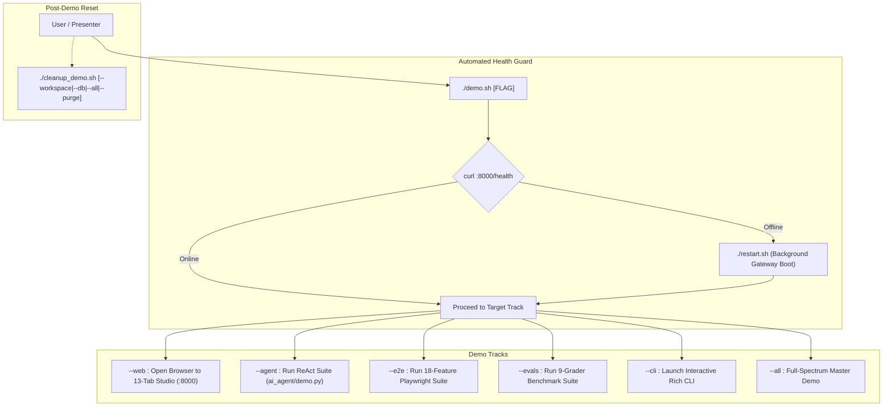

# 🎬 Agentic-AI Demo Guide: Instructions & Walkthroughs
### *Complete Guide for Running, Presenting, and Verifying the 503 Features of Agentic-AI*

---

## 🌟 The 5 Pillars of the Demo Runner Architecture

### 1. What It Does (Plain English & Analogy)
Think of **[`demo.sh`](file:///Users/donthireddy/code/github/agentic-ai/demo.sh)** and **[`story.md`](file:///Users/donthireddy/code/github/agentic-ai/story.md)** as the **Universal Remote Control and Director's Script for a State-of-the-Art IMAX Theater**:
- **[`story.md`](file:///Users/donthireddy/code/github/agentic-ai/story.md)** is the complete screenplay—a 1,400+ line, 15-act narrative walkthrough taking an executive audience through all 503 features of the platform step-by-step.
- **[`demo.sh`](file:///Users/donthireddy/code/github/agentic-ai/demo.sh)** is the master launch button that automatically checks system health, starts background services if needed, and runs any demonstration track you choose with a single keystroke.
- **[`cleanup_demo.sh`](file:///Users/donthireddy/code/github/agentic-ai/cleanup_demo.sh)** is the robotic cleaning crew that sweeps away temporary files, resets test databases, and restores the system to pristine condition in seconds.

### 2. Why & How It Helps (Value Proposition)
| ❌ The Challenge Before | ✅ How Agentic-AI Solves It |
| :--- | :--- |
| **Complex Multi-Step Bootstrapping**: Having to open 4 terminal tabs to start the gateway, Vite server, Ollama, and agent client. | **Self-Healing 1-Click Runner**: [`demo.sh`](file:///Users/donthireddy/code/github/agentic-ai/demo.sh) auto-detects offline services, boots the gateway via [`restart.sh`](file:///Users/donthireddy/code/github/agentic-ai/restart.sh), and opens the browser. |
| **Scattered Demo Scripts**: Separate scripts for browser tests, terminal CLI, benchmarks, and chat demos. | **Unified Interactive Hub**: A single CLI menu (`./demo.sh`) with instant sub-action flags (`--web`, `--agent`, `--e2e`, `--evals`, `--cli`). |
| **Demo Debris Pollution**: Leftover test files, half-finished DAG checkpoints, and test DB entries cluttering the workspace. | **Idempotent Cleanup**: [`cleanup_demo.sh`](file:///Users/donthireddy/code/github/agentic-ai/cleanup_demo.sh) safely purges demo session records from SQLite and clears `workspace/` files without affecting core schemas. |

### 3. Real-World Simple Step-by-Step Scenario
1. **Developer / Presenter**: Types `./demo.sh` in the terminal.
2. **System**: Displays a formatted interactive menu.
3. **Presenter**: Selects `1` (Launch Web Studio UI) or runs `./demo.sh --web`.
4. **System**: Verifies Gateway at `http://localhost:8000/health`, boots background services if offline, and automatically opens Google Chrome to the 13-Tab React Studio!

### 4. Witty Commentary
> *"In software presentations, the 'Demo Gods' are notorious for striking down anyone who attempts to type 12 distinct terminal commands live in front of a CTO. [`demo.sh`](file:///Users/donthireddy/code/github/agentic-ai/demo.sh) exists to appease the Demo Gods: you press one key, lean back with your coffee, and let the scripts do the heavy lifting."*

### 5. Visual Flows & Under-the-Hood Code



---

## 📋 Prerequisites & Quick Setup

Before running the demo, ensure the local environment is prepared:

```bash
# 1. Clone & enter repository
cd /Users/donthireddy/code/github/agentic-ai

# 2. Verify Python virtual environment (auto-activated by demo.sh)
source .venv/bin/activate

# 3. (Optional) Ensure Ollama is running locally for free $0 inference
ollama list
# Recommended models: ollama/qwen2.5-coder:7b, ollama/llama3.2, ollama/gemma2:2b
```

---

## 🚀 Quickstart: The Interactive Demo Menu

Simply run:
```bash
./demo.sh
```

An interactive menu will guide your choices:
```text
==========================================================================
  🧠 AGENTIC-AI : UNIFIED ENTERPRISE DEMO RUNNER
  503 Features · 8 Modules · 13 Studio Tabs · 23 MCP Tools · 10 Skills
==========================================================================

Please select an option to demonstrate:
  1) 🌐 Launch Web Studio UI & Open Browser (http://localhost:8000)
  2) 🤖 Run Automated Agent Demo (ReAct loop, Math, Weather, Shopping, Files)
  3) 🧪 Run 18-Feature Playwright E2E Suite (Headless browser verification)
  4) 📊 Run 9-Grader Evals Suite (Quality & compliance benchmark)
  5) 💻 Launch Interactive Terminal CLI (Rich CLI chat & /skills)
  6) 🌟 Full-Spectrum Demo (Boot Gateway + Agent Demo + Open Web UI)
  7) 📜 View Demo Story (story.md)
  q) Quit
```

---

## 🎯 Walkthrough Tracks in Detail

### Track 1: The Unified Web Studio UI Demo (Interactive Browser)
The centerpiece of the platform is the **13-Tab React Studio** hosted on port 8000.

```bash
./demo.sh --web
# Or: ./demo.sh -w
```

This ensures the backend is healthy and opens `http://localhost:8000` in your default browser. Follow the narrative script in [`story.md`](file:///Users/donthireddy/code/github/agentic-ai/story.md) to explore each tab:

| Tab | Location | Key Demonstration |
| :--- | :--- | :--- |
| **AI Agent Chatbot** | `/chat` | ReAct Loop, Tool Badges, Plotly Artifact Panel, Voice Input, Context Compactor (`/compact`) |
| **Workflow Canvas (DAG)** | `/canvas` | 2D Drag-and-drop board, 4 node types, Kahn topological execution, durable state checkpoints & resume |
| **Orchestrator Swarm** | `/orchestrator` | Supervisor task decomposition, SSE worker streams, and 3-agent adversarial Red-Team Debate |
| **MCP Tools & Sandbox** | `/tools` | Test parameter forms and latency meters for all **23 FastMCP Tools** |
| **Domain Skills Hub** | `/skills` | Progressive Skill Disclosure (85% token savings), 10 built-in personas, and custom skill creator |
| **Memory Explorer** | `/memory` | Semantic Vector Vault (ChromaDB + SQLite fallback) and GraphRAG Knowledge Graph with multi-hop BFS |
| **Workspace Files** | `/workspace` | Sandboxed file manager, path traversal guard (`../` blocking), code editor |
| **Smart Router** | `/smart-router` | 2-stage intent pipeline (Reason ➔ Execute), 5 categories, threshold sliders, trace logs |
| **Telemetry & Metrics** | `/overview` | KPI cards, token pie chart, model share bars, latency percentiles (P50, P90, P99), anomaly flags |
| **Audit Logs** | `/logs` | 3-tier tree view (Conversation ➔ Turn ➔ Request), live SSE stream, CSV/JSONL export |
| **Safety Approvals (HITL)** | `/approvals` | Pending approval queue, 4 risk levels, 60-second countdown timer, user justification logs |
| **Evals & Benchmarks** | `/evals` | Single & multi-model benchmark runners, 9 graders, 100% composite score formula |
| **Settings & Providers** | `/settings` | Transport mode toggle (HTTP vs Stdio), local Ollama detection, cloud API keys, system gauges |

---

### Track 2: The Automated Agent ReAct Swarm Demo (Terminal)
Demonstrates the autonomous ReAct engine ([`ai_agent/demo.py`](file:///Users/donthireddy/code/github/agentic-ai/ai_agent/demo.py)) executing multi-step everyday tasks directly in the terminal with Rich-formatted tables.

```bash
./demo.sh --agent
# Or: ./demo.sh -a
```

**Scenarios Executed:**
1. **Scenario A (Math & Bill Split)**: Splits a $184.50 restaurant bill with 18% tip across 4 people using `calculate_tip_and_split`.
2. **Scenario B (Vacation & Live Weather)**: Activates `travel_planner_skill`, queries live weather for Paris via `weather`, and formats a 3-day bakery itinerary.
3. **Scenario C (Shopping Deal Finder)**: Activates `shopping_assistant_skill`, finds espresso machines in `product_knowledge`, and computes discounts.
4. **Scenario D (Jailed File Operations)**: Writes a vacation packing list to `workspace/paris_trip_checklist.txt` via `workspace_file_ops`.
5. **Gateway Audit Verification**: Queries the Gateway for audit receipts and prints an ASCII table of latency, tokens, and dispatched tools.

---

### Track 3: The 18-Feature Playwright E2E Verification Suite
Runs a headless Chromium browser instance using Playwright ([`scripts/verify_all_docs_workflows.mjs`](file:///Users/donthireddy/code/github/agentic-ai/scripts/verify_all_docs_workflows.mjs)) to programmatically verify all 18 documented workflows in under 10 seconds:

```bash
./demo.sh --e2e
# Or: ./demo.sh -e
```

**Expected Output:**
```text
[E2E-1/18]  ✓ Checking Gateway Health (:8000/health) ......... OK
[E2E-2/18]  ✓ Loading React Studio UI ........................ OK
[E2E-3/18]  ✓ Verifying 13 Sidebar Navigation Tabs ........... OK
...
[E2E-18/18] ✓ Testing Sandboxed Workspace File Security ...... OK
======================================================================
🎯 18 OF 18 WORKFLOW VERIFICATIONS PASSED WITH ZERO FAILURES!
```

---

### Track 4: The 9-Grader Benchmark Evaluation Suite
Grades local or cloud models against standardized test datasets ([`evals_framework/runner.py`](file:///Users/donthireddy/code/github/agentic-ai/evals_framework/runner.py)) across all 9 evaluators:

```bash
./demo.sh --evals
```

**Graders Evaluated:**
- **Deterministic (20%)**: Precision and recall of tool calls.
- **Efficiency (15%)**: Token budget SLA and loop redundancy penalty.
- **LLM Judge (15%)**: Safety, politeness, and intent adherence.
- **Fact Checker (15%)**: Hallucination detection.
- **Faithfulness (10%)**: Grounding against tool outputs.
- **Safety (10%)**: Leaked secrets and shell bomb prevention.
- **Style (5%)**: Length constraints and readability.
- **Relevance (5%)**: Query alignment without fluff.
- **Code Syntax (5%)**: AST validation and safe execution.

A complete Markdown report is generated and saved in [`evals_framework/reports/`](file:///Users/donthireddy/code/github/agentic-ai/evals_framework/reports/).

---

### Track 5: The Interactive Rich Terminal CLI
For developers who prefer terminal-first agent interactions:

```bash
./demo.sh --cli
# Or: ./demo.sh -c
```

**Special Commands Inside CLI:**
- `/skills`: Lists all 10 domain personas and custom registered skills.
- `/skill activate <name>`: Injects a specific domain skill into the active session.
- `/stats`: Displays current gateway latency, token counts, and spend.
- `/logs`: Shows recent audit logs directly in the terminal.

---

### Track 6: The Full-Spectrum Master Demo
Runs the complete demonstration flow in a single automated sequence:

```bash
./demo.sh --all
```

1. Verifies/boots the Gateway on port 8000.
2. Executes the 4-scenario ReAct Agent Demo Suite.
3. Opens the Web Studio UI at `http://localhost:8000`.

---

## 🧹 Post-Demo Cleanup & System Reset

After running demos or tests, temporary files and demo database records can be wiped cleanly using **[`cleanup_demo.sh`](file:///Users/donthireddy/code/github/agentic-ai/cleanup_demo.sh)**:

### Interactive Cleanup Menu
```bash
./cleanup_demo.sh
```

```text
Please select cleanup action:
  1) 📂 Clean demo files in workspace/
  2) 📊 Clean benchmark reports in evals_framework/reports/
  3) 💾 Purge demo sessions from SQLite databases
  4) 📜 Reset runtime gateway.log & webui_dev.log
  5) 🛑 Stop running demo background services
  6) ✨ Clean All Demo Data (Workspace, Reports, DB, Logs)
  7) 💥 Full Purge (Stop services + Clean everything)
  q) Cancel / Quit
```

### CLI Cleanup Flags
| Command | What It Cleans |
| :--- | :--- |
| `./cleanup_demo.sh --workspace` | Removes demo files from `workspace/` (`paris_trip_checklist.txt`, etc.) |
| `./cleanup_demo.sh --reports` | Cleans generated `.md` files in `evals_framework/reports/` |
| `./cleanup_demo.sh --db` | Purges demo sessions (`everyday_sess_*`, `conv_*paris*`) from SQLite |
| `./cleanup_demo.sh --logs` | Truncates runtime `gateway.log` and `webui_dev.log` |
| `./cleanup_demo.sh --stop` | Stops background processes on port 8000 |
| `./cleanup_demo.sh --all` | Cleans workspace, reports, DB records, and logs in one command |
| `./cleanup_demo.sh --purge` | Stops background services and cleans all demo data |

---

## 🛠️ Troubleshooting & Graceful Fallbacks

| Issue | Cause | Solution |
| :--- | :--- | :--- |
| **Port 8000 is in use** | A previous instance of the gateway or another web service is bound to port 8000. | Run `./cleanup_demo.sh --stop` or `./restart.sh stop`. |
| **Ollama model not found** | `ollama/qwen2.5-coder:7b` is not installed locally. | Run `ollama pull qwen2.5-coder:7b` or switch model in `SettingsView` to `ollama/llama3.2` or any cloud model. |
| **Cloud API keys not configured** | Cloud models (GPT-4o, Claude, Gemini) fail with 401. | Open **Settings & Providers** tab in Web UI (`/settings`) and paste keys into the encrypted input fields. |
| **Playwright browser missing** | Chromium binaries not downloaded. | Run `npx playwright install chromium`. |
| **Permission denied on scripts** | Execution bit not set. | Run `chmod +x demo.sh cleanup_demo.sh restart.sh`. |

---

## 📖 Related Documents
- [**`story.md`**](file:///Users/donthireddy/code/github/agentic-ai/story.md): The full 1,400+ line narrative demonstration covering all 503 features in depth.
- [**`agentic-ai-feature-map.md`**](file:///Users/donthireddy/code/github/agentic-ai/agentic-ai-feature-map.md): Exhaustive breakdown of all 45 top-level, 209 sub-features, and 503 atomic capabilities.
- [**`laymans_guide.md`**](file:///Users/donthireddy/code/github/agentic-ai/laymans_guide.md): High-level plain-English architectural tour for non-technical stakeholders.
