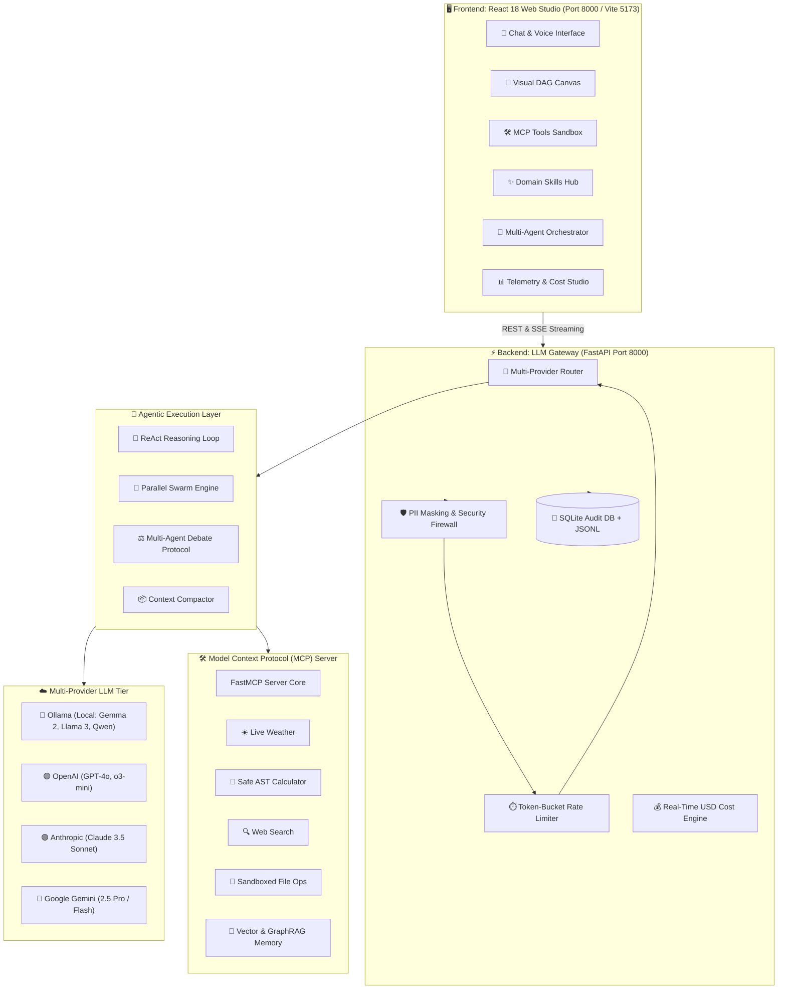

# 🚀 00. Getting Started & System Architecture Blueprint

> **Author**: Vijay Donthireddy  
> **Repository**: [vdonthireddy/agentic-ai](https://github.com/vdonthireddy/agentic-ai)  
> **Documentation Track**: [Phase 1: Foundations & Quickstart](./README.md#phase-1-foundations--quickstart)  
> **Navigation**: [🏠 Docs Hub](./README.md) | **Step 0 of 18** | [➡️ Next: 01. AI Agent Chatbot](./01_ai_agent_chatbot.md)

---

## 🌟 1. What It Does (Plain English & Analogy)

The **Agentic AI Platform** is an enterprise-grade, modular operating environment designed to run autonomous AI agents that don't just chat, but **plan**, **call real-world tools**, **execute parallel workflows**, and **self-correct**.

Unlike brittle AI demos that rely on rigid scripts, this platform unifies an **Autonomous ReAct Agent**, a **Multi-Provider LLM Gateway**, a **Model Context Protocol (MCP) Server**, and a high-performance **React 18 Studio** into a single cohesive system.

> 💡 **The Real-World Analogy**:  
> Think of building an AI agent like opening a high-end restaurant:
> - **The LLM Gateway (`llm_gateway/`)** is the **Maitre D' & Supplier Coordinator**: It routes orders to any chef (Ollama, OpenAI, Claude, Gemini), verifies payment and security (PII masking, token rate limits), and logs every ticket into a permanent audit database.
> - **The MCP Server (`mcp_server/`)** is the **Kitchen Prep Station & Tool Rack**: It provides the knives, blenders, thermometers, and recipes (Calculators, Weather APIs, File I/O, Web Search, Dynamic Skills).
> - **The Autonomous Agent (`ai_agent/`)** is the **Master Chef**: It reads the customer's request, decides which tools to use, inspects the intermediate dishes, and adjusts seasoning if something goes wrong.
> - **The Web Studio (`webui/`)** is the **Dining Room & Mission Control**: Where customers place orders, watch live cooking through a glass window (real-time SSE streaming), and inspect nutritional breakdowns (evals, telemetry, cost tracking).

---

## 🎯 2. Why & How It Helps (Value Proposition)

### "The Challenge Before" vs. "How This Solves It"

| The Challenge Before | How This Solves It |
|---|---|
| **Vendor Lock-In**: Code is hardcoded to a single LLM API (e.g. OpenAI only). Switching requires rewriting prompt parsing and tool calling. | **Unified Multi-Provider Gateway**: LiteLLM router supports Ollama (local), OpenAI, Anthropic, Gemini, Groq, Mistral with automated fallbacks. |
| **Monolithic Fragility**: Tool definitions, agent prompts, and UI logic are coupled in one giant script that breaks easily. | **Decoupled Architecture**: Clean microservice separation between UI (React), Gateway (FastAPI :8000), MCP Tools, and Agent logic. |
| **No Operational Visibility**: Teams deploy agents without knowing token costs, latency spikes, or failure patterns. | **3-Tier Audit Flight Recorder**: Every token, prompt, cost in USD, and tool call is recorded in SQLite and JSONL streams. |
| **Brittle Single-Agent Failure**: Complex multi-step instructions overwhelm single LLMs, causing hallucinated results. | **Multi-Agent Orchestrator & DAG Swarms**: Decomposes tasks into visual DAGs with parallel execution and debate protocols. |

---

## 🗺️ 3. High-Level Architecture Topology



---

## ⚡ 4. Real-World Step-by-Step Scenario: 3-Minute Quickstart

### Prerequisites
- Python 3.10+
- Node.js 18+ (for WebUI development)
- Ollama (optional, for 100% free offline local models)

### Step-by-Step Quickstart:

1. **Clone the Repository**:
   ```bash
   git clone https://github.com/vdonthireddy/agentic-ai.git
   cd agentic-ai
   ```

2. **Set Up Python Environment**:
   ```bash
   python3 -m venv .venv
   source .venv/bin/activate
   pip install -r requirements.txt
   ```

3. **Configure Environment Variables**:
   ```bash
   cp .env.example .env
   # Edit .env to add cloud API keys (OpenAI, Anthropic, Gemini, Groq)
   # Or run 100% locally with Ollama without any API keys!
   ```

4. **Launch the Unified Studio Server**:
   ```bash
   ./restart.sh
   ```
   *The script starts the FastAPI Gateway on `http://localhost:8000`, verifies database migrations, and serves the pre-built React Studio.*

5. **Open the Studio in Your Browser**:
   - Navigate to [`http://localhost:8000`](http://localhost:8000).
   - Verify that your models are loaded in the top dropdown selector.
   - Run your first prompt: *"What's the weather in Tokyo and calculate $125/night for 4 nights?"*

---

## 😄 5. Witty & Relatable Commentary

> *"Most AI tutorials ask you to install 47 different experimental frameworks, paste an unverified API key into a random shell script, and pray. We built this platform so you can clone the repo, run `./restart.sh`, and immediately have a production-grade AI studio running with zero guesswork and zero drama."*

---

## 💻 6. Under-the-Hood Code & Key Entrypoints

| Subsystem | Source Location | Description |
|---|---|---|
| **Gateway Application** | [`llm_gateway/app.py`](file:///Users/donthireddy/code/github/agentic-ai/llm_gateway/app.py) | Main FastAPI application entrypoint and route orchestrator |
| **Model Router** | [`llm_gateway/router.py`](file:///Users/donthireddy/code/github/agentic-ai/llm_gateway/router.py) | Multi-provider LiteLLM proxy with fallback handling |
| **Agent Reasoning Engine** | [`ai_agent/agent.py`](file:///Users/donthireddy/code/github/agentic-ai/ai_agent/agent.py) | Autonomous ReAct loop with tool call parsing |
| **MCP Tools Server** | [`mcp_server/server.py`](file:///Users/donthireddy/code/github/agentic-ai/mcp_server/server.py) | FastMCP tool server and schema publisher |
| **React Studio WebUI** | [`webui/src/App.jsx`](file:///Users/donthireddy/code/github/agentic-ai/webui/src/App.jsx) | React 18 single-page application entrypoint |

---

## 🧭 Next Step in Your Journey

Now that your platform is up and running, proceed to **Phase 2: Conversational Agents & Tool Power** to explore how the autonomous ReAct chatbot operates:

👉 **[Continue to 01. AI Agent Chatbot Guide](./01_ai_agent_chatbot.md)**
