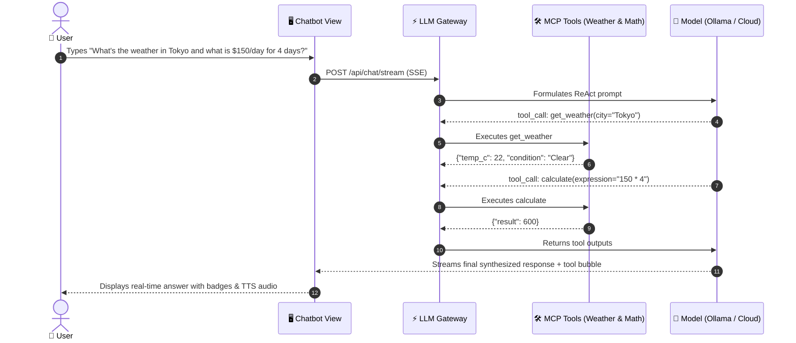

# 💬 01. AI Agent Chatbot — Step-by-Step UI Guide

> **Author**: Vijay Donthireddy  
> **Route**: `http://localhost:8000/chat` (or `http://localhost:8000/`)  
> **Component Source**: [`webui/src/views/ChatView.jsx`](file:///Users/donthireddy/code/github/agentic-ai/webui/src/views/ChatView.jsx)

---

## 🌟 1. What It Does (Plain English & Analogy)

The **AI Agent Chatbot** is your conversational mission control. Unlike standard raw chatbots that just predict text, this is an **Autonomous ReAct Agent** equipped with real-world **Model Context Protocol (MCP) tools** (Live Weather, Web Search, Calculator, Shopping Catalog, Workspace Files, and Memory).

> 💡 **The Real-World Analogy**:  
> Think of a raw LLM like an encyclopedia reader sitting in a closed room with no phone or internet. The **Agentic AI Chatbot** is like an executive assistant equipped with a smartphone, a scientific calculator, an office file cabinet, and a live web browser. When you ask a question, the assistant looks up live data, calculates exact numbers, checks your files, and delivers a fact-checked answer.

---

## 🎯 2. Why & How It Helps (Value Proposition)

### "The Challenge Before" vs. "How This Solves It"

| The Challenge Before | How This Solves It |
|---|---|
| **Hallucinated Math & Facts**: LLMs generate plausible-sounding but wrong numbers (e.g. `145 * 38.5 = 5200`). | **Deterministic MCP Tool Calling**: Automatically calls python sandbox / math tools to execute certified calculations. |
| **Outdated Knowledge Cutoffs**: LLMs don't know today's weather or current news. | **Live MCP Web & Weather Tools**: Fetches real-time temperatures and search snippets on the fly. |
| **Context Window Exhaustion**: Long chats blow past token limits and fail. | **Proactive Context Compaction (`/compact`)**: Compresses earlier conversational turns into milestone summaries, freeing 70%+ context tokens. |
| **Rigid Monolithic Execution**: Chatbots can only run one sequential prompt. | **Workflow DAG Integration**: Select any visual DAG pipeline from the dropdown and execute complex multi-stage graphs inside the chat. |

---

## 🚀 3. Real-World Step-by-Step Scenario

### Scenario: Planning a Trip with Weather, Budget Calculation & DAG Pipeline

### Step-by-Step UI Actions:

1. **Select Model**: In the top control bar, pick your desired model (e.g., local `Gemma 2 2B`, `Qwen 2.5 Coder`, or cloud `Claude 3.5 Sonnet`).
2. **Select Active Domain Skill (Optional)**: Choose a specialized persona (e.g., `Customer Support Agent`, `Financial Analyst`).
3. **Select Workflow DAG (Optional)**: Choose `None (Standard ReAct Chat)` or select any saved DAG (e.g., `⚡ 1-to-3 Parallel Swarm Fork`).
4. **Enter Prompt**:
   - Click a **Prompt Chip** (e.g., *"Check Tokyo weather & calculate total"*) or type your custom query.
   - Or click the **🎤 Microphone** button to speak your prompt via Whisper voice transcription.
5. **Observe Execution**:
   - Tool bubbles will animate in real-time (`🛠️ Executed Tool: get_weather`).
   - If a DAG pipeline is active, a purple **DAG Execution Card** displays stage-by-stage status.
6. **Context Management**:
   - When history grows large, click **`[Minimize2 Compact]`** or type `/compact` to summarize earlier messages.

---

## 😄 4. Witty & Relatable Commentary

> *"Remember when chatbots used to confidently tell you that 17 times 24 was 'around 500'? Our Agentic Chatbot actually opens a calculator, presses the buttons, and double-checks the math before answering you. No more conversational guessing games!"*

---

## 💻 5. Under-the-Hood Code & API Endpoints

- **Chat Stream Route**: `POST /api/chat/stream`
- **Context Compaction Route**: `POST /api/chat/compact`
- **Voice STT Route**: `POST /api/voice/transcribe`
- **Primary Source**: [`webui/src/views/ChatView.jsx`](file:///Users/donthireddy/code/github/agentic-ai/webui/src/views/ChatView.jsx)
