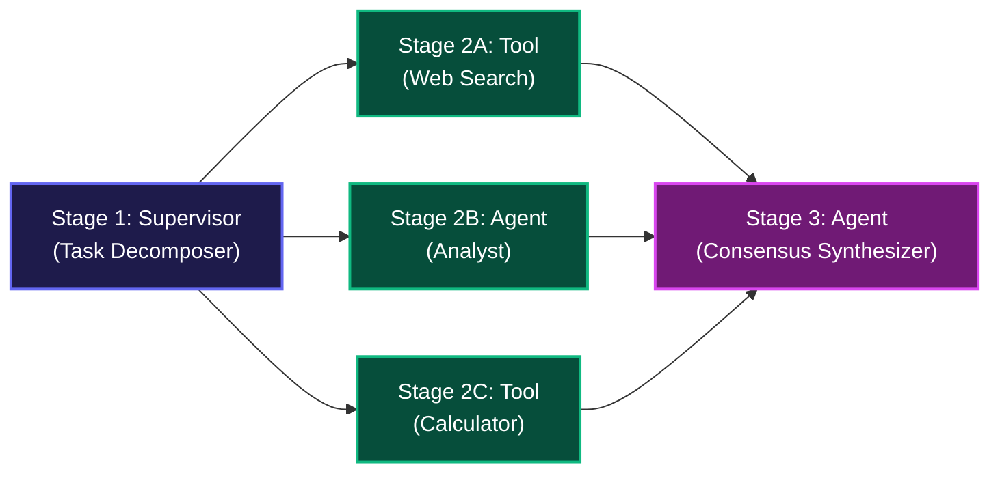

# 🔱 02. Workflow Canvas (DAG Studio) — Step-by-Step UI Guide

> **Author**: Vijay Donthireddy  
> **Route**: `http://localhost:8000/canvas`  
> **Component Source**: [`webui/src/views/CanvasView.jsx`](file:///Users/donthireddy/code/github/agentic-ai/webui/src/views/CanvasView.jsx)

---

## 🌟 1. What It Does (Plain English & Analogy)

The **Workflow Canvas (DAG Studio)** is an interactive 2D node-based visual orchestration builder. It allows you to build multi-agent graphs with **Forks (Fan-Out)** and **Joins (Fan-In)**, connecting Agent Reasoning nodes, MCP Tool nodes, Human-in-the-Loop (HITL) safety gates, and Semantic Memory stores.

> 💡 **The Real-World Analogy**:  
> Think of standard chat like a single worker assembling a car one bolt at a time. The **DAG Studio** is like an automated Tesla gigafactory assembly line: a supervisor decomposes the job, three specialized robotic arms work in parallel at the same time (Stage 2 swarm), a quality safety inspector checks the work (Stage 3 HITL), and an executive arbitrator signs off on the final car (Stage 4 Join).

---

## 🎯 2. Why & How It Helps (Value Proposition)

### "The Challenge Before" vs. "How This Solves It"

| The Challenge Before | How This Solves It |
|---|---|
| **Sequential Bottlenecks**: Running 3 independent tasks (e.g. search web, calculate taxes, lookup customer) sequentially takes 3x the time. | **Concurrent Stage Swarms**: Kahn's topological sort groups independent nodes into parallel execution waves (`asyncio.gather`), slashing execution latency by up to 70%. |
| **Accidental Infinite Loops**: A circular connection between agents (`A -> B -> A`) crashes agent frameworks. | **DFS Cycle Prevention**: Instant visual validation and cycle rejection before execution. |
| **Isolated Experiments**: Graph experiments stay trapped in the editor. | **One-Click Save & Chatbot Integration**: Save any graph as a named pipeline and select it directly in the AI Chatbot dropdown. |

---

## 🚀 3. Real-World Step-by-Step Scenario

### Scenario: Building a 1-to-3 Parallel Swarm with Web Search & Calculation

### Step-by-Step UI Actions:

1. **Load a Template or Build Blank**:
   - Click **`🔱 1-to-3 Parallel Swarm Fork`** to pre-populate a supervisor-to-workers graph.
   - Or drag nodes from the left **Node Palette** (`Agent Node`, `MCP Tool Node`, `HITL Gate`, `Memory Store`) onto the canvas.
2. **Configure Node Settings**:
   - On the **Tool Node**, click the tool dropdown and pick `search_web`, `weather`, or `calculate`.
   - On the **Agent Node**, pick the specialized role (`analyst`, `critic`, `arbitrator`).
3. **Connect Wires**:
   - Click and drag from the blue **Output Port** (right side of a node) to the emerald **Input Port** (left side of another node).
4. **Name Your Pipeline**:
   - In the top action bar, click the **`📝 Name:`** box and type `Customer Support Swarm`.
5. **Run the DAG**:
   - Click the blue **`[▶ Run Workflow DAG]`** button.
   - Watch the nodes illuminate dynamically as each stage executes.
   - Scroll down to review the **Live Execution Trace Card**.
6. **Save for Chatbot Use**:
   - Click **`[💾 Save Pipeline]`**. It will appear in your **"⚡ Your Saved Pipelines"** bar and in the Chatbot's **Workflow DAG** selector.

---

## 😄 4. Witty & Relatable Commentary

> *"Why make one AI agent do all the homework alone when you can spawn three agent workers in parallel, make them do the research at the same time, and have a supervisor agent take all the credit? That's what we call modern enterprise efficiency!"*

---

## 💻 5. Under-the-Hood Code & API Endpoints

- **DAG Execute Endpoint**: `POST /api/canvas/execute` (Kahn's Topological Algorithm)
- **DAG Pipelines CRUD**: `GET /api/canvas/pipelines`, `POST /api/canvas/pipelines`, `DELETE /api/canvas/pipelines/{id}`
- **Source File**: [`webui/src/views/CanvasView.jsx`](file:///Users/donthireddy/code/github/agentic-ai/webui/src/views/CanvasView.jsx)
