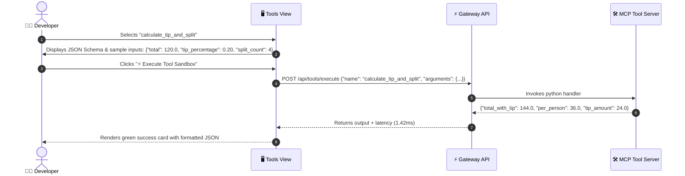

# 🛠️ 03. MCP Tools & Sandbox — Step-by-Step UI Guide

> **Author**: Vijay Donthireddy  
> **Route**: `http://localhost:8000/tools`  
> **Component Source**: [`webui/src/views/ToolsView.jsx`](file:///Users/donthireddy/code/github/agentic-ai/webui/src/views/ToolsView.jsx)

---

## 🌟 1. What It Does (Plain English & Analogy)

The **MCP Tools & Sandbox** view is an interactive developer workbench and diagnostic playground for all registered Model Context Protocol (MCP) tools. You can inspect tool JSON schemas, execute test payloads in an isolated sandbox, and benchmark real-time tool latency.

> 💡 **The Real-World Analogy**:  
> If an agent is a master craftsman, MCP tools are the power tools on their workbench (the laser measure, the power drill, the voltmeter). The **MCP Tools & Sandbox** is the calibration bench where you test each tool before handing it to the worker on the job site.

---

## 🎯 2. Why & How It Helps (Value Proposition)

### "The Challenge Before" vs. "How This Solves It"

| The Challenge Before | How This Solves It |
|---|---|
| **Blind Tool Debugging**: You only find out a tool has a bad parameter schema when an LLM fails mid-conversation. | **Interactive JSON Sandbox**: Live parameter editor with pre-filled sample payloads and instant execution results. |
| **Unknown Tool Latency**: Slow external APIs degrade chat response times without clear visibility. | **Millisecond Latency Benchmarking**: Displays exact round-trip execution latency (`latency_ms`) for every tool invocation. |
| **Tool Calling Hallucinations**: Models calling tools with non-existent argument names. | **Standardized JSON Schema Specification**: Strict type verification complying with Anthropic MCP standards. |

---

## 🚀 3. Real-World Step-by-Step Scenario

### Scenario: Testing the `calculate_tip_and_split` Math Tool



### Step-by-Step UI Actions:

1. **Browse Registered Tools**: On the left list, view all active MCP tools (`get_weather`, `web_search`, `calculate`, `product_knowledge`, `workspace_file_ops`, `get_system_metrics`).
2. **Select a Tool**: Click on any tool card (e.g. `get_weather`).
3. **Inspect Schema**: Review the parameter requirements (`city: string`, `units: string`).
4. **Edit Arguments**: In the **Tool Arguments (JSON)** box, customize the input:
   ```json
   {
     "city": "Tokyo"
   }
   ```
5. **Execute**: Click **`⚡ Execute Tool Sandbox`**.
6. **Analyze Output**: View the formatted result JSON, execution status code, and latency badge.

---

## 😄 4. Witty & Relatable Commentary

> *"Never let an AI agent use a tool you haven't tested yourself in the sandbox first. It's like giving your teenage cousin the keys to a sports car without checking if the brakes work!"*

---

## 💻 5. Under-the-Hood Code & API Endpoints

- **List Tools Endpoint**: `GET /api/tools` or `GET /v1/tools`
- **Execute Sandbox Endpoint**: `POST /api/tools/execute`
- **Source Files**: [`mcp_server/tools/`](file:///Users/donthireddy/code/github/agentic-ai/mcp_server/tools/) and [`webui/src/views/ToolsView.jsx`](file:///Users/donthireddy/code/github/agentic-ai/webui/src/views/ToolsView.jsx)
