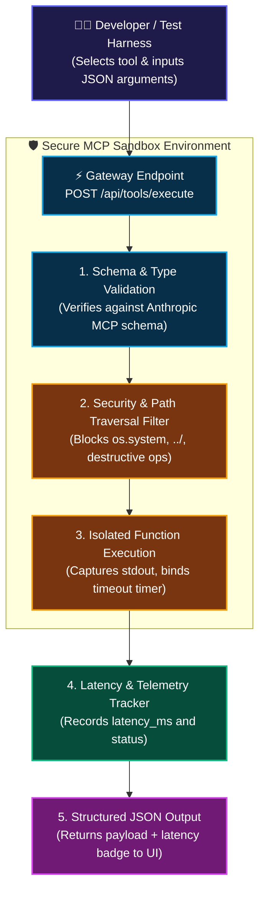
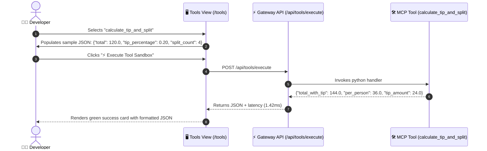

# 🛠️ 03. MCP Tools & Sandbox — Step-by-Step UI Guide

> **Author**: Vijay Donthireddy  
> **Route**: `http://localhost:8000/tools`  
> **Component Source**: [`webui/src/views/ToolsView.jsx`](file:///Users/donthireddy/code/github/agentic-ai/webui/src/views/ToolsView.jsx)  
> **Backend Engine**: [`llm_gateway/app.py`](file:///Users/donthireddy/code/github/agentic-ai/llm_gateway/app.py) (`/api/tools/execute`) & [`mcp_server/tools/`](file:///Users/donthireddy/code/github/agentic-ai/mcp_server/tools/)

---

## 🌟 1. What It Does (Plain English & Analogy)

The **MCP Tools & Sandbox** is an interactive developer workbench, diagnostic test harness, and secure execution environment for all registered Model Context Protocol (MCP) tools. It allows engineers to inspect standardized tool JSON schemas, execute isolated test payloads without spending LLM tokens, and benchmark real-time tool latencies.

### 🧪 What is a "Sandbox"?
A **Sandbox** is an isolated, controlled testing environment where software components or code can be safely executed without affecting the rest of the application or the host operating system. In this platform, sandboxing exists at two distinct levels:

1. **The MCP Tool Diagnostic Sandbox (`/tools`)**: A zero-token testing playground where you can feed raw JSON arguments directly into any tool (e.g., `get_weather`, `calculate`, `workspace_file_ops`, `product_knowledge`) to verify its return values, validate schemas, and measure latency before handing it to an autonomous AI agent.
2. **The Python Code Interpreter Sandbox (`python_sandbox`)**: A security-restricted runtime environment that dynamically executes generated Python scripts, captures standard output, generates interactive Plotly visualizations, and blocks dangerous system calls (like `os.system` or `shutil.rmtree`).

> 💡 **The Real-World Analogy**:  
> - **The Flight Simulator**: An airline pilot doesn't test a new engine maneuver with 300 passengers in mid-air. They test it first in a flight simulator (the sandbox) where mistakes cost nothing.  
> - **The Chemistry Fume Hood**: A chemist mixes volatile compounds inside a reinforced glass fume hood with its own ventilation. If something explodes, the lab is completely protected.

---

## 🎯 2. Why & How It Helps (Value Proposition)

### "The Challenge Before" vs. "How This Solves It"

| The Challenge Before | How This Solves It |
|---|---|
| **Blind Tool Debugging**: Discovering that a tool has a bad parameter schema only when an LLM fails and crashes a live 10-turn conversation. | **Interactive JSON Sandbox**: Live parameter editor with pre-filled sample payloads, schema validation, and instant test execution. |
| **Token Waste on Tool Testing**: Forcing an LLM to call tools just to test if the Python code works, burning API credits and adding latency. | **Zero-Token Direct Execution**: Directly invokes the Python backend handler via `POST /api/tools/execute` without calling any AI model. |
| **Security Risks from Code Execution**: Allowing AI agents to execute arbitrary Python code can lead to server compromise or data deletion. | **AST Security Scanning & Memory Sandboxing**: The Python sandbox inspects code AST, blocks dangerous syscalls, and runs inside a memory-bounded context. |
| **Unpredictable Tool Latencies**: Slow third-party APIs dragging down agent responsiveness without visibility. | **Sub-Millisecond Benchmarking**: Displays exact round-trip execution latency (`latency_ms`) for every single tool invocation. |

---

## 🏗️ 3. How the Sandbox is Created & How It Works Under the Hood



---

### ⚙️ The 4-Step Sandboxing Lifecycle:

1. **Tool Discovery & Schema Reflection (`GET /api/tools`)**:  
   The UI queries the MCP registry to discover all registered tools, their descriptions, and their strict JSON Schema parameter definitions (`type`, `properties`, `required`).
2. **Payload Marshalling & Validation**:  
   When you click `[⚡ Execute Tool Sandbox]`, the payload is sent to `POST /api/tools/execute`. The server verifies that all required parameters are present and conform to type specifications.
3. **Isolated Execution & IO Capture**:  
   - For standard tools (e.g. `calculate`, `get_weather`, `workspace_file_ops`), the gateway dispatches the call to the tool's python handler in [`mcp_server/tools/`](file:///Users/donthireddy/code/github/agentic-ai/mcp_server/tools/).
   - For dynamic code execution (`python_sandbox`), the engine redirects `sys.stdout`, intercepts Plotly figure calls, scans for forbidden system imports, and executes the script inside an isolated namespace.
4. **Latency Benchmarking & Telemetry**:  
   The execution timer calculates round-trip time in milliseconds (e.g., `1.42ms`) and packages the response into a clean JSON structure displayed in the green success card.

---

## 🚀 4. Real-World Step-by-Step Scenarios

### Scenario A: Testing the Math & Tip Calculator Tool


#### Step-by-Step UI Actions:
1. Navigate to **MCP Tools & Sandbox** in the left sidebar (`http://localhost:8000/tools`).
2. In the left **Registered Tools** column, click **`calculate`** (or `get_weather`, `search_web`, `workspace_file_ops`).
3. In the **Tool Arguments (JSON)** editor, enter your test arguments:
   ```json
   {
     "expression": "((150 * 4) + 85) * 1.08"
   }
   ```
4. Click the blue **`[⚡ Execute Tool Sandbox]`** button.
5. Review the results:
   - **Status Badge**: `200 OK`
   - **Latency Badge**: `⚡ 0.85 ms`
   - **Response Payload**: `{"status": "success", "result": 739.8}`

---

### Scenario B: Testing the Python Sandbox with a Dynamic Plotly Chart
1. Select **`python_sandbox`** from the tool list.
2. In the arguments box, input a script generating a sales chart:
   ```json
   {
     "code": "import plotly.graph_objects as go\nfig = go.Figure(data=[go.Bar(x=['Q1', 'Q2', 'Q3', 'Q4'], y=[120, 180, 240, 310])])\nfig.show()\nprint('Chart generated successfully!')"
   }
   ```
3. Click **`[⚡ Execute Tool Sandbox]`**.
4. The sandbox safely captures standard output and returns the Plotly JSON specification without executing any unsafe operating system commands.

---

## 😄 5. Witty & Relatable Commentary

> *"Never let an AI agent use a tool you haven't tested yourself in the sandbox first. It's like giving your teenage cousin the keys to a twin-turbo sports car without checking if the brakes work! Test it in the sandbox for 1 millisecond, verify the schema, and sleep soundly knowing your agent won't hallucinate."*

---

## 💻 6. Under-the-Hood Code & API Endpoints

- **List Tools Endpoint**: `GET /api/tools` (Returns full Anthropic MCP schemas)
- **Execute Sandbox Endpoint**: `POST /api/tools/execute`
- **Tool Catalog Directory**: [`mcp_server/tools/`](file:///Users/donthireddy/code/github/agentic-ai/mcp_server/tools/)
- **Python Sandbox Engine**: [`mcp_server/tools/python_tool.py`](file:///Users/donthireddy/code/github/agentic-ai/mcp_server/tools/python_tool.py)
- **UI Component**: [`webui/src/views/ToolsView.jsx`](file:///Users/donthireddy/code/github/agentic-ai/webui/src/views/ToolsView.jsx)
