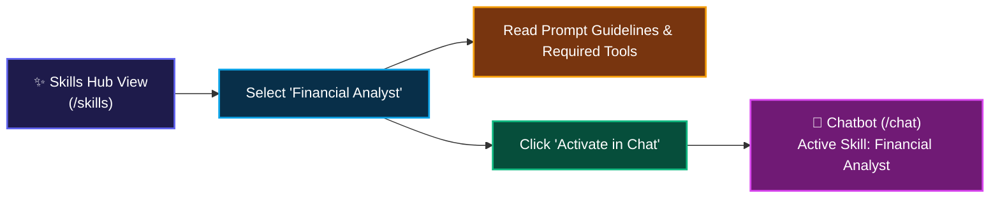

# ✨ 04. Domain Skills Hub — Step-by-Step UI Guide

> **Author**: Vijay Donthireddy  
> **Repository**: [vdonthireddy/agentic-ai](https://github.com/vdonthireddy/agentic-ai)  
> **Route**: `http://localhost:8000/skills`  
> **Component Source**: [`webui/src/views/SkillsView.jsx`](file:///Users/donthireddy/code/github/agentic-ai/webui/src/views/SkillsView.jsx)  
> **Documentation Track**: [Phase 2: Single-Agent Mechanics & Tool Power](./README.md#phase-2-single-agent-mechanics--tool-power)  
> **Navigation**: [🏠 Docs Hub](./README.md) | [⬅️ Prev: 03. MCP Tools & Sandbox](./03_mcp_tools_sandbox.md) | **Step 5 of 18** | [➡️ Next: 05. Workspace Files](./05_workspace_files.md)

---

> 🔗 **Related Deep-Dive Modules**:
> - 💬 [01. AI Agent Chatbot](./01_ai_agent_chatbot.md) — The conversational interface where active skills are injected into prompts.
> - 🛠️ [03. MCP Tools & Sandbox](./03_mcp_tools_sandbox.md) — Everyday tools declared as dependencies by domain skills.
> - 📁 [05. Workspace Files Explorer](./05_workspace_files.md) — Inspect how skills manipulate and save data artifacts in the workspace.

---

## 🌟 1. What It Does (Plain English & Analogy)

The **Domain Skills Hub** manages specialized, on-demand agent personas and task-specific operational procedures (SOPs). Instead of stuffing every single instruction into a gigantic, expensive system prompt, skills are **progressively loaded** only when activated.

> 💡 **The Real-World Analogy**:  
> Think of a general practitioner doctor who needs to perform specialized surgery. Instead of carrying a 10,000-page textbook on brain surgery into every routine checkup, they open the specific surgical guide only when the specialized procedure begins.

---

## 🎯 2. Why & How It Helps (Value Proposition)

### "The Challenge Before" vs. "How This Solves It"

| The Challenge Before | How This Solves It |
|---|---|
| **Bloated System Prompts**: Including all company policies in every chat wastes thousands of tokens on every message. | **Progressive Skill Disclosure**: Loads only the relevant markdown skill (`SKILL.md`) when selected or auto-routed. |
| **Generic, Boring Advice**: Models give surface-level answers because they lack domain-specific guidelines. | **Targeted Domain Guidelines**: Provides domain-specific constraints, recommended tool-calling sequences, and formatting rules. |
| **Vendor Lock-In**: Prompts hardcoded inside Python code files are hard for non-engineers to edit. | **Clean Markdown Files**: Skills are defined as human-readable `.md` files with YAML metadata in `mcp_server/skills/`. |

---

## 🚀 3. Real-World Step-by-Step Scenario

### Scenario: Activating the `financial_analyst` Domain Skill

### Step-by-Step UI Actions:

1. **Browse Active Skills**: View the library of skills:
   - 💳 **Customer Support Agent** (Ticket resolution, return policies, empathic escalation)
   - 📊 **Financial Analyst** (Tax calculation, tip splits, revenue metrics)
   - 💻 **Software Engineer** (Code generation, debugging, sandbox testing)
   - ✈️ **Travel Planner** (Multi-city itineraries, live weather, budget breakdown)
2. **Inspect Skill Details**: Click any skill card to view:
   - Category tag & required MCP tools.
   - The exact system instruction injected into the agent prompt.
3. **Activate in Chat**: Click the blue **`[💬 Activate in Chat]`** button.
4. **Instant Redirect**: The UI automatically switches to the **AI Agent Chatbot** with the domain skill pre-selected in the header!

---

## 😄 4. Witty & Relatable Commentary

> *"A general AI trying to do financial planning without a skill prompt is like asking your friendly golden retriever to file your taxes. With the Financial Analyst skill loaded, the agent turns into a certified CPA in one click!"*

---

## 💻 5. Under-the-Hood Code & API Endpoints

- **List Skills Endpoint**: `GET /api/skills`
- **Source Directory**: [`mcp_server/skills/`](file:///Users/donthireddy/code/github/agentic-ai/mcp_server/skills/)
- **UI View Source**: [`webui/src/views/SkillsView.jsx`](file:///Users/donthireddy/code/github/agentic-ai/webui/src/views/SkillsView.jsx)

---

## 🧭 Next Step in Your Journey

Now that you've explored persona skills, learn how agents interact with files and create persistent workspace artifacts:

👉 **[Continue to 05. Workspace Files Explorer Guide](./05_workspace_files.md)**
