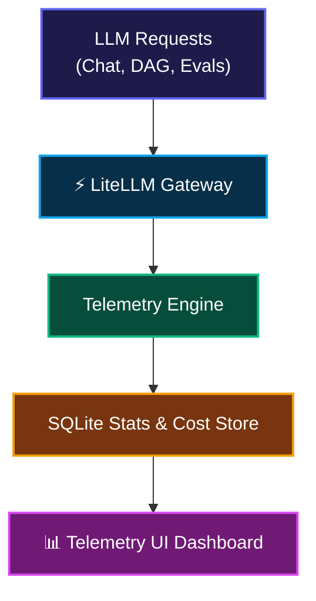

# 📊 06. Telemetry & Metrics — Step-by-Step UI Guide

> **Author**: Vijay Donthireddy  
> **Repository**: [vdonthireddy/agentic-ai](https://github.com/vdonthireddy/agentic-ai)  
> **Route**: `http://localhost:8000/overview` (or `http://localhost:8000/telemetry`)  
> **Component Source**: [`webui/src/views/TelemetryView.jsx`](file:///Users/donthireddy/code/github/agentic-ai/webui/src/views/TelemetryView.jsx)  
> **Documentation Track**: [Phase 5: Observability, Evals & Benchmarks](./README.md#phase-5-observability-evals--benchmarks)  
> **Navigation**: [🏠 Docs Hub](./README.md) | [⬅️ Prev: 18. Rate Limiting & Costs](./18_rate_limiting_and_cost_tracking.md) | **Step 15 of 18** | [➡️ Next: 07. Audit Logs](./07_audit_logs.md)

---

> 🔗 **Related Deep-Dive Modules**:
> - 📜 [07. Audit Logs](./07_audit_logs.md) — Inspect raw payloads, prompt traces, and token costs per request.
> - 💰 [18. Rate Limiting & Cost Tracking](./18_rate_limiting_and_cost_tracking.md) — Deep dive into cost models and token-bucket throttling.
> - 🏆 [08. 4-Grader Evals & Benchmarks](./08_evals_benchmarks.md) — Correlate model accuracy with latency and token consumption.

---

## 🌟 1. What It Does (Plain English & Analogy)

The **Telemetry & Metrics** dashboard is the live health and performance cockpit of your LLM Gateway. It tracks token usage, request latency percentiles (p50, p95, p99), error rates, provider health status, and live cost estimation across all local and cloud LLMs.

> 💡 **The Real-World Analogy**:  
> Think of the **Telemetry & Metrics** view like the dashboard in a hybrid sports car. It tells you your exact speed (requests per second), fuel efficiency (tokens per dollar), engine temperature (error rate), and whether you're running on battery (free local Ollama) or premium gas (cloud LLMs).

---

## 🎯 2. Why & How It Helps (Value Proposition)

### "The Challenge Before" vs. "How This Solves It"

| The Challenge Before | How This Solves It |
|---|---|
| **Surprise API Bills**: Developers accidentally rack up thousands in cloud LLM fees from runaway agent loops. | **Real-Time Cost Tracking**: Tracks exact cumulative cost ($USD) based on model token rates. |
| **Silent Failures & Rate Limits**: 429 rate limits or timeouts happen in the dark without metrics. | **Live Error Rate & Health Monitors**: Instant visual red-flags for rate limits and server errors. |
| **No Latency Visibility**: Unclear which model or tool is slowing down user response times. | **p50, p95, p99 Latency Distribution**: Isolates slow providers and bottlenecks in real time. |

---

## 🚀 3. Real-World Step-by-Step Scenario

### Scenario: Monitoring Multi-Provider Token Consumption and Latency

### Step-by-Step UI Actions:

1. **Open Telemetry**: Click **Telemetry & Metrics** in the left sidebar.
2. **Review Top KPI Cards**:
   - **Total Requests**: Total completions served.
   - **Total Tokens**: Prompt + completion tokens consumed.
   - **Total Cost ($)**: Estimated spending in USD.
   - **Average Latency**: Gateway response speed in milliseconds.
3. **Inspect Visual Charts**:
   - **Hourly Request Volume**: Bar chart of traffic trends.
   - **Token Consumption Breakdown**: Comparison between prompt tokens and completion tokens.
   - **Error Rate & Status Codes**: Distribution of HTTP 200 vs 4xx/5xx responses.
4. **Check Provider Status**: Scroll to the **Provider Health** section to verify that Ollama, OpenAI, Anthropic, Gemini, Groq, and DeepSeek endpoints are responding.

---

## 😄 4. Witty & Relatable Commentary

> *"Running autonomous AI agents without a telemetry dashboard is like driving at 120 mph on the highway with your eyes closed and hoping you don't hit a toll booth. Our dashboard keeps your wallet and your servers in the safe lane!"*

---

## 💻 5. Under-the-Hood Code & API Endpoints

- **Stats Overview Endpoint**: `GET /api/stats`
- **Cost Metrics Endpoint**: `GET /api/stats/cost`
- **Health Check Endpoint**: `GET /health`
- **Database Module**: [`llm_gateway/db.py`](file:///Users/donthireddy/code/github/agentic-ai/llm_gateway/db.py) and [`llm_gateway/cost_tracker.py`](file:///Users/donthireddy/code/github/agentic-ai/llm_gateway/cost_tracker.py)

---

## 🧭 Next Step in Your Journey

To inspect the raw turn-by-turn prompt logs, token counts, and cryptographic clearance tokens behind these metrics:

👉 **[Continue to 07. Audit Logs Guide](./07_audit_logs.md)**
