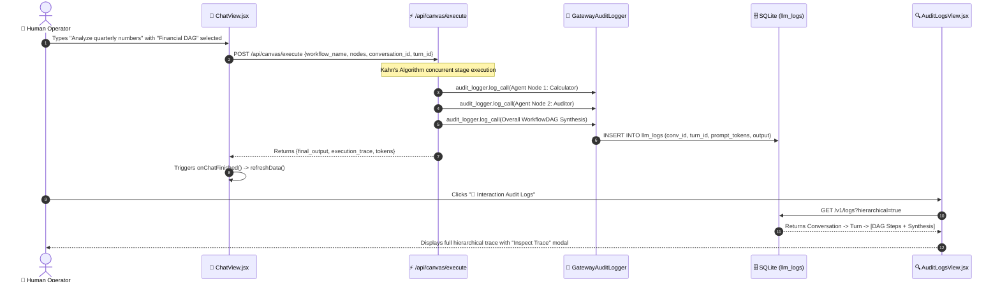

# 📜 07. Audit Logs — Step-by-Step UI Guide

> **Author**: Vijay Donthireddy  
> **Repository**: [vdonthireddy/agentic-ai](https://github.com/vdonthireddy/agentic-ai)  
> **Route**: `http://localhost:8000/logs`  
> **Component Source**: [`webui/src/views/AuditLogsView.jsx`](file:///Users/donthireddy/code/github/agentic-ai/webui/src/views/AuditLogsView.jsx)  
> **Documentation Track**: [Phase 5: Observability, Evals & Benchmarks](./README.md#phase-5-observability-evals--benchmarks)  
> **Navigation**: [🏠 Docs Hub](./README.md) | [⬅️ Prev: 06. Telemetry & Metrics](./06_telemetry_metrics.md) | **Step 16 of 18** | [➡️ Next: 08. Evals & Benchmarks](./08_evals_benchmarks.md)

---

> 🔗 **Related Deep-Dive Modules**:
> - 📊 [06. Telemetry & Metrics](./06_telemetry_metrics.md) — Aggregate metrics calculated from audit log streams.
> - 🏆 [08. 4-Grader Evals & Benchmarks](./08_evals_benchmarks.md) — Automated scoring of agent accuracy across benchmark datasets.
> - 🛡️ [14. Human-in-the-Loop (HITL) Safety](./14_human_in_the_loop_safety.md) — Review cryptographic approval tokens stored in audit records.
> - 🛡️ [17. Security Firewall & Defense](./17_security_firewall_prompt_defense.md) — Review blocked threats and injection attempts.

---

## 🌟 1. What It Does (Plain English & Analogy)

The **Audit Logs** view is the comprehensive forensic recorder and flight data recorder for every single interaction that passes through the system—including standard ReAct chatbot conversations, multi-agent debates, and multi-stage **Workflow DAG pipelines**. It categorizes telemetry into a structured 3-tier hierarchy:
1. **Conversation (`conversation_id`)**: The overarching user session thread.
2. **Turn (`turn_id`)**: A specific user prompt and all downstream reasoning waves.
3. **Request (`request_id`)**: The granular, individual LLM completions and tool invocations.

> 💡 **The Real-World Analogy**:  
> Think of the **Audit Logs** as an airport's **Dual Air Traffic & Black Box Recorder System**. In the past, if a flight flew across standard airspace (ReAct Chat), it was tracked on the main radar; but if it flew through specialized formation test zones (Workflow DAGs), it was logged on an isolated local clipboard. Now, both the primary air routes and formation aerobatics stream into the **same central control tower radar**, with every wingman's altitude and engine thrust recorded in one unified timeline!

---

## 🎯 2. Why & How It Helps (Value Proposition)

### "The Challenge Before" vs. "How This Solves It"

| The Challenge Before | How This Solves It |
|---|---|
| **Disjointed Workflow Logs**: When users selected a Workflow DAG from the AI Agent Chatbot, executions were stored only in `workflow_runs`, causing the Interaction Audit Logs (`llm_logs`) to show zero records. | **Unified Cross-Subsystem Audit Bridge**: `POST /api/canvas/execute` propagates the active chatbot `session_id`, `conversation_id`, and `turn_id`, recording both the overall DAG synthesis and each agent node into `llm_logs`. |
| **Silent Grouping Failures (`conv_default`)**: Legacy or offline calls with null conversation IDs produced 0 turns and 0 requests in the Hierarchical Tree view because SQLite `WHERE conversation_id = 'conv_default'` evaluated to false. | **Resilient `COALESCE` Query Architecture**: Both turn aggregation and request lookups resolve via `COALESCE(conversation_id, session_id, 'conv_default') = ?`, guaranteeing 100% trace capture without data loss. |
| **Untraceable Multi-Turn Conversations**: Debugging turn 5 of a long conversation is impossible when logs are disconnected flat rows. | **Categorized 3-Tier Telemetry Tree**: Visual collapsible tree (**Conversation** &rarr; **Turn** &rarr; **LLM Requests**) with token counters, latencies, and inspection modals. |
| **Compliance & Forensic Blind Spots**: Regulated industries require immutable proof of which agent approved or ran what tool. | **Dual SQLite & JSONL Persistence**: Every prompt, tool input, output, and token count is durably written to SQLite and appended to `gateway_audit.jsonl`. |

---

## 🚀 3. Real-World Step-by-Step Scenario

### Scenario: Executing a Workflow DAG from Chat and Auditing the Full Trace



### Step-by-Step UI Actions:

1. **Open AI Agent Chatbot**: Navigate to **Chat** (`/chat`).
2. **Select a Workflow DAG**: In the **Workflow DAG** dropdown, choose a pipeline (e.g., `⚡ 1-to-3 Parallel Swarm Fork` or `Financial Analysis Pipeline`).
3. **Submit Prompt**: Enter a query like *"Calculate quarterly taxes on $140,000 revenue at 22%"*.
4. **Instant Telemetry Update**: Notice the real-time token badge in the header updating immediately upon DAG completion.
5. **Open Audit Logs**: Navigate to **Interaction Audit Logs** (`/logs`).
6. **Inspect the Hierarchical Tree**:
   - Locate your conversation ID (e.g., `conv_172570...`).
   - Expand **Turn #1** &rarr; inspect **Step 1** (Agent node reasoning), **Step 2** (MCP tool execution), and **Step 3** (Final Workflow DAG synthesis).
   - Click **Inspect Trace** to view raw system prompts, user context, and token usage!

---

## 😄 4. Witty & Relatable Commentary

> *"The author once spent three hours debugging an autonomous pipeline only to realize the workflow was logging to a completely different database table than the chat UI. It felt like shouting into a walkie-talkie while the receiver was tuned to FM radio! With our unified audit bridge, every whisper, tool calculation, and DAG stage reports directly to the main mission log."*

---

## 💻 5. Under-the-Hood Code & API Endpoints

### 1. Unified Payload Propagation in `ChatView.jsx`
```javascript
// webui/src/views/ChatView.jsx
const res = await fetch('/api/canvas/execute', {
  method: 'POST',
  headers: { 'Content-Type': 'application/json' },
  body: JSON.stringify({
    workflow_name: activePipe.name,
    nodes: activePipe.nodes,
    edges: activePipe.edges,
    initial_input: text,
    model: selectedModel,
    session_id: sessionId,
    conversation_id: sessionId,
    turn_id: turnId
  })
});
```

### 2. End-of-Run Audit Telemetry in `ai_agent/router.py`
```python
# ai_agent/router.py
audit_logger.log_call(
    caller_id="chatbot_canvas",
    agent_name=f"WorkflowDAG: {req.workflow_name}",
    session_id=conv_id,
    conversation_id=conv_id,
    turn_id=turn_id,
    model=target_model,
    skill_names=[],
    tool_names=all_tool_names,
    request_messages=[{"role": "user", "content": initial_input}],
    response_content=final_synthesis,
    prompt_tokens=tot_p_toks,
    completion_tokens=tot_c_toks,
    total_tokens=tot_toks,
    latency_ms=duration_ms,
    status="SUCCESS" if not has_denial else "DENIED"
)
```

### 3. Resilient Hierarchical SQL Query in `llm_gateway/db.py`
```python
# llm_gateway/db.py
cursor.execute("""
SELECT 
    COALESCE(turn_id, 'turn_legacy_' || id) as t_id,
    COUNT(*) as request_count,
    SUM(total_tokens) as turn_total_tokens
FROM llm_logs
WHERE (conversation_id = ? OR session_id = ? OR COALESCE(conversation_id, session_id, 'conv_default') = ?)
GROUP BY t_id
ORDER BY turn_started_at ASC
""", (cid, cid, cid))
```

---

## 🧭 Next Step in Your Journey

To measure model accuracy, tool adherence, and hallucination rates with automated multi-grader evaluations:

👉 **[Continue to 08. Evals & Benchmarks Guide](./08_evals_benchmarks.md)**
