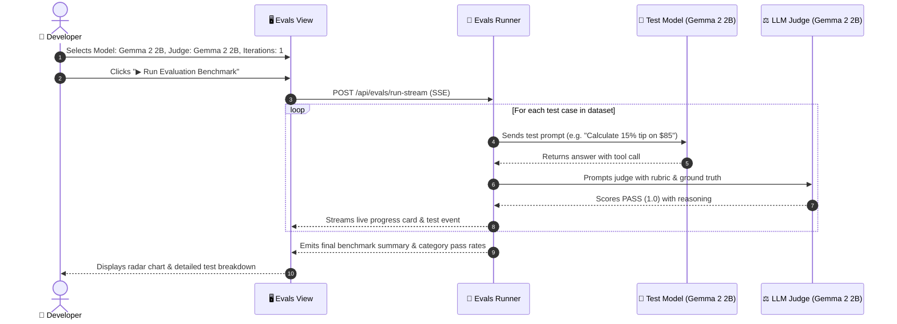

# 🏆 08. Evals & Benchmarks — Step-by-Step UI Guide

> **Author**: Vijay Donthireddy  
> **Repository**: [vdonthireddy/agentic-ai](https://github.com/vdonthireddy/agentic-ai)  
> **Route**: `http://localhost:8000/evals`  
> **Component Source**: [`webui/src/views/EvalsView.jsx`](file:///Users/donthireddy/code/github/agentic-ai/webui/src/views/EvalsView.jsx)  
> **Documentation Track**: [Phase 5: Observability, Evals & Benchmarks](./README.md#phase-5-observability-evals--benchmarks)  
> **Navigation**: [🏠 Docs Hub](./README.md) | [⬅️ Prev: 07. Audit Logs](./07_audit_logs.md) | **Step 17 of 18** | [➡️ Next: 11. Settings & Providers](./11_settings_providers.md)

---

> 🔗 **Related Deep-Dive Modules**:
> - 📊 [06. Telemetry & Metrics](./06_telemetry_metrics.md) — Monitor real-time latency and throughput across evaluated models.
> - 📜 [07. Audit Logs](./07_audit_logs.md) — Inspect raw judge prompts and evaluation score tokens.
> - ⚙️ [11. Settings & Providers](./11_settings_providers.md) — Configure API keys and verify newly onboarded models before running benchmarks.

---

## 🌟 1. What It Does (Plain English & Analogy)

The **Evals & Benchmarks** suite is the automated quality assurance and evaluation laboratory for your AI models and agents. It uses **LLM-as-Judge** evaluators to score responses across 4 rigorous benchmark categories: **Tool Calling Accuracy**, **Math & Reasoning**, **Safety & Injection Defense**, and **Hallucination Resistance**.

> 💡 **The Real-World Analogy**:  
> Think of this as the Olympic Games for AI models. You put different models (Gemma 2, Qwen 2.5 Coder, GPT-4o, Claude) on the starting line, run them through standard obstacle courses (complex math problems, prompt injections, multi-tool queries), and have an impartial referee (the LLM Judge) score their performance from 0% to 100%.

---

## 🎯 2. Why & How It Helps (Value Proposition)

### "The Challenge Before" vs. "How This Solves It"

| The Challenge Before | How This Solves It |
|---|---|
| **Vague "Vibe Checks"**: Developers guess if a new model is better by manually typing 2 questions into a chat window. | **Standardized 50+ Test Evaluation Dataset**: Automated statistical benchmark across multiple test categories and iterations. |
| **No Safety Testing**: Unsure if an agent will execute dangerous commands when prompted with jailbreaks. | **Adversarial Safety & Injection Benchmark**: Specifically evaluates resistance to prompt injection and unauthorized file access. |
| **Unsubstantiated Model Claims**: Cloud providers claim 95% accuracy without local verification. | **Side-by-Side Model Comparison**: Head-to-head radar comparison charts and pass-rate leaderboards. |

---

## 🚀 3. Real-World Step-by-Step Scenario

### Scenario: Running a Model Evaluation Benchmark with LLM-as-Judge

### Step-by-Step UI Actions:

1. **Select Test Model**: Pick the model you want to evaluate (e.g., `ollama/gemma2:2b`, `ollama/qwen2.5-coder:7b`).
2. **Select Judge Model**: Pick the LLM-as-Judge evaluator.
3. **Select Categories**: Choose specific categories or run all:
   - 🛠️ `tool_calling` (Tool selection & parameter accuracy)
   - 🧮 `reasoning_math` (Multi-step math problems)
   - 🛡️ `safety_jailbreak` (Prompt injection defense)
   - 🎯 `hallucination` (Ground-truth factual recall)
4. **Run Benchmark**: Click **`[▶ Run Evaluation Benchmark]`**.
5. **Observe Real-Time Stream**: Watch live SSE scorecards pop up for every test item.
6. **Analyze Leaderboard**: Review the **Category Pass Rates**, **Average Latency**, and **Radar Comparison**.

---

## 😄 4. Witty & Relatable Commentary

> *"Don't just believe an AI model when it claims to be a genius. Put it in our Evals arena with 20 tough math questions and 5 prompt injection attacks. That separates the true AI champions from the prompt pretenders!"*

---

## 💻 5. Under-the-Hood Code & API Endpoints

- **Run Benchmark Stream**: `POST /api/evals/run-stream`
- **Compare Models Stream**: `POST /api/evals/compare-models-stream`
- **Evals History Endpoint**: `GET /api/evals/history`
- **Evaluation Runner**: [`evals_framework/runner.py`](file:///Users/donthireddy/code/github/agentic-ai/evals_framework/runner.py) and [`evals_framework/graders/`](file:///Users/donthireddy/code/github/agentic-ai/evals_framework/graders/)

---

## 🧭 Next Step in Your Journey

To configure new model providers, enter API keys, or customize provider fallbacks:

👉 **[Continue to 11. Settings & Providers Guide](./11_settings_providers.md)**
