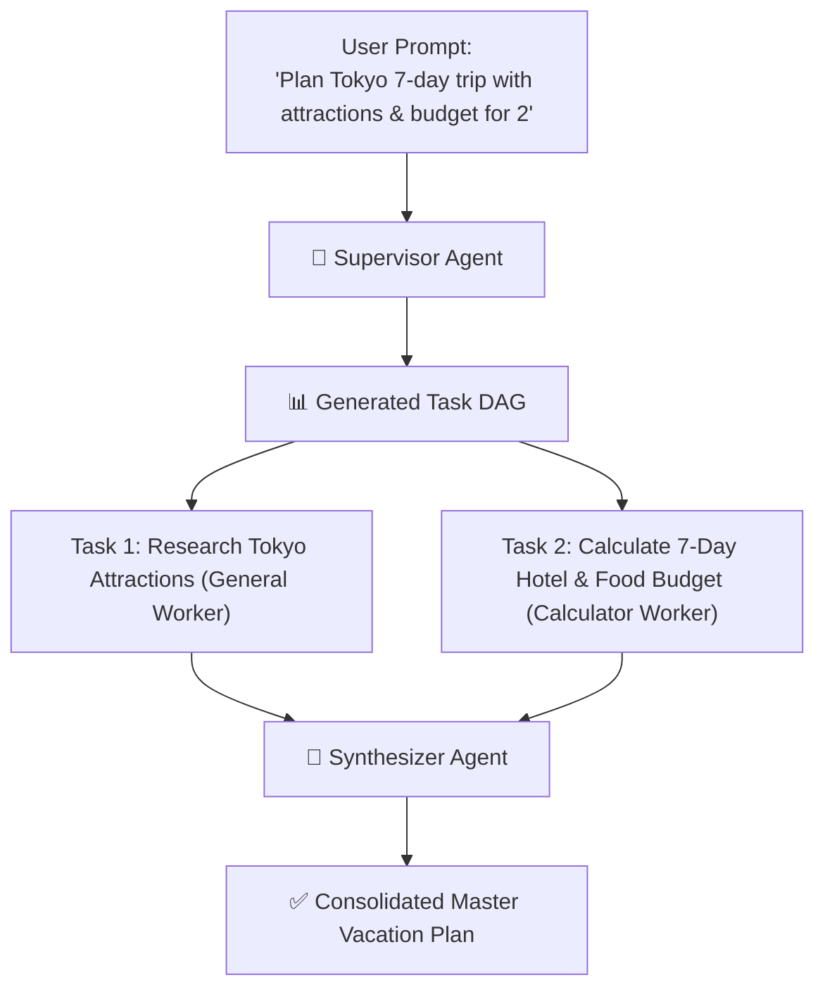
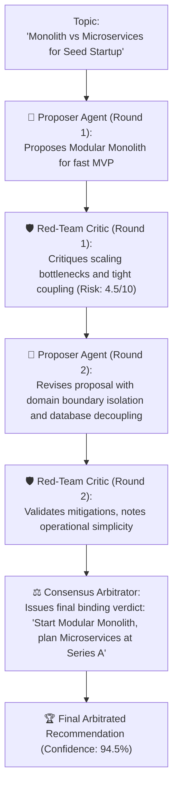

# 🤖 09. Multi-Agent Orchestrator — Step-by-Step UI Guide

> **Author**: Vijay Donthireddy  
> **Route**: `http://localhost:8000/orchestrator` (or `http://localhost:8000/debate`)  
> **Component Source**: [`webui/src/views/OrchestratorView.jsx`](file:///Users/donthireddy/code/github/agentic-ai/webui/src/views/OrchestratorView.jsx)  
> **Backend Engine**: [`ai_agent/orchestrator.py`](file:///Users/donthireddy/code/github/agentic-ai/ai_agent/orchestrator.py) & [`ai_agent/debate.py`](file:///Users/donthireddy/code/github/agentic-ai/ai_agent/debate.py)

---

## 🌟 1. What It Does (Plain English & Analogy)

The **Multi-Agent Orchestrator** coordinates teams of specialized AI agents working together on complex missions. Rather than asking a single LLM to guess everything in one monolithic prompt, the orchestrator gives you two battle-tested collaboration patterns:

1. **📋 Hierarchical Task Decomposition**: A **Supervisor Agent** breaks a complex user prompt into a Directed Acyclic Graph (DAG) of parallel sub-tasks, assigns each sub-task to a specialized worker agent, and synthesizes the outputs into a unified master report.
2. **⚖️ Multi-Agent Debate Federation**: A **Proposer Agent** and an adversarial **Red-Team Critic** cross-examine and stress-test an architectural or strategic proposition across iterative rounds, before an impartial **Consensus Arbitrator** delivers a final verified verdict.

> 💡 **The Real-World Analogies**:  
> - **Hierarchical Decomposition**: Think of a **General Contractor** renovating a house. The contractor doesn't lay the pipes, paint the walls, and wire the electricity alone. Instead, the contractor draws up a master blueprint (the DAG), hires a licensed electrician, a plumber, and a carpenter to work in parallel, and presents you with a completed house.  
> - **Debate Federation**: Think of a **Courtroom Trial**. The Defense Attorney (Proposer) presents the best possible argument, the Prosecutor (Adversarial Critic) probes every loophole, and the Judge (Arbitrator) delivers a fair, airtight verdict based on the evidence.

---

## 🎯 2. Why & How It Helps (Value Proposition)

### "The Challenge Before" vs. "How This Solves It"

| The Challenge Before | How This Solves It |
|---|---|
| **Monolithic Prompt Failure**: Asking one LLM to research, budget, calculate, and format a 10-page plan causes hallucinations and dropped instructions. | **Supervisor Task Decomposition**: Breaks complex missions into distinct, focused sub-tasks executed by specialized worker agents in parallel. |
| **Confirmation Bias & Blind Spots**: A single model confidently asserts flawed technical architectures without scrutiny. | **Adversarial Red-Team Critique**: The Critic agent is specifically prompted to uncover edge-case failures, hidden costs, and security risks. |
| **No Consensus Metrics**: Hard to know if an LLM recommendation is speculative or high-confidence. | **Arbitrated Consensus Scoring**: Provides a quantitative confidence percentage (e.g. 94.5%) with resolved vulnerability matrices. |

---

## 🚀 3. Concrete Step-by-Step Real-World Examples

### 📋 Example 1: Hierarchical Task Decomposition in Action

#### 🎯 Scenario: Planning a Complete 7-Day Vacation & Budget
**User Goal**: *"Research the best attractions in Tokyo, calculate a detailed 7-day budget for 2 travelers, and create a daily itinerary."*



#### Step-by-Step UI Instructions:
1. **Navigate to the Orchestrator**: Click **Multi-Agent Orchestrator** in the left sidebar (`http://localhost:8000/orchestrator`).
2. **Select the Pattern**: Click the **`📋 Hierarchical Task Decomposition`** button at the top.
3. **Enter the Prompt**: Type into the description box:
   ```text
   Research top cultural attractions in Tokyo, calculate a 7-day budget for 2 people with hotel ($150/night) and food ($60/day/person), and synthesize a daily itinerary.
   ```
4. **Configure Parameters**:
   - **Model**: Select `ollama/gemma2:2b` (or your active default model).
   - **Max Workers**: Set to `4` for parallel execution.
5. **Click `[🚀 Run Task Decomposition]`**:
   - The **📊 Task DAG** appears immediately, showing decomposing sub-tasks (`t1: Research attractions`, `t2: Calculate budget`).
   - The **📡 Live Events** terminal streams real-time SSE progress (`worker_start`, `worker_complete`).
   - The **✅ Orchestration Result** card displays the final synthesized master plan combining exact calculations ($1,050 hotel + $840 food = $1,890 total) and attraction summaries.

---

### ⚖️ Example 2: Multi-Agent Debate Federation in Action

#### 🎯 Scenario: Architectural Decision for a Seed-Stage Startup
**User Goal**: *"Evaluate architectural tradeoffs between Monolith and Microservices for our seed-stage startup."*



#### Step-by-Step UI Instructions:
1. **Navigate to the Orchestrator**: Click **Multi-Agent Orchestrator** in the left sidebar.
2. **Select the Pattern**: Click the **`⚖️ Multi-Agent Debate Federation`** button at the top.
3. **Enter Debate Topic**:
   ```text
   Evaluate architectural tradeoffs between Monolith and Microservices for our seed-stage startup
   ```
4. **Configure Parameters**:
   - **Debate Model**: Select `ollama/gemma2:2b`.
   - **Rounds**: Choose `2 Rounds (Balanced)`.
5. **Click `[⚖️ Start Multi-Agent Debate]`**:
   - The button shows `⚖️ Debating & Cross-Examining...` as the agents run multi-round inference.
   - **🏆 Consensus Arbitrator Verdict**: Appears at the top with a **94.5% Confidence Badge** and definitive actionable next steps.
   - **📜 Cross-Examination Rounds History**: Expands below, revealing the Proposer's initial stance, the Critic's adversarial risk scoring (`Risk Score: 4.5/10`), and the refined rebuttal.

---

## 😄 4. Witty & Relatable Commentary

> *"Asking a single AI model to design your entire production architecture is like asking one person to be the architect, the building inspector, and the fire marshal all at once. They'll approve their own blueprint every single time! Multi-Agent Debate forces your AI to undergo rigorous red-team cross-examination before a single line of code is written."*

---

## 💻 5. Under-the-Hood Code & API Signatures

### 1. Hierarchical Decomposition Stream Endpoint
```python
# Route: POST /api/orchestrator/run-stream
@app.post("/api/orchestrator/run-stream")
async def run_orchestrator_stream(req: OrchestratorRequest):
    """Streams live DAG creation and worker completion events."""
    supervisor = SupervisorAgent(
        gateway_url=f"http://localhost:{config.port}",
        model=req.model or config.default_model,
        max_workers=req.max_workers or 4,
        on_event_callback=callback
    )
    result = await supervisor.run(req.prompt)
```

### 2. Multi-Agent Debate Execution Endpoint
```python
# Route: POST /api/debate
@app.post("/api/debate")
async def run_multi_agent_debate(req: DebateRequest):
    """Executes multi-round adversarial cross-examination and arbitrator synthesis."""
    # Proposer -> Critic -> Revision -> Arbitrator
    # Returns DebateResult with rounds, risk scores, and consensus verdict
```

- **Supervisor Source**: [`ai_agent/orchestrator.py`](file:///Users/donthireddy/code/github/agentic-ai/ai_agent/orchestrator.py)
- **Debate Protocol Source**: [`ai_agent/debate.py`](file:///Users/donthireddy/code/github/agentic-ai/ai_agent/debate.py)
- **Frontend View**: [`webui/src/views/OrchestratorView.jsx`](file:///Users/donthireddy/code/github/agentic-ai/webui/src/views/OrchestratorView.jsx)
