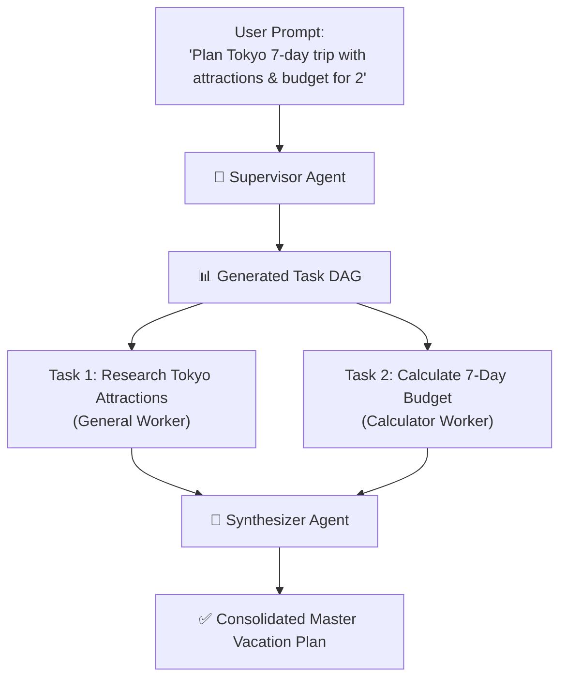

# 🤖 09. Multi-Agent Orchestrator — Step-by-Step UI Guide

> **Author**: Vijay Donthireddy  
> **Repository**: [vdonthireddy/agentic-ai](https://github.com/vdonthireddy/agentic-ai)  
> **Route**: `http://localhost:8000/orchestrator` (or `http://localhost:8000/debate`)  
> **Component Source**: [`webui/src/views/OrchestratorView.jsx`](file:///Users/donthireddy/code/github/agentic-ai/webui/src/views/OrchestratorView.jsx)  
> **Backend Engine**: [`ai_agent/orchestrator.py`](file:///Users/donthireddy/code/github/agentic-ai/ai_agent/orchestrator.py) & [`ai_agent/debate.py`](file:///Users/donthireddy/code/github/agentic-ai/ai_agent/debate.py)  
> **Documentation Track**: [Phase 3: Visual Workflows & Multi-Agent Swarms](./README.md#phase-3-visual-workflows--multi-agent-swarms)  
> **Navigation**: [🏠 Docs Hub](./README.md) | [⬅️ Prev: 13. Parallel Swarms & DAGs](./13_parallel_agent_execution_swarms.md) | **Step 10 of 18** | [➡️ Next: 12. Multi-Agent Debate](./12_multi_agent_debate_protocol.md)

---

> 🔗 **Related Deep-Dive Modules**:
> - ⚖️ [12. Multi-Agent Debate Protocol](./12_multi_agent_debate_protocol.md) — Deep dive into Proposer vs. Red-Team Critic adversarial rounds.
> - 🔱 [02. Workflow Canvas (DAG)](./02_workflow_canvas_dag.md) — The visual 2D graph editor for manually constructed pipelines.
> - ⚡ [13. Parallel Swarms & DAG Execution](./13_parallel_agent_execution_swarms.md) — Asynchronous worker pools and topological sorting mechanics.

---

## 🌟 1. What It Does (Plain English & Analogy)

The **Multi-Agent Orchestrator** coordinates teams of specialized AI agents working together on complex missions. Rather than asking a single LLM to guess everything in one monolithic prompt, the orchestrator gives you two battle-tested collaboration patterns:

1. **📋 Hierarchical Task Decomposition**: A **Supervisor Agent** breaks a complex user prompt into a Directed Acyclic Graph (DAG) of parallel sub-tasks, assigns each sub-task to a specialized worker agent, and synthesizes the outputs into a unified master report.
2. **⚖️ Multi-Agent Debate Federation**: A **Proposer Agent** and an adversarial **Red-Team Critic** cross-examine and stress-test an architectural or strategic proposition across iterative rounds, before an impartial **Consensus Arbitrator** delivers a final verified verdict.

> 💡 **The Real-World Analogies**:  
> - **Hierarchical Decomposition**: Think of a **General Contractor** renovating a house. The contractor doesn't lay the pipes, paint the walls, and wire the electricity alone. Instead, the contractor draws up a master blueprint (the DAG), hires a licensed electrician, a plumber, and a carpenter to work in parallel, and presents you with a completed house.  
> - **Debate Federation**: Think of a **Courtroom Trial**. The Defense Attorney (Proposer) presents the best possible argument, the Prosecutor (Adversarial Critic) probes every loophole, and the Judge (Arbitrator) delivers a fair, airtight verdict based on the evidence.

---

## 🎯 2. Why & How It Helps (Value Proposition)

### "The Challenge Before" vs. "How This Solves It"

| The Challenge Before | How This Solves It |
|---|---|
| **Monolithic Prompt Failure**: Asking one LLM to research, budget, calculate, and format a 10-page plan causes hallucinations and dropped instructions. | **Supervisor Task Decomposition**: Breaks complex missions into distinct, focused sub-tasks executed by specialized worker agents in parallel. |
| **Confirmation Bias & Blind Spots**: A single model confidently asserts flawed technical architectures without scrutiny. | **Adversarial Red-Team Critique**: The Critic agent is specifically prompted to uncover edge-case failures, hidden costs, and security risks. |
| **No Consensus Metrics**: Hard to know if an LLM recommendation is speculative or high-confidence. | **Arbitrated Consensus Scoring**: Provides a quantitative confidence percentage (e.g. 94.5%) with resolved vulnerability matrices. |

---

## 🚀 3. Concrete Step-by-Step Real-World Examples

### 📋 Example 1: Hierarchical Task Decomposition in Action

#### 🎯 Scenario: Planning a Complete 7-Day Vacation & Budget
**User Goal**: *"Research the best attractions in Tokyo, calculate a detailed 7-day budget for 2 travelers, and create a daily itinerary."*

#### Step-by-Step UI Actions:
1. Navigate to **`http://localhost:8000/orchestrator`**.
2. Click the **`📋 Hierarchical Task Decomposition`** tab.
3. Select an execution template (e.g., *✈️ Vacation & Budget Planner* or *🛒 E-Commerce Product Launch*).
4. Select your preferred **Worker Model** and **Concurrency Limit (Max Workers: 4)**.
5. Click **`[🚀 Decompose & Execute Mission]`**:
   - The UI streams the Supervisor's decomposed DAG in real-time.
   - Worker progress bars illuminate as parallel tasks complete.
   - The final Synthesizer report renders with full sources and cost breakdown.

---

### ⚖️ Example 2: Multi-Agent Debate Federation in Action

#### 🎯 Scenario: Evaluating Architecture Migration (PostgreSQL vs SQLite)

#### Step-by-Step UI Actions:
1. Click the **`⚖️ Multi-Agent Debate Federation`** tab.
2. Select a debate preset: *"Architecture Migration: Monolith to Microservices vs Modular Monolith"*.
3. Choose **Rounds**: `2 Rounds (Balanced)`.
4. Click **`[⚖️ Start Multi-Agent Debate]`**:
   - Watch the Proposer present arguments, the Critic probe edge cases, and the Arbitrator deliver a consensus verdict with confidence score (e.g., `94.5%`).

---

## 😄 4. Witty & Relatable Commentary

> *"Asking a single AI model to design your entire production architecture is like asking one person to be the architect, the building inspector, and the fire marshal all at once. They'll approve their own blueprint every single time! Multi-Agent Debate forces your AI to undergo rigorous red-team cross-examination before a single line of code is written."*

---

## 💻 5. Under-the-Hood Code & API Signatures

- **Hierarchical Stream Endpoint**: `POST /api/orchestrator/run-stream`
- **Debate Execution Endpoint**: `POST /api/debate`
- **Supervisor Source**: [`ai_agent/orchestrator.py`](file:///Users/donthireddy/code/github/agentic-ai/ai_agent/orchestrator.py)
- **Debate Protocol Source**: [`ai_agent/debate.py`](file:///Users/donthireddy/code/github/agentic-ai/ai_agent/debate.py)
- **Frontend View**: [`webui/src/views/OrchestratorView.jsx`](file:///Users/donthireddy/code/github/agentic-ai/webui/src/views/OrchestratorView.jsx)

---

## 🧭 Next Step in Your Journey

To master the adversarial cross-examination math and confidence scoring behind the Debate Federation:

👉 **[Continue to 12. Multi-Agent Debate Protocol Guide](./12_multi_agent_debate_protocol.md)**
