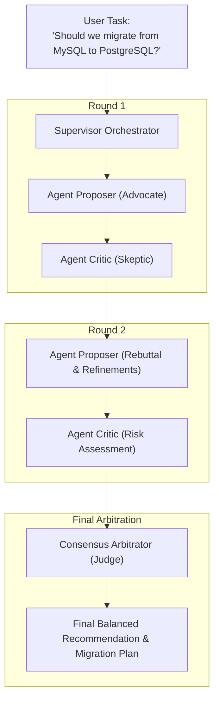

# 🤖 09. Multi-Agent Orchestrator — Step-by-Step UI Guide

> **Author**: Vijay Donthireddy  
> **Route**: `http://localhost:8000/orchestrator` (or `http://localhost:8000/debate`)  
> **Component Source**: [`webui/src/views/OrchestratorView.jsx`](file:///Users/donthireddy/code/github/agentic-ai/webui/src/views/OrchestratorView.jsx)

---

## 🌟 1. What It Does (Plain English & Analogy)

The **Multi-Agent Orchestrator** enables advanced multi-agent collaboration patterns including **Hierarchical Task Decomposition** and **Multi-Agent Debate & Consensus Federation**. Multiple specialized AI agents (e.g. Proposer, Critic, Fact-Checker, and Arbitrator) critique and refine each other's arguments across multiple rounds to produce balanced, high-accuracy conclusions.

> 💡 **The Real-World Analogy**:  
> Think of a courtroom trial or an executive board meeting. Instead of a single person making a high-stakes decision alone, an **Advocate** presents the case, a **Skeptic/Critic** challenges the flaws, a **Fact-Checker** audits the data, and an **Impartial Judge (Arbitrator)** issues the final verdict based on consensus.

---

## 🎯 2. Why & How It Helps (Value Proposition)

### "The Challenge Before" vs. "How This Solves It"

| The Challenge Before | How This Solves It |
|---|---|
| **Single-Model Blind Spots**: A single model's biases and reasoning gaps go unchallenged. | **Adversarial Multi-Round Debate**: Critic agents systematically identify weaknesses, logical fallacies, and risks in the proposer's argument. |
| **Monolithic Task Overload**: Large complex tasks fail because one prompt tries to do everything. | **Hierarchical Supervisor Decomposition**: A supervisor breaks tasks into sub-goals, delegates to specialist worker agents, and aggregates results. |
| **No Consensus Scoring**: Unclear how much the agents actually agreed on the final answer. | **Statistical Consensus & Agreement Score**: Quantifies agreement metrics (e.g. 92% consensus) with explicit arbitration rationale. |

---

## 🚀 3. Real-World Step-by-Step Scenario

### Scenario: Running a 3-Round Debate on "Should we migrate from MySQL to PostgreSQL?"

### Step-by-Step UI Actions:

1. **Select Orchestration Pattern**:
   - **Multi-Agent Debate Federation**: Adversarial round-based debate with consensus scoring.
   - **Hierarchical Task Decomposition**: Supervisor delegating to parallel specialist workers.
2. **Configure Parameters**:
   - **Debate Rounds**: Select 1, 2, or 3 iterative rounds.
   - **Supervisor / Agent Models**: Pick models for Proposer, Critic, and Arbitrator.
3. **Enter Task / Question**: Type your complex topic (e.g., *"Evaluate architectural tradeoffs between Monolith and Microservices for our seed-stage startup"*).
4. **Click `[▶ Start Multi-Agent Orchestration]`**.
5. **Watch the Live Feed**:
   - Round 1 Proposer argument card renders in real time.
   - Round 1 Critic rebuttal card challenges specific assumptions.
   - Round 2 refinements address the critique.
   - The **Arbitrator Verdict Card** appears with the final balanced synthesis and consensus agreement percentage.

---

## 😄 4. Witty & Relatable Commentary

> *"Two heads are better than one, especially when both heads are AI agents trying to prove each other wrong! By the time they finish arguing in Round 3, only the most airtight, battle-tested answer survives."*

---

## 💻 5. Under-the-Hood Code & API Endpoints

- **Debate Orchestrator Endpoint**: `POST /api/debate/run`
- **Supervisor Workflow Endpoint**: `POST /api/orchestrator/run`
- **Orchestration Module**: [`ai_agent/orchestrator.py`](file:///Users/donthireddy/code/github/agentic-ai/ai_agent/orchestrator.py) and [`ai_agent/debate_engine.py`](file:///Users/donthireddy/code/github/agentic-ai/ai_agent/debate_engine.py)
