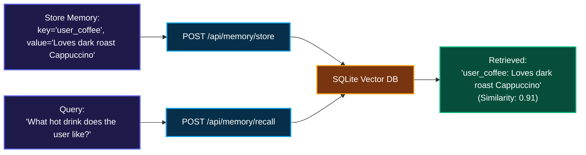

# 🧠 10. Memory Explorer — Step-by-Step UI Guide

> **Author**: Vijay Donthireddy  
> **Route**: `http://localhost:8000/memory`  
> **Component Source**: [`webui/src/views/MemoryView.jsx`](file:///Users/donthireddy/code/github/agentic-ai/webui/src/views/MemoryView.jsx)

---

## 🌟 1. What It Does (Plain English & Analogy)

The **Memory Explorer** is the long-term cognitive memory vault for your AI agents. It combines **Episodic Key-Value Memory**, **Vector Semantic Similarity Search**, and **Knowledge Graph Triples** (`Subject - Predicate - Object`) so agents remember user preferences, project facts, and prior conversations across sessions.

> 💡 **The Real-World Analogy**:  
> Standard chatbots suffer from digital amnesia: the second you close the browser, they forget your name, your favorite programming language, and your project details. The **Memory Explorer** is the agent's digital brain journal. When you tell it *"My favorite coffee is Cappuccino"*, it writes it in its journal and recalls it weeks later when you ask for morning recommendations.

---

## 🎯 2. Why & How It Helps (Value Proposition)

### "The Challenge Before" vs. "How This Solves It"

| The Challenge Before | How This Solves It |
|---|---|
| **Session Amnesia**: Having to repeat your project tech stack and user preferences on every new chat. | **Persistent Cross-Session Memory**: SQLite + Vector embedding store persists facts permanently across sessions. |
| **Keyword Search Fragility**: Searching for "beverage preference" fails if the memory only has the word "coffee". | **Dense Semantic Vector Search**: Embeddings-based similarity search retrieves semantically relevant memories even with different vocabulary. |
| **No Structured Relationship Mapping**: Agents lose track of who reports to who or which components depend on what. | **Knowledge Graph Triples**: Stores entity relationships (`[Vijay] -> [leads] -> [Agentic AI Project]`). |

---

## 🚀 3. Real-World Step-by-Step Scenario

### Scenario: Storing a User Preference and Performing Semantic Recall

### Step-by-Step UI Actions:

1. **Store a New Memory**:
   - In the **Store New Memory** card:
     - **Key / Subject**: `user_favorite_drink`
     - **Value / Statement**: `Prefers Cappuccino with oat milk`
     - **Category / Namespace**: `preferences`
   - Click **`💾 Save to Memory Vault`**.
2. **Perform Semantic Query**:
   - In the **Semantic Search** box, type: *"What should I order at the cafe?"*
   - Click **`🔍 Semantic Recall`**.
   - View the matched memory with its similarity relevance score.
3. **Inspect Knowledge Graph Triples**:
   - Switch to the **Knowledge Graph** tab to explore entity relationships (`Subject -> Relation -> Object`).
4. **Delete or Clean Up**: Click the **`🗑️ Delete`** button on any obsolete memory card.

---

## 😄 4. Witty & Relatable Commentary

> *"A chatbot with memory is like a great barista who already knows your order the second you walk through the door. A chatbot without memory is like having to re-introduce yourself every 30 seconds!"*

---

## 💻 5. Under-the-Hood Code & API Endpoints

- **Recall Endpoint**: `POST /api/memory/recall`
- **Store Endpoint**: `POST /api/memory/store`
- **List All Memories**: `GET /api/memory/list`
- **Delete Endpoint**: `DELETE /api/memory/{key}`
- **Memory Module**: [`mcp_server/tools/memory_tools.py`](file:///Users/donthireddy/code/github/agentic-ai/mcp_server/tools/memory_tools.py)
