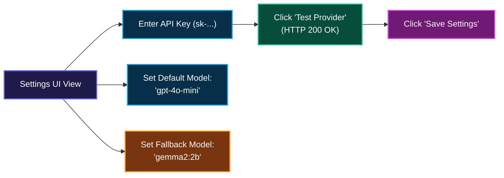

# ⚙️ 11. Settings & Providers — Step-by-Step UI Guide

> **Author**: Vijay Donthireddy  
> **Route**: `http://localhost:8000/settings`  
> **Component Source**: [`webui/src/views/SettingsView.jsx`](file:///Users/donthireddy/code/github/agentic-ai/webui/src/views/SettingsView.jsx)

---

## 🌟 1. What It Does (Plain English & Analogy)

The **Settings & Providers** view is the central configuration engine for your multi-provider LLM Gateway. Here you can configure API keys, customize endpoint URLs (e.g. custom Ollama hosts, LiteLLM proxy), select default and fallback models, adjust rate limits, and test provider connectivity with live round-trip pings.

> 💡 **The Real-World Analogy**:  
> Think of the **Settings & Providers** view like the universal power adapter and fuse box in an international tech lab. Whether you're plugging in local solar power (free local Ollama models) or commercial high-voltage power grids (OpenAI, Anthropic, Gemini, Groq), this panel lets you wire, test, and switch power sources seamlessly.

---

## 🎯 2. Why & How It Helps (Value Proposition)

### "The Challenge Before" vs. "How This Solves It"

| The Challenge Before | How This Solves It |
|---|---|
| **Single-Provider Vendor Lock-In**: If OpenAI goes down, your entire application crashes. | **Intelligent Automatic Fallback Routing**: If primary cloud model fails, automatically routes to secondary provider or local Ollama. |
| **Scattered Configuration Files**: Having API keys spread across multiple `.env` and `.json` files leads to misconfigurations. | **Unified Multi-Provider Control Center**: Single UI to configure keys for Ollama, OpenAI, Anthropic, Gemini, Groq, Mistral, DeepSeek. |
| **Unverified Key Setup**: Unclear if an API key is valid until an application crashes in production. | **Live Provider Connectivity Pings**: One-click **"⚡ Test Provider"** button verifies authorization and latency instantly. |

---

## 🚀 3. Real-World Step-by-Step Scenario

### Scenario: Adding an OpenAI API Key & Setting Fallback to Local Gemma 2

### Step-by-Step UI Actions:

1. **Open Settings**: Click **Settings & Providers** at the bottom of the left sidebar.
2. **Configure Providers**:
   - **Ollama Host URL**: e.g., `http://localhost:11434` or `http://host.docker.internal:11434`.
   - **OpenAI API Key**: Enter your `sk-...` key.
   - **Anthropic Claude Key**: Enter your `sk-ant-...` key.
   - **Google Gemini Key**: Enter your Gemini AI key.
   - **Groq / DeepSeek / Mistral Keys**: Add fast inference provider keys.
3. **Set Model Routing Preferences**:
   - **Default Gateway Model**: Select your preferred primary model (e.g., `ollama/gemma2:2b` or `openai/gpt-4o-mini`).
   - **Automatic Fallback Model**: Select your local safety net model if the cloud provider errors or times out.
4. **Test Live Connectivity**:
   - Click the **`⚡ Test`** button next to any provider.
   - A green checkmark badge appears with verified latency.
5. **Save Changes**: Click the blue **`[💾 Save Configuration]`** button.

---

## 😄 4. Witty & Relatable Commentary

> *"A resilient AI engineer never relies on just one provider. When one cloud service gets a hiccup, our gateway flips the switch to local Ollama before your users even finish blinking!"*

---

## 💻 5. Under-the-Hood Code & API Endpoints

- **Get Config Endpoint**: `GET /api/config`
- **Update Config Endpoint**: `POST /api/config`
- **Gateway Health Check**: `GET /health`
- **Configuration Module**: [`llm_gateway/config.py`](file:///Users/donthireddy/code/github/agentic-ai/llm_gateway/config.py) and [`llm_gateway/router.py`](file:///Users/donthireddy/code/github/agentic-ai/llm_gateway/router.py)
