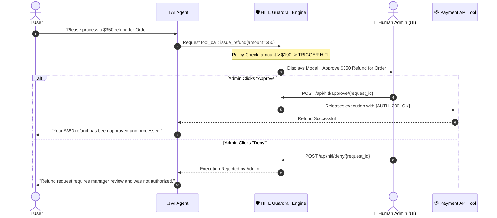
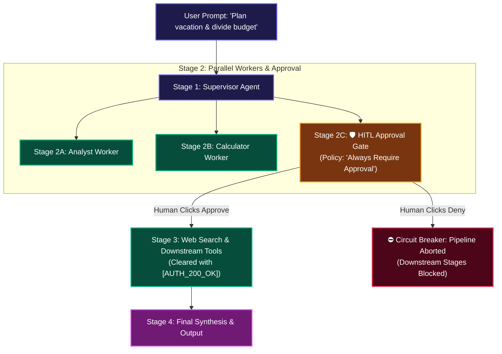

# 🛡️ 14. Human-in-the-Loop (HITL) Safety & Policy Guardrails

> **Author**: Vijay Donthireddy  
> **Route**: All Views (Chatbot, Workflow Canvas, Tools)  
> **Component Sources**: [`mcp_server/hitl.py`](file:///Users/donthireddy/code/github/agentic-ai/mcp_server/hitl.py), [`webui/src/views/ChatView.jsx`](file:///Users/donthireddy/code/github/agentic-ai/webui/src/views/ChatView.jsx), [`llm_gateway/app.py`](file:///Users/donthireddy/code/github/agentic-ai/llm_gateway/app.py)

---

## 🌟 1. What It Does (Plain English & Analogy)

The **Human-in-the-Loop (HITL) Safety & Guardrails Engine** acts as an intelligent supervisor and safety checkpoint. Whenever an autonomous agent or a workflow pipeline attempts a high-stakes action (such as issuing a customer refund over $100, deleting files, modifying production databases, or reaching an explicit DAG approval gate), the engine intercepts execution, pauses the pipeline, and displays an interactive approval modal for human verification before proceeding.

> 💡 **The Real-World Analogy**:  
> Think of the "Dual-Key System" in a bank vault or a commercial aircraft cockpit. The pilot can fly the plane on autopilot, but turning off the engines or dumping fuel requires explicit human confirmation and a physical switch flip.

---

## 🎯 2. Why & How It Helps (Value Proposition)

### "The Challenge Before" vs. "How This Solves It"

| The Challenge Before | How This Solves It |
|---|---|
| **Runaway Autonomous Damage**: Agents accidentally executing destructive commands (e.g., `DELETE FROM users` or issuing large refunds). | **Configurable Policy Interception**: High-risk actions are automatically trapped and held in a pending state until a human signs off. |
| **Pipeline Continues After Denial**: Denying an action still leaves downstream pipeline stages running. | **Strict Circuit Breaker**: Denying any approval gate immediately aborts the pipeline and blocks all downstream stages from executing. |
| **Complete System Freezing**: Pausing the entire server for human approval blocks other users and threads. | **Asynchronous Non-Blocking Queues**: Uses async event loops so other agent threads continue while waiting for approval on specific request IDs. |
| **No Audit of Approved Actions**: Unclear who approved an agent's destructive action. | **Cryptographic Approval Tokens**: Generates unique `[AUTH_200_OK]` tokens with timestamps and approver identities stored in the audit DB. |

---

## 🚀 3. Real-World Step-by-Step Scenarios

### Mode A: Intercepting a Protected Tool Action in Standard Chat

---

### Mode B: Human Approval Gate in a Visual Workflow Canvas DAG

---

### 📋 Step-by-Step UI Guide

#### 1. Configuring HITL on the Visual Canvas (`/canvas`)
1. Drag an **HITL Gate Node** onto the canvas.
2. In the **Approval Policy** dropdown, choose your safety threshold:
   - `🔒 Always Require Approval`: Halts every single run for human confirmation.
   - `💰 Amount > $100`: Triggers only on financial operations over $100.
   - `🗑️ File Deletions / Writes`: Triggers when files are modified or deleted.
3. Wire the gate between upstream data sources and downstream execution stages.
4. Click **`[💾 Save Pipeline]`**.

#### 2. Running with Live Prompts in the Chatbot (`/chat`)
1. Select your saved pipeline in the **`🔱 Workflow DAG`** dropdown.
2. Type your prompt and click **Send**.
3. When the pipeline hits the HITL gate:
   - The glowing **🛡️ Human Approval Required** modal appears in the center of the screen.
   - It displays the prompt, node ID, and policy reason.

#### 3. Handling the Approval Modal
* **Click `[✅ Approve Action]`**:
  - The gate issues token `[AUTH_200_OK]`.
  - The remaining downstream stages execute seamlessly to completion.
* **Click `[❌ Deny Action]`**:
  - The DAG **halts immediately**.
  - All downstream nodes are **blocked**.
  - A red security alert banner explains that execution was safely aborted by the operator.

---

## 😄 4. Witty & Relatable Commentary

> *"An autonomous agent without HITL guardrails is like giving your credit card to your toddler and walking out of the room. It only takes 30 seconds before you've bought 500 cases of candy. Keep the keys in human hands!"*

---

## 💻 5. Under-the-Hood Code & API Endpoints

- **Pending Approvals Endpoint**: `GET /api/hitl/pending`
- **Approve Request Endpoint**: `POST /api/hitl/approve/{request_id}`
- **Deny Request Endpoint**: `POST /api/hitl/deny/{request_id}`
- **HITL Engine Source**: [`mcp_server/hitl.py`](file:///Users/donthireddy/code/github/agentic-ai/mcp_server/hitl.py)
- **DAG Execution Engine**: [`llm_gateway/app.py`](file:///Users/donthireddy/code/github/agentic-ai/llm_gateway/app.py) (`/api/canvas/execute`)
