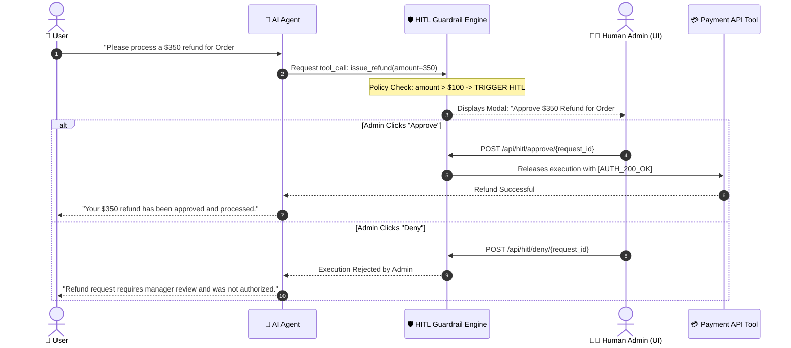

# 🛡️ 14. Human-in-the-Loop (HITL) Safety & Policy Guardrails

> **Author**: Vijay Donthireddy  
> **Route**: All Views (Chatbot, Canvas, Tools)  
> **Component Sources**: [`mcp_server/hitl.py`](file:///Users/donthireddy/code/github/agentic-ai/mcp_server/hitl.py), [`webui/src/views/ChatView.jsx`](file:///Users/donthireddy/code/github/agentic-ai/webui/src/views/ChatView.jsx)

---

## 🌟 1. What It Does (Plain English & Analogy)

The **Human-in-the-Loop (HITL) Safety & Guardrails Engine** acts as an intelligent supervisor and safety checkpoint. Whenever an autonomous agent attempts a high-stakes action (such as issuing a customer refund over $100, deleting files, modifying production databases, or triggering unauthorized webhooks), the engine intercepts execution, pauses the pipeline, and displays an interactive approval modal for human verification before proceeding.

> 💡 **The Real-World Analogy**:  
> Think of the "Dual-Key System" in a bank vault or a commercial aircraft cockpit. The pilot can fly the plane on autopilot, but turning off the engines or dumping fuel requires explicit human confirmation and a physical switch flip.

---

## 🎯 2. Why & How It Helps (Value Proposition)

### "The Challenge Before" vs. "How This Solves It"

| The Challenge Before | How This Solves It |
|---|---|
| **Runaway Autonomous Damage**: Agents accidentally executing destructive commands (e.g., `DELETE FROM users` or issuing large refunds). | **Configurable Policy Interception**: High-risk actions are automatically trapped and held in a pending state until a human signs off. |
| **Complete System Freezing**: Pausing the entire server for human approval blocks other users and threads. | **Asynchronous Non-Blocking Queues**: Uses async event loops so other agent threads continue while waiting for approval on specific request IDs. |
| **No Audit of Approved Actions**: Unclear who approved an agent's destructive action. | **Cryptographic Approval Tokens**: Generates unique `[AUTH_200_OK]` tokens with timestamps and approver identities stored in the audit DB. |

---

## 🚀 3. Real-World Step-by-Step Scenario

### Scenario: Intercepting a $350 Customer Refund in the AI Chatbot

### Step-by-Step UI Experience:

1. In the **AI Agent Chatbot**, type: *"Please refund $350 for order #9912"*.
2. The agent reasoning loop detects the high-value transaction.
3. A glowing amber **HITL Safety Approval Modal** appears on your screen:
   - **Action**: `issue_refund`
   - **Parameters**: `{"order_id": "9912", "amount": 350}`
   - **Risk Level**: `HIGH (Exceeds $100 policy threshold)`
4. Click **`[✅ Approve]`** or **`[❌ Deny]`**.
5. Upon approval, the agent executes the tool and delivers the verified confirmation.

---

## 😄 4. Witty & Relatable Commentary

> *"An autonomous agent without HITL guardrails is like giving your credit card to your toddler and walking out of the room. It only takes 30 seconds before you've bought 500 cases of candy. Keep the keys in human hands!"*

---

## 💻 5. Under-the-Hood Code & API Endpoints

- **Pending Requests Endpoint**: `GET /api/hitl/pending`
- **Approve Request Endpoint**: `POST /api/hitl/approve/{request_id}`
- **Deny Request Endpoint**: `POST /api/hitl/deny/{request_id}`
- **Core Module**: [`mcp_server/hitl.py`](file:///Users/donthireddy/code/github/agentic-ai/mcp_server/hitl.py)
