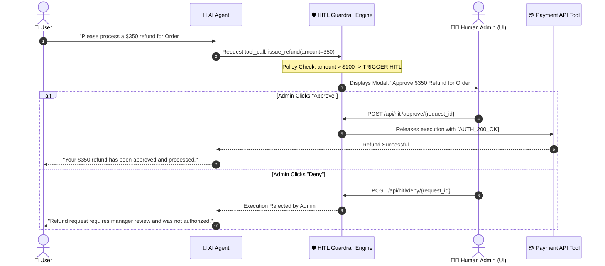
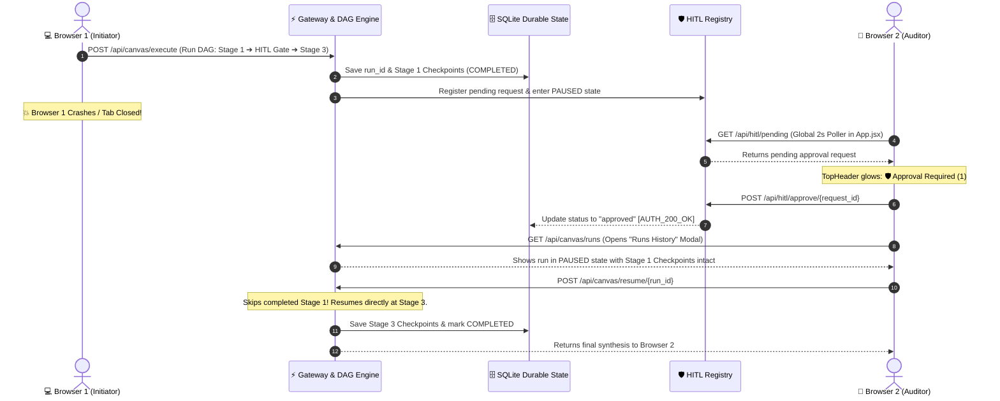

# 🛡️ 14. Human-in-the-Loop (HITL) Safety & Policy Guardrails

> **Author**: Vijay Donthireddy  
> **Repository**: [vdonthireddy/agentic-ai](https://github.com/vdonthireddy/agentic-ai)  
> **Route**: All Views (Chatbot, Workflow Canvas, Tools)  
> **Component Sources**: [`mcp_server/hitl.py`](file:///Users/donthireddy/code/github/agentic-ai/mcp_server/hitl.py), [`mcp_server/router.py`](file:///Users/donthireddy/code/github/agentic-ai/mcp_server/router.py), [`webui/src/views/ChatView.jsx`](file:///Users/donthireddy/code/github/agentic-ai/webui/src/views/ChatView.jsx), [`llm_gateway/app.py`](file:///Users/donthireddy/code/github/agentic-ai/llm_gateway/app.py)  
> **Documentation Track**: [Phase 4: Enterprise Safety, Guardrails & Governance](./README.md#phase-4-enterprise-safety-guardrails--governance)  
> **Navigation**: [🏠 Docs Hub](./README.md) | [⬅️ Prev: 12. Multi-Agent Debate](./12_multi_agent_debate_protocol.md) | **Step 12 of 18** | [➡️ Next: 17. Security Firewall & Defense](./17_security_firewall_prompt_defense.md)

---

> 🔗 **Related Deep-Dive Modules**:
> - 🛡️ [17. Security Firewall & Prompt Defense](./17_security_firewall_prompt_defense.md) — Protect against prompt injections, secret leakage, and path traversal.
> - 💰 [18. Rate Limiting & Cost Tracking](./18_rate_limiting_and_cost_tracking.md) — Prevent token resource exhaustion and budget blowouts.
> - 🔱 [02. Workflow Canvas (DAG)](./02_workflow_canvas_dag.md) — Wire HITL approval gate nodes visually into multi-stage pipelines.
> - 📜 [07. Audit Logs](./07_audit_logs.md) — Inspect cryptographically signed `[AUTH_200_OK]` approval tokens.

---

## 🌟 1. What It Does (Plain English & Analogy)

The **Human-in-the-Loop (HITL) Safety & Guardrails Engine** acts as an intelligent supervisor and safety checkpoint. Whenever an autonomous agent or a workflow pipeline attempts a high-stakes action (such as issuing a customer refund over $100, deleting files, modifying production databases, or reaching an explicit DAG approval gate), the engine intercepts execution, pauses the pipeline, and displays an interactive approval modal for human verification before proceeding.

> 💡 **The Real-World Analogy**:  
> Think of the "Dual-Key System" in a bank vault or a commercial aircraft cockpit. The pilot can fly the plane on autopilot, but turning off the engines or dumping fuel requires explicit human confirmation and a physical switch flip.

---

## 🎯 2. Why & How It Helps (Value Proposition)

### "The Challenge Before" vs. "How This Solves It"

| The Challenge Before | How This Solves It |
|---|---|
| **Runaway Autonomous Damage**: Agents accidentally executing destructive commands (e.g., `DELETE FROM users` or issuing large refunds). | **Configurable Policy Interception**: High-risk actions are automatically trapped and held in a pending state until a human signs off. |
| **Pipeline Continues After Denial**: Denying an action still leaves downstream pipeline stages running. | **Strict Circuit Breaker**: Denying any approval gate immediately aborts the pipeline and blocks all downstream stages from executing. |
| **Complete System Freezing**: Pausing the entire server for human approval blocks other users and threads. | **Asynchronous Non-Blocking Queues**: Uses async event loops so other agent threads continue while waiting for approval on specific request IDs. |
| **No Audit of Approved Actions**: Unclear who approved an agent's destructive action. | **Cryptographic Approval Tokens**: Generates unique `[AUTH_200_OK]` tokens with timestamps and approver identities stored in the audit DB. |
| **Tab / Browser Session Isolation**: Approval requests trapped in the initiating browser tab; if the tab is closed or crashes, the approval is orphaned. | **Global Cross-Session Broadcast & Durable Resumption**: Polled globally by `App.jsx`, surfaced across all tabs/browsers via glowing `🛡️ Approval Required (1)` header badges, with durable checkpoint recovery via `POST /api/canvas/resume/{run_id}`. |
| **Zombie Requests & Indefinite Blocking**: If an operator steps away or forgets to review a prompt, pipelines remain stalled forever in limbo. | **Enforced Time Limits & Safe Auto-Denial**: Every gate enforces a configurable timeout (default **20 minutes / 1200s**). If the operator does not respond within the window, the request is automatically **DENIED** (`resolved_by: "timeout"`). Setting the time limit to `0` designates an **infinite** window for workflows that must wait indefinitely. |

---

## 🚀 3. Real-World Step-by-Step Scenarios

### Mode A: Intercepting a Protected Tool Action in Standard Chat

---

### Mode B: Wired HITL Approval Node in Workflow Canvas DAG

#### 1. Wiring the Node in Workflow Canvas (`/canvas`)
1. Drag a **🛡️ HITL Approval Gate Node** onto the canvas.
2. Select the trigger policy:
   - `⚡ Always Require Approval`: Stops every time execution reaches this node.
   - `💰 Financial Threshold (> $100)`: Only triggers if payload contains financial amounts $\ge \$100$.
   - `🗑️ File Deletions / Writes`: Triggers when files are modified or deleted.
3. Wire the gate between upstream data sources and downstream execution stages.
4. Click **`[💾 Save Pipeline]`**.

#### 2. Running with Live Prompts in the Chatbot (`/chat`)
1. Select your saved pipeline in the **`🔱 Workflow DAG`** dropdown.
2. Type your prompt and click **Send**.
3. When the pipeline hits the HITL gate:
   - The glowing **🛡️ Human Approval Required** modal appears in the center of the screen.
   - It displays the prompt, node ID, and policy reason.

#### 3. Handling the Approval Modal
* **Click `[✅ Approve Action]`**:
  - The gate issues token `[AUTH_200_OK]`.
  - The remaining downstream stages execute seamlessly to completion.
* **Click `[❌ Deny Action]`**:
  - The DAG **halts immediately**.
  - All downstream nodes are **blocked**.
  - A red security alert banner explains that execution was safely aborted by the operator.

---

### Mode C: Multi-Browser Session Resilience & Crash Recovery

What happens if an operator triggers a long-running DAG in **Browser 1**, and then Browser 1 crashes, runs out of battery, or the operator switches to **Browser 2** (e.g. laptop to tablet)?

1. **Global Presence in Every Window**: Because approval listening is managed at the root application layer (`App.jsx`), pending approvals are **never trapped** in the initiating browser tab. Any open tab or secondary device immediately displays the glowing **`🛡️ Approval Required (1)`** header button.
2. **Durable SQLite Checkpoints**: Every completed node (Stage 1, Tool calls, Memory queries) is written to `node_checkpoints` and `workflow_runs`. Even if the client socket terminates, intermediate state is 100% preserved.
3. **One-Click Resumption**: In the Canvas view under **`[📜 Runs History]`**, the operator inspects the paused run, examines which nodes finished, and clicks **`▶️ Resume Execution`** to complete downstream execution without wasted token re-computation.

---

### Mode D: The Dedicated Safety Approvals Hub (`/approvals`)

In addition to quick-approval modals and header alerts, the Studio features a dedicated **Human Approvals Hub** accessible via the sidebar navigation:

1. **Pending Approvals Queue**: Live-polled card stream showing tool name, arguments JSON, risk badge, and a real-time countdown bar with immediate **`[✓ Approve Action]`** and **`[✕ Deny Request]`** buttons.
2. **Safety Policy Rules Registry**: Direct visibility into all active safety gates registered with `HITLRegistry` (`GET /api/hitl/rules`), including tool names, risk tiers, argument filters (e.g. `delete, remove, rm`), and timeout thresholds.
3. **Audit History Ledger**: Chronological trail of all previously resolved requests (`GET /api/hitl/history`) with resolution statuses (`APPROVED`, `DENIED`) and operator identity timestamps.

---

### Mode E: Time Limit Governance & Auto-Denial Semantics (20-Minute Default & Infinite Zero)

Every HITL safety gate enforces deterministic temporal boundaries to prevent agent pipelines from deadlocking:

1. **Default 20-Minute Time Limit (`1200s`)**:
   * Pending approval requests default to a **20-minute (1200 seconds)** review window.
   * Both the modal in Chat and the dedicated Approvals Hub card display real-time animated countdown bars: `⏳ Auto-denies in 19m 45s (1185s) if unresolved`.
2. **Deterministic Auto-Denial on Expiration**:
   * If the time limit elapses without operator interaction, the request is automatically transitioned to **`DENIED`** (`status: "denied"`, `resolved_by: "timeout"`).
   * Downstream pipeline execution or tool invocation is immediately **aborted**, preventing zombie pipelines and securing systems against silent unattended execution.
   * Expired requests are purged from `GET /api/hitl/pending` and recorded in the SQLite audit ledger (`GET /api/hitl/history`).
3. **Infinite Approval Window (`0s`)**:
   * For enterprise environments or manual change windows where an operator may review actions hours later, the timeout can be set to **`0`**.
   * When set to 0, requests never expire automatically, remaining securely in `PAUSED` status until an authorized human decides their fate.

---

### Mode F: Temporal Observability — Workflow Execution Runs & Checkpoint Timestamps

#### 1. What It Does (Plain English & Analogy)
When inspecting complex agent workflows across distributed browser sessions, knowing *what* executed is only half the picture; operators must also know *when* each stage took place. 
**The Analogy**: Imagine an airplane flight data recorder (the "Black Box") that records every rudder adjustment and engine thrust, but without timestamps. If the plane hit turbulence, you wouldn't know if it was 5 minutes ago over Denver or 3 days ago over Chicago! Checkpoint timestamps provide the digital stopwatch and synchronized chronometer for every agent run.

#### 2. Why & How It Helps: The Challenge Before vs. How This Solves It
| The Challenge Before | How This Solves It |
| :--- | :--- |
| **No Execution Timestamps**: Run cards only listed run IDs (e.g. `run_20260907_060654...`) and raw elapsed milliseconds (`193129ms`). Operators could not determine if a run occurred today, yesterday, or a week ago. | **Localized Human-Readable Date & Time**: Every run card displays an exact formatted timestamp (`Sep 6, 2026, 11:06:54 PM`) alongside relative age badges (`5m ago`, `2d ago`). |
| **Missing Checkpoint Step Timing**: Individual node checkpoints only showed duration (`116ms`), obscuring the sequence of parallel vs. sequential step transitions. | **Per-Step Checkpoint Timestamps**: Each durable checkpoint card displays its exact UTC/localized recorded time with an indigo `Clock` icon and formatted duration badge. |
| **Anonymous Run Labels**: Run cards fell back to a generic `'DAG Pipeline'` header instead of the named workflow pipeline. | **Full Pipeline Context & Detailed Header**: Selected runs display their true pipeline name (`selectedRun.workflow_name`), full execution ID, started timestamp, and total duration. |

#### 3. Real-World Step-by-Step Scenario
1. **Triggering Workflow**: An operator triggers a multi-stage data migration pipeline on the DAG Canvas at 11:06:54 PM.
2. **Reviewing in Another Tab**: The operator opens a new browser window 10 minutes later and clicks **`[📜 Runs History]`**.
3. **Instant Temporal Context**: The left sidebar shows the run: `🔱 Parallel Swarm Fork • COMPLETED • 193.1s (193,129ms)` with timestamp `Sep 6, 2026, 11:06:54 PM (10m ago)`.
4. **Inspecting Node Checkpoints**: Clicking the run displays all 6 step checkpoints:
   - `Stage 1: Task Decomposer (Supervisor)` recorded at `11:06:54 PM • 116ms`
   - `Stage 2: search_web (Worker 1)` recorded at `11:06:54 PM • 2403ms`
   - `Stage 3: Consensus Synthesizer` recorded at `11:10:07 PM • 79ms`
5. **Audit Confidence**: Forensic compliance teams can immediately verify the exact execution sequence and verify that no unauthorized delay occurred.

---

## 😄 4. Witty & Relatable Commentary

> *"An autonomous agent without HITL guardrails is like giving your credit card to your toddler and walking out of the room. It only takes 30 seconds before you've bought 500 cases of candy. Keep the keys in human hands! And if you get distracted making coffee, don't worry: our 20-minute auto-denial ensures the robot doesn't sit with the nuclear launch codes open forever — if you don't say yes in 20 minutes, it's a polite 'no thanks'. Furthermore, displaying runs without timestamps is like finding a sticky note on your desk that says 'Server exploded' with no date... was that right now, or three weeks ago? Timestamps bring peace of mind!"*

---

## 💻 5. Under-the-Hood Code & API Endpoints

- **Pending Approvals Endpoint**: `GET /api/hitl/pending`
- **Approve Request Endpoint**: `POST /api/hitl/approve/{request_id}`
- **Deny Request Endpoint**: `POST /api/hitl/deny/{request_id}`
- **Registered Safety Rules**: `GET /api/hitl/rules`
- **Resolution History Ledger**: `GET /api/hitl/history`
- **List Workflow Runs**: `GET /api/canvas/runs`
- **Inspect Run Checkpoints**: `GET /api/canvas/runs/{run_id}`
- **Resume Paused Run**: `POST /api/canvas/resume/{run_id}`
- **HITL Engine Source**: [`mcp_server/hitl.py`](file:///Users/donthireddy/code/github/agentic-ai/mcp_server/hitl.py)
- **DAG Execution Engine**: [`ai_agent/router.py`](file:///Users/donthireddy/code/github/agentic-ai/ai_agent/router.py) (mounted via [`llm_gateway/app.py`](file:///Users/donthireddy/code/github/agentic-ai/llm_gateway/app.py) at `/api/canvas/execute`)
- **Dedicated Approvals View**: [`webui/src/views/ApprovalsView.jsx`](file:///Users/donthireddy/code/github/agentic-ai/webui/src/views/ApprovalsView.jsx)
- **Global Poller & Modal**: [`webui/src/App.jsx`](file:///Users/donthireddy/code/github/agentic-ai/webui/src/App.jsx) and [`webui/src/components/TopHeader.jsx`](file:///Users/donthireddy/code/github/agentic-ai/webui/src/components/TopHeader.jsx)

---

## 🧭 Next Step in Your Journey

Now that you know how human gates protect high-stakes actions, learn how the Security Firewall blocks prompt injections and masks sensitive PII:

👉 **[Continue to 17. Security Firewall & Prompt Defense Guide](./17_security_firewall_prompt_defense.md)**
