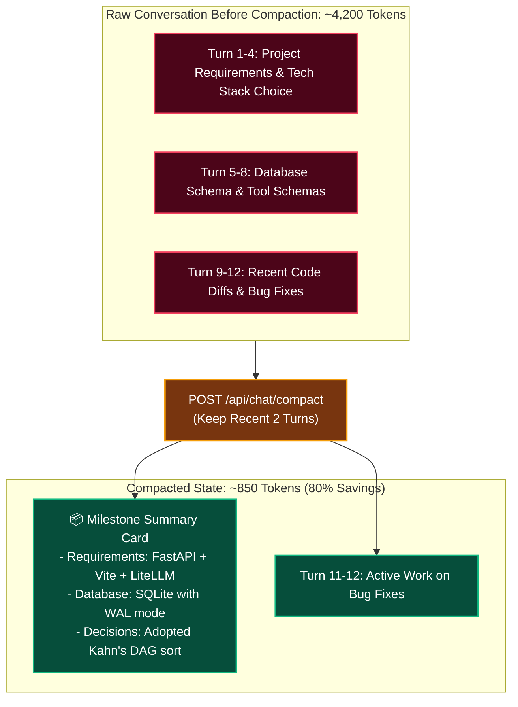

# 📦 15. Context Compaction & Token Economics Engine

> **Author**: Vijay Donthireddy  
> **Repository**: [vdonthireddy/agentic-ai](https://github.com/vdonthireddy/agentic-ai)  
> **Route**: `http://localhost:8000/chat`  
> **Component Sources**: [`llm_gateway/app.py`](file:///Users/donthireddy/code/github/agentic-ai/llm_gateway/app.py), [`webui/src/views/ChatView.jsx`](file:///Users/donthireddy/code/github/agentic-ai/webui/src/views/ChatView.jsx)  
> **Documentation Track**: [Phase 2: Single-Agent Mechanics & Tool Power](./README.md#phase-2-single-agent-mechanics--tool-power)  
> **Navigation**: [🏠 Docs Hub](./README.md) | [⬅️ Prev: 16. Voice & Whisper TTS](./16_voice_speech_recognition_tts.md) | **Step 3 of 18** | [➡️ Next: 03. MCP Tools & Sandbox](./03_mcp_tools_sandbox.md)

---

> 🔗 **Related Deep-Dive Modules**:
> - 💬 [01. AI Agent Chatbot](./01_ai_agent_chatbot.md) — The conversational view where compaction triggers occur.
> - 💰 [18. Rate Limiting & Cost Tracking](./18_rate_limiting_and_cost_tracking.md) — Understand per-model pricing and how compaction lowers USD expenditure.
> - 📊 [06. Telemetry & Metrics](./06_telemetry_metrics.md) — Observe token throughput graphs before and after compaction.

---

## 🌟 1. What It Does (Plain English & Analogy)

The **Context Compaction Engine** solves the fundamental bottleneck of LLM context limits. As conversations grow over 10, 20, or 50 turns, raw history consumes thousands of tokens per request. Compaction periodically summarizes earlier turns into a compact **Milestone Synthesis**, discarding repetitive raw messages while preserving critical facts and reducing token overhead by **70% to 85%**.

> 💡 **The Real-World Analogy**:  
> Imagine a courtroom reporter who has taken 500 pages of verbatim shorthand notes over a 3-week trial. Instead of handing the entire 500 pages to the jury every single day, the clerk prepares a certified 1-page executive summary of Days 1 through 18, keeping only today's verbatim testimony open on the desk.

---

## 🎯 2. Why & How It Helps (Value Proposition)

### "The Challenge Before" vs. "How This Solves It"

| The Challenge Before | How This Solves It |
|---|---|
| **Sudden `400 Context Length Exceeded` Errors**: Long chats crash when they hit the model's token limit. | **Proactive Threshold Alerts**: Automatically warns the user when context crosses configurable limits (e.g. 1,500t or 3,000t). |
| **Linear Cost Explosion**: Turn 20 costs 20x more than Turn 1 because the entire conversation is resent every time. | **Constant Token Baseline**: Keeps active conversational payloads under 1,000 tokens regardless of conversation length. |
| **Lost Facts in Manual Summarization**: Generic truncation chops off earlier user preferences or requirements. | **Structured Milestone Extraction**: Specifically extracts user facts, active constraints, and tool results into milestone summaries. |

---

## 🚀 3. Real-World Step-by-Step Scenario

### Scenario: Compacted 12-Turn Architecture Brainstorming Session



### Step-by-Step UI Actions:

1. In the **AI Agent Chatbot**, engage in a multi-turn conversation.
2. In the header bar, observe the live token counter: `Turn 8 • 2,450t`.
3. When the token count crosses your configured limit (e.g., 1,500t), an amber banner appears:  
   `⚠️ Context Alert: History is ~2,450 tokens. Run /compact to summarize and free up context space.`
4. Click **`[Compact Now]`** (or type `/compact`).
5. A green **Milestone Summary Card** replaces the earlier turns:  
   `📦 Context Compacted Successfully: Saved 1,820 tokens (74% reduction).`
6. The chat continues seamlessly with full awareness of your earlier decisions!

---

## 😄 4. Witty & Relatable Commentary

> *"Trying to run a 50-turn chat without context compaction is like carrying your entire luggage set on your back while running a marathon. Compaction checks the heavy bags into the hotel so you can sprint to the finish line!"*

---

## 💻 5. Under-the-Hood Code & API Endpoints

- **Compaction Endpoint**: `POST /api/chat/compact`
- **Request Payload**:
  ```json
  {
    "messages": [
      {"role": "user", "content": "Let's build a new search tool..."},
      {"role": "assistant", "content": "Here is the schema..."}
    ],
    "keep_recent_turns": 2,
    "model": "ollama/gemma2:2b"
  }
  ```
- **Response Structure**:
  ```json
  {
    "status": "success",
    "compacted_messages": [...],
    "summary": "User prefers TypeScript and SQLite backend...",
    "tokens_before": 2450,
    "tokens_after": 630,
    "tokens_saved": 1820,
    "savings_percent": 74.3
  }
  ```

---

## 🧭 Next Step in Your Journey

Now that you understand conversational flow and token compression, explore how tools work under the hood:

👉 **[Continue to 03. MCP Tools & Sandbox Guide](./03_mcp_tools_sandbox.md)**
