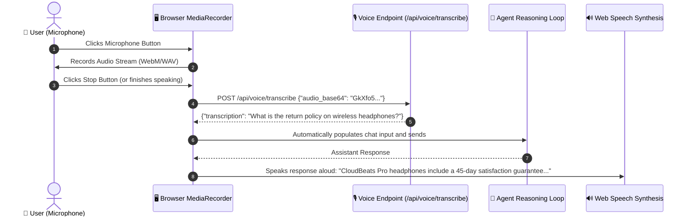

# 🎙️ 16. Voice Interaction (Speech-to-Text & TTS)

> **Author**: Vijay Donthireddy  
> **Route**: `http://localhost:8000/chat`  
> **Component Sources**: [`llm_gateway/voice_endpoints.py`](file:///Users/donthireddy/code/github/agentic-ai/llm_gateway/voice_endpoints.py), [`webui/src/views/ChatView.jsx`](file:///Users/donthireddy/code/github/agentic-ai/webui/src/views/ChatView.jsx)

---

## 🌟 1. What It Does (Plain English & Analogy)

The **Voice Interaction Engine** enables hands-free multimodal communication with your AI Agent. It provides in-browser audio recording via the HTML5 MediaStream API, server-side speech recognition with local/cloud **OpenAI Whisper STT**, and automatic speech synthesis (**Text-to-Speech / TTS**) via the browser Web Speech API.

> 💡 **The Real-World Analogy**:  
> Think of this as turning your web studio into a conversational in-car smart assistant (like a next-generation Siri or Jarvis). You tap the microphone on your steering wheel, speak your question out loud, and the assistant responds back with a natural spoken voice while displaying the written answer on screen.

---

## 🎯 2. Why & How It Helps (Value Proposition)

### "The Challenge Before" vs. "How This Solves It"

| The Challenge Before | How This Solves It |
|---|---|
| **Slow Keyboard Typing for Long Prompts**: Typing complex domain prompts on a laptop or mobile takes time. | **Instant Voice Dictation**: Speak naturally; Whisper transcribes your voice to structured text in milliseconds. |
| **No Audio Feedback When Multi-Tasking**: You have to stare at the screen to read long text responses. | **Automated TTS Playback**: The agent speaks its final answers aloud with one-click toggles (`[TTS On]`). |
| **Unreliable WebSockets Setup**: Heavy streaming WebSocket audio connections frequently drop over corporate firewalls. | **Robust Base64 REST Audio Chunks**: Uses clean standard `POST /api/voice/transcribe` with zero dropped audio packets. |

---

## 🚀 3. Real-World Step-by-Step Scenario

### Scenario: Hands-Free Voice Query for Weather and Product Catalog



### Step-by-Step UI Actions:

1. In the **AI Agent Chatbot**, click the **🎤 Microphone** button next to the text input.
2. The button turns **Red** with an animated listening indicator (`🎤 Listening...`).
3. Speak clearly into your computer microphone:  
   *"Check the weather in Tokyo and calculate 15% discount on $200."*
4. Click the red microphone button again to finish recording.
5. The audio is transcribed instantly and placed into the text area.
6. The agent executes the tools and, if **`[🔊 TTS On]`** is enabled in the top bar, reads the answer back to you out loud!

---

## 😄 4. Witty & Relatable Commentary

> *"Why type out a 3-paragraph prompt when you can just talk to your computer like Captain Picard on the Starship Enterprise? 'Computer, check Tokyo weather and calculate my budget.' Make it so!"*

---

## 💻 5. Under-the-Hood Code & API Endpoints

- **Transcribe Audio Endpoint**: `POST /api/voice/transcribe`
- **Payload Schema**:
  ```json
  {
    "audio_base64": "<base64-encoded-audio>",
    "language": "en"
  }
  ```
- **Voice Module**: [`llm_gateway/voice_endpoints.py`](file:///Users/donthireddy/code/github/agentic-ai/llm_gateway/voice_endpoints.py)
