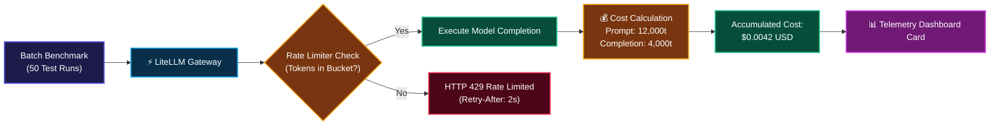

# 💰 18. Rate Limiting & Real-Time Cost Tracking

> **Author**: Vijay Donthireddy  
> **Route**: Gateway Middleware & Telemetry (`/overview`)  
> **Component Sources**: [`llm_gateway/rate_limiter.py`](file:///Users/donthireddy/code/github/agentic-ai/llm_gateway/rate_limiter.py), [`llm_gateway/cost_tracker.py`](file:///Users/donthireddy/code/github/agentic-ai/llm_gateway/cost_tracker.py)

---

## 🌟 1. What It Does (Plain English & Analogy)

The **Rate Limiting & Cost Tracking Engine** protects your infrastructure and budget. It uses a **Token-Bucket Algorithm** to prevent runaway loops or denial-of-service traffic from flooding LLM endpoints, while calculating the exact real-time monetary cost (in $USD) for every prompt and completion token based on published provider rate tables.

> 💡 **The Real-World Analogy**:  
> Think of the Rate Limiter as the **Speed Governor on a rental car** (it physically won't let you redline the engine at 150 mph), and the Cost Tracker as the **Digital Taxi Meter on the dashboard** (ticking up dollar-by-dollar so you always know your exact bill before you get out of the cab).

---

## 🎯 2. Why & How It Helps (Value Proposition)

### "The Challenge Before" vs. "How This Solves It"

| The Challenge Before | How This Solves It |
|---|---|
| **Infinite While-Loops in AI Agents**: A bug in an agent loop sends 50,000 requests in 5 minutes, crashing servers. | **Token-Bucket Rate Limiter**: Caps requests per minute (e.g. 60 req/min) with smooth token replenishment and HTTP 429 backoff headers. |
| **End-of-Month Billing Shock**: Opening a cloud invoice to discover a $1,200 bill from unmonitored test runs. | **Live Millicent Cost Computation**: Tracks exact cost per model ($/1k prompt tokens, $/1k completion tokens) updated in real time. |
| **No Per-Agent Budget Attribution**: Cannot tell which department or agent consumed the budget. | **Granular Caller Context Tagging**: Logs cost per `session_id`, `caller_id`, and `agent_name`. |

---

## 🚀 3. Real-World Step-by-Step Scenario

### Scenario: Tracking Spending on a 10-Agent Batch Benchmark

### Rate Table Reference (Per 1k Tokens):

| Provider / Model | Prompt Rate ($/1k) | Completion Rate ($/1k) | Local / Cloud |
|---|---|---|---|
| **Ollama (Gemma 2 / Qwen)** | **$0.0000** | **$0.0000** | **100% Free Local** |
| **OpenAI GPT-4o-mini** | $0.00015 | $0.00060 | Cloud |
| **Anthropic Claude 3.5 Sonnet** | $0.00300 | $0.01500 | Cloud |
| **Google Gemini 1.5 Pro** | $0.00125 | $0.00500 | Cloud |
| **Groq LLaMA 3.3 70B** | $0.00059 | $0.00079 | Cloud Ultra-Fast |

---

## 😄 4. Witty & Relatable Commentary

> *"The two scariest things in software engineering are an unhandled NullPointerException in production and an AI agent with an uncapped credit card! Our rate limiter and cost tracker guarantee you sleep like a baby every night."*

---

## 💻 5. Under-the-Hood Code & API Endpoints

- **Cost Stats Endpoint**: `GET /api/stats/cost`
- **Rate Limit Config**: Configurable via `RATE_LIMIT_PER_MINUTE` in `.env`
- **Modules**: [`llm_gateway/rate_limiter.py`](file:///Users/donthireddy/code/github/agentic-ai/llm_gateway/rate_limiter.py) and [`llm_gateway/cost_tracker.py`](file:///Users/donthireddy/code/github/agentic-ai/llm_gateway/cost_tracker.py)
