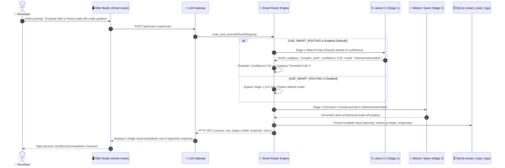

# ⚡ 19. Smart-Router: Dynamic 2-Stage Reasoning Dispatcher & Category Accuracy Thresholds

> **Author**: Vijay Donthireddy  
> **Repository**: [vdonthireddy/agentic-ai](https://github.com/vdonthireddy/agentic-ai)  
> **Route**: Gateway Engine & Web Studio (`/smart-router`, `POST /api/smart-router/route`, `POST /v1/chat/completions`)  
> **Component Sources**: [`llm_gateway/smart_router.py`](file:///Users/donthireddy/code/github/agentic-ai/llm_gateway/smart_router.py), [`llm_gateway/db.py`](file:///Users/donthireddy/code/github/agentic-ai/llm_gateway/db.py), [`smart_router_config.json`](file:///Users/donthireddy/code/github/agentic-ai/smart_router_config.json), [`webui/src/views/SmartRouterView.jsx`](file:///Users/donthireddy/code/github/agentic-ai/webui/src/views/SmartRouterView.jsx)  
> **Documentation Track**: [Phase 1: Foundations & Architecture](./README.md#phase-1-foundations--setup)  
> **Navigation**: [🏠 Docs Hub](./README.md) | [⬅️ Prev: 18. Rate Limiting & Cost Tracking](./18_rate_limiting_and_cost_tracking.md) | **Step 15 of 19** | [➡️ Next: 06. Telemetry & Metrics](./06_telemetry_metrics.md)

---

> 🔗 **Related Deep-Dive Modules**:
> - 🌐 [00. Getting Started & Architecture](./00_getting_started_and_architecture.md) — System topology, gateway routes, and deployment models.
> - 💬 [01. AI Agent Chatbot](./01_ai_agent_chatbot.md) — How the chatbot consumes dynamic model routes via `model="smart-router"`.
> - ⚙️ [11. Settings & Multi-Provider Config](./11_settings_providers.md) — Managing local Ollama instances and fallback models.
> - 📜 [07. Audit Logs](./07_audit_logs.md) — Immutable SQLite flight recorder capturing latency, token, and routing decisions.

---

## 🌟 1. What It Does (Plain English & Analogy)

The **Smart-Router** is an intelligent, two-stage dispatch engine that dynamically routes user prompts to the most capable and cost-effective AI model based on domain classification and calibrated **Accuracy Thresholds**.

Instead of statically hardcoding a single expensive model for every prompt or forcing users to guess which model is best, the Smart-Router queries a fast default reasoning model (Stage 1) to inspect the prompt's intent, categorize its complexity, estimate confidence, and select the optimal specialized model. If the confidence falls below the category's accuracy threshold, the system automatically redirects the query to a preconfigured safety fallback model. Once validated, the prompt is executed by the chosen target model (Stage 2).

> 💡 **The Real-World Analogy**:  
> Think of the Smart-Router as the **Chief Triage Nurse in a Hospital Emergency Department**.  
> When a patient walks through the door with an injury, they don't immediately get wheeled into an expensive open-heart operating theater. The triage nurse evaluates their symptoms, checks their severity score against clinical thresholds, and routes them appropriately:
> - A scratch or fever goes to the **Urgent Care Clinic** (`ollama/gemma2:2b` — fast, lightweight, zero wait).
> - Complex compound bone fractures go to the **Orthopedic Surgeon** (`ollama/qwen2.5-coder:7b` — specialized precision engineering).
> - Multi-organ trauma goes to the **Chief Surgical Specialist** (`ollama/mistral:latest` — deep architectural reasoning).
> If the triage nurse is uncertain or the injury looks borderline, they immediately escalate to the senior specialist to ensure absolute safety.

---

## 🎯 2. Why & How It Helps (Value Proposition)

### "The Challenge Before" vs. "How This Solves It"

| The Challenge Before | How This Solves It |
|---|---|
| **One-Size-Fits-All Inefficiency**: Forcing a 70B parameter frontier model to answer simple greetings like *"Hi"* wastes compute, drains GPU VRAM, and inflates latency. | **Adaptive Workload Tiering**: Greetings and simple lookups route to ultra-fast 2B models (`gemma2:2b`) in under 500ms, reserving large models for complex logic. |
| **Model Hallucination on Coding Tasks**: General-purpose conversational models stumble on niche language syntax, Dockerfiles, and complex SQL joins. | **Domain-Specialized Routing**: Code queries automatically dispatch to specialized models (`qwen2.5-coder:7b`) with code-optimized weights. |
| **Silent Underperformance**: Small or uncalibrated models attempting complex multi-step reasoning often fail silently with confident yet hallucinated answers. | **Calibrated Accuracy Thresholds**: The reasoner evaluates confidence against category minimums (e.g. 0.80 for `complex_work`). Low-confidence choices fall back safely to verified models. |
| **Fragile Black-Box Decisions**: No visibility into *why* a particular model was chosen or what intermediate prompt was passed. | **Full 5-Point Call Audit Log**: Stored in SQLite (`smart_router_logs`) capturing user prompt, reasoning raw output, confidence vs threshold, target prompt, and execution latency. |
| **Crash Vulnerability When Offline**: If the reasoning model is slow or offline, routing hangs and the client request fails. | **Zero-Dependency Graceful Fallbacks**: Production portability featuring deterministic regex classification, auto-repairing JSON parsers, and a clean toggle flag (`USE_SMART_ROUTING=False`). |

---

## 🚀 3. Real-World Step-by-Step Scenario

### Scenario: Routing a Complex Distributed Systems Architectural Query



### Execution Steps & Verified Outputs:

1. **Step 1: Input Submission**: The user enters a prompt requiring multi-step reasoning in the **Route & Playground** tab.
2. **Step 2: Stage 1 Reasoning Dispatch**: The prompt is analyzed by the default reasoning model (`ollama/llama3.2:latest`) against configured domain thresholds:
   ```json
   {
     "category": "complex_work",
     "confidence": 0.92,
     "selected_model": "ollama/mistral:latest",
     "reasoning": "Query involves architectural trade-offs, network partitions, and distributed consensus logic.",
     "prompt_for_model": "Evaluate Raft vs Paxos trade-offs under partition"
   }
   ```
3. **Step 3: Threshold Validation**:
   - Detected Category: `complex_work` (Threshold: `0.80`).
   - Confidence: `0.92` $\ge$ `0.80` $\rightarrow$ **Threshold Satisfied** (`threshold_met: true`).
   - Actual Routed Model: `ollama/mistral:latest`.
4. **Step 4: Stage 2 Target Execution**: The prompt is dispatched to `ollama/mistral:latest`, generating a rigorous, multi-point comparative breakdown.
5. **Step 5: Persistent Audit Stamping**: Both stages are recorded into `smart_router_logs` with a breakdown of `stage1_latency_ms: 2450.97`, `stage2_latency_ms: 1018.47`, and full token accounting.

---

## 🎭 4. Witty, Engaging & Humorous Commentary

> *"Asking a 70B parameter frontier model to respond to 'Hello!' is the AI equivalent of hiring a private jet to deliver a slice of toast to your neighbor across the street. Sure, it gets there, but the fuel bill is terrifying and the neighbor is wondering why there's jet wash in their rhododendrons.*
>
> *On the flip side, asking a 2B parameter lightweight model to write an asynchronous Raft consensus engine in Rust is like asking a golden retriever to explain quantum chromodynamics — it will wag its tail enthusiastically and hand you back a ball made of syntax errors.*
>
> *The Smart-Router gives your system adult supervision: it lets small models do what small models do best (be fast and cheap), lets large models do the heavy lifting, and keeps an immutable receipt of every decision so nobody has to play detective when the bill arrives."*

---

## 🔬 5. Visual Flows & Under-the-Hood Code

### Domain Classification & Threshold Decision Topology

```mermaid
flowchart TD
    Prompt["📥 Incoming User Prompt"] --> EnabledCheck{"⚙️ USE_SMART_ROUTING\nEnabled?"}
    
    EnabledCheck -->|No (Bypassed)| DirectRoute["⚡ Direct Dispatch to Default Model\n(0.0ms Stage 1 Latency)"]
    EnabledCheck -->|Yes| Stage1["🩺 Stage 1: Call Default Reasoning Model\n(ollama/llama3.2:latest)"]

    Stage1 --> ParseDecision{"Robust JSON\nParser & Auto-Repair"}
    ParseDecision -->|Valid JSON| Extract["Extract Category & Confidence"]
    ParseDecision -->|Truncated / Non-JSON| Heuristic["🛡️ Deterministic Heuristic Fallback\n(Zero-Downtime Regex Classifier)"]
    Heuristic --> Extract

    Extract --> ThresholdCheck{"Confidence >=\nCategory Threshold?"}
    ThresholdCheck -->|Yes ✅| RouteTarget["🎯 Route to Selected Specialist Model"]
    ThresholdCheck -->|No ⚠️| FallbackRoute["🛟 Route to Category Fallback Model\n(ollama/mistral:latest)"]

    RouteTarget --> Stage2["🚀 Stage 2: Target Model Execution"]
    FallbackRoute --> Stage2
    DirectRoute --> Stage2

    Stage2 --> AuditSave["💾 Persist 5-Point Trace to SQLite\n(smart_router_logs + Gateway Audit)"]
    AuditSave --> ClientOut["📤 Deliver Formatted Response + Trace Metadata"]

    classDef cIndigo fill:#1e1b4b,stroke:#6366f1,stroke-width:2px,color:#fff;
    classDef cCyan fill:#082f49,stroke:#0ea5e9,stroke-width:2px,color:#fff;
    classDef cAmber fill:#78350f,stroke:#f59e0b,stroke-width:2px,color:#fff;
    classDef cEmerald fill:#064e3b,stroke:#10b981,stroke-width:2px,color:#fff;

    class Prompt,ClientOut cIndigo;
    class Stage1,Stage2 cCyan;
    class EnabledCheck,ThresholdCheck,ParseDecision cAmber;
    class RouteTarget,AuditSave,DirectRoute cEmerald;
```

---

### Configuration Schema (`smart_router_config.json`)

```json
{
  "enabled": true,
  "default_reasoning_model": "ollama/llama3.2:latest",
  "fallback_model": "ollama/mistral:latest",
  "categories": {
    "coding": {
      "name": "Coding & Software Engineering",
      "description": "Code generation, debugging, refactoring, algorithms, SQL queries, scripting, software design",
      "accuracy_threshold": 0.75,
      "target_model": "ollama/qwen2.5-coder:7b",
      "fallback_model": "ollama/mistral:latest"
    },
    "complex_work": {
      "name": "Complex Reasoning & Analysis",
      "description": "Multi-step logical reasoning, math proofs, deep technical evaluation, architecture trade-offs",
      "accuracy_threshold": 0.80,
      "target_model": "ollama/mistral:latest",
      "fallback_model": "ollama/qwen2.5-coder:7b"
    },
    "general_qa": {
      "name": "General Knowledge & QA",
      "description": "General question answering, broad world knowledge, explanations, conversational inquiries",
      "accuracy_threshold": 0.70,
      "target_model": "ollama/llama3.2:latest",
      "fallback_model": "ollama/mistral:latest"
    },
    "fast_lightweight": {
      "name": "Fast & Lightweight Tasks",
      "description": "Quick greetings, short text summaries, basic grammar/formatting, simple translations",
      "accuracy_threshold": 0.60,
      "target_model": "ollama/gemma2:2b",
      "fallback_model": "ollama/llama3.2:latest"
    },
    "creative_writing": {
      "name": "Creative & Nuanced Writing",
      "description": "Storytelling, brainstorming, creative ideation, copywriting, narrative prose, poetry",
      "accuracy_threshold": 0.70,
      "target_model": "ollama/llama3.2:latest",
      "fallback_model": "ollama/mistral:latest"
    }
  }
}
```

---

### Database Schema (`smart_router_logs` in `llm_gateway/db.py`)

```sql
CREATE TABLE IF NOT EXISTS smart_router_logs (
    id TEXT PRIMARY KEY,
    timestamp TEXT NOT NULL,
    prompt TEXT NOT NULL,
    reasoning_model TEXT NOT NULL,
    reasoning_raw_response TEXT,
    routing_decision TEXT,
    category TEXT,
    confidence REAL,
    threshold REAL,
    threshold_met BOOLEAN,
    selected_model TEXT,
    target_model TEXT NOT NULL,
    target_prompt TEXT,
    target_response TEXT,
    stage1_latency_ms REAL DEFAULT 0.0,
    stage2_latency_ms REAL DEFAULT 0.0,
    total_latency_ms REAL DEFAULT 0.0,
    prompt_tokens INTEGER DEFAULT 0,
    completion_tokens INTEGER DEFAULT 0,
    total_tokens INTEGER DEFAULT 0,
    status TEXT DEFAULT 'SUCCESS',
    error_message TEXT
);

CREATE INDEX IF NOT EXISTS idx_sr_timestamp ON smart_router_logs(timestamp);
CREATE INDEX IF NOT EXISTS idx_sr_category ON smart_router_logs(category);
CREATE INDEX IF NOT EXISTS idx_sr_target_model ON smart_router_logs(target_model);
```

---

### Core Execution Engine Snippet (`llm_gateway/smart_router.py`)

```python
async def route_and_execute(
    self,
    request: RouteRequest,
    gateway_config: Optional[GatewayConfig] = None
) -> Dict[str, Any]:
    cfg = gateway_config or global_config
    trace_id = request.request_id or f"sr_{uuid.uuid4().hex[:12]}"
    timestamp = datetime.now(timezone.utc).isoformat()
    prompt = request.prompt.strip()
    stage1_start = time.time()

    if self.config.enabled:
        # STAGE 1: Call Default Reasoning Model with meta-prompt
        stage1_resp = await litellm.acompletion(
            model=self.config.default_reasoning_model,
            messages=[{"role": "system", "content": system_prompt}, {"role": "user", "content": prompt}],
            temperature=0.1,
            max_tokens=800
        )
        parsed = self._parse_reasoning_output(stage1_resp.choices[0].message.content, prompt)
        
        # Enforce Category Accuracy Threshold
        cat_cfg = self.config.categories.get(parsed["category"])
        threshold = cat_cfg.accuracy_threshold if cat_cfg else 0.70
        threshold_met = parsed["confidence"] >= threshold
        
        target_model = parsed["selected_model"] if threshold_met else (cat_cfg.fallback_model or self.config.fallback_model)
    else:
        # BYPASS MODE: USE_SMART_ROUTING=False
        stage1_latency_ms = 0.0
        target_model = self.config.fallback_model or cfg.default_model
        threshold_met = True

    # STAGE 2: Call Selected Target Model
    stage2_resp = await litellm.acompletion(
        model=target_model,
        messages=[{"role": "user", "content": prompt}],
        temperature=request.temperature
    )

    # STAGE 3: Persist Full Call Trace
    save_smart_router_log(trace_record, cfg.db_path)
    return {"success": True, "target_model": target_model, "trace": trace_record, "response": stage2_resp.choices[0].message.content}
```

---

## 🛡️ 6. Production Portability & Zero-Dependency Graceful Fallbacks

1. **Feature Toggle Flag (`USE_SMART_ROUTING`)**:
   Can be set in environment variables (`USE_SMART_ROUTING=false`), the Web Studio header toggle (`🟢 ENABLED` / `🟡 DISABLED`), or runtime API endpoints (`POST /api/smart-router/config`). When disabled, Stage 1 reasoning is completely bypassed (`0.0 ms` latency overhead) and requests route directly to the default model.
2. **Deterministic Heuristic Classifier**:
   If the reasoning model is offline, timed out, or returns free-form unparseable text, the router activates [`_heuristic_classify`](file:///Users/donthireddy/code/github/agentic-ai/llm_gateway/smart_router.py#L233) using precompiled regex syntax matchers, ensuring 100% uptime with zero crashes.
3. **Auto-Repairing Regex JSON Parser**:
   If a reasoning model's output is truncated due to token limits, [`_parse_reasoning_output`](file:///Users/donthireddy/code/github/agentic-ai/llm_gateway/smart_router.py#L330) automatically repairs unclosed strings and braces, falling back to regex group extraction to honor the model's chosen decision rather than failing.
4. **Prefix-Safe Model Normalizer**:
   [`_normalize_model_name`](file:///Users/donthireddy/code/github/agentic-ai/llm_gateway/smart_router.py#L214) cleanly strips provider prefixes before candidate evaluation, preventing substring false-positives (such as `"ollama/"` erroneously triggering `"llama"` normalization for `gemma2:2b`).
5. **Universal Gateway Interoperability**:
   Any standard OpenAI-compatible client can route dynamically simply by requesting `model="smart-router"`, receiving the target response alongside rich routing trace metadata in `gateway_metadata.smart_router_trace`.
