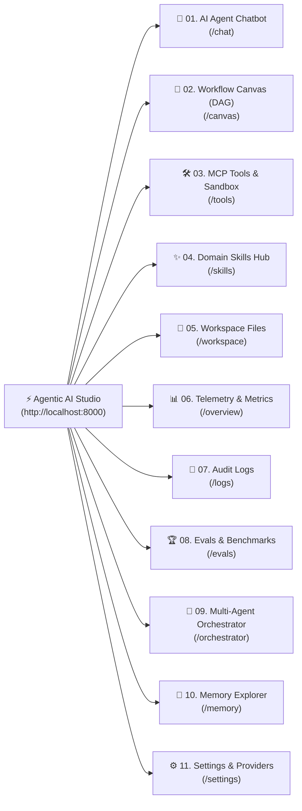

# 📚 Agentic AI Studio — User Interface & Feature Guide

> **Author**: Vijay Donthireddy  
> **Repository**: [agentic-ai](https://github.com/vdonthireddy/agentic-ai)  
> **Studio URL**: `http://localhost:8000`

Welcome to the **Agentic AI Studio Documentation Suite**. This directory contains step-by-step operational guides for every navigation feature and view inside the Agentic AI Studio.

---

## 🗺️ Studio Navigation Sitemap

---

## 📑 Feature Guides Index

| # | Left Navigation Item | Route | Documentation Guide | Key Capabilities |
|---|---|---|---|---|
| **01** | **AI Agent Chatbot** | `/chat` or `/` | [`01_ai_agent_chatbot.md`](./01_ai_agent_chatbot.md) | ReAct reasoning loop, SSE streaming, voice I/O, prompt chips, DAG integration |
| **02** | **Workflow Canvas (DAG)** | `/canvas` | [`02_workflow_canvas_dag.md`](./02_workflow_canvas_dag.md) | 2D visual graph builder, Kahn's topological sort, parallel swarms, save pipelines |
| **03** | **MCP Tools & Sandbox** | `/tools` | [`03_mcp_tools_sandbox.md`](./03_mcp_tools_sandbox.md) | Interactive tool caller, schema explorer, real-time latency benchmark |
| **04** | **Domain Skills Hub** | `/skills` | [`04_domain_skills_hub.md`](./04_domain_skills_hub.md) | Markdown skills library, progressive disclosure, system prompt injector |
| **05** | **Workspace Files** | `/workspace` | [`05_workspace_files.md`](./05_workspace_files.md) | Sandboxed filesystem explorer, live markdown preview, file creation/deletion |
| **06** | **Telemetry & Metrics** | `/overview` | [`06_telemetry_metrics.md`](./06_telemetry_metrics.md) | Live token throughput, error rate charts, latency distribution, provider health |
| **07** | **Audit Logs** | `/logs` | [`07_audit_logs.md`](./07_audit_logs.md) | Hierarchical turn logs, JSON/CSV export, full-text token filter |
| **08** | **Evals & Benchmarks** | `/evals` | [`08_evals_benchmarks.md`](./08_evals_benchmarks.md) | LLM-as-Judge grader, automated benchmark runner, model comparison radar |
| **09** | **Multi-Agent Orchestrator** | `/orchestrator` | [`09_multi_agent_orchestrator.md`](./09_multi_agent_orchestrator.md) | Multi-agent debate federation, hierarchical supervisor, consensus arbitrator |
| **10** | **Memory Explorer** | `/memory` | [`10_memory_explorer.md`](./10_memory_explorer.md) | Vector semantic search, knowledge graph triples, episodic memory CRUD |
| **11** | **Settings & Providers** | `/settings` | [`11_settings_providers.md`](./11_settings_providers.md) | Multi-provider API keys (Ollama, OpenAI, Anthropic, Gemini, Groq), model fallbacks |
| **12** | **Multi-Agent Debate Protocol** | `/orchestrator` | [`12_multi_agent_debate_protocol.md`](./12_multi_agent_debate_protocol.md) | Adversarial Proposer vs Critic rounds, arbitrator verdicts, statistical consensus |
| **13** | **Parallel Swarms & DAGs** | `/canvas` | [`13_parallel_agent_execution_swarms.md`](./13_parallel_agent_execution_swarms.md) | Kahn's topological sort, concurrent parallel forks (`asyncio.gather`), zero-wait joins |
| **14** | **HITL Safety & Guardrails** | `All Views` | [`14_human_in_the_loop_safety.md`](./14_human_in_the_loop_safety.md) | High-stakes action interception, threshold approvals, async pause/resume |
| **15** | **Context Compaction Engine** | `/chat` | [`15_context_compaction_engine.md`](./15_context_compaction_engine.md) | Proactive token threshold alerts, `/compact` summaries, 75%+ token savings |
| **16** | **Voice I/O & Whisper TTS** | `/chat` | [`16_voice_speech_recognition_tts.md`](./16_voice_speech_recognition_tts.md) | In-browser MediaRecorder, Whisper speech recognition, automated Web Speech TTS |
| **17** | **Security Firewall & Defense** | `Gateway` | [`17_security_firewall_prompt_defense.md`](./17_security_firewall_prompt_defense.md) | Prompt injection defense, path traversal blocking, secret masking |
| **18** | **Rate Limiting & Cost Tracking** | `/overview` | [`18_rate_limiting_and_cost_tracking.md`](./18_rate_limiting_and_cost_tracking.md) | Token-bucket rate limiting, real-time per-model USD cost calculation |

---

*Every guide is crafted with real-world analogies, problem-solution matrices, step-by-step UI actions, architecture diagrams, and test scenarios.*
