# 📚 Agentic AI Studio — Comprehensive Documentation & Learning Tracks

> **Author**: Vijay Donthireddy  
> **Repository**: [agentic-ai](https://github.com/vdonthireddy/agentic-ai)  
> **Studio URL**: `http://localhost:8000`

Welcome to the **Agentic AI Studio Documentation Suite**. This directory provides a structured, phased curriculum designed to take you step-by-step from zero setup to building and orchestrating production-grade autonomous AI swarms, real-world MCP tools, and enterprise security guardrails.

---

## 🗺️ Visual Learning Progression (Zero to Production)

```mermaid
flowchart TD
    subgraph P1["🚀 Phase 1: Foundations & Setup"]
        D00["00. Getting Started & Architecture\n(/docs/00_getting_started_and_architecture.md)"]
        D11["11. Settings & Multi-Provider Config\n(/settings)"]
    end

    subgraph P2["🧠 Phase 2: Single-Agent Mechanics & Tool Power"]
        D01["01. AI Agent Chatbot\n(/chat)"]
        D16["16. Voice Speech & Whisper TTS\n(/chat)"]
        D15["15. Context Compaction Engine\n(/chat)"]
        D03["03. MCP Tools & Sandbox\n(/tools)"]
        D04["04. Domain Skills Hub\n(/skills)"]
        D05["05. Workspace Files Explorer\n(/workspace)"]
        D10["10. Memory Explorer (Vector & GraphRAG)\n(/memory)"]
    end

    subgraph P3["🔱 Phase 3: Visual Workflows & Multi-Agent Swarms"]
        D02["02. Workflow Canvas (DAG)\n(/canvas)"]
        D13["13. Parallel Swarm Execution\n(/canvas)"]
        D09["09. Multi-Agent Orchestrator\n(/orchestrator)"]
        D12["12. Multi-Agent Debate Protocol\n(/orchestrator)"]
    end

    subgraph P4["🛡️ Phase 4: Enterprise Safety, Guardrails & Governance"]
        D14["14. Human-in-the-Loop (HITL) Safety\n(All Views)"]
        D17["17. Security Firewall & Defense\n(Gateway)"]
        D18["18. Rate Limiting & Cost Tracking\n(/overview)"]
    end

    subgraph P5["📊 Phase 5: Observability, Evals & Benchmarks"]
        D06["06. Telemetry & Metrics Observatory\n(/overview)"]
        D07["07. Audit Logs Flight Recorder\n(/logs)"]
        D08["08. 4-Grader Evals & Benchmarking\n(/evals)"]
    end

    subgraph P6["🏗️ Phase 6: Full Construction Blueprint"]
        BYO["🛠️ Build Your Own Agentic AI Platform\n(12-Chapter Deep-Dive Guide)"]
    end

    P1 --> P2
    P2 --> P3
    P3 --> P4
    P4 --> P5
    P5 --> P6
```

---

## 🧭 Role-Based Fast Tracks

Pick the path that matches your current goal:

| 👤 Your Role / Goal | 📖 Recommended Step-by-Step Path | Focus Areas |
| :--- | :--- | :--- |
| **🚀 Getting Started Fast** | [`00`](./00_getting_started_and_architecture.md) ➔ [`11`](./11_settings_providers.md) ➔ [`01`](./01_ai_agent_chatbot.md) ➔ [`03`](./03_mcp_tools_sandbox.md) | Running the platform, setting API keys, testing first prompt & tools |
| **💻 Software Engineer** | [`00`](./00_getting_started_and_architecture.md) ➔ [`01`](./01_ai_agent_chatbot.md) ➔ [`03`](./03_mcp_tools_sandbox.md) ➔ [`04`](./04_domain_skills_hub.md) ➔ [`02`](./02_workflow_canvas_dag.md) ➔ [`13`](./13_parallel_agent_execution_swarms.md) ➔ [`BUILD_YOUR_OWN_AGENTIC_AI.md`](./BUILD_YOUR_OWN_AGENTIC_AI.md) | Custom tool writing, prompt injection, ReAct loop mechanics, DAG execution |
| **🏛️ System Architect** | [`00`](./00_getting_started_and_architecture.md) ➔ [`09`](./09_multi_agent_orchestrator.md) ➔ [`12`](./12_multi_agent_debate_protocol.md) ➔ [`13`](./13_parallel_agent_execution_swarms.md) ➔ [`10`](./10_memory_explorer.md) ➔ [`17`](./17_security_firewall_prompt_defense.md) | Multi-agent coordination, GraphRAG, microservices topology, resilience |
| **🛡️ SecOps / DevOps** | [`00`](./00_getting_started_and_architecture.md) ➔ [`14`](./14_human_in_the_loop_safety.md) ➔ [`17`](./17_security_firewall_prompt_defense.md) ➔ [`18`](./18_rate_limiting_and_cost_tracking.md) ➔ [`07`](./07_audit_logs.md) | Zero-trust isolation, PII masking, token-bucket rate limits, Docker topology |
| **🏆 QA & Evaluation Engineer** | [`08`](./08_evals_benchmarks.md) ➔ [`06`](./06_telemetry_metrics.md) ➔ [`07`](./07_audit_logs.md) ➔ [`12`](./12_multi_agent_debate_protocol.md) | 4-grader scoring rubrics, automated benchmarking, model comparison radar |

---

## 🪜 The 6-Phase Master Step-by-Step Curriculum

### Phase 1: Foundations & Quickstart
*Get the platform running, configure model providers, and understand the core architecture.*

| Step | Guide | Route / Subsystem | Key Capabilities & What You Will Learn |
|---|---|---|---|
| **00** | [**Getting Started & System Topology**](./00_getting_started_and_architecture.md) | System Core | 3-minute quickstart, architecture map, port allocations, and foundational mental model. |
| **11** | [**Settings & Providers**](./11_settings_providers.md) | `/settings` | Ollama local model verification, multi-cloud API keys, active provider selection, and latency checks. |

---

### Phase 2: Single-Agent Mechanics & Tool Power
*Master autonomous ReAct reasoning, voice interaction, memory persistence, and Model Context Protocol (MCP) tools.*

| Step | Guide | Route / Subsystem | Key Capabilities & What You Will Learn |
|---|---|---|---|
| **01** | [**AI Agent Chatbot**](./01_ai_agent_chatbot.md) | `/chat` | Autonomous ReAct loop, real-time SSE streaming, prompt chips, and tool execution badges. |
| **16** | [**Voice I/O & Whisper TTS**](./16_voice_speech_recognition_tts.md) | `/chat` | In-browser MediaRecorder, Whisper speech recognition, and auto Web Speech audio playback. |
| **15** | [**Context Compaction Engine**](./15_context_compaction_engine.md) | `/chat` | Proactive token threshold alerts, `/compact` summaries, and 75%+ token cost savings. |
| **03** | [**MCP Tools & Sandbox**](./03_mcp_tools_sandbox.md) | `/tools` | Interactive tool caller, schema explorer, AST python sandbox, and sub-millisecond benchmarking. |
| **04** | [**Domain Skills Hub**](./04_domain_skills_hub.md) | `/skills` | Markdown skill library, progressive disclosure, system prompt injection, and custom skill crafting. |
| **05** | [**Workspace Files Explorer**](./05_workspace_files.md) | `/workspace` | Sandboxed workspace filesystem, live markdown/code previews, file creation, and deletion. |
| **10** | [**Memory Explorer (Vector + GraphRAG)**](./10_memory_explorer.md) | `/memory` | Vector semantic search, knowledge graph triples, episodic memory CRUD, and conversation retention. |

---

### Phase 3: Visual Workflows & Multi-Agent Swarms
*Scale from single prompts to complex multi-agent Directed Acyclic Graphs (DAGs) and adversarial debate protocols.*

| Step | Guide | Route / Subsystem | Key Capabilities & What You Will Learn |
|---|---|---|---|
| **02** | [**Workflow Canvas (DAG Builder)**](./02_workflow_canvas_dag.md) | `/canvas` | 2D visual pipeline builder, Kahn's topological sort, pipeline preset loader, and execution runner. |
| **13** | [**Parallel Swarms & DAG Execution**](./13_parallel_agent_execution_swarms.md) | `/canvas` | Concurrent parallel forks (`asyncio.gather`), zero-wait joins, and dynamic input routing. |
| **09** | [**Multi-Agent Orchestrator**](./09_multi_agent_orchestrator.md) | `/orchestrator` | Hierarchical supervisor task decomposition, worker delegation, and master report synthesis. |
| **12** | [**Multi-Agent Debate Protocol**](./12_multi_agent_debate_protocol.md) | `/orchestrator` | Adversarial Proposer vs. Critic debate rounds, consensus scoring, and arbitrator verdicts. |

---

### Phase 4: Enterprise Safety, Guardrails & Governance
*Safeguard agent operations with human approval interceptors, security firewalls, and real-time cost tracking.*

| Step | Guide | Route / Subsystem | Key Capabilities & What You Will Learn |
|---|---|---|---|
| **14** | [**Human-in-the-Loop (HITL) Safety**](./14_human_in_the_loop_safety.md) | Studio Core | High-stakes action interception, threshold approvals, and async pause/resume controls. |
| **17** | [**Security Firewall & Prompt Defense**](./17_security_firewall_prompt_defense.md) | `Gateway` | PII regex/NER masking, prompt injection heuristic defense, and path traversal guards. |
| **18** | [**Rate Limiting & Cost Tracking**](./18_rate_limiting_and_cost_tracking.md) | `/overview` | Token-bucket client throttling, per-model USD cost calculation, and budget alerts. |

---

### Phase 5: Observability, Evals & Benchmarks
*Inspect live system health, trace every turn in audit logs, and grade model accuracy with automated benchmarks.*

| Step | Guide | Route / Subsystem | Key Capabilities & What You Will Learn |
|---|---|---|---|
| **06** | [**Telemetry & Metrics Observatory**](./06_telemetry_metrics.md) | `/overview` | Live token throughput, error rate charts, latency distribution, and provider health. |
| **07** | [**Audit Logs Flight Recorder**](./07_audit_logs.md) | `/logs` | Hierarchical turn logs, JSON/CSV export, full-text token filter, and execution replays. |
| **08** | [**4-Grader Evals & Benchmarking**](./08_evals_benchmarks.md) | `/evals` | LLM-as-Judge grader, automated benchmark runner, model comparison radar, and accuracy trends. |

---

### Phase 6: Full Construction Blueprint
*Dive into the complete 200KB implementation master document to build the entire platform from scratch.*

👉 [**Build Your Own Production-Grade Agentic AI Platform Guide (`BUILD_YOUR_OWN_AGENTIC_AI.md`)**](./BUILD_YOUR_OWN_AGENTIC_AI.md)  
*Includes complete chapter-by-chapter code samples, SQLite DDL schemas, Docker deployment topologies, and production troubleshooting gotchas.*

---

## 🔗 Repository Navigation Links

- [Root README.md](../README.md) — Main repository introduction and feature overview.
- [Architecture Blueprint (architecture.md)](../architecture.md) — System architecture diagram and service interaction matrix.
- [Extendable Design Document (EXTENDABLE_DESIGN_DOCUMENT.md)](../EXTENDABLE_DESIGN_DOCUMENT.md) — Deep architectural specification and extensibility guide.
- [Layman's Guide (laymans_guide.md)](../laymans_guide.md) — Simple, accessible explanation of how the entire system works without technical jargon.
