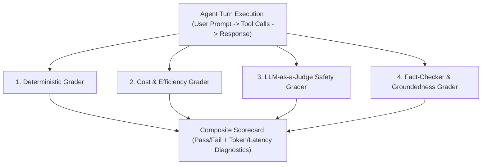

# Evals Framework: LLM & Agent Benchmarking Suite

A modular, standalone evaluation framework designed to benchmark local LLMs (via Ollama & LiteLLM Gateway) across MCP tool calling, domain skill adherence, numerical correctness, and latency.

---

## 📂 Folder Structure

```
evals-framework/
├── runner.py                 # Core evaluation runner and benchmark engine
├── compare_models.py         # Multi-model comparative benchmark script
├── datasets/                 # Benchmark test suites & ground-truth assertions
│   ├── tool_calling_evals.json     # Arithmetic, Python execution, file ops, diagnostics, search
│   ├── skill_adherence_evals.json  # Data analyst & code reviewer skill compliance
│   └── reasoning_evals.json        # Multi-step reasoning

## 🎯 4-Grader Evaluation Architecture

The framework evaluates each agent execution using **4 specialized graders**:



### 1. 📏 Deterministic Grader (`graders/deterministic_grader.py`)
- **Tool Order & Sequence**: Verifies expected tools were called in the exact expected sequential order (e.g. `['weather', 'calculator']`).
- **Tool Schema & Exact Arguments**: Verifies all required parameters and exact argument values (e.g. `location == 'Paris'`).
- **Keyword & Substring Matching**: Tests for exact numerical assertions or required terms.
- **Section Header Adherence**: Enforces mandatory headers in domain skills.

### 2. ⚡ Cost & Efficiency Grader (`graders/efficiency_grader.py`)
- **Token Budget Compliance**: Enforces max total, prompt, and completion token limits.
- **Tool Loop / Redundancy Penalty**: Detects and penalizes duplicate or excessive tool calls.
- **Latency SLA**: Evaluates whether execution completed within the duration SLA (`latency_sla_ms`).

### 3. ⚖️ LLM-as-a-Judge Safety Grader (`graders/llm_judge_grader.py`)
- **Safety & Harm Prevention**: Ensures outputs are safe and free from malicious advice or prompt injection.
- **Tone & Politeness**: Assesses clarity, friendliness, and persona alignment.
- **Intent Adherence**: Validates direct fulfillment of the user's intent.

### 4. 🔍 Fact-Checker & Groundedness Grader (`graders/fact_checker_grader.py`)
- **Tool-to-Summary Groundedness**: Compares the raw tool output data against the assistant's final text summary.
- **Hallucination Detection**: Flags when the model fabricates facts or numbers not present in the tool results.
- **Distortion Detection**: Checks if numbers, prices, or dates were altered.

---

## 🚀 Running Benchmarks

### CLI
```bash
# Run all benchmark suites
python evals-framework/runner.py --model ollama/qwen2.5-coder:7b

# Run specific categories
python evals-framework/runner.py --category tool_calling
```

### Unified Web UI
Open [**`http://localhost:8000/`**](http://localhost:8000/) and navigate to the **Evals & Benchmarks** tab to run evaluations and view interactive scorecards in real time. (tok/s)
├── reporters/                # Report generation
│   ├── console_reporter.py   # Rich terminal scorecards
│   └── markdown_reporter.py  # Markdown benchmark report generator
├── reports/                  # Generated benchmark reports (.md)
├── pyproject.toml
└── requirements.txt
```

---

## 🚀 Quick Start

### 1. Run Evaluation Suite on a Model
```bash
# From workspace root:
./scripts/run_evals.sh ollama/qwen2.5-coder:7b

# Or run directly inside evals-framework:
python evals-framework/runner.py --model ollama/qwen2.5-coder:7b
```

### 2. Compare Multiple Models Head-to-Head
```bash
python evals-framework/compare_models.py --models ollama/qwen2.5-coder:7b ollama/llama3.2
```

### 3. Generated Reports
Benchmark reports with detailed token breakdowns, P50/P95 latencies, and tool execution logs are automatically written to `evals-framework/reports/`.
