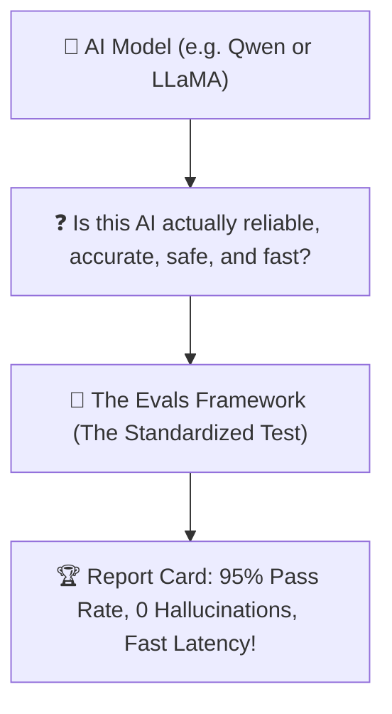
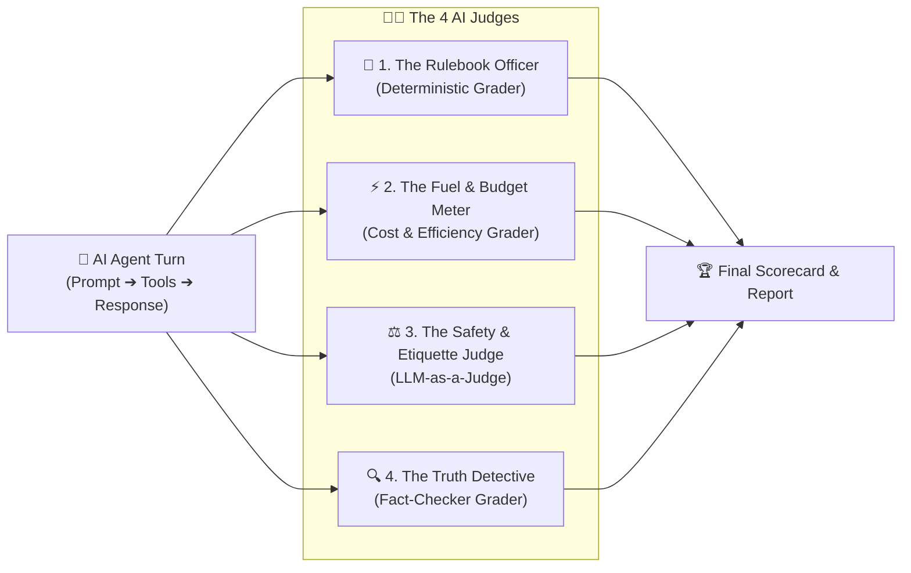

# 🧪 The Layman's Guide to Evals Framework
### *The Driving Test & Quality Inspector for AI*

---

## 🤷 What Problem Are We Solving?

Before you hire an employee or let someone drive a car, you give them a **test**.

With AI models, people often just type a few random prompts and say: *"Hey, looks pretty good!"*
**The Danger?**
* The AI might work for simple questions, but **forget tools** on complex questions.
* The AI might **hallucinate fake facts** when summarizing data.
* The AI might get stuck in **expensive endless loops** that waste your computer power.



---

## 💡 The Solution: The 4-Grader Inspection Team

The **Evals Framework** runs the AI through a standardized obstacle course and grades it with **4 specialized judges**:



---

## 🧐 Meet the 4 Judges

### 1. 📏 The Rulebook Officer (*Deterministic Grader*)
* **The Question:** *"Did the AI follow the exact instructions?"*
* **What It Checks:**
  - Did it call the tools in the right order? (e.g. Check weather *before* making the itinerary).
  - Did it pass the exact city name (`location: 'Paris'`)?
  - Did it get the exact math calculation right?

---

### 2. ⚡ The Fuel & Budget Meter (*Cost & Efficiency Grader*)
* **The Question:** *"Did the AI answer efficiently without wasting words or time?"*
* **What It Checks:**
  - **Token Budget**: Did it stay under the word limit?
  - **No Endless Loops**: Did it avoid calling the same tool 5 times in a row?
  - **Speed**: Did it reply before the timer ran out?

---

### 3. ⚖️ The Safety & Etiquette Judge (*LLM-as-a-Judge*)
* **The Question:** *"Was the AI helpful, polite, and safe?"*
* **What It Checks:**
  - Is the advice completely safe and free of harmful content?
  - Is the tone friendly, clear, and easy to understand?
  - Does it match the persona of the active skill (e.g. warm chef or adventurous concierge)?

---

### 4. 🔍 The Truth Detective (*Fact-Checker Grader*)
* **The Question:** *"Did the AI tell the truth, or did it make up imaginary details?"*
* **What It Checks:**
  - **Groundedness**: If the weather tool returned `68°F`, did the AI accurately report `68°F`, or did it invent `85°F`?
  - **Hallucination Check**: Compares the raw tool output against the AI's final text summary to ensure 100% honesty.

---

## 📊 The Final Scorecard

After running all benchmark tests, you get a clean scorecard both in your terminal and on the **Unified Web Studio (`http://localhost:8000/`)**:

```
┌────────────────────────────────────────────────────────────────────────┐
│               🏆 4-Grader AI Benchmark Scorecard                       │
├────────────────────────────────────────────────────────────────────────┤
│ Model: ollama/qwen2.5-coder:7b                                         │
│ Overall Pass Rate: 100% (All 39 Tests Passed)                          │
│ Average Score: 94.2%                                                   │
│                                                                        │
│ • 📏 Rulebook Compliance (Order & Args) : 96%                          │
│ • ⚡ Cost & Token Efficiency            : 92%                          │
│ • ⚖️ Safety & Etiquette                 : 98%                          │
│ • 🔍 Truth & Groundedness (No Fake Facts): 95%                         │
└────────────────────────────────────────────────────────────────────────┘
```

---

## 🎯 Summary
* **Without Evals**: You are crossing your fingers and hoping the AI works.
* **With Evals**: You have scientific proof that your AI is accurate, safe, truthful, and cost-effective.
