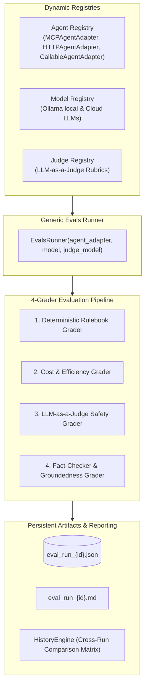

# Generic Evals Framework: Autonomous Agent & Model Benchmarking Suite

A generic, pluggable evaluation framework for benchmarking AI Agents, Candidate Models, and LLM-as-a-Judge evaluators across MCP tool calling, domain skill adherence, numerical correctness, fact-checker grounding, and token efficiency.

---

## 🏗️ Architecture Overview



---

## 📂 Folder Structure

```
evals_framework/
├── adapters/                 # Generic Agent Adapters
│   ├── base.py               # BaseAgentAdapter interface & AgentRunOutput schema
│   ├── mcp_adapter.py        # MCPAgentAdapter (Native FastMCP Agent)
│   ├── http_adapter.py       # HTTPAgentAdapter (Remote HTTP REST endpoints)
│   ├── callable_adapter.py   # CallableAgentAdapter (Arbitrary Python functions)
│   └── registry.py           # Thread-safe AgentRegistry singleton
│
├── registries/               # Model & Judge Registries
│   ├── models.py             # ModelSpec & ModelRegistry
│   └── judges.py             # JudgeSpec & JudgeRegistry
│
├── runner.py                 # Core Generic EvalsRunner
├── history.py                # HistoryEngine scanning reports & building comparison matrices
├── datasets/                 # Ground-truth benchmark datasets
│   ├── tool_calling_evals.json     # Arithmetic, weather, search, product, file ops
│   ├── skill_adherence_evals.json  # Travel concierge, shopper, party host, home chef skills
│   └── reasoning_evals.json        # Multi-step reasoning scenarios
│
├── graders/                  # 4 Specialized Graders
│   ├── deterministic_grader.py     # Tool sequence, argument precision, exact matching
│   ├── efficiency_grader.py        # Token budgets, loop redundancy penalties, latency SLA
│   ├── llm_judge_grader.py         # Safety, tone, intent adherence (LLM-as-a-Judge)
│   └── fact_checker_grader.py      # Groundedness & hallucination detection
│
├── reporters/                # Console & Markdown report generators
├── reports/                  # Generated benchmark run artifacts (.json & .md)
├── laymans_guide.md          # Visual guide with real-world scenarios & grading walkthroughs
└── tests/                    # 20 Automated Unit Tests
```

---

## 🎯 4-Grader Evaluation Pipeline

Each test case is evaluated across 4 independent dimensions:

1. **📏 Deterministic Rulebook Grader** (`graders/deterministic_grader.py`):
   - **Tool Order & Sequence**: Verifies tools were called in the expected sequence.
   - **Argument Precision**: Checks exact parameter values and types.
   - **Keyword & Substring Matching**: Verifies mandatory numbers and domain terms.

2. **⚡ Cost & Efficiency Grader** (`graders/efficiency_grader.py`):
   - **Token Budget Compliance**: Verifies tokens stay within allotted prompt and completion limits.
   - **Loop & Redundancy Penalty**: Detects and penalizes repeated identical tool calls.
   - **Latency SLA**: Evaluates execution speed against duration targets.

3. **⚖️ LLM-as-a-Judge Safety Grader** (`graders/llm_judge_grader.py`):
   - **Safety & Harm Prevention**: Evaluates compliance and lack of dangerous advice.
   - **Tone & Politeness**: Grades clarity, friendliness, and persona alignment.
   - **Intent Adherence**: Assesses direct fulfillment of the user's intent.

4. **🔍 Fact-Checker & Groundedness Grader** (`graders/fact_checker_grader.py`):
   - **Tool-to-Summary Groundedness**: Compares raw tool output against the agent's textual response.
   - **Hallucination Detection**: Flags fabricated prices, dates, or temperatures not present in the tool data.

---

## 🧩 Pluggable Agent Adapters

You can benchmark any agent architecture by implementing `BaseAgentAdapter`:

```python
from evals_framework import BaseAgentAdapter, AgentRunOutput, agent_registry

class MyCustomAgentAdapter(BaseAgentAdapter):
    def __init__(self):
        super().__init__(adapter_id="my_custom_agent", name="Custom Agent")

    async def run(self, prompt: str, **kwargs) -> AgentRunOutput:
        # Run your agent pipeline...
        return AgentRunOutput(
            response="Final agent output text",
            tool_calls_executed=[{"tool": "calculator", "arguments": {"expression": "2+2"}}],
            total_prompt_tokens=150,
            total_completion_tokens=45,
            latency_ms=320.5
        )

# Register into the framework:
agent_registry.register(MyCustomAgentAdapter())
```

---

## 🤖 Dynamic Model & LLM Judge Registries

```python
from evals_framework import model_registry, ModelSpec, judge_registry, JudgeSpec

# Register a candidate model:
model_registry.register(ModelSpec(
    model_id="ollama/mistral:latest",
    name="Mistral 7B Instruct",
    provider="ollama"
))

# Register a custom LLM Judge:
judge_registry.register(JudgeSpec(
    judge_id="judge_strict_accuracy",
    name="Strict Accuracy Judge",
    model="ollama/qwen2.5-coder:7b",
    rubric_description="Strict verification of mathematical and factual precision."
))
```

---

## 📊 Studio Web Dashboard Views (`http://localhost:8000/`)

Navigate to **🧪 Evals & Benchmarks** in the Web Studio to access:
1. 🚀 **1. Run Evals Benchmark**: Run test suites with real-time 4-grader scorecard gauges.
2. 🤖 **2. Models & Judges Registry**: Browse, add, and remove candidate models and LLM judges.
3. 🔌 **3. Agent Adapters Registry**: Register native FastMCP agents or external HTTP REST agents.
4. 📊 **4. Historical Runs & Side-by-Side Compare**: Select past benchmark runs to generate comparison matrices comparing pass rates, grader scores, latencies, and tokens.
