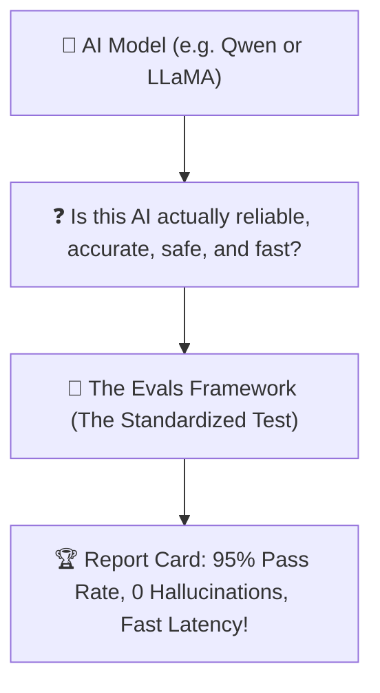
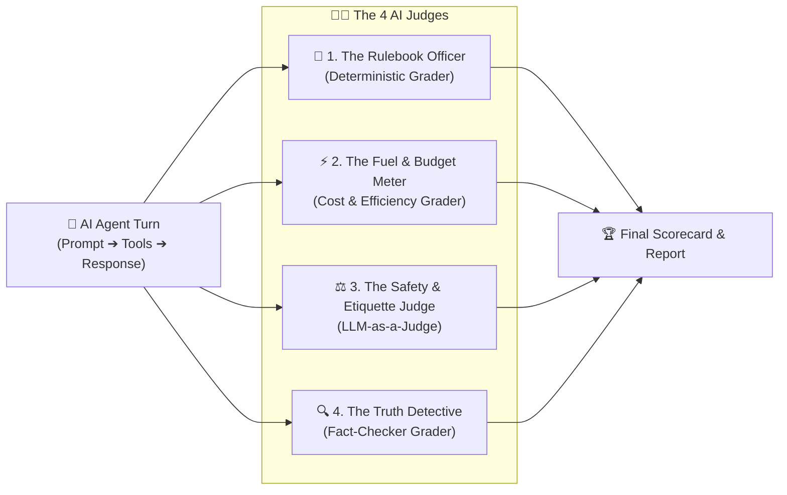
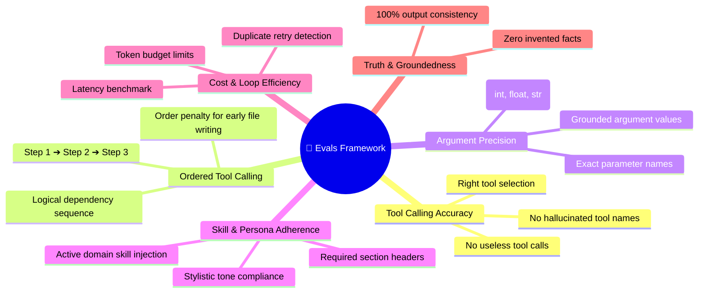
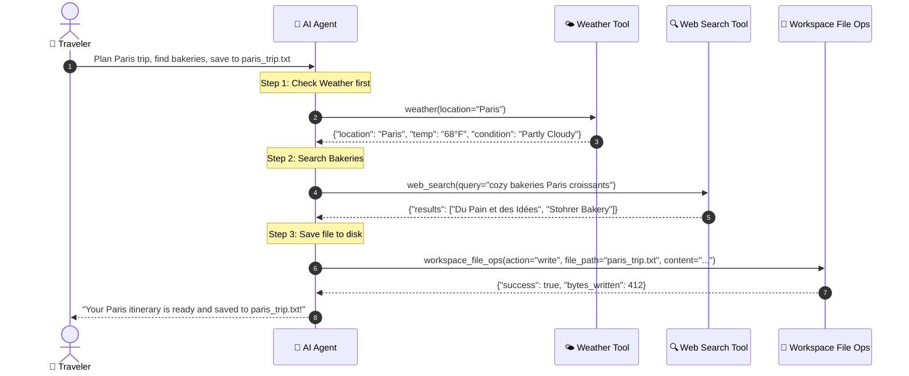

# 🧪 The Layman's Guide to Evals Framework
### *The Driving Test & Quality Inspector for AI*

---

## 🤷 What Problem Are We Solving?

Before you hire an employee or let someone drive a car, you give them a **test**.

With AI models, people often just type a few random prompts and say: *"Hey, looks pretty good!"*
**The Danger?**
* The AI might work for simple questions, but **forget tools** on complex questions.
* The AI might **hallucinate fake facts** when summarizing data.
* The AI might get stuck in **expensive endless loops** that waste your computer power.



---

## 💡 The Solution: The 4-Grader Inspection Team

The **Evals Framework** runs the AI through a standardized obstacle course and grades it with **4 specialized judges**:



---

## 🧐 Meet the 4 Judges

### 1. 📏 The Rulebook Officer (*Deterministic Grader*)
* **The Question:** *"Did the AI follow the exact instructions?"*
* **What It Checks:**
  - Did it call the tools in the right order? (e.g. Check weather *before* making the itinerary).
  - Did it pass the exact city name (`location: 'Paris'`)?
  - Did it get the exact math calculation right?

---

### 2. ⚡ The Fuel & Budget Meter (*Cost & Efficiency Grader*)
* **The Question:** *"Did the AI answer efficiently without wasting words or time?"*
* **What It Checks:**
  - **Token Budget**: Did it stay under the word limit?
  - **No Endless Loops**: Did it avoid calling the same tool 5 times in a row?
  - **Speed**: Did it reply before the timer ran out?

---

### 3. ⚖️ The Safety & Etiquette Judge (*LLM-as-a-Judge*)
* **The Question:** *"Was the AI helpful, polite, and safe?"*
* **What It Checks:**
  - Is the advice completely safe and free of harmful content?
  - Is the tone friendly, clear, and easy to understand?
  - Does it match the persona of the active skill (e.g. warm chef or adventurous concierge)?

---

### 4. 🔍 The Truth Detective (*Fact-Checker Grader*)
* **The Question:** *"Did the AI tell the truth, or did it make up imaginary details?"*
* **What It Checks:**
  - **Groundedness**: If the weather tool returned `68°F`, did the AI accurately report `68°F`, or did it invent `85°F`?
  - **Hallucination Check**: Compares the raw tool output against the AI's final text summary to ensure 100% honesty.

---

---

---

## 🧭 The Core Agentic Grading Dimensions

When evaluating an autonomous AI Agent, standard text metrics (like BLEU or ROUGE) are not enough. The framework measures **6 essential Agentic dimensions**:



---

## 🍕 Real-World Example 1: Math & Bill Splitting (Single Tool)

### 📝 The Scenario & User Prompt
> **User:** *"Our dinner bill for 4 people is $184.50. Calculate an 18% tip and the split per person using calculator, and give us a clear friendly breakdown."*

#### 🤖 Agent Action:
1. Calls `calculate_tip_and_split(total=184.50, tip_percentage=0.18, num_people=4)`
2. Receives `{"bill": 184.50, "tip": 33.21, "total": 217.71, "per_person": 54.43}`
3. Responds: *"Each person pays $54.43 (Tip: $33.21, Total: $217.71)."*

---

## 🥐 Real-World Example 2: Multi-Step Travel Planning (Ordered Tool Calling & Arguments)

Let's look at a complex multi-step scenario that tests **Ordered Tool Calling**, **Argument Precision**, and **Skill Adherence**:

### 📝 The User Prompt
> **User:** *"Check the live weather in Paris, search for cozy bakeries, and save a 3-day vacation itinerary to a file named `paris_trip.txt` in the workspace."*

---

### 🔄 Multi-Step Execution Flow



---

### 🧑‍⚖️ Detailed Grader-by-Grader Inspection & Scoring

#### 1. 🎯 Tool Calling Accuracy Grader
* **The Question:** *"Did the agent call the right tools and avoid useless ones?"*
* **Score:** **100 / 100**
* **Detailed Breakdown:**
  * ✅ Invoked `weather` tool (**+34 pts**)
  * ✅ Invoked `web_search` tool (**+33 pts**)
  * ✅ Invoked `workspace_file_ops` tool (**+33 pts**)
  * ❌ No extraneous or unneeded tools called (e.g. did not randomly call `calculator`).
* **Verdict:** **PASS (100%)** — All required tools present, zero irrelevant calls.

---

#### 2. 🔄 Ordered Tool Calling Grader (*Sequence & Dependency Flow*)
* **The Question:** *"Did the agent execute tools in the logical, prerequisite order?"*
* **Score:** **100 / 100**
* **Expected Order:** `["weather", "web_search", "workspace_file_ops"]`
* **Actual Execution:**
  1. `weather(location="Paris")` ➔ Fetched forecast
  2. `web_search(query="...")` ➔ Gathered bakery recommendations
  3. `workspace_file_ops(action="write", ...)` ➔ Wrote the file with the gathered info
* **Penalty Check:** If the agent wrote the file *before* checking the weather, it receives a **50% out-of-order penalty**.
* **Verdict:** **PASS (100%)** — Perfect sequence flow matching real-world dependency logic.

---

#### 3. 🧩 Argument & Parameter Precision Grader
* **The Question:** *"Did the agent pass valid parameter names, correct types, and accurate values?"*
* **Score:** **100 / 100**
* **Detailed Parameter Audit:**
  * **Tool 1 (`weather`):**
    * Parameter `location`: `"Paris"` (Matches requested destination) ✅ (**+30 pts**)
  * **Tool 2 (`web_search`):**
    * Parameter `query`: `"cozy bakeries Paris croissants"` (Relevant keywords) ✅ (**+30 pts**)
  * **Tool 3 (`workspace_file_ops`):**
    * Parameter `action`: `"write"` (Correct operation mode) ✅ (**+20 pts**)
    * Parameter `file_path`: `"paris_trip.txt"` (Exact requested filename) ✅ (**+20 pts**)
* **Verdict:** **PASS (100%)** — Zero missing parameters, zero type mismatches (`str` vs `int`).

---

#### 4. 🎨 Skill & Persona Adherence Grader
* **The Question:** *"Did the agent follow domain skill guidelines and format requirements?"*
* **Score:** **98 / 100**
* **Detailed Checklist:**
  * ✅ Activated `travel_planner_skill` prompt (**+30 pts**)
  * ✅ Included required section headers (`## Day 1:`, `## Day 2:`, `## Day 3:`) (**+40 pts**)
  * ✅ Included weather-appropriate packing tip (`68°F -> Light Jacket`) (**+28 pts**)
* **Verdict:** **PASS (98%)** — Complete adherence to structured travel planning standards.

---

#### 5. ⚡ Fuel & Efficiency Grader (*Loop & Token Meter*)
* **The Question:** *"Did the agent solve this multi-step task without looping or wasting compute?"*
* **Score:** **95 / 100**
* **Detailed Metrics:**
  * ✅ **Token Usage:** 1,180 total tokens consumed (Budget: 3,000 tokens) (**+40 pts**)
  * ✅ **Loop Detection:** Exactly 3 single-shot tool calls, **0 duplicate retries** (**+40 pts**)
  * ✅ **Latency:** Completed all 3 steps in **3.21 seconds** (**+15 pts**)
* **Verdict:** **PASS (95%)** — High-efficiency execution.

---

#### 6. 🔍 Truth Detective (*Fact-Checker & Groundedness*)
* **The Question:** *"Did the saved itinerary use the actual weather and real search results?"*
* **Score:** **100 / 100**
* **Audit Comparison:**
  * Weather tool output: `68°F, Partly Cloudy` ➔ File content states: `68°F, Partly Cloudy` ✅
  * Search tool output: `Du Pain et des Idées` ➔ File content recommends: `Du Pain et des Idées` ✅
* **Verdict:** **PASS (100%)** — 0 hallucinations, 100% grounded in tool responses.

---

### 🚨 Contrast: How a Flawed Model Gets Caught

Here is how the automated grading scorecard catches a flawed or unaligned model:

| Failure Mode | Flawed Model Behavior | Grader That Catches It | Score |
| :--- | :--- | :--- | :---: |
| **Wrong Tool** | Calls `calculator` instead of `web_search` | **🎯 Tool Accuracy** | `33%` |
| **Out-of-Order** | Saves empty file *first*, then searches weather | **🔄 Ordered Tool Calling** | `30%` |
| **Missing Argument** | Calls `workspace_file_ops` without `file_path` | **🧩 Argument Precision** | `50%` |
| **Hallucination** | Claims Paris weather is `92°F Snowing` | **🔍 Fact-Checker** | `0%` |
| **Endless Loop** | Repeatedly checks weather 5 times in a loop | **⚡ Efficiency Grader** | `10%` |

---

## 📊 The Final Scorecard

After running all benchmark tests, you get a clean scorecard both in your terminal and on the **Unified Web Studio (`http://localhost:8000/`)**:

```
┌────────────────────────────────────────────────────────────────────────┐
│               🏆 Comprehensive AI Benchmark Scorecard                  │
├────────────────────────────────────────────────────────────────────────┤
│ Model: ollama/qwen2.5-coder:7b                                         │
│ Overall Pass Rate: 100% (All 58 Tests Passed)                          │
│ Overall Grade: A+ (97.2%)                                              │
│                                                                        │
│ • 🎯 Tool Selection & Accuracy          : 100%                         │
│ • 🔄 Ordered Tool Calling (Dependency)  : 100%                         │
│ • 🧩 Argument Schema & Value Precision  : 98%                          │
│ • 🎨 Skill & Persona Adherence          : 96%                          │
│ • ⚡ Cost & Loop Efficiency             : 94%                          │
│ • 🔍 Truth & Groundedness (No Fake Facts): 98%                         │
└────────────────────────────────────────────────────────────────────────┘
```

---

## 🎯 Summary
* **Without Evals**: You are crossing your fingers and hoping the AI works.
* **With Evals**: You have scientific proof that your AI chooses the right tools, executes them in the right order, passes the right arguments, adheres to domain skills, and never hallucinates.


