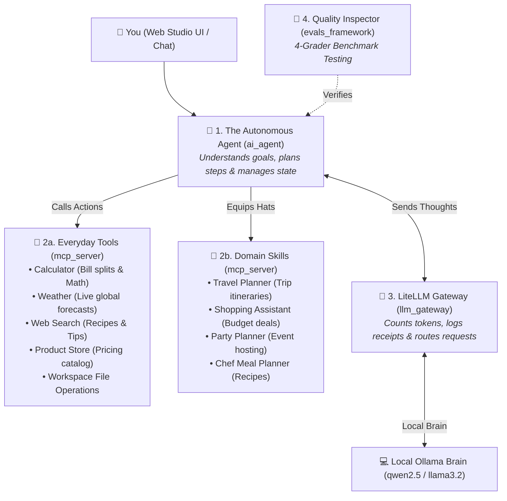
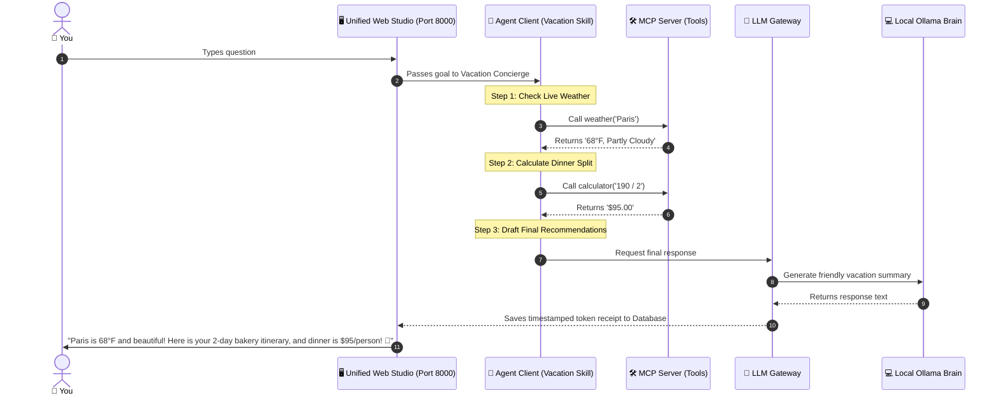

# 🏰 The Layman's Grand Tour of Agentic AI
### *How All 4 Projects Work Together as One Supercharged AI Assistant*

---

## 🌟 The Big Picture in 30 Seconds

Think of this entire project as building a **World-Class AI Concierge Agency**:



---

## 🏢 The 4 Team Members Explained Simply

| Folder | Name & Analogy | What It Does For You |
| :--- | :--- | :--- |
| 🛠️ [**`mcp_server/`**](file:///Users/donthireddy/code/github/agentic-ai/mcp_server/laymans_guide.md) | **The Toolbelt & Hands** | Gives the AI real-world tools: calculating bill splits, live weather, web search, product catalog, safe SQL queries, GraphRAG knowledge graphs, and Python data plotting. |
| 🧠 [**`ai_agent/`**](file:///Users/donthireddy/code/github/agentic-ai/ai_agent/laymans_guide.md) | **The Smart Concierge & Swarm** | Solves multi-step problems (Think ➔ Act ➔ Observe ➔ Answer), runs adversarial Red-Team Debates, orchestrates multi-agent DAG swarms, and federates external MCP servers. |
| 🛂 [**`llm_gateway/`**](file:///Users/donthireddy/code/github/agentic-ai/llm_gateway/laymans_guide.md) | **The Air Traffic Controller & Security Guard** | Redacts sensitive credit cards/SSNs in flight, blocks prompt injection attacks, logs audit receipts, exports OpenTelemetry spans, and hosts the **11-Tab Web Studio UI** at `http://localhost:8000/`. |
| 🧪 [**`evals_framework/`**](file:///Users/donthireddy/code/github/agentic-ai/evals_framework/laymans_guide.md) | **The Driving Test & Quality Inspector** | Grades the AI with 4 judges: Rulebook compliance, Token budget efficiency, Safety, and Truthfulness (no hallucinations). |

---

## 🎨 Next-Gen Superpowers Explained in Plain English

| Superpower | The Real-World Analogy | What It Does For You |
| :--- | :--- | :--- |
| **🤖 Multi-Agent Debate (`debate.py`)** | **The Courtroom Trial** | Instead of trusting one model that might hallucinate, an *Author Agent* presents a plan, a *Red-Team Critic Agent* attacks it for flaws, and an *Arbitrator* writes the verified final consensus. |
| **🕸️ GraphRAG Knowledge Graph (`graph_memory.py`)** | **The Family Tree of Facts** | Connects people, projects, files, and tools into a web of relationships so the AI can answer multi-hop questions like *"Who worked on Project Apollo and what tools did they use?"* |
| **🐍 Python Sandbox & Plotly (`python_tool.py`)** | **The On-Demand Math Laboratory** | Lets the AI write real Python code to crunch numbers, calculate statistics, and generate interactive zoomable charts right inside the chat window. |
| **📑 Live Artifacts Side-Panel (`ArtifactPanel.jsx`)** | **The Split-Screen Projector** | Opens a dedicated side-panel (Claude Artifacts style) to run interactive HTML widgets, preview code, and download documents without cluttering the chat stream. |
| **🎨 Visual Workflow Canvas (`CanvasView.jsx`)** | **The Lego Builder for AI** | A visual drag-and-drop board where you can connect Agent Nodes, Tool Nodes, and Manager Approval Gates into automated pipelines with one click. |
| **🛡️ PII & Injection Firewall (`firewall.py`)** | **The Airport Security Scanner** | Automatically blacks out Social Security Numbers and Credit Cards before sending them to cloud models, and blocks malicious hacker prompts. |

---

## 🎬 A Real-World Story: Planning a Weekend in Paris

Here is what happens when you type:
> *"I'm going to Paris with a friend. What's the weather, what's a good 2-day itinerary with cozy bakeries, and how much is a $190 dinner split between 2 people?"*



---

## 🚀 How to Experience It in 1 Step

You can launch the entire ecosystem in **one single command**:

```bash
# Start the unified studio
docker compose up -d

# Open in your browser:
# http://localhost:8000
```

./scripts/docker_run.sh
```

Then open your browser to:
👉 [**`http://localhost:8000/`**](http://localhost:8000/)

* Chat with the AI using real-world tools.
* Watch token meters and live charts.
* Run the 4-grader evaluation benchmark suite with one click!
