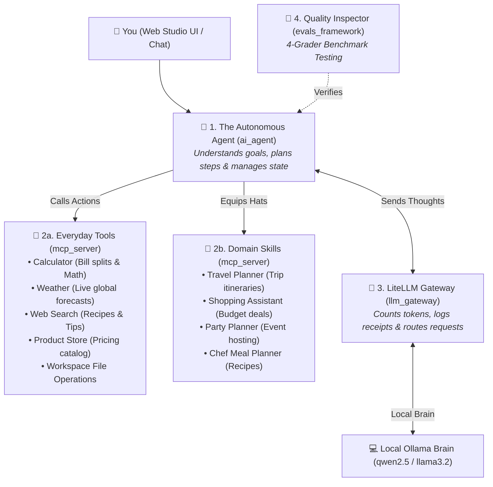
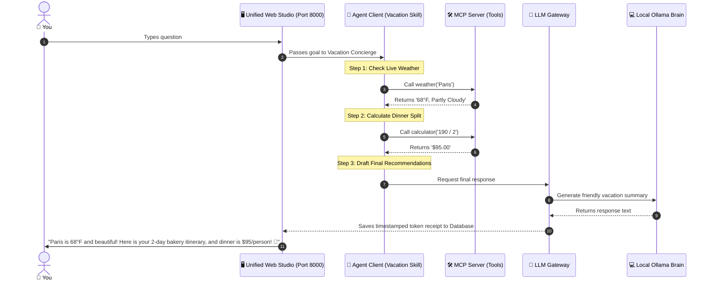
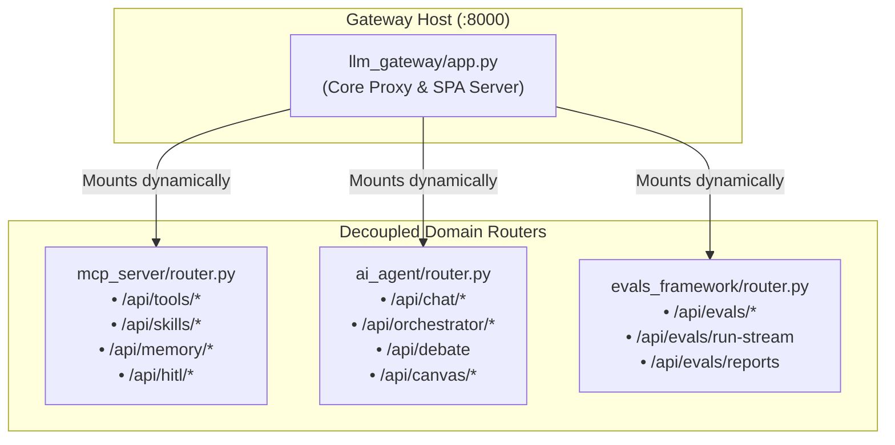
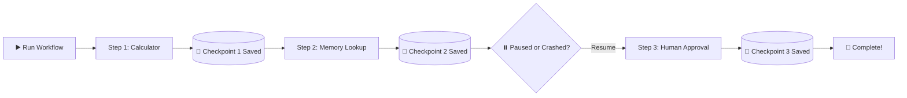

# 🏰 The Layman's Grand Tour of Agentic AI
### *How All 4 Projects Work Together as One Supercharged AI Assistant*

> 📚 **Looking for step-by-step feature guides?** Check out the [Comprehensive Step-by-Step Learning Tracks](docs/README.md).

---

## 🌟 The Big Picture in 30 Seconds

Think of this entire project as building a **World-Class AI Concierge Agency**:



---

## 🏢 The 4 Team Members Explained Simply

| Folder | Name & Analogy | What It Does For You |
| :--- | :--- | :--- |
| 🛠️ [**`mcp_server/`**](file:///Users/donthireddy/code/github/agentic-ai/mcp_server/laymans_guide.md) | **The Toolbelt & Hands** | Gives the AI real-world tools: calculating bill splits, live weather, web search, product catalog, safe SQL queries, GraphRAG knowledge graphs, and Python data plotting. |
| 🧠 [**`ai_agent/`**](file:///Users/donthireddy/code/github/agentic-ai/ai_agent/laymans_guide.md) | **The Smart Concierge & Swarm** | Solves multi-step problems (Think ➔ Act ➔ Observe ➔ Answer), runs adversarial Red-Team Debates, orchestrates multi-agent DAG swarms, and federates external MCP servers. |
| 🛂 [**`llm_gateway/`**](file:///Users/donthireddy/code/github/agentic-ai/llm_gateway/laymans_guide.md) | **The Air Traffic Controller & Security Guard** | Redacts sensitive credit cards/SSNs in flight, blocks prompt injection attacks, logs audit receipts, exports OpenTelemetry spans, and hosts the **11-Tab Web Studio UI** at `http://localhost:8000/`. |
| 🧪 [**`evals_framework/`**](file:///Users/donthireddy/code/github/agentic-ai/evals_framework/laymans_guide.md) | **The Driving Test & Quality Inspector** | Grades the AI with 4 judges: Rulebook compliance, Token budget efficiency, Safety, and Truthfulness (no hallucinations). |

---

## 🎨 Next-Gen Superpowers Explained in Plain English

| Superpower | The Real-World Analogy | What It Does For You |
| :--- | :--- | :--- |
| **🤖 Multi-Agent Debate (`debate.py`)** | **The Courtroom Trial** | Instead of trusting one model that might hallucinate, an *Author Agent* presents a plan, a *Red-Team Critic Agent* attacks it for flaws, and an *Arbitrator* writes the verified final consensus. |
| **🕸️ GraphRAG Knowledge Graph (`graph_memory.py`)** | **The Family Tree of Facts** | Connects people, projects, files, and tools into a web of relationships so the AI can answer multi-hop questions like *"Who worked on Project Apollo and what tools did they use?"* |
| **🐍 Python Sandbox & Plotly (`python_tool.py`)** | **The On-Demand Math Laboratory** | Lets the AI write real Python code to crunch numbers, calculate statistics, and generate interactive zoomable charts right inside the chat window. |
| **📑 Live Artifacts Side-Panel (`ArtifactPanel.jsx`)** | **The Split-Screen Projector** | Opens a dedicated side-panel (Claude Artifacts style) to run interactive HTML widgets, preview code, and download documents without cluttering the chat stream. |
| **🎨 Visual Workflow Canvas (`CanvasView.jsx`)** | **The Lego Builder for AI** | A visual drag-and-drop board where you can connect Agent Nodes, Tool Nodes, and Manager Approval Gates into automated pipelines with one click. |
| **💾 Durable State Machine & Checkpointing (`router.py`)** | **The Video Game Auto-Save Checkpoint** | Saves every single step of your workflow to disk. If your laptop battery dies or the server restarts, you click "Resume" and pick up right where you left off without wasting tokens! |
| **🛡️ PII & Injection Firewall (`firewall.py`)** | **The Airport Security Scanner** | Automatically blacks out Social Security Numbers and Credit Cards before sending them to cloud models, and blocks malicious hacker prompts. |
| **📦 Context Compaction (`/compact`)** | **The Executive Briefing Binder** | When a conversation gets long, summarizes earlier turns into crisp bullet points, saving 80% token costs and preventing the AI from getting confused. |

---

## 🎬 A Real-World Story: Planning a Weekend in Paris

Here is what happens when you type:
> *"I'm going to Paris with a friend. What's the weather, what's a good 2-day itinerary with cozy bakeries, and how much is a $190 dinner split between 2 people?"*



---

## 🧩 The Decoupled Architecture: Independent Lego Bricks

### 1. What It Does (Plain English & Analogy)
Think of the platform as a **Professional Sound Studio**:
- **The Mixing Console (`llm_gateway`)**: Manages volume, routing, and master recording meters.
- **The Microphones & Instruments (`mcp_server`)**: Real-world inputs like weather sensors, calculators, and file storage.
- **The Lead Vocalist & Musicians (`ai_agent`)**: Composes songs, improvises solos, and runs rehearsal debates.
- **The Sound Quality Inspector (`evals_framework`)**: Checks audio frequencies, cleans background noise, and certifies master tracks.
- **The Decoupling Magic**: Each component lives in its own room. If the band goes on break, the mixing console doesn't crash. You can plug any microphone into any mixer, or record solo tracks independently!

### 2. Why & How It Helps (Value Proposition)
| ❌ The Challenge Before (Monolithic App Dump) | ✅ How This Solves It (Decoupled Microservice Architecture) |
| :--- | :--- |
| **All Routes in One Mega-File**: 2,100+ lines in `llm_gateway/app.py` combining proxy routes, agent swarms, tool sandboxes, and evals. | **Dedicated Domain Routers**: Clean APIRouters in [`ai_agent/router.py`](file:///Users/donthireddy/code/github/agentic-ai/ai_agent/router.py), [`mcp_server/router.py`](file:///Users/donthireddy/code/github/agentic-ai/mcp_server/router.py), and [`evals_framework/router.py`](file:///Users/donthireddy/code/github/agentic-ai/evals_framework/router.py). |
| **Tight Coupling & Circular Imports**: Couldn't import or test `llm_gateway` without installing all agent and eval dependencies. | **Zero-Dependency Dynamic Mounting**: Gateway mounts subproject routers with graceful `try/except ImportError` fallbacks. |
| **Monolithic Testing Fragility**: A small change in an eval grader or canvas node could prevent the gateway from starting up. | **Independent Test Boundaries**: Standalone test suites discoverable instantly via root [`pytest.ini`](file:///Users/donthireddy/code/github/agentic-ai/pytest.ini). |

### 3. Real-World Simple Step-by-Step Scenario: Independent Operation
1. **Scenario**: A data engineer wants to run automated regression evals on their company's custom LLaMA-3 model overnight without starting the React WebUI or MCP tools.
2. **Action**: They run `python evals_framework/runner.py --model ollama/llama3.2`.
3. **Execution**: The evaluation framework runs 4 judges (Deterministic, Cost, LLM Judge, Fact-Checker) directly against the local model.
4. **Output**: A comprehensive markdown scorecard saved in `evals_framework/reports/` with zero web server overhead!

### 4. Witty, Engaging & Humorous Commentary
> *"In software engineering, there is a famous temptation known as 'just add one more endpoint to app.py'. Before you know it, your humble 100-line reverse proxy has become a sentient 2,100-line monolith capable of ordering pizza and solving Rubik's cubes. By breaking the application into crisp, courteous subproject routers, we gave every subsystem its own house with a neat front lawn."*

### 5. Visual Flows & Under-the-Hood Code


```python
# Graceful router mounting in llm_gateway/app.py
try:
    from ai_agent.router import router as agent_router
    app.include_router(agent_router)
    logger.info("Mounted ai_agent router successfully")
except ImportError as err:
    logger.warning(f"ai_agent router not loaded: {err}")
```

---

## 💾 The Video Game Auto-Save Checkpoint: Never Lose Workflow Progress

### 1. What It Does (Plain English & Analogy)
> **The Analogy: *"The Video Game Auto-Save & DVR Pause Button"***  
> Ever had your game console turn off right before reaching the final castle? Without auto-save, you lose 3 hours of progress. With auto-save, you press **Continue** and spawn right at the castle gates.  
> 
> The **Durable State Machine** does this for your AI workflows. When a visual pipeline runs across multiple steps (calculate numbers, search documents, ask human permission, summarize reports), each step's result is saved immediately into a database on disk. If your laptop restarts, your internet cuts out, or the agent pauses for 3 days waiting for a manager's signature, you click **Resume** and the engine continues without re-running finished steps!

### 2. Why & How It Helps
| The Challenge Before | How Auto-Save Solves It |
| :--- | :--- |
| **Amnesia on Crash**: If the computer restarts, a 10-step workflow is erased from memory. | **Durable SQLite Checkpoints**: Every step is written to disk in milliseconds. |
| **Burning Money on Re-Runs**: Re-starting a pipeline from scratch re-runs already successful AI calls, costing real money. | **Smart Step Skipping**: The system skips all completed steps and only runs the remaining ones. |
| **Lost Approval Requests**: When an AI pauses for human approval, a reboot used to destroy the question. | **Persistent Approvals**: Pending questions are saved safely to disk and reload upon startup. |

### 3. A Real-World Story: The Split Bill & Expense Report
1. **Step 1 (Calculator)**: The AI splits a $400 business team dinner between 4 people ($100 each). Auto-saved!
2. **Step 2 (Memory)**: The AI checks company policy for daily meal allowances. Auto-saved!
3. **Step 3 (Human Gate)**: The AI halts and asks the manager: *"Approve $100 expense reimbursement?"*
4. **Crash!**: The developer closes their laptop lid and drives home.
5. **Resume**: The manager opens the dashboard next morning, hits **Resume**, approves the request, and the final expense PDF is created instantly!

### 4. Witty Commentary
> *"The author once lost an entire term paper because Microsoft Word crashed in 2004 before auto-save was invented. We built this feature so that your AI agents will never suffer that trauma."*

### 5. Visual Flow



---

## 🚀 How to Experience It in 1 Step

You can launch the entire ecosystem in **one single command**:

```bash
# Option A: Start using Docker Compose
docker compose up -d

# Option B: Start using the local runner script
./scripts/docker_run.sh
```

Then open your browser to:
👉 [**`http://localhost:8000/`**](http://localhost:8000/)

* Chat with the AI using real-world tools.
* Watch token meters and live charts across 11 Studio Views.
* Run the 4-grader evaluation benchmark suite with one click!
