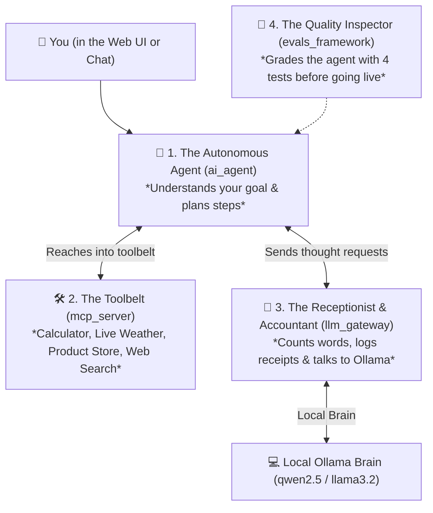
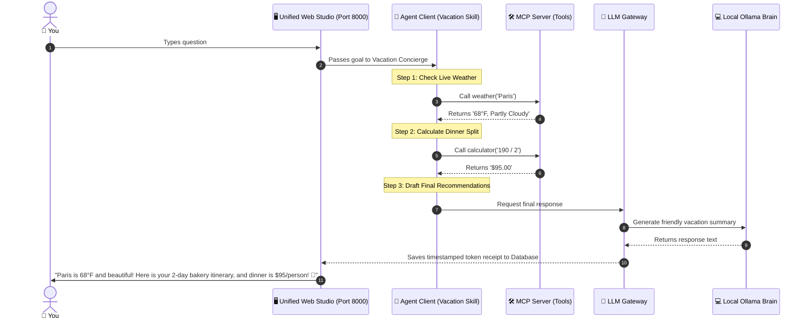

# 🏰 The Layman's Grand Tour of Agentic AI
### *How All 4 Projects Work Together as One Supercharged AI Assistant*

---

## 🌟 The Big Picture in 30 Seconds

Think of this entire project as building a **World-Class AI Concierge Agency**:



---

## 🏢 The 4 Team Members Explained Simply

| Folder | Name & Analogy | What It Does For You |
| :--- | :--- | :--- |
| 🛠️ [**`mcp_server/`**](file:///Users/donthireddy/code/github/agentic-ai/mcp_server/laymans_guide.md) | **The Toolbelt & Hands** | Gives the AI real-world tools: calculating bill splits, looking up live weather, searching 15-min pasta recipes, and checking product prices. |
| 🧠 [**`ai_agent/`**](file:///Users/donthireddy/code/github/agentic-ai/ai_agent/laymans_guide.md) | **The Smart Concierge** | Solves multi-step problems (Think ➔ Act ➔ Observe ➔ Answer) and wears specialized skill hats (Vacation Guide, Shopper, Party Host, Chef). |
| 🛂 [**`llm_gateway/`**](file:///Users/donthireddy/code/github/agentic-ai/llm_gateway/laymans_guide.md) | **The Air Traffic Controller & Accountant** | Logs every conversation receipt, counts word tokens, tracks speed, and hosts the **Unified Web Studio UI** at `http://localhost:8000/`. |
| 🧪 [**`evals_framework/`**](file:///Users/donthireddy/code/github/agentic-ai/evals_framework/laymans_guide.md) | **The Driving Test & Quality Inspector** | Grades the AI with 4 judges: Rulebook compliance, Token budget efficiency, Safety, and Truthfulness (no hallucinations). |

---

## 🎬 A Real-World Story: Planning a Weekend in Paris

Here is what happens when you type:
> *"I'm going to Paris with a friend. What's the weather, what's a good 2-day itinerary with cozy bakeries, and how much is a $190 dinner split between 2 people?"*



---

## 🚀 How to Experience It in 1 Step

You can launch the entire ecosystem in **one single command**:

```bash
# Start the unified studio
./scripts/docker_run.sh
```

Then open your browser to:
👉 [**`http://localhost:8000/`**](http://localhost:8000/)

* Chat with the AI using real-world tools.
* Watch token meters and live charts.
* Run the 4-grader evaluation benchmark suite with one click!
