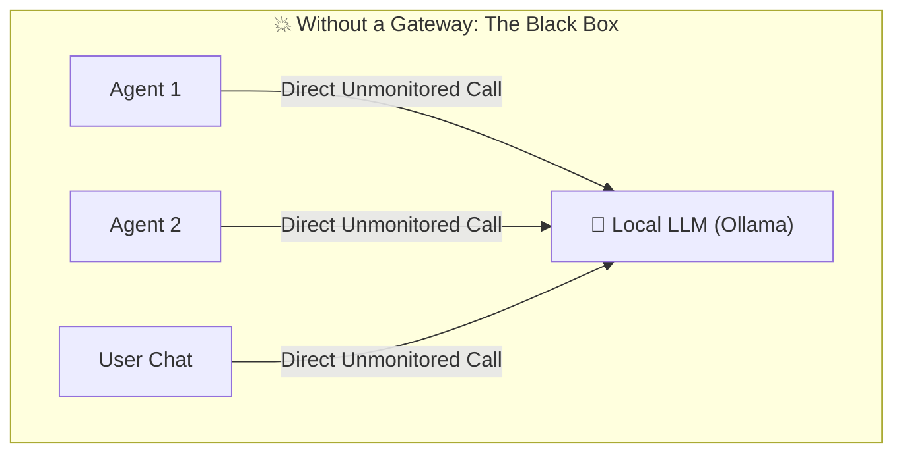
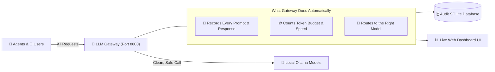
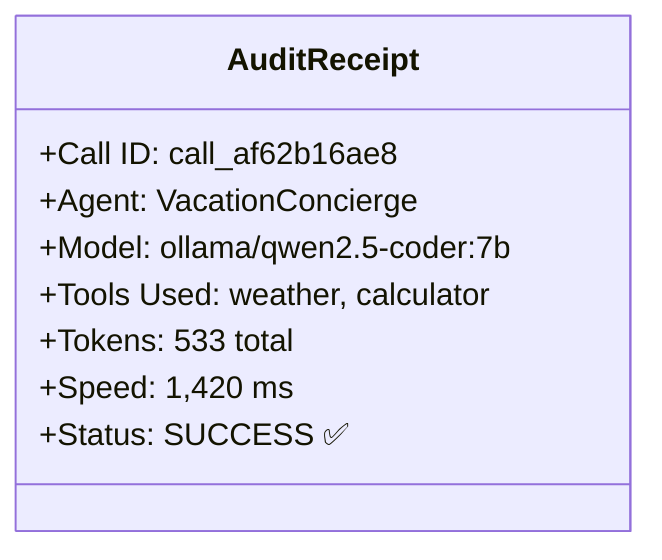
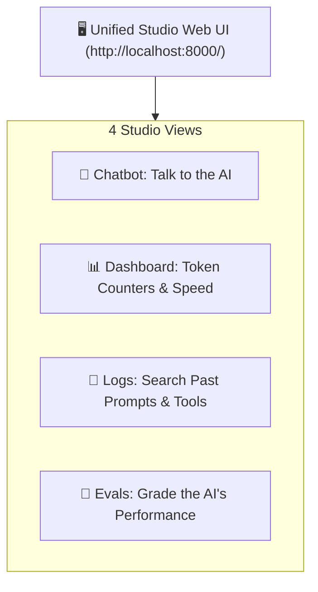

# 🛂 The Layman's Guide to LLM Gateway
### *The Air Traffic Controller & Transparent Accountant for AI*

---

## 🤷 What Problem Are We Solving?

Imagine running a busy office where dozens of employees and robots are constantly making long-distance phone calls to AI services:

**The Chaos:**
1. **No Receipts**: You have no idea how many words ("tokens") were used or how much energy was spent.
2. **No Audit Trail**: If the AI gave strange advice 3 days ago, you can't go back and see the exact question and answer.
3. **No Central Switchboard**: If you want to switch from `qwen2.5-coder` to `llama3.2`, you'd have to edit code in 20 different places.

---

## 💡 The Solution: LiteLLM Gateway

The **LLM Gateway** sits in the middle like a **friendly, meticulous Receptionist & Air Traffic Controller**:

---

## 🌟 What Does the Gateway Give You?

### 1. 🧾 The Itemized Receipt (Audit Logging)
Every single time an AI thinks or speaks, the gateway creates a timestamped receipt containing:
* **Who called?** (e.g. `User_Chat`, `Travel_Agent`, `Party_Host`).
* **What was asked?** (The exact prompt).
* **What tools were used?** (e.g. `weather`, `calculator`).
* **Token bill**: How many prompt words went in, and how many answer words came out.
* **Speed**: How many milliseconds the local computer took to generate the answer.

---

### 2. 📊 Live Telemetry & Mission Control
The Gateway provides a **real-time visual dashboard** right at `http://localhost:8000/`:
* **Token Counters**: Watch prompt and completion token usage in real time.
* **Traffic Charts**: See which models and tools get the most use.
* **Searchable Log Book**: Search any past prompt by name, model, or session ID and click **Inspect** to see the full conversation tree!

---

## 🎯 Summary
* **Without Gateway**: A scary black box where you don't know what the AI did or how much it cost.
* **With Gateway**: Complete visibility, security, instant replay, and live charts for every single conversation.
