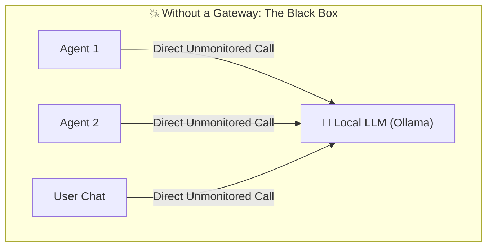
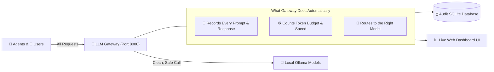
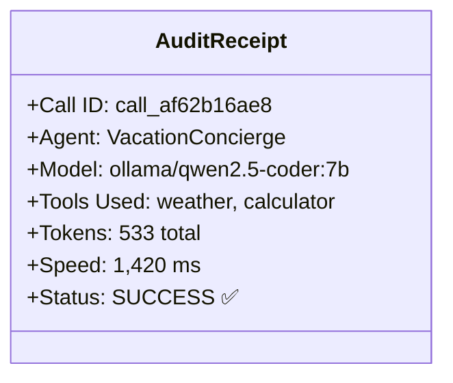
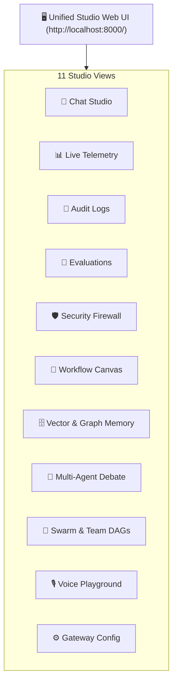
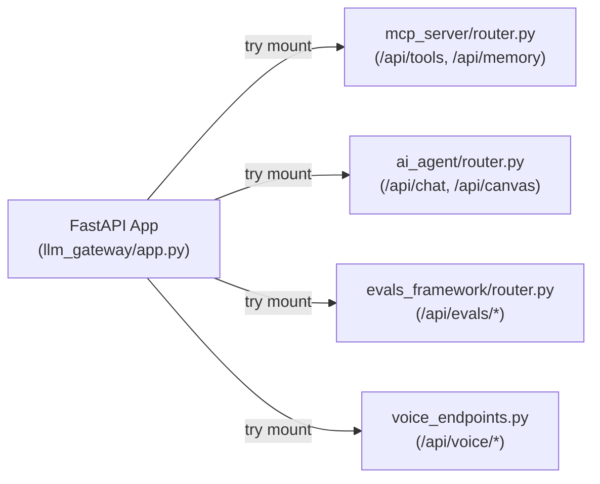

# 🛂 The Layman's Guide to LLM Gateway
### *The Air Traffic Controller & Transparent Accountant for AI*

---

## 🤷 What Problem Are We Solving?

Imagine running a busy office where dozens of employees and robots are constantly making long-distance phone calls to AI services:



**The Chaos:**
1. **No Receipts**: You have no idea how many words ("tokens") were used or how much energy was spent.
2. **No Audit Trail**: If the AI gave strange advice 3 days ago, you can't go back and see the exact question and answer.
3. **No Central Switchboard**: If you want to switch from `qwen2.5-coder` to `llama3.2`, you'd have to edit code in 20 different places.

---

## 💡 The Solution: LiteLLM Gateway

The **LLM Gateway** sits in the middle like a **friendly, meticulous Receptionist & Air Traffic Controller**:



---

## 🌟 What Does the Gateway Give You?

### 1. 🧾 The Itemized Receipt (Audit Logging)
Every single time an AI thinks or speaks, the gateway creates a timestamped receipt containing:
* **Who called?** (e.g. `User_Chat`, `Travel_Agent`, `Party_Host`).
* **What was asked?** (The exact prompt).
* **What tools were used?** (e.g. `weather`, `calculator`).
* **Token bill**: How many prompt words went in, and how many answer words came out.
* **Speed**: How many milliseconds the local computer took to generate the answer.



---

### 2. 📊 Live Telemetry & Mission Control
The Gateway provides a **real-time visual dashboard** right at `http://localhost:8000/`:
* **Token Counters**: Watch prompt and completion token usage in real time.
* **Traffic Charts**: See which models and tools get the most use.
* **Searchable Log Book**: Search any past prompt by name, model, or session ID and click **Inspect** to see the full conversation tree!



---

## 🧩 The Decoupled Gateway Architecture: Modularity Without Bloat

### 1. What It Does (Plain English & Analogy)
Think of the Gateway as a **Modular Home Theater Receiver**:
- The receiver itself handles power, volume, and routing audio/video inputs.
- You can plug in a game console (`ai_agent`), a 4K Blu-ray player (`evals_framework`), or external smart speakers (`mcp_server`).
- If you unplug the game console, your receiver doesn't blow a fuse or refuse to play sound. It simply plays whatever inputs remain connected!
- In the same way, [`llm_gateway/app.py`](file:///Users/donthireddy/code/github/agentic-ai/llm_gateway/app.py) handles LiteLLM proxying and static asset serving, while dynamically mounting feature routers from [`ai_agent/router.py`](file:///Users/donthireddy/code/github/agentic-ai/ai_agent/router.py), [`mcp_server/router.py`](file:///Users/donthireddy/code/github/agentic-ai/mcp_server/router.py), and [`evals_framework/router.py`](file:///Users/donthireddy/code/github/agentic-ai/evals_framework/router.py) with graceful fallbacks.

### 2. Why & How It Helps (Value Proposition)
| The Challenge Before (Monolithic 2,100-Line File) | How This Solves It (Decoupled Subsystems) |
| :--- | :--- |
| `app.py` was 2,103 lines long, coupling agent debate, evals benchmarks, tool sandboxes, and DAG canvas logic into one giant file. | `app.py` is shrunk down to ~480 lines of pure gateway logic, with domain routers self-contained in their own subprojects. |
| Running tests or importing the gateway required installing all agent and eval dependencies. | Zero hard dependencies: if `ai_agent` or `evals_framework` isn't installed, the gateway still boots as a pure LiteLLM proxy. |
| Modifying an agent prompt or evaluation grader risked breaking gateway routing or causing git merge conflicts. | Independent codebases with clear ownership and zero cross-project spillover. |

### 3. Real-World Simple Step-by-Step Scenario: Standalone Deployment
1. **Scenario**: A devops engineer wants to deploy *only* the LiteLLM Gateway in an air-gapped VPC to provide token budgeting and PII redacting for internal teams.
2. **Action**: They package only the `llm_gateway/` directory into a lightweight container.
3. **Execution**: The server boots up instantly, logging:
   `ℹ️ Agent router not loaded: No module named 'ai_agent'`
   `🚀 LLM Gateway online at http://0.0.0.0:8000 (Proxy Mode Active)`
4. **Result**: Full OpenAI-compatible proxy (`/v1/*`), cost tracking, and PII firewall work out-of-the-box without pulling in gigabytes of unused dependencies.

### 4. Witty, Engaging & Humorous Commentary
> *"The author once saw a project where changing a button label in the React UI required recompiling a C++ database driver. In our early iterations, `app.py` was dangerously close to that level of 'everything-bagel' energy: asking for an audit log required importing Kahn's algorithm for canvas execution! Now, the gateway is a polite butler who only serves what is on the menu."*

### 5. Visual Flows & Under-the-Hood Code


```python
# Graceful router mounting in llm_gateway/app.py
try:
    from mcp_server.router import router as mcp_router
    app.include_router(mcp_router)
    logger.info("Mounted mcp_server router successfully")
except ImportError as err:
    logger.warning(f"MCP server router not loaded: {err}")
```

---

## 🎯 Summary
* **Without Gateway**: A scary black box where you don't know what the AI did or how much it cost.
* **With Gateway**: Complete visibility, security, instant replay, and live charts for every single conversation.
* **Decoupled Architecture**: Clean microservice boundaries where each component runs independently or clicks together seamlessly.
