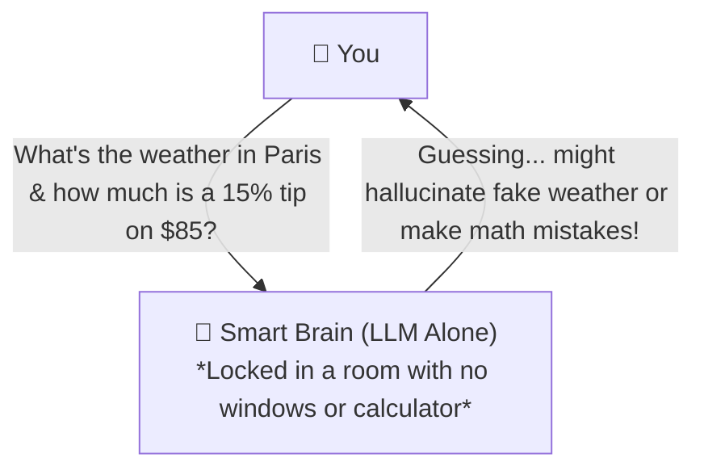
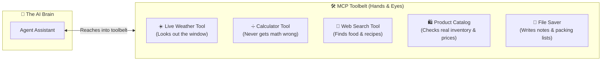
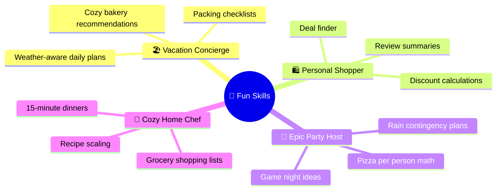
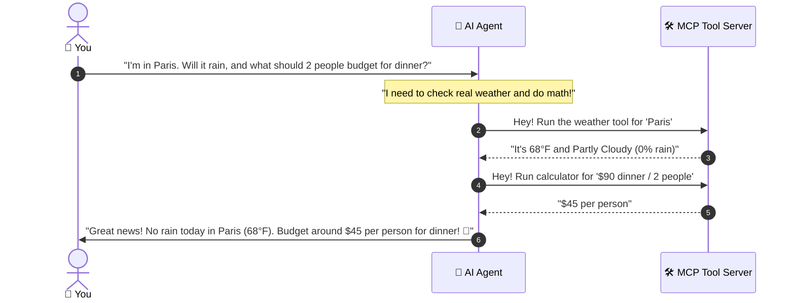

# 🛠️ The Layman's Guide to MCP Server
### *Giving AI "Hands, Eyes, and a Toolbelt" to Help in the Real World*

---

## 🤷 What Problem Are We Solving?

Imagine you hired the smartest assistant in the world. They have read every encyclopedia, poem, and philosophy book ever written. 

**The Catch?**
They are locked in a soundproof room with **no windows, no calculator, and no internet connection**. 

If you ask them:
* *"What's the temperature in Paris right now?"* ➔ **They have to guess** (because they can't look out the window).
* *"Split an $85.40 dinner bill among 3 people with a 15% tip"* ➔ **They might mess up the math** (because language brains aren't calculators).
* *"Is this espresso machine currently on sale?"* ➔ **They don't know today's store catalog**.

---

## 💡 The Solution: MCP Server (The AI's Toolbelt)

The **MCP (Model Context Protocol) Server** is like handing your smart assistant a **Swiss Army Knife** and a set of **Skill Badges**.

---

## 🌟 Everyday Tools in Simple Terms

| Tool | Real-World Everyday Analogy | Example Prompt |
| :--- | :--- | :--- |
| ➗ **`calculator`** | A pocket calculator that guarantees 100% accurate bill splitting and discount math. | *"Our dinner was $184.50 for 4 people. Split with an 18% tip."* |
| ☀️ **`weather`** | A live digital thermometer and radar looking at real skies. | *"Will I need an umbrella in Paris this Saturday?"* |
| 🔎 **`web_search`** | A local guidebook finder for delicious 15-minute recipes and cozy coffee spots. | *"Find a quick 15-min creamy garlic pasta recipe."* |
| 🛍️ **`product_knowledge`** | A shopping catalog with star ratings and return policies. | *"Find top-rated noise-canceling headphones on sale."* |
| 📝 **`workspace_file_ops`** | A digital notepad that writes down vacation packing checklists. | *"Save this 3-day Paris itinerary to paris_trip.txt"* |

---

## 🎭 Fun Domain Skills (Instant Superpowers)

Beyond single tools, the MCP Server gives the AI **Skill Personas** (like putting on specialized hats):

---

## 🔄 How It Works Step-by-Step

When you ask a question, here is the friendly story behind the scenes:

---

## 🎯 Summary
* **Without MCP**: The AI is just guessing words.
* **With MCP**: The AI has **eyes to see live data**, **hands to do math**, and **special skills to help with real life**.
