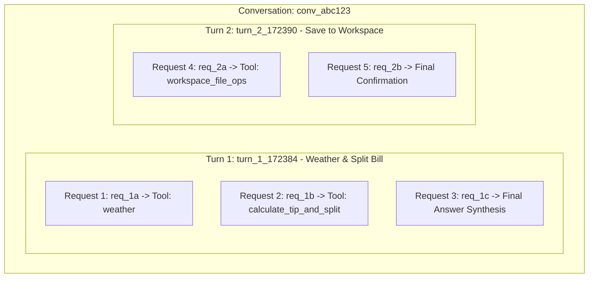

# Agentic AI React WebUI Studio

Modern, responsive React application powering the **Agentic AI Unified Studio & Observatory**, built with **React 18**, **Vite**, **Adobe React Spectrum** (`@adobe/react-spectrum`), **Lucide React**, and **Recharts**.

---

## 🌟 Key Features

1. **💬 AI Agent Chatbot**:
   - Interactive multi-turn chat powered by the ReAct agent engine.
   - Dynamic model switcher (Local Ollama & Cloud: OpenAI, Anthropic, Gemini, Groq, DeepSeek).
   - Domain Skill switcher with 9 pre-built personas.
   - Live step-by-step tool invocation timeline and token meter.

2. **🛠️ MCP Tools & Sandbox Playground**:
   - Interactive catalog of all registered MCP everyday tools.
   - Standalone live tool execution sandbox with custom JSON arguments.

3. **⚡ Domain Skills Hub**:
   - Grid cards for all 9 domain skills with recommended tool tags.
   - Custom Skill Crafter to register user-defined personas and prompts.
   - One-click "Activate in Chat" loading.

4. **📁 Workspace File Explorer & Editor**:
   - Live directory browser for persistent files generated by agents in `./workspace/`.
   - In-browser code/text editor with syntax highlighting, save, and download.

5. **📊 Telemetry & Metrics Observatory**:
   - Real-time KPI summary cards (Total Calls, Success Rate, Latency, Total Tokens).
   - Interactive Recharts / Spectrum graphs for Prompt vs. Completion token distribution and per-model execution shares.

6. **📜 Categorized Interaction Audit Logs**:
   - **3-Tier Hierarchy Visualization**: Organized by **Conversation ID** &rarr; **Turn ID** &rarr; **Request ID (LLM Calls)**.
   - Collapsible conversation threads displaying total turns, tokens, duration, and underlying requests.
   - Expandable turns showing individual LLM reasoning cycles and executed MCP tools.
   - Flat tabular stream toggle for fast linear search and log exporting.
   - Deep inspection modal with full request messages, parameters, model response content, and latency.

7. **🧪 Evals & Benchmark Studio**:
   - 4-Grader Benchmark Suite Runner with category checkboxes.
   - Registries management (Candidate Models, LLM Judges, Agent Adapters).
   - Historical runs archive with side-by-side comparative matrix and winner highlighting.

8. **⚙️ Settings & Host Diagnostics**:
   - Multi-provider API keys manager (OpenAI, Anthropic, Gemini, Groq, Mistral, DeepSeek).
   - Ollama API Base URL and Transport switcher (`HTTP :8000` vs `Stdio`).
   - Live host system diagnostics (CPU %, RAM memory, Disk storage, OS platform).

---

## 🌲 Hierarchical Audit Log Architecture



---

## 🛠️ Project Structure

```
webui/
├── package.json              # React 18, @adobe/react-spectrum, lucide-react, recharts, vitest
├── vite.config.js          # Vite config with backend proxy (/api, /v1, /health -> :8000)
├── index.html
├── dist/                   # Production build assets served directly by FastAPI
└── src/
    ├── main.jsx            # Entry point wrapped with Spectrum Provider in dark mode
    ├── App.jsx             # Top-level state & 8 Studio tab routing
    ├── api/
    │   └── client.js       # Unified API client for all Gateway backend endpoints
    ├── styles/
    │   └── index.css       # Custom design system, glassmorphism tokens, and responsive layout
    ├── components/
    │   ├── Sidebar.jsx     # Navigation bar for all 8 Studio tabs + live health indicator
    │   ├── TopHeader.jsx   # Topbar with active model badge and refresh action
    │   ├── InspectorModal.jsx  # Audit log inspector modal
    │   └── CreateSkillModal.jsx # Custom domain skill creator modal
    ├── views/
    │   ├── ChatView.jsx    # Multi-turn ReAct chatbot with tool timelines and token meter
    │   ├── ToolsView.jsx   # MCP tools catalog & live sandbox execution playground
    │   ├── SkillsView.jsx  # Domain skills grid & custom skill crafter
    │   ├── WorkspaceView.jsx # File explorer, syntax-aware code editor & downloader
    │   ├── TelemetryView.jsx # KPI cards, token distribution & model execution share charts
    │   ├── AuditLogsView.jsx # Searchable & filterable interaction audit table
    │   ├── EvalsView.jsx   # 4-Grader benchmark runner, registries & compare matrix
    │   └── SettingsView.jsx # Cloud API keys manager, Ollama URL, & live system gauges
    └── test/
        ├── setup.js        # Vitest DOM setup and mocks
        ├── client.test.js  # API client unit tests
        ├── components.test.jsx # Component unit tests
        └── views.test.jsx  # View render and interaction unit tests
```

---

## 🚀 Running the WebUI

### Development Mode (with Vite HMR)
```bash
# Start Gateway backend
.venv/bin/python llm_gateway/main.py

# Start React WebUI
cd webui
npm run dev
# Open browser at http://localhost:5173
```

### Production Build
```bash
cd webui
npm run build
# The build output in dist/ is automatically served by FastAPI on http://localhost:8000
```

### Running Unit Tests
```bash
cd webui
npm test
```
